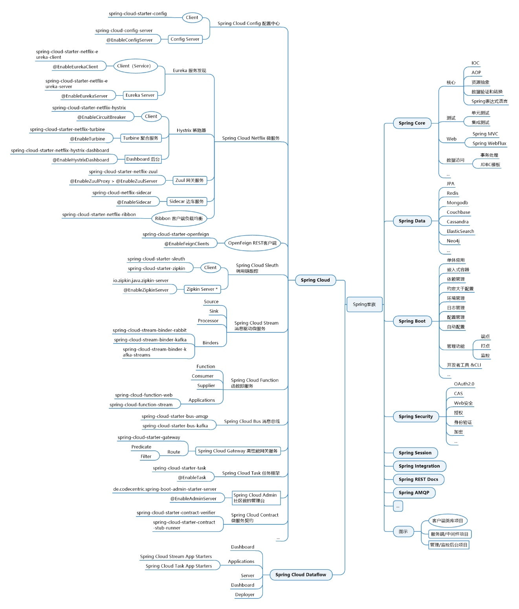

## Spring大家族

Spring家族体系有四个阶段，其中第四个阶段还在孵化

- Spring：将单体应用更方便的开发
  - Spring Core
  - Spring Data
  - Spring Security
- SpringBoot：加速开发效率，将程序从可用变为好用
- SpringCloud：推动微服务架构落地，很多时候都是先了解到SpringCloud之后，才去了解微服务的
- Spring Cloud Dataflow：将所有服务当做组件，可用实现灵活的伸缩组合

