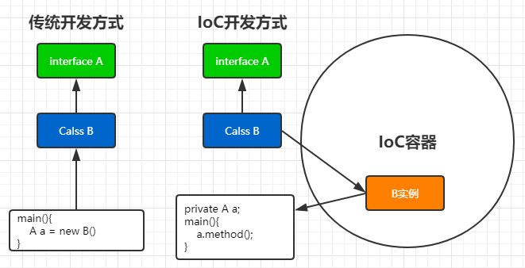
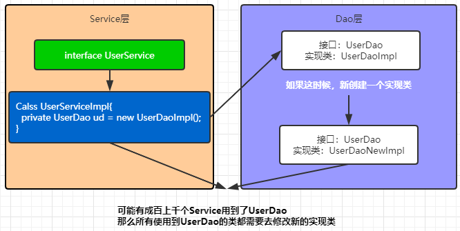
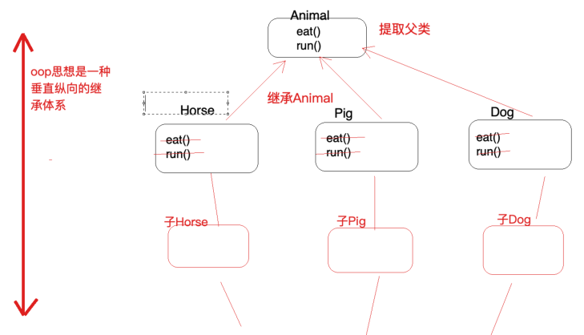
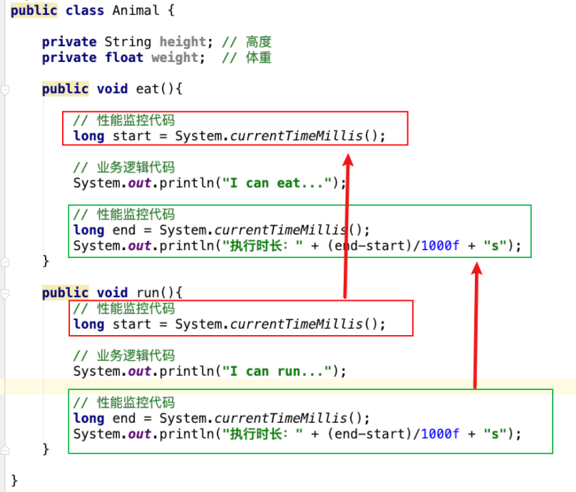
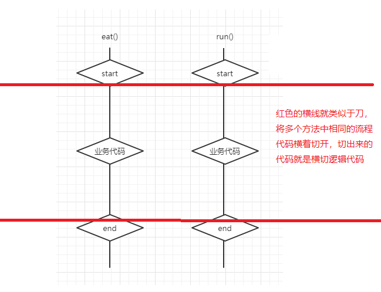
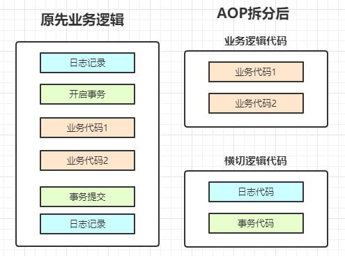

## Spring IoC

### 什么是IoC

IoC，inversion of control 控制反转，将控制对象的权力（创建对象，管理对象）交给外部（容器），IoC是一种技术思想，而不是技术实现，SpringIoC，就是实现了控制反转思想的框架

传统开发方式：类A是个接口，类B是实现类，往往代码是这么编写的

```java
A a = new B()
```

IoC思想开发方式：不需要使用new关键字，即不需要我们自己创建对象，而是从一个容器中直接拿创建好的对象

```java
private A a;
```

所以Spring根据IoC思想，创建出了IoC容器，用来对Bean进行实例化，依赖管理，维护等工作，我们想要使用此对象时，直接去容器中取。

我们丧失了创建对象，管理对象的权利，但是得到了对应的福利，不需要考虑对象创建管理等一系列的事情。



### IoC解决了什么问题

IoC解决了很多问题，比如对象之间耦合问题，对于复杂的对象依赖关系的管理问题



### IoC和DI的区别

IoC控制反转，DI依赖注入，其描述的都是一件事情，对象实例化以及依赖关系维护这件事，区别在哪呢？

所站立的角度不同：

- IoC是站在对象角度的，对象的控制权利被反转了
- DI是站在容器角度的，对象A中具有对象B属性，容器就需要将B注入给A

## Spring AOP

### 什么是AOP

AOP，面向切面编程， AOP可以对业务逻辑的各个部分进行隔离，从而使得业务逻辑各部分之间的耦合度降低，提高程序的可重用性，同时提高了开发的效率。 

它是OOP也就是面向对象编程的一种扩展，所以要说AOP，我们应先从OOP说起，看看它为什么要扩展，有什么缺点使得AOP的出现？

#### OOP的问题



OOP是一种垂直纵向的继承体系，他可以解决绝大部分的代码重复或耦合的问题，但是有一些情况它是解决不了的，比如下面的代码：



在`eat()`和`run()`方法中，为了性能监控，添加了对应的代码，可以看到代码是重复的，所以类似这种在业务逻辑代码上下围绕着的代码，OOP编程思想是无法解决代码重复问题的

#### 横切逻辑代码

在上面的例子中，方框框起来的代码，就称之为横切逻辑代码，为什么叫横切呢？看下图



这些被横切出来的代码，我们称之为横切逻辑代码

横切逻辑代码有什么问题呢？

- 横切代码重复
- 横切代码与业务代码混杂在一起，维护不方便

所以这时，AOP出场了，为了解决横切代码问题，提出了横向抽取机制，将横切逻辑代码与业务逻辑代码拆分：



AOP将代码拆分成两块，解决了重复问题和混杂耦合问题，并且使用特殊的方式（代理）来实现原先一样的效果。具体怎么实现的，后面在研究。

### AOP解决了什么问题

在不改变原来业务逻辑实现效果情况下，将横切逻辑代码与业务逻辑代码拆分，根本上实现解耦合，避免横切逻辑代码重复。

一般来说，横切逻辑代码的使用场景比较有限，常见的有：

- 事务控制
- 日志管理
- 权限校验

### 为什么叫面向切面编程

- 【切】：横切逻辑，我们不能动原有业务代码，只能操作横切逻辑代码，所以切就是指面向横切逻辑
- 【面】：横切逻辑代码往往影响了很多方法，比如上面例子中的eat和run方法，这种方法就像一个个的点，多点构成一个面，所以叫做面