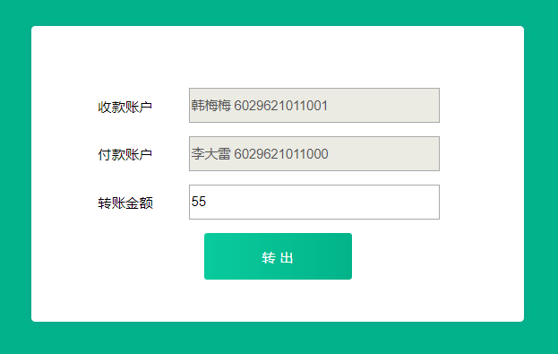
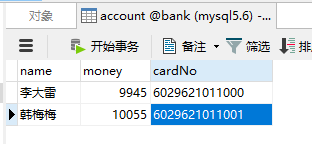
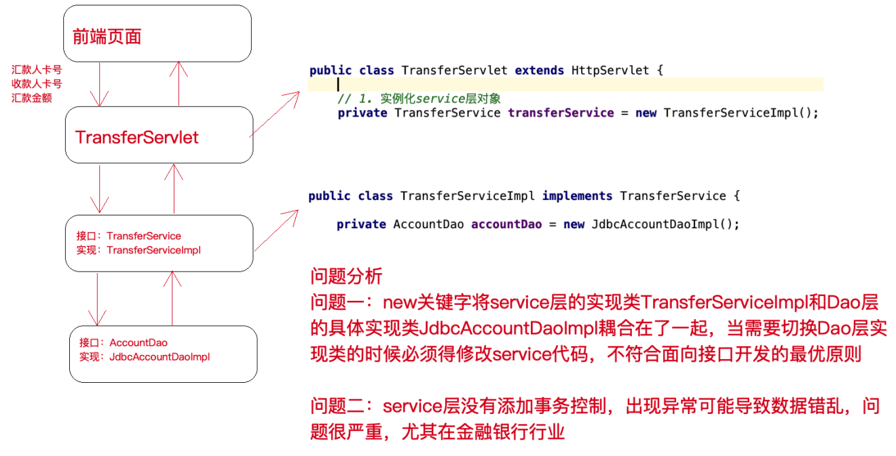
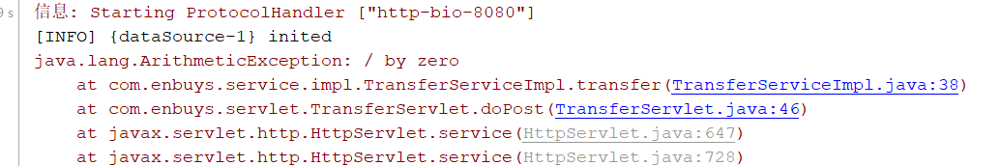

> 源码地址：[Github源码]( https://github.com/PAcee1/custom-spring )

## 从案例开始分析原始开发方式的问题

这里我们忘记Spring，看看以前Servlet是如何开发Web项目的，存在哪些问题，应该如何优化？

这里以银行转账为例子，具体代码后期会放到Github上

该例子也很简单，就是A向B转账，然后对数据库中的金额进行增减



这里贴几个关键代码：

### Servlet层

```java
@WebServlet(name="transferServlet",urlPatterns = "/transferServlet")
public class TransferServlet extends HttpServlet {

    // 1. 实例化service层对象
    private TransferService transferService = new TransferServiceImpl();

    @Override
    protected void doGet(HttpServletRequest req, HttpServletResponse resp) throws ServletException, IOException {
        doPost(req,resp);
    }

    @Override
    protected void doPost(HttpServletRequest req, HttpServletResponse resp) throws ServletException, IOException {
        // 设置请求体的字符编码
        req.setCharacterEncoding("UTF-8");

        String fromCardNo = req.getParameter("fromCardNo");
        String toCardNo = req.getParameter("toCardNo");
        String moneyStr = req.getParameter("money");
        int money = Integer.parseInt(moneyStr);

        Result result = new Result();

        try {

            // 2. 调用service层方法
            transferService.transfer(fromCardNo,toCardNo,money);
            result.setStatus("200");
        } catch (Exception e) {
            e.printStackTrace();
            result.setStatus("201");
            result.setMessage(e.toString());
        }

        // 响应
        resp.setContentType("application/json;charset=utf-8");
        resp.getWriter().print(JsonUtils.object2Json(result));
    }
}
```

### Service层

```java
public interface TransferService {
    void transfer(String fromCardNo,String toCardNo,int money) throws Exception;
}

public class TransferServiceImpl implements TransferService {

    private AccountDao accountDao = new JdbcAccountDaoImpl();

    @Override
    public void transfer(String fromCardNo, String toCardNo, int money) throws Exception {
        Account from = accountDao.queryAccountByCardNo(fromCardNo);
        Account to = accountDao.queryAccountByCardNo(toCardNo);

        from.setMoney(from.getMoney()-money);
        to.setMoney(to.getMoney()+money);

        accountDao.updateAccountByCardNo(to);
        accountDao.updateAccountByCardNo(from);
    }
}
```

### Dao层

```java
public interface AccountDao {

    Account queryAccountByCardNo(String cardNo) throws Exception;

    int updateAccountByCardNo(Account account) throws Exception;
}

public class JdbcAccountDaoImpl implements AccountDao {

    @Override
    public Account queryAccountByCardNo(String cardNo) throws Exception {
        //从连接池获取连接
        Connection con = DruidUtils.getInstance().getConnection();
        String sql = "select * from account where cardNo=?";
        PreparedStatement preparedStatement = con.prepareStatement(sql);
        preparedStatement.setString(1,cardNo);
        ResultSet resultSet = preparedStatement.executeQuery();

        Account account = new Account();
        while(resultSet.next()) {
            account.setCardNo(resultSet.getString("cardNo"));
            account.setName(resultSet.getString("name"));
            account.setMoney(resultSet.getInt("money"));
        }

        resultSet.close();
        preparedStatement.close();
        con.close();

        return account;
    }

    @Override
    public int updateAccountByCardNo(Account account) throws Exception {

        // 从连接池获取连接
        Connection con = DruidUtils.getInstance().getConnection();
        String sql = "update account set money=? where cardNo=?";
        PreparedStatement preparedStatement = con.prepareStatement(sql);
        preparedStatement.setInt(1,account.getMoney());
        preparedStatement.setString(2,account.getCardNo());
        int i = preparedStatement.executeUpdate();

        preparedStatement.close();
        con.close();
        return i;
    }
}
```

### 问题分析

通过这些简单的代码实现，我们不难发现以下几个问题，如图所示：



## 手写IOC实现

我们刚刚发现，原始开发方式有两个重点问题

- 一是new关键字将不同层级的类耦合在了一起
- 二是没有添加事务控制

这里我们来解决实例化耦合问题，这也是Spring的IOC解决的问题

### 实例化耦合解决思路

new关键字是用来实例化对象的，如果想要不适用new来实例化，那么还有什么实例化方式呢？那就是**反射技术**，使用`Class.forName("全限定类名")`来实现对象实例化。

使用反射会发现全限定类名也耦合到类中了，如果想解耦，关于这种配置的东西都可以放在配置文件里，所以我们可以创建`xml`文件来保存全限定类名。

但还存在一个问题，如果类有很多，那么每个类都需要使用反射创建对象，如果直接写在业务类中比如`ServiceImpl`，那么会有大量重复代码，所以我们可以**使用工厂模式**，让工厂使用反射生产对象，当我们业务类需要使用时，直接去工厂拿。


### 实例化解决方案代码实现

#### 创建配置文件

首先我们需要使用XML配置文件，来保存类的全限定类名

```xml
<?xml version="1.0" encoding="UTF-8" ?>
<!--跟标签beans，里面配置一个又一个的bean子标签，每一个bean子标签都代表一个类的配置-->
<beans>
    <!--id标识对象，class是类的全限定类名-->
    <bean id="accountDao" class="com.lagou.edu.dao.impl.JdbcTemplateDaoImpl">
    </bean>
    <bean id="transferService" class="com.lagou.edu.service.impl.TransferServiceImpl">
    </bean>
</beans>
```

#### 创建对象工厂

使用Dom4j解析XML文件，使用反射创建对象，使用Map保存对象

```java
public class BeanFactory {

    // 创建Map，用来保存类id与类对象
    private static Map<String,Object> map = new HashMap<>();

    // 根据id获取Bean
    public static Object getBean(String id){
        return map.get(id);
    }

    // 加载时初始化
    // 一、读取配置文件
    // 二、使用反射实例化
    static {
        // 获取配置文件流
        InputStream inputStream = BeanFactory.class.getClassLoader().getResourceAsStream("beans.xml");

        // 使用dom4j解析配置文件
        SAXReader reader = new SAXReader();
        try {
            Document document = reader.read(inputStream);
            // 获取根标签
            Element rootElement = document.getRootElement();
            // 获取bean标签
            List<Element> beanNodes = rootElement.selectNodes("//bean");

            // 循环bean，使用反射创建对象，保存到容器中
            for (Element element : beanNodes) {
                String id = element.attributeValue("id"); // 获取id 当key
                String clazz = element.attributeValue("class"); // 获取全限定类名，用作反射

                // 反射创建对象
                Class<?> aClass = Class.forName(clazz);
                Object o = aClass.newInstance();
                // 保存到容器中
                map.put(id,o);
            }
        } catch (Exception e) {
            e.printStackTrace();
        }

        // 关闭流
        try {
            inputStream.close();
        } catch (IOException e) {
            e.printStackTrace();
        }
    }
}
```

#### 修改new处代码

```java
public class TransferServiceImpl implements TransferService {

    // private AccountDao accountDao = new JdbcAccountDaoImpl();
    private AccountDao accountDao = (AccountDao) BeanFactory.getBean("accountDao");
    //···
}

@WebServlet(name="transferServlet",urlPatterns = "/transferServlet")
public class TransferServlet extends HttpServlet {

    // 1. 实例化service层对象
    //private TransferService transferService = new TransferServiceImpl();
    private TransferService transferService = (TransferService) BeanFactory.getBean("transferService");
    //···
}
```

修改完后，我们会发现这样使用工厂的getBean方法获取对象，也不够优雅，最完美的形式应该是下面这样

```java
public class TransferServiceImpl implements TransferService {

    // private AccountDao accountDao = new JdbcAccountDaoImpl();
    //private AccountDao accountDao = (AccountDao) BeanFactory.getBean("accountDao");
    // 完美形式
    private AccountDao accountDao;
    //···
}
```

这样应该如何实现呢，首先我们必须为成员变量AccountDao赋值，方式一般为两种，构造方法或`set`方法

这里我们使用`set`方法，然后我们可以将此类所依赖的对象配置到配置文件中，然后再工厂创建对象时，使用反射调用`set`方法为其成员变量赋值。

#### 优化实现方式

##### Service类中添加set方法

```java
public class TransferServiceImpl implements TransferService {

    // private AccountDao accountDao = new JdbcAccountDaoImpl();
    //private AccountDao accountDao = (AccountDao) BeanFactory.getBean("accountDao");
    // 完美形式
    private AccountDao accountDao;

    public void setAccountDao(AccountDao accountDao) {
        this.accountDao = accountDao;
    }
    // ···
}
```

这里就不在Servlet类中添加了，因为Servlet有自己的容器初始化规则

##### 配置文件添加配置

```xml
<?xml version="1.0" encoding="UTF-8" ?>
<!--跟标签beans，里面配置一个又一个的bean子标签，每一个bean子标签都代表一个类的配置-->
<beans>
    <!--id标识对象，class是类的全限定类名-->
    <bean id="accountDao" class="com.lagou.edu.dao.impl.JdbcTemplateDaoImpl">
    </bean>
    <bean id="transferService" class="com.lagou.edu.service.impl.TransferServiceImpl">
        <!--set+ name 之后锁定到传值的set方法了，通过反射技术可以调用该方法传入对应的值-->
        <property name="AccountDao" ref="accountDao"></property>
    </bean>
</beans>
```

这里在需要对成员变量赋值的bean标签中，添加property标签，设置需要设置的成员变量名，和对应的实例化id

##### 修改对象工厂代码

```java
public class BeanFactory {

    // 创建Map，用来保存类id与类对象
    private static Map<String,Object> map = new HashMap<>();

    // 根据id获取Bean
    public static Object getBean(String id){
        return map.get(id);
    }

    // 加载时初始化
    // 一、读取配置文件
    // 二、使用反射实例化
    static {
        // 获取配置文件流
        InputStream inputStream = BeanFactory.class.getClassLoader().getResourceAsStream("beans.xml");

        // 使用dom4j解析配置文件
        SAXReader reader = new SAXReader();
        try {
            Document document = reader.read(inputStream);
            // 获取根标签
            Element rootElement = document.getRootElement();
            // 获取bean标签
            List<Element> beanNodes = rootElement.selectNodes("//bean");

            // 循环bean，使用反射创建对象，保存到容器中
            for (Element element : beanNodes) {
                String id = element.attributeValue("id"); // 获取id 当key
                String clazz = element.attributeValue("class"); // 获取全限定类名，用作反射

                // 反射创建对象
                Class<?> aClass = Class.forName(clazz);
                Object o = aClass.newInstance();
                // 保存到容器中
                map.put(id,o);
            }

            // 优化实例化方式，获取带有property的标签，将其所属父标签的实例进行依赖注入
            List<Element> propertyNodes = rootElement.selectNodes("//property");
            for (Element element : propertyNodes) {
                // 获取标签中的name与ref
                String name = element.attributeValue("name");
                String ref = element.attributeValue("ref");
                String methodName = "set" + name; // set方法名称

                // 获取父标签
                Element parent = element.getParent();
                // 获取父标签的id，好从Map容器中拿出
                String parId = parent.attributeValue("id");
                Object parentObject = map.get(parId);
                // 获取该对象的所有方法
                Method[] methods = parentObject.getClass().getMethods();
                // 循环方法，找到set + name方法
                for (Method method : methods) {
                    if(method.getName().equalsIgnoreCase(methodName)){
                        // 依赖注入
                        Object propertyObject = map.get(ref); // 依赖的对象
                        method.invoke(parentObject,propertyObject);
                    }
                }

                // 设置完依赖后，将该对象重新放入容器
                map.put(parId,parentObject);
            }
        } catch (Exception e) {
            e.printStackTrace();
        }

        // 关闭流
        try {
            inputStream.close();
        } catch (IOException e) {
            e.printStackTrace();
        }
    }
}
```

到此，IOC容器来解决实例化耦合就实现完成了，主要就是创建一个Bean工厂，来创建管理Bean，当类需要调用其他类时，直接从工厂中拿Bean即可

## 手写AOP实现

接着我们来解决Service层没有进行事物控制的问题

### 事物控制解决思路

数据库事物控制，归根结底是JDBC来管理，那么我们看一下现在是如何实现插入操作的：

```java
public class JdbcAccountDaoImpl implements AccountDao {

    @Override
    public Account queryAccountByCardNo(String cardNo) throws Exception {
        //从连接池获取连接
        Connection con = DruidUtils.getInstance().getConnection();
        // ···
    }
    @Override
    public int updateAccountByCardNo(Account account) throws Exception {
        // 从连接池获取连接
        Connection con = DruidUtils.getInstance().getConnection();
        // ···
    }
}
```

1. 可以发现，每次查询，插入操作，都从数据库连接池取了新的连接，那么事物是一定不统一的
2. 除了这个问题之外，我们会发现目前事物控制是放在Dao层，交给JDBC来控制，但是对于业务来说，事物应该放在Service层，因为一个Service方法可能会执行多条SQL语句。

所以针对这两个问题，有以下两个解决思路：

1. 让两次`update`操作使用同一个连接，两次操作使用一个线程，我们可以为**每个线程绑定一个连接**，在线程执行过程中都使用此连接
2. JDBC获取连接时，默认是自动提交事务，可以再**创建连接时取消自动提交**，转而在Service层，手工调用`connection.commit()`，`connection.rollback()`控制事物

### 事物问题代码初步实现

#### 创建线程连接管理工具类

使用`ThreadLocal`保存连接，这样各个线程间互不影响

```java
public class ConnectionUtils {

    // 使用ThreadLoacl保存连接
    private ThreadLocal<Connection> threadLocal = new ThreadLocal<>();

    private static ConnectionUtils connectionUtils = new ConnectionUtils();

    private ConnectionUtils(){}

    // 单例模式，提供获取方法
    public static ConnectionUtils getInstance(){
        return connectionUtils;
    }

    /**
     * 获取连接
     * @return
     */
    public Connection getConnection(){
        // 判断此线程是否为空，为空创建，不为空直接返回
        Connection connection = threadLocal.get();
        if(connection == null){
            try {
                connection = DruidUtils.getInstance().getConnection();
                threadLocal.set(connection);
            } catch (SQLException e) {
                e.printStackTrace();
            }
        }
        return connection;
    }
}
```

#### 创建事物管理类

```java
public class TransactionManager {

    private TransactionManager(){}

    private static TransactionManager transactionManager = new TransactionManager();

    public static TransactionManager getInstance(){
        return transactionManager;
    }

    // 设置手工提交事务
    public void begin() throws SQLException {
        ConnectionUtils.getInstance().getConnection().setAutoCommit(false);
    }

    // 提交事务
    public void commit() throws SQLException {
        ConnectionUtils.getInstance().getConnection().commit();
    }

    // 回滚事务
    public void rollback() throws SQLException {
        ConnectionUtils.getInstance().getConnection().rollback();
    }
}
```

#### 修改Service与Dao层代码

Dao层：从线程中取连接，注意需要把close方法注释掉，不然连接就被关闭了

```java
public class JdbcAccountDaoImpl implements AccountDao { 
    @Override
    public Account queryAccountByCardNo(String cardNo) throws Exception {
        //从连接池获取连接
        //Connection con = DruidUtils.getInstance().getConnection();
        // 从线程中获取连接，每个线程使用同一个连接
        Connection con = ConnectionUtils.getInstance().getConnection();
        // ···
        //con.close();
    }
    @Override
    public int updateAccountByCardNo(Account account) throws Exception {
        // 从连接池获取连接
        //Connection con = DruidUtils.getInstance().getConnection();
        // 从线程中获取连接，每个线程使用同一个连接
        Connection con = ConnectionUtils.getInstance().getConnection();
        // ···
        //con.close();
    }
}
```
Service层：使用事物管理，在Service进行事物控制

```java
@Override
public void transfer(String fromCardNo, String toCardNo, int money) throws Exception {
    try {
        // 开启事物
        TransactionManager.getInstance().begin();
        Account from = accountDao.queryAccountByCardNo(fromCardNo);
        Account to = accountDao.queryAccountByCardNo(toCardNo);

        from.setMoney(from.getMoney() - money);
        to.setMoney(to.getMoney() + money);

        accountDao.updateAccountByCardNo(to);

        // 测试异常
        int a = 1/0;

        accountDao.updateAccountByCardNo(from);

        // 提交事务
        TransactionManager.getInstance().commit();
    } catch (Exception e) {
        e.printStackTrace();
        // 出现异常后，回滚事物
        TransactionManager.getInstance().rollback();

        throw e; // 将异常抛出，告诉上层
    }
}
```

这里我们在两次数据修改之间，添加了一个异常，测试下事物是否成功控制



成功抛出异常，并且数据库数据没有变动

### 使用JDK代理实现AOP

我们刚刚的代码会发现有很大的问题，如果有很多Service中方法，每个方法都需要写一模一样的事务控制代码，这就需要用到我们之前说的AOP了，将横切逻辑方法与业务逻辑方法分离开，使用代理技术将其业务方法增强。

#### 创建代理工厂

```java
public class ProxyFactory {

    private TransactionManager transactionManager;

    public void setTransactionManager(TransactionManager transactionManager) {
        this.transactionManager = transactionManager;
    }

    // 使用JDK动态代理，实现AOP增强
    public Object getProxy(Object obj){
        Object o = Proxy.newProxyInstance(obj.getClass().getClassLoader(),
            obj.getClass().getInterfaces(),
            new InvocationHandler() {
                @Override
                public Object invoke(Object proxy, Method method, Object[] args) throws Throwable {
                    Object result = null;
                    try {
                        // 开启事物
                        transactionManager.begin();
                        System.out.println("开启事务");

                        // 执行方法
                        result = method.invoke(obj, args);

                        // 提交事务
                        transactionManager.commit();
                        System.out.println("事务提交");
                    } catch (Exception e) {
                        e.printStackTrace();
                        // 出现异常后，回滚事物
                        transactionManager.rollback();
                        System.out.println("事务回滚");
                        throw e; // 将异常抛出，告诉上层
                    }
                    return result;
                }
            });
        return o;
    }

}
```

#### 修改Servlet创建Service方式

改为使用代理工厂创建

```java
@WebServlet(name="transferServlet",urlPatterns = "/transferServlet")
public class TransferServlet extends HttpServlet {

    // 1. 实例化service层对象
    //private TransferService transferService = new TransferServiceImpl();

    // 从BeanFactory取Service
    //private TransferService transferService = (TransferService) BeanFactory.getBean("transferService");

    // 使用AOP生成代理Service
    private ProxyFactory proxyFactory = (ProxyFactory) BeanFactory.getBean("proxyFactory");
    private TransferService transferService = (TransferService) proxyFactory.getProxy(BeanFactory.getBean("transferService"));
    
    //···
}
```

### 代码最终完善

这里我将之前写的`ConnectionUtils`，`TransactionManager`，`ProxyFactory`都使用IOC容器进行管理

```xml
<?xml version="1.0" encoding="UTF-8" ?>
<!--跟标签beans，里面配置一个又一个的bean子标签，每一个bean子标签都代表一个类的配置-->
<beans>
    <!--id标识对象，class是类的全限定类名-->
    <bean id="accountDao" class="com.enbuys.dao.impl.JdbcAccountDaoImpl">
        <property name="ConnectionUtils" ref="connectionUtils"></property>
    </bean>
    <bean id="transferService" class="com.enbuys.service.impl.TransferServiceImpl">
        <!--set+ name 之后锁定到传值的set方法了，通过反射技术可以调用该方法传入对应的值-->
        <property name="AccountDao" ref="accountDao"></property>
    </bean>

    <bean id="connectionUtils" class="com.enbuys.utils.ConnectionUtils">
        <!--set+ name 之后锁定到传值的set方法了，通过反射技术可以调用该方法传入对应的值-->
        <property name="AccountDao" ref="accountDao"></property>
    </bean>

    <bean id="transactionManager" class="com.enbuys.utils.TransactionManager">
        <!--set+ name 之后锁定到传值的set方法了，通过反射技术可以调用该方法传入对应的值-->
        <property name="ConnectionUtils" ref="connectionUtils"></property>
    </bean>

    <bean id="proxyFactory" class="com.enbuys.factory.ProxyFactory">
        <!--set+ name 之后锁定到传值的set方法了，通过反射技术可以调用该方法传入对应的值-->
        <property name="TransactionManager" ref="transactionManager"></property>
    </bean>
</beans>
```

具体java代码就不放出来了，和之前IOC实现是一样的，具体可以看我的[Github源码]( https://github.com/PAcee1/custom-spring )

## 总结我们的层次结构


