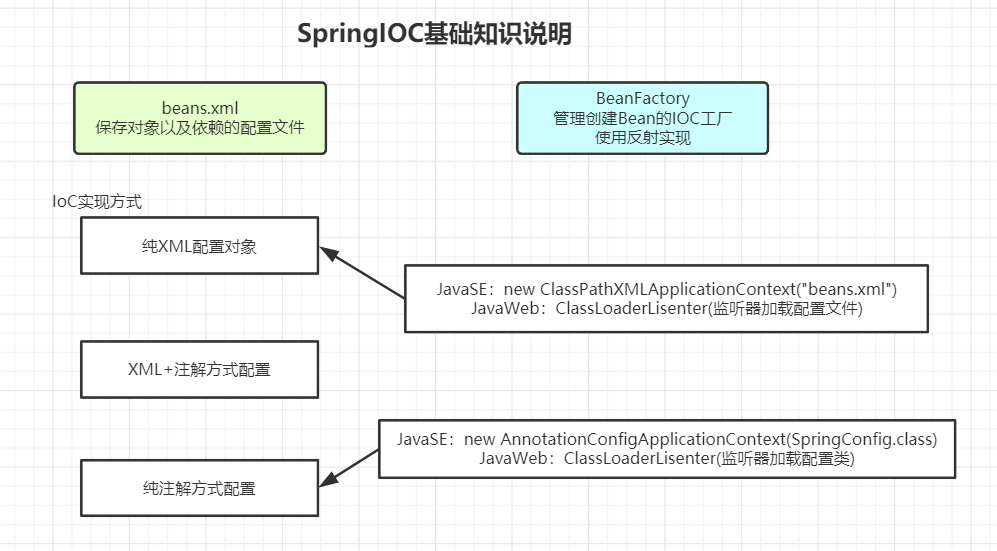
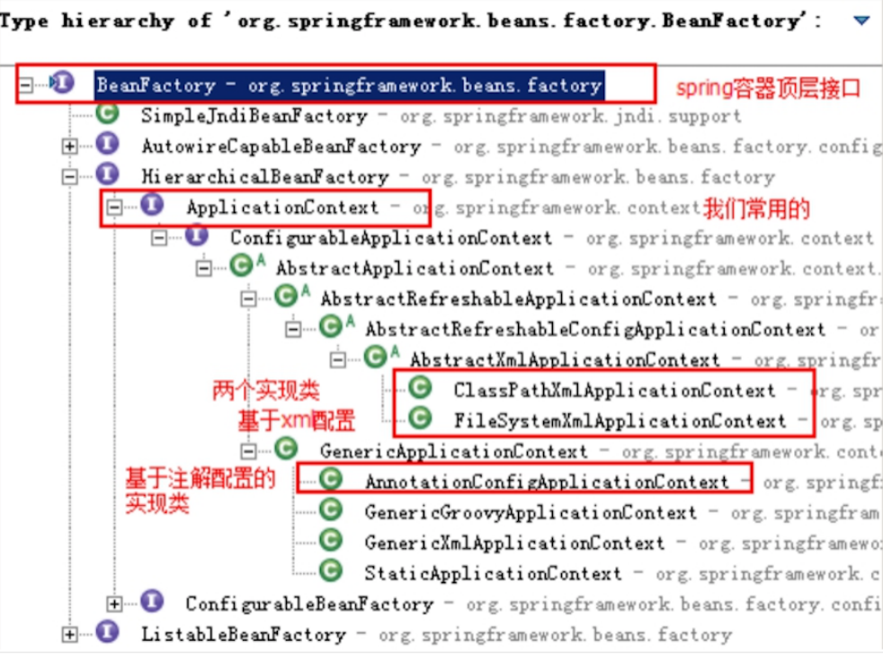
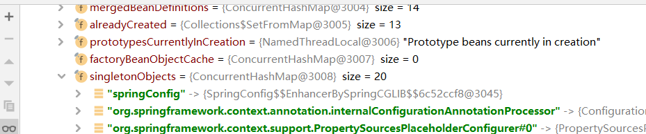
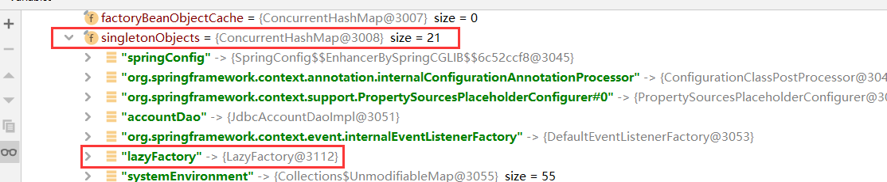
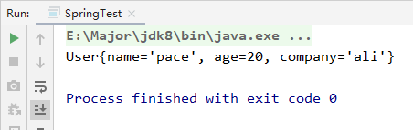
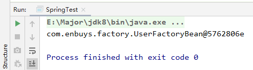
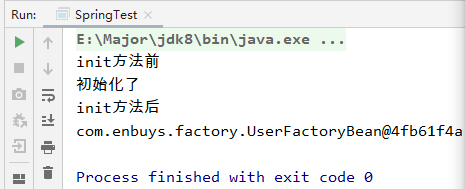
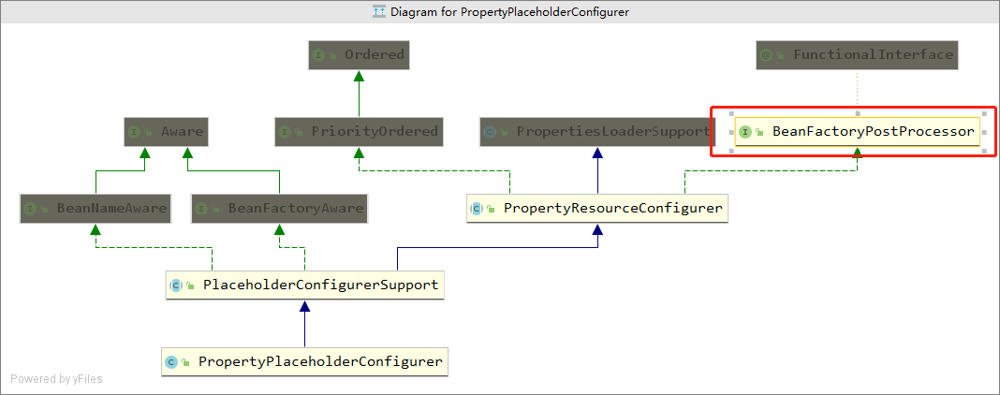

## SpringIOC基础知识回顾

> 这里我们复制之前手写Spring的项目，来进行Spring知识回顾

在我们使用SpringIoC时，有几种实现方式，如下



接着我们用代码来回顾这三种实现方式

### BeanFactory和ApplicationContext区别

首先我们要先回顾下BeanFactory和ApplicationContext有何区别，这里我们可以直接看Spring的类层次结构，一看便知：



BeanFactory为Spring容器的顶层接口，定义了一些基础的功能规范，而对于ApplicationContext则是子接口，添加了一些高级功能，比如国际化支持，资源访问等等。

所以我们称BeanFactory为Spring基础接口，ApplicationContext为Spring高级接口，一般使用时也是使用ApplicationContext

### XML方式实现

首先我们需要添加spring的依赖：

```xml
<!--  添加Spring依赖  -->
<dependency>
  <groupId>org.springframework</groupId>
  <artifactId>spring-context</artifactId>
  <version>5.1.2.RELEASE</version>
</dependency>
<dependency>
  <groupId>org.springframework</groupId>
  <artifactId>spring-web</artifactId>
  <version>5.1.2.RELEASE</version>
</dependency>
```

然后修改之前`beans.xml`配置，因为Spring默认xml配置名为applicationContext.xml，所以修改名称，然后添加上Spring的约束

```xml
<beans xmlns="http://www.springframework.org/schema/beans"
       xmlns:xsi="http://www.w3.org/2001/XMLSchema-instance"
       xsi:schemaLocation="http://www.springframework.org/schema/beans
       https://www.springframework.org/schema/beans/spring-beans.xsd">
```

#### 加载IOC容器获取实例

JavaSE方式：

```java
public class ApplicationContextTest {

    @Test
    public void test(){
        ApplicationContext applicationContext = new ClassPathXmlApplicationContext("classpath:applicationContext.xml");
        AccountDao accountDao = (AccountDao) applicationContext.getBean("accountDao");
        System.out.println(accountDao);
    }
}
```

JavaWeb方式：需配置web.xml中设置监听器，加载配置文件

```xml
<web-app>
  <display-name>Archetype Created Web Application</display-name>

<!--  Web应用使用监听器创建IOC容器 -->
  <context-param>
    <param-name>contextConfigLocation</param-name>
    <param-value>classpath:applicationContext.xml</param-value>
  </context-param>
  <listener>
    <listener-class>org.springframework.web.context.ContextLoaderListener</listener-class>
  </listener>
</web-app>
```

JavaWeb获取实例方式：从WebApplicationContext中获取

```java
@WebServlet(name="transferServlet",urlPatterns = "/transferServlet")
public class TransferServlet extends HttpServlet {

    private TransferService transferService = null;

    @Override
    public void init() throws ServletException {
        WebApplicationContext webApplicationContext = WebApplicationContextUtils.getWebApplicationContext(this.getServletContext());
        ProxyFactory proxyFactory = (ProxyFactory) webApplicationContext.getBean("proxyFactory");
        transferService = (TransferService) proxyFactory.getProxy((TransferService) webApplicationContext.getBean("transferService"));
    }
}
```

#### 实例化Bean的三种方式

无参构造：

```xml
<!-- 无参构造 -->
<bean id="connectionUtils" class="com.enbuys.utils.ConnectionUtils"></bean>
```

静态工厂构造：

```xml
<!-- 静态工厂构造 -->
<bean id="connectionUtils" class="com.enbuys.factory.CreateBeanFactory"
    factory-method="getInstance"></bean>
```

实例工厂构造：

```xml
<bean id="createBeanFactory" class="com.enbuys.factory.CreateBeanFactory"></bean>
<bean id="connectionUtils" factory-bean="createBeanFactory"
   factory-method="getInstance2" ></bean>
```

和静态工厂区别就是此方法非静态的，就是需要创建工厂对象后，才能调用其方法

工厂：

```java
public class CreateBeanFactory {

    public ConnectionUtils getInstance2(){
        return new ConnectionUtils();
    }

    public static ConnectionUtils getInstance(){
        return new ConnectionUtils();
    }
}
```

#### Bean的常见配置

在基于xml的IoC配置中，bean标签是最基础的标签。它表示了IoC容器中的⼀个对象。换句话说，如果⼀个对象想让spring管理，在XML的配置中都需要使⽤此标签配置，Bean标签的属性如下：

- `id`属性： ⽤于给bean提供⼀个唯⼀标识。在⼀个标签内部，标识必须唯⼀。
- `class`属性：⽤于指定创建Bean对象的全限定类名。
- `name`属性：⽤于给bean提供⼀个或多个名称。多个名称⽤空格分隔。
- `factory-bean`属性：⽤于指定创建当前bean对象的⼯⼚bean的唯⼀标识。当指定了此属性之后，
  class属性失效。
- `factory-method`属性：⽤于指定创建当前bean对象的⼯⼚⽅法，如配合factory-bean属性使⽤，
  则class属性失效。如配合class属性使⽤，则⽅法必须是static的。
- `scope`属性：⽤于指定bean对象的作⽤范围。通常情况下就是`singleton`。当要⽤到多例模式时，
  可以配置为`prototype`。
  - `singleton`：单例模式，每次获取对象时，都使用的同一个实例对象，默认，对象跟随着容器诞生和死亡
  - `prototype`：原型模式，多例模式，每次获取对象时都创建一个新对象，对象会被JVM垃圾回收
- `init-method`属性：⽤于指定bean对象的初始化⽅法，此⽅法会在bean对象装配后调⽤。必须是
  ⼀个⽆参⽅法。
- `destory-method`属性：⽤于指定bean对象的销毁⽅法，此⽅法会在bean对象销毁前执⾏。它只
  能为scope是`singleton`时起作⽤。

#### DI依赖注入配置

之前我们在手写Spring时，使用了`<property>`标签，set方式的注入方式，对于Spring DI来说，有两种依赖注入方式：

- 构造方法注入：使用`<constructor-arg>`标签
- set方式注入：使用`<property>`标签

对于成员变量的赋值来说，也有两种形式

- 普通数据类型：需要使用`value`属性进行赋值
- 引用数据类型（成员变量为某个类的）：需要使用`ref`属性进行赋值

```xml
<!--  Spring bean DI依赖注入配置  -->
<bean id="accountDao" class="com.enbuys.dao.impl.JdbcAccountDaoImpl">
    <!--依赖注入有两种方式，构造方法注入和set方法注入
        构造方法注入，使用<constructor-arg>标签
        set方法注入，使用<property>标签 -->

    <!--对于成员变量又有两种，一种是普通数据类型的成员变量，使用value赋值
        一种是对象数据类型的，需要使用ref赋值-->
    <!--<property name="ConnectionUtils" ref="connectionUtils"></property>
    <property name="Name" value="pace"></property>
    <property name="Age" value="20"></property>-->

    <!-- 构造方法注入，可以使用index下标对应变量位置，也可以使用name指定变量名称 -->
    <!--<constructor-arg index="0" ref="connectionUtils"></constructor-arg>
    <constructor-arg index="1" value="pace"></constructor-arg>
    <constructor-arg index="2" value="20"></constructor-arg>-->

    <constructor-arg name="connectionUtils" ref="connectionUtils"></constructor-arg>
    <constructor-arg name="name" value="pace"></constructor-arg>
    <constructor-arg name="age" value="20"></constructor-arg>
</bean>
```

这里我们展示了对于普通数据类型和引用数据类型的依赖注入，下面我们看看对于集合应该如何注入：

```xml
<property name="Set">
    <set>
        <value>1</value>
        <value>2</value>
    </set>
</property>
<property name="List">
    <list>
        <value>1</value>
        <value>2</value>
    </list>
</property>
<property name="Map">
    <map>
        <entry key="key1" value="value1"></entry>
        <entry key="key2" value="value2"></entry>
    </map>
</property>
<property name="Properties">
    <props>
        <prop key="key1">value1</prop>
        <prop key="key2">value2</prop>
    </props>
</property>
```

### XML配合注解方式实现

为什么又要有XML又要有注解呢？

一般情况下，这种开发方式，都是将外部引用的jar对象，放在XML中实例化，对于我们自己创建的对象使用注解的方式实例化与维护依赖。

#### XML标签与注解对应关系

| XML                              | 注解                                                         |
| -------------------------------- | ------------------------------------------------------------ |
| `bean`标签                       | @Component("accountDao")，注解内部的是该类的id，如果不配置，默认为此类的名称（首字母小写），另外，根据分层开发，Spring提供了三种不同的注解：@Controller，@Service，@Repository，这四种注解用法完全一样，只是为了更清晰的区分 |
| `bean`的`scope`属性              | @Scope("prototype")，默认单例，注解加在类上                  |
| `bean`标签的
`init-method`
属性    | @PostConstruct，注解加在⽅法上，该⽅法就是初始化后调⽤的⽅法 |
| `bean`标签的`destory-method`属性 | @PreDestory，注解加在⽅法上，该⽅法就是销毁前调⽤的⽅法      |

#### DI依赖注入的注解实现

主要分为两种：

- @Autowire：按照类型注入

```java
public class TransferServiceImpl {
    @Autowired
    private AccountDao accountDao;
}
```

如上代码，加载TransferServiceImpl类时，会向容器中寻找类型为AccountDao的实例对象，找到后返回赋值。

这里有一个问题就是如果AccountDao有多个子实现类，如果进行选择呢？

1. 根据你的变量名称，如果和类id一样则直接使用
2. 使用@Qualifier指定具体装配哪个对象

```java
public class TransferServiceImpl {
    @Autowired
    @Qualifier(name="jdbcAccountDaoImpl")
    private AccountDao accountDao;
}
```

- @Resource：默认按照名称注入，也可以配置使用类型注入，JDK11淘汰

````java
public class TransferService {
    @Resource
    private AccountDao accountDao;
    @Resource(name="studentDao")
    private StudentDao studentDao;
    @Resource(type="TeacherDao")
    private TeacherDao teacherDao;
    @Resource(name="manDao",type="ManDao")
    private ManDao manDao;
}
````

1. 如果同时指定了 `name` 和 `type`，则从Spring上下⽂中找到唯⼀匹配的bean进⾏装配，找不到则抛出异常。
2. 如果指定了 `name`，则从上下⽂中查找名称（`id`）匹配的bean进⾏装配，找不到则抛出异常。
3. 如果指定了 `type`，则从上下⽂中找到类似匹配的唯⼀bean进⾏装配，找不到或是找到多个，都会抛出异常。
4. 如果既没有指定name，⼜没有指定`type`，则⾃动按照`byName`⽅式进⾏装配；

#### 使用注解的XML配置

我们想使用注解+XML的方式开发，就需要在xml配置中配置扫描注解所在的包，需要用到`spring-context`模块

```xml
<beans xmlns="http://www.springframework.org/schema/beans"
       xmlns:context="http://www.springframework.org/schema/context"
       xmlns:xsi="http://www.w3.org/2001/XMLSchema-instance"
       xsi:schemaLocation="http://www.springframework.org/schema/beans
       https://www.springframework.org/schema/beans/spring-beans.xsd
       http://www.springframework.org/schema/context
       https://www.springframework.org/schema/context/spring-context.xsd">

    <!-- 扫描注解 -->
    <context:component-scan base-package="com.enbuys"/>

    <!-- 加载外部配置文件-->
    <context:property-placeholder location="classpath:jdbc.properties"/>

    <!-- 配置数据源-->
    <bean id="dataSource" class="com.alibaba.druid.pool.DruidDataSource">
        <property name="driverClassName" value="${jdbc.driver}"></property>
        <property name="url" value="${jdbc.url}"></property>
        <property name="username" value="${jdbc.username}"></property>
        <property name="password" value="${jdbc.password}"></property>
    </bean>

</beans>
```

对于数据源我们使用到了Druid，属于第三方jar，所以我们配置在了XML里，呼应到一开始说的使用原因。

这里我们还将数据库配置解耦到具体配置文件中，使用`context`模块引用外部配置文件

这里我们最先加载的还是此xml配置，所以在`web.xm`l中的配置不需要改变

### 纯注解开发方式

纯注解开发方式，就是将xml配置中的东西全部使用注解的方式实现，对于我们刚刚的配置文件，还有一些配置，如何使用注解实现呢？

| XML                              | 注解                                                         |
| -------------------------------- | ------------------------------------------------------------ |
| 配置文件                         | @Configuration 注解，表名当前类是⼀个配置类                  |
| `<context:component-scan>`       | @ComponentScan("com.enbuys") 注解，扫描包下注解              |
| `<context:property-placeholder>` | @PropertySource("classpath:jdbc.properties") 引⼊外部属性配置⽂件 |
| 读取外部配置文件中的信息         | @Value 对变量赋值，可以直接赋值，也可以使⽤ ${} 读取资源配置⽂件中的信息 |
| 外部Bean加载到容器               | @Bean("dataSource")，将⽅法返回对象加⼊ SpringIOC 容器       |

所以，了解后，我们配置了一个SpringConfig配置类，来替代XML：

```java
@Configuration
@ComponentScan("com.enbuys")
@PropertySource("classpath:jdbc.properties")
public class SpringConfig {

    @Value("${jdbc.driver}")
    private String driver;
    @Value("${jdbc.url}")
    private String url;
    @Value("${jdbc.username}")
    private String username;
    @Value("${jdbc.password}")
    private String password;

    @Bean("dataSource")
    public DruidDataSource dataSource(){
        DruidDataSource druidDataSource = new DruidDataSource();
        druidDataSource.setDriverClassName(driver);
        druidDataSource.setUrl(url);
        druidDataSource.setUsername(username);
        druidDataSource.setPassword(password);
        return druidDataSource;
    }
}
```

现在我们使用纯注解开发，那么我们的入口就不是xml配置文件了，而是这个配置类，所以我们需要修改web.xml的加载方式

```xml
<web-app>
  <display-name>Archetype Created Web Application</display-name>

  <!--  告诉Spring使用注解方式加载配置文件 -->
  <context-param>
    <param-name>contextClass</param-name>
    <param-value>org.springframework.web.context.support.AnnotationConfigWebApplicationContext</param-value>
  </context-param>
  <!--  Web应用使用监听器创建IOC容器 -->
  <context-param>
    <param-name>contextConfigLocation</param-name>
    <param-value>com.enbuys.config.SpringConfig</param-value>
  </context-param>
  <listener>
    <listener-class>org.springframework.web.context.ContextLoaderListener</listener-class>
  </listener>

  <!--<context-param>
    <param-name>contextConfigLocation</param-name>
    <param-value>classpath:applicationContext-anno.xml</param-value>
  </context-param>-->
</web-app>
```

## SpringIOC高级知识回顾

### 延迟加载lazy-init

延迟加载顾名思义，当Bean使用到的时候才进行实例化，如果没有使用，在容器加载时不进行实例化。

Spring的Bean默认不开启延迟加载：

```xml
<bean id="dataSource" class="com.alibaba.druid.pool.DruidDataSource"></bean>
<bean id="dataSource" class="com.alibaba.druid.pool.DruidDataSource"
    lazy-init="false"/>
```

两种都是一样的形式

开启延迟加载测试：

```xml
<bean id="lazyFactory" class="com.enbuys.factory.LazyFactory" lazy-init="true"/>
```



我们会发现有20个实例被加载了，但是并没有LazyFactory

单步执行，使用LazyFactory后查看是否被实例化



被实例化，并且实例数为21了，说明延迟加载验证成功

特殊情况：如果A类为立即加载，B类为延迟加载，但是A依赖B，那么在容器加载时随着A的实例化，B也会被实例化，符合第一次调用时被实例化的规则。

延迟加载也可以直接设置在整个配置上，那么这个配置文件中所有类都会延迟加载

```xml
<beans default-lazy-init="true">
    <!-- no beans will be eagerly pre-instantiated... -->
</beans>
```

应用场景：

1. 加快容器启动
2. 对于不常用的Bean，使用延迟加载可以节省空间资源

### FactoryBean

我们之前回顾了BeanFactory，是IoC容器的顶级接口，封装了最基础的方法规范，常用ApplicationContext子接口来进行容器的获取管理。

Spring中Bean有两种，⼀种是普通Bean，⼀种是⼯⼚Bean（FactoryBean），FactoryBean可以⽣成某⼀个类型的Bean实例（返回给我们），也就是说我们可以借助于它⾃定义Bean的创建过程。

Bean创建的三种⽅式中的静态⽅法和实例化⽅法和FactoryBean作⽤类似，FactoryBean使⽤较多，尤其在Spring框架⼀些组件中会使⽤，还有其他框架和Spring框架整合时使⽤。

所以对于实例化过程相对复杂的Bean，我们可以使用FactoryBean的方式进行构建。

下面代码演示FactoryBean是如何构建对象的

User对象

```java
public class User {

    private String name;
    private Integer age;
    private String company;
    // get set
}
```

UserFactoryBean

```java
public class UserFactoryBean implements FactoryBean<User> {

    private String userInfo;

    public void setUserInfo(String userInfo) {
        this.userInfo = userInfo;
    }

    @Override
    public User getObject() throws Exception {
        User user = new User();
        String[] strings = userInfo.split(",");
        user.setName(strings[0]);
        user.setAge(Integer.valueOf(strings[1]));
        user.setCompany(strings[2]);
        return user;
    }

    @Override
    public Class<?> getObjectType() {
        return null;
    }

    @Override
    public boolean isSingleton() {
        return true;
    }
}
```

我们需要实现`FactoryBean<T>`接口，并重新其方法

xml配置

```xml
<bean id="userBean" class="com.enbuys.factory.UserFactoryBean">
    <property name="userInfo" value="pace,20,ali"/>
</bean>
```

测试获取Bean

```java
public class SpringTest {
    public static void main(String[] args) {
        ApplicationContext applicationContext = new ClassPathXmlApplicationContext("classpath:applicationContext.xml");
        Object userBean = applicationContext.getBean("userBean");

        System.out.println(userBean);
    }
}
```



可以看到，最终获取到的是User对象，而不是UserFactoryBean对象

那这里可能就有疑问了，如何获取UserFactoryBean这个对象呢？

只需再获取Bean时，id前加一个`&`符号即可

```java
Object userBean = applicationContext.getBean("&userBean");
```



### 后置处理器

Spring提供了两种后处理bean的接口，BeanPostProcessor和BeanFactoryPostProcessor。

- BeanFactoryPostProcessor：BeanFactory工厂初始化后，进行的一些操作
- BeanFactoryProcessor：Bean实例化后进行的一些操作，实际上时init方法前后的操作

注意：这里关联着SpringBean生命周期，后面详细说

#### BeanPostProcessor

BeanPostProcessor是针对Bean级别的处理，可以针对某个具体的Bean

```java
public interface BeanPostProcessor {

	@Nullable
	default Object postProcessBeforeInitialization(Object bean, String beanName) throws BeansException {
		return bean;
	}

	@Nullable
	default Object postProcessAfterInitialization(Object bean, String beanName) throws BeansException {
		return bean;
	}

}
```

BeanPostProcessor提供了两个方法，分别在初始化前后执行，初始化时什么意思？其实就是init-method指定的方法前后执行。

定义⼀个类实现了BeanPostProcessor，默认是会对整个Spring容器中所有的bean进⾏处理。如果要对具体的某个bean处理，可以通过⽅法参数判断，两个类型参数分别为Object和String，第⼀个参数是每个bean的实例，第⼆个参数是每个bean的name或者id属性的值。所以我们可以通过第⼆个参数，来判断我们将要处理的具体的bean。

```java
@Component
public class MyBeanPostProcessor implements BeanPostProcessor {
    @Override
    public Object postProcessBeforeInitialization(Object bean, String beanName) throws BeansException {
        System.out.println("init方法前");
        return bean;
    }

    @Override
    public Object postProcessAfterInitialization(Object bean, String beanName) throws BeansException {
        System.out.println("init方法后");
        return bean;
    }
}
```

我们创建自定义后置处理器时，一定要注意将其加入到容器中才可以



注意：处理是发⽣在Spring容器的实例化和依赖注⼊之后。

#### BeanFactoryPostProcessor

BeanFactory的后置处理器，是针对BeanFactory进行的处理，经典应用是PropertyPlaceholderConfigurer



通过类图可以看到，多层继承实现后，有实现BeanFactoryPostProcessor接口，这个类是干嘛的呢？

BeanFactory在加载后，会读取xml配置文件，然后将一个个标签放到`BeanDefinition`对象中保存，这个实现类后置处理器的类，就是用来读取xml中配置外部配置文件，然后将占位符替换的，比如之前的`jdbc.properties`。

这就是BeanFactory后置处理器最经典的应用

**BeanFactory读取xml配置，后置处理器将外部配置文件的占位符替换**

