再进行Spring IOC流程解析前，我们需要对一些必要的类进行了解

## Bean

Bean我们太常见了，就是一个个的Java对象，那他和普通Java对象有什么不同呢？其实就是Bean是由Spring进行管理的。

## BeanDefinition

BeanDefinition是什么呢？看名字为Bean的定义，其实就是Bean在xml或者注解配置时，所添加的属性，都会被组装成一个个的BeanDefineition，放到容器中，以供后面使用。

常见的Bean定义属性有：

- lazy-init懒加载
- id
- class
- scope作用域
- 等等

## BeanFactory

BeanFactory是顶级的管理Bean的接口，为基类接口

其中getBean方法也是我们经常使用的方法，通过名称、类型或者构造函数来从容器中获取Bean

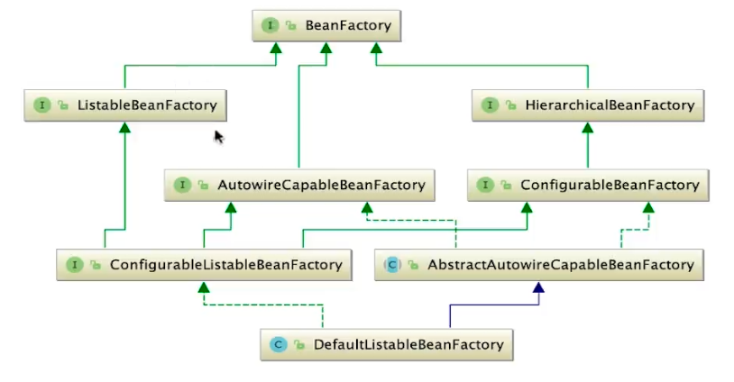

BeanFactory因为是顶级接口，所以肯定会派生出很多接口与实现类

比如`ListableBeanFactory`就可以获取List形式的Bean集合，以及`AutowireCapableBeanFactory`为注解形式的BeanFactory，`HierarchicalBeanFactory`中自定义方法最少，但也非常关键，因为它是重要容器`ApplicationContext`的父接口

### ApplicationContext

接下来看看ApplicationContext

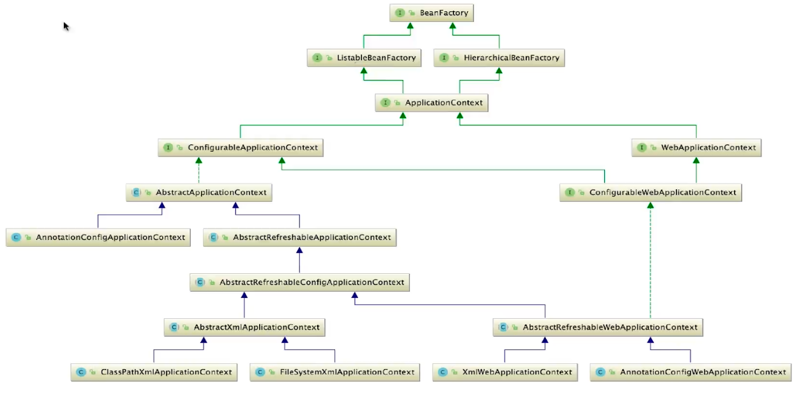

这里可以发现，ApplicationContext也有很多具体的实现，其中用到了很多设计模式

相对重要的是`AbstractApplicationContext`，其中最重要的方法`refresh()`，就是SpringIOC容器启动的方法

其中就用到了**模板方法模式**，`refresh`中有很多方法，有的是模板方法，所有子类实现公用的，有的是钩子方法，可实现可不实现，有的是抽象方法，必须由子类实现的

除了`AbstractApplicationContext`外，可以看到最下层具有几个常用的ApplicationContext

- `ClassPathXmlApplicationContext`
- `FileSystemXmlApplicationContext`
- `XMLWebApplicationContext`
- `AnnotationConfigWebApplicationContext`

前三个是加载xml配置文件的，最后一个是注解时使用的上下文

## Resources

Resources是用来解析读取解析配置文件的，将配置文件中的Bean属性，装配到BeanDefinition中，保存到集合，以待后续使用，下面是Resources的结构图

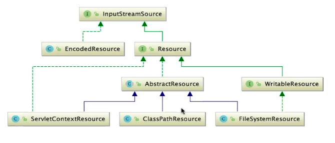

可以看到Resources是基于io实现的配置文件读取，并且使用了**策略模式**，即Resources只是一个接口，具体实现以及使用是由下层实现类提供。

简单介绍一下相关接口和类：

- EncodedResource：主要是对资源文件进行解码编码
- AbstractResources：Resources接口的具体实现，实现了大部分基础功能，当用户需要自定义实现Resources加载功能时，应继承此类，而不是实现Resources接口。
  - 基于抽象Resources，衍生出很多不同情景下的Resources实现，比如Servlet上下文获取资源，类加载路径下的资源，本地文件绝对路径的资源等
- WritableResources：其他的Resources，基本都是对资源文件进行读操作，而此接口可以实现一些写操作

## ResourcesLoader

顾名思义，这个接口是用来获取Resources的，根据各个不同的路径，返回不同的Resources

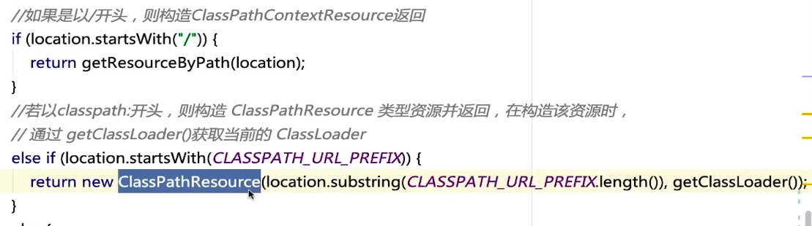

Resources的策略模式，就是在ResourcesLoader中使用的，如上代码，根据路径的不同，使用不同的Resources


通过`ResourcesLoader`的类图，我们可以看到`ApplicationContext`与`AbstractApplicationContext`也在关系图谱中，这说明`ApplicationContext`可以使用`getResources()`方法，使用`ResourcesLoader`对路径进行解析，获取`Resources`

## BeanDefinitionRegister

此接口主要实现对于BeanDefinition的注册，将其注册到容器中，主要使用Map来进行保存

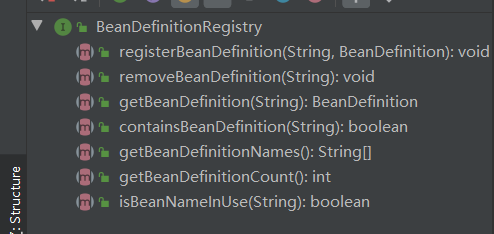

具体实现由实现类实现，常用的有DefaultListableBeanFactory

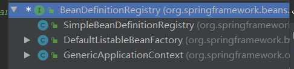

下一节BeanDefinition注册解析时，会具体查看注册逻辑

## BeanDefinitionReader

这个接口，**是用来调用ResourcesLoader或Resources**，将配置文件解析成BeanDefinition，并注册到容器中，这里我们就可以知道，在ApplicationContext中，会调用BeanDefinitionReader-》Resources-》BeanDefinition，注册到容器中

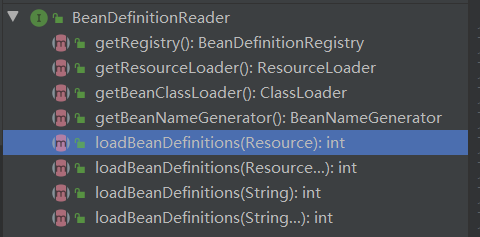

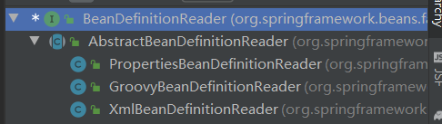

该接口有一个抽象类实现，以及三个具体实现，我们去`XMLBeanDefinitionReader`中看看，因为一般来说，都是使用xml配置文件进行spring的配置

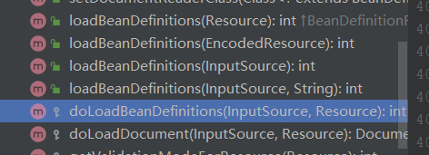

Spring对于命名非常规范，在一个类中，以`do`开头的，一定是具体的实现方法，所以我们去看一下`doLoadBeanDefinitions`这个方法

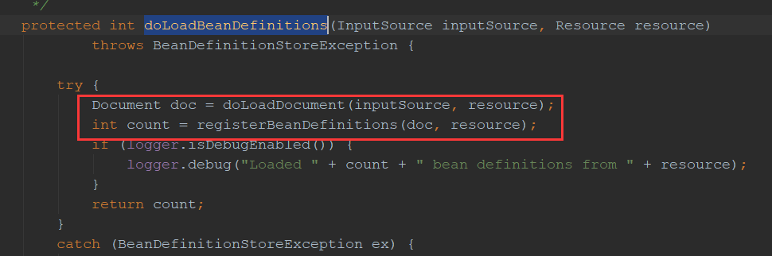

通过源码可知，具体干了两件事

1. 将传入的配置文件流信息，通过SAX XML解析成Document对象
2. 将Document对象转成BeanDefinition注册到容器中

对于如何将xml文件解析成Document对象这里就不看了，是SAX实现的

这里主要看一下注册BeanDefinition到容器中

### BeanDefinition加载解析与注册

```java
public int registerBeanDefinitions(Document doc, Resource resource) throws BeanDefinitionStoreException {
    // 创建Reader，用来读取Document转换成BeanDefinition
    BeanDefinitionDocumentReader documentReader = createBeanDefinitionDocumentReader();
    // 这里是从BeanDefinition注册表中获取数量，即已经注册的数量
    int countBefore = getRegistry().getBeanDefinitionCount();
    // 具体注册逻辑
    documentReader.registerBeanDefinitions(doc, createReaderContext(resource));
    // 返回本次注册了的数量
    return getRegistry().getBeanDefinitionCount() - countBefore;
}

// 具体注册逻辑
@Override
public void registerBeanDefinitions(Document doc, XmlReaderContext readerContext) {
    this.readerContext = readerContext;
    doRegisterBeanDefinitions(doc.getDocumentElement());
}

protected void doRegisterBeanDefinitions(Element root) {
    // 使用代理类实现注册
    BeanDefinitionParserDelegate parent = this.delegate;
    this.delegate = createDelegate(getReaderContext(), root, parent);

    // 判断

    // 自定义注册前后的钩子方法，留给用户实现
    preProcessXml(root);
    // 具体注册逻辑
    parseBeanDefinitions(root, this.delegate);
    postProcessXml(root);

    this.delegate = parent;
}

protected void parseBeanDefinitions(Element root, BeanDefinitionParserDelegate delegate) {
    // 判断是否是默认的配置文件，如果不是 使用用户自定义解析逻辑
    if (delegate.isDefaultNamespace(root)) {
        parseDefaultElement(ele, delegate);
    }else {
        delegate.parseCustomElement(root);
    }
}	

private void parseDefaultElement(Element ele, BeanDefinitionParserDelegate delegate) {
    // 解析import标签的属性，import引了其他配置文件，就会进行递归解析
    if (delegate.nodeNameEquals(ele, IMPORT_ELEMENT)) {
        importBeanDefinitionResource(ele);
    }
    // 解析alias别名
    else if (delegate.nodeNameEquals(ele, ALIAS_ELEMENT)) {
        processAliasRegistration(ele);
    }
    // 解析bean
    else if (delegate.nodeNameEquals(ele, BEAN_ELEMENT)) {
        processBeanDefinition(ele, delegate);
    }
    // 解析beans标签，即递归doRegisterBeanDefinitions，解析注册bean
    else if (delegate.nodeNameEquals(ele, NESTED_BEANS_ELEMENT)) {
        // recurse
        doRegisterBeanDefinitions(ele);
    }
}
```

通过层层代码递进，我们找到了对Bean标签进行解析的实际方法`processBeanDefinition()`，该方法是调用`DefaultBeanDefinitionDocumentReader`实现的，即Reader的实现类

```java
protected void processBeanDefinition(Element ele, BeanDefinitionParserDelegate delegate) {
    // 将属性，解析成BeanDefinition
   BeanDefinitionHolder bdHolder = delegate.parseBeanDefinitionElement(ele);
   if (bdHolder != null) {
      bdHolder = delegate.decorateBeanDefinitionIfRequired(ele, bdHolder);
      try {
         //注册BeanDefinition到容器中
         BeanDefinitionReaderUtils.registerBeanDefinition(bdHolder, getReaderContext().getRegistry());
      }
      catch (BeanDefinitionStoreException ex) {
         getReaderContext().error("Failed to register bean definition with name '" +
               bdHolder.getBeanName() + "'", ele, ex);
      }
      // Send registration event.
      getReaderContext().fireComponentRegistered(new BeanComponentDefinition(bdHolder));
   }
}
```

这里可以看到，主要分为了两步，解析和注册

### 解析创建

```java
@Nullable
public BeanDefinitionHolder parseBeanDefinitionElement(Element ele) {
    return parseBeanDefinitionElement(ele, null);
}

@Nullable
public BeanDefinitionHolder parseBeanDefinitionElement(Element ele, @Nullable BeanDefinition containingBean) {
    String id = ele.getAttribute(ID_ATTRIBUTE);
    String nameAttr = ele.getAttribute(NAME_ATTRIBUTE);

    // 处理Bean名称

    // 实际解析方法
    AbstractBeanDefinition beanDefinition = parseBeanDefinitionElement(ele, beanName, containingBean);
    // 创建完毕后的处理
}

@Nullable
public AbstractBeanDefinition parseBeanDefinitionElement(
    Element ele, String beanName, @Nullable BeanDefinition containingBean) {

    this.parseState.push(new BeanEntry(beanName));
    // 获取class名称
    String className = null;
    if (ele.hasAttribute(CLASS_ATTRIBUTE)) {
        className = ele.getAttribute(CLASS_ATTRIBUTE).trim();
    }
    // 获取父类
    String parent = null;
    if (ele.hasAttribute(PARENT_ATTRIBUTE)) {
        parent = ele.getAttribute(PARENT_ATTRIBUTE);
    }

    try {
        // 创建BeanDefinition，返回AbstractBeanDefinition
        AbstractBeanDefinition bd = createBeanDefinition(className, parent);
        // 创建完毕后的处理
    }
}

protected AbstractBeanDefinition createBeanDefinition(@Nullable String className, @Nullable String parentName)
    throws ClassNotFoundException {
    return BeanDefinitionReaderUtils.createBeanDefinition(
        parentName, className, this.readerContext.getBeanClassLoader());
}
// 使用BeanDefinitionReaderUtils实现BeanDefinition的创建，实际创建了GenericBeanDefinition返回
public static AbstractBeanDefinition createBeanDefinition(
    @Nullable String parentName, @Nullable String className, @Nullable ClassLoader classLoader) throws ClassNotFoundException {

    GenericBeanDefinition bd = new GenericBeanDefinition();
    bd.setParentName(parentName);
    if (className != null) {
        if (classLoader != null) {
            bd.setBeanClass(ClassUtils.forName(className, classLoader));
        }
        else {
            bd.setBeanClassName(className);
        }
    }
    return bd;
}
```

### 注册

`BeanDefinitionReaderUtils.registerBeanDefinition(bdHolder, getReaderContext().getRegistry());`

接着看一下注册逻辑，其实比较简单，就是根据BeanName注册到容器里

```java
@Override
public void registerBeanDefinition(String beanName, BeanDefinition beanDefinition)
    throws BeanDefinitionStoreException {

    Assert.hasText(beanName, "Bean name must not be empty");
    Assert.notNull(beanDefinition, "BeanDefinition must not be null");

    // 校验BeanDefinition
    if (beanDefinition instanceof AbstractBeanDefinition) {
        try {
            ((AbstractBeanDefinition) beanDefinition).validate();
        }
        catch (BeanDefinitionValidationException ex) {
            throw new BeanDefinitionStoreException(beanDefinition.getResourceDescription(), beanName,
                                                   "Validation of bean definition failed", ex);
        }
    }

    // 从容器中获取Bean
    BeanDefinition existingDefinition = this.beanDefinitionMap.get(beanName);
    // 判断是否存在
    if (existingDefinition != null) {
        // 如果存在，判断是否可用覆盖，可用覆盖会使用新的BeanDefinition覆盖
        this.beanDefinitionMap.put(beanName, beanDefinition);
    }
    else {
        // 判断当前是否在Bean创建阶段，如果时，会使用synchronize，锁住当前的Map，将新的BeanDefinition保存到里面
        if (hasBeanCreationStarted()) {
            // Cannot modify startup-time collection elements anymore (for stable iteration)
            synchronized (this.beanDefinitionMap) {
                this.beanDefinitionMap.put(beanName, beanDefinition);
                List<String> updatedDefinitions = new ArrayList<>(this.beanDefinitionNames.size() + 1);
                updatedDefinitions.addAll(this.beanDefinitionNames);
                updatedDefinitions.add(beanName);
                this.beanDefinitionNames = updatedDefinitions;
                removeManualSingletonName(beanName);
            }
        }
        // 不处于创建阶段，直接放到容器中
        else {
            // Still in startup registration phase
            this.beanDefinitionMap.put(beanName, beanDefinition);
            this.beanDefinitionNames.add(beanName);
            removeManualSingletonName(beanName);
        }
        this.frozenBeanDefinitionNames = null;
    }

    // 再次检查IOC容器中是否有同名的BeanDefinition
    if (existingDefinition != null || containsSingleton(beanName)) {
        // 如果有，会进行BeanDefinition的重置，包括合并的BeanDefinition，BeanDefinition的父类等
        resetBeanDefinition(beanName);
    }
}
```

## 总结BeanDefinition加载注册流程

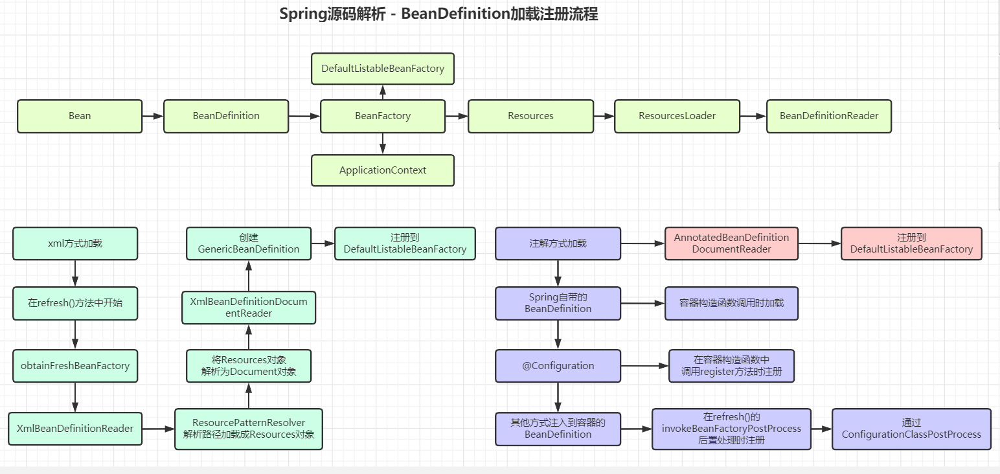