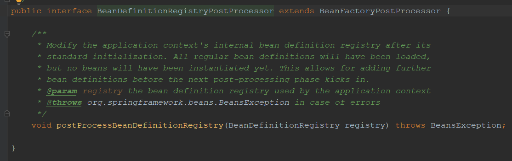
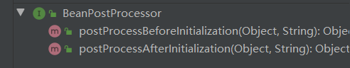
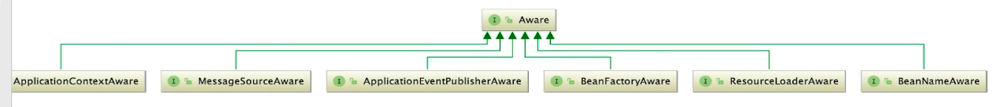
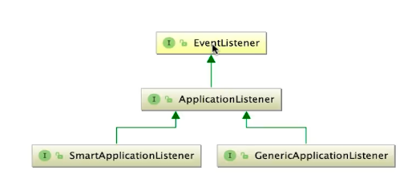

容器初始化，其实就是AbstractApplicationContext中的refresh()方法，但是在直接查看refresh实现之前，我们也需要提前了解一些知识。

## PostProcessor

PostProcessor是后置处理器，即某些场景下，在完成某些操作后执行的方法，Spring的后置处理器默认有三种

- BeanDefinitionRegisterPostProcessor：BeanDefinition注册后后置处理
- BeanFactoryPostProcessor：Bean工厂创建后后置处理
- BeanPostProcessor：Bean对象创建后后置处理

### BeanDefinitionRegisterPostProcessor

BeanDefinitionRegisterPostProcessor其实继承自BeanFactoryPostProcessor，即是特殊的BeanFactory后置处理器



通过此后置处理器，可以实现在后置处理中实现搜索某些第三方项目里的class，将其注册到Spring容器中，这样就可以复用其功能了，Mybatis就是这样做的

此接口和BeanFactoryPostProcessor一样，都是在refresh方法中的invokeBeanFactoryPostProcessors()执行的

### BeanPostProcessor

BeanPostProcessor是Bean的后置处理器



后置器有两个方法，在Bean初始化前后进行一些增强操作，注意是初始化即init-method执行前后，而不是创建前后。

使用这个接口，可以实现一些功能增强作用，比如init前后实现日志打印，其实这就是AOP的实现原理，后续会详细了解。

## Aware

一般来说，Spring为我们提供了一个容器，让我们可以无感知的获取Bean，使用Bean进行一系列操作，通过源码，我们看到容器中有很多Spring提供的Bean的管理器，比如ApplicationContext，BeanFactory等等，如果某些特定场景下，我们需要使用这些管理器，而又因为是无感知的容器，所以应该如何获取呢？

Spring就为我们提供了Aware接口，使得我们可以操作这些管理器，来达到我们的目的。



比如：


提供了一个set方法，那么我们就可以知道如何使用Aware接口了，只需实现接口，然后再成员变量上添加ApplicationContext，再重写set方法时，对其赋值，就可以使用，如下代码：

```java
public class UserService implements ApplicationContextAware {

   private ApplicationContext applicationContext;

   public void getUser(){
      System.out.println("获取了User");
      String[] beanDefinitionNames = applicationContext.getBeanDefinitionNames();
      for (String beanDefinitionName : beanDefinitionNames) {
         System.out.println("我在操作ApplicationContext，获取了很多Bean，如："+beanDefinitionName);
      }
   }

   @Override
   public void setApplicationContext(ApplicationContext applicationContext) throws BeansException {
      this.applicationContext = applicationContext;
   }
}
```

注意，使用aware时，使用的类需要被Spring管理才可以

## 事件监听模式

事件监听模式也是Spring中大量使用的一种设计模式，因为之前有过详细介绍，这里就不赘述了，不明白的可以看下这两篇文章：

[观察者模式](<http://www.pacee1.com/2020/04/04/%E8%AE%BE%E8%AE%A1%E6%A8%A1%E5%BC%8F/%E8%AE%BE%E8%AE%A1%E6%A8%A1%E5%BC%8F10-%E8%A7%82%E5%AF%9F%E8%80%85%E6%A8%A1%E5%BC%8F/>)，[SpringBoot中的事件监听机制](<http://www.pacee1.com/2020/04/28/springboot/SpringBoot%E6%BA%90%E7%A0%81%E8%A7%A3%E6%9E%9003-%E4%BA%8B%E4%BB%B6%E7%9B%91%E5%90%AC%E6%9C%BA%E5%88%B6/>)

对于Spring来说，监听机制其实都差不多，只是事件与监听器的不同

事件：


监听器：



## 攻坚refresh

这里我们主要了解流程，每一步做了哪些事，具体每一步内部的代码逻辑，在SpringBoot源码分析中已经详细介绍，可以看这一篇文章：[SpringBoot中Bean加载流程](<http://www.pacee1.com/2020/04/28/springboot/SpringBoot%E6%BA%90%E7%A0%81%E8%A7%A3%E6%9E%9004-bean%E8%A7%A3%E6%9E%90/>)

```java
@Override
public void refresh() throws BeansException, IllegalStateException {
   synchronized (this.startupShutdownMonitor) {
      // 1.环境准备，包括容器active状态设置，检查必备属性，添加一些监听
      prepareRefresh();

      // 2.创建BeanFactory，默认为DefaultListableBeanFactory
      // 这里有两种情况，xml与注解
      // xml时，会使用BeanDefinitionReader读取xml配置到Resources再到Document再解析成BeanDefinition到容器
      // 注解时，对于解析BeanDefinition到容器的操作会在后面执行，这里仅仅创建BeanFactory
      ConfigurableListableBeanFactory beanFactory = obtainFreshBeanFactory();

      // 3.配置BeanFactory，主要是用来配置一些属性，后置处理器
      // 比如ClassLoader，ApplicationContextAwarePostProcessor等
      prepareBeanFactory(beanFactory);

      try {
         // 4.BeanFactory创建后的一些操作，由子类实现，钩子方法，不需要过多关注
         postProcessBeanFactory(beanFactory);

         // 5.循环执行所有的后置处理器
         // 注解形式时，就会使用ConfigurationClassPostProcessor，将BeanDefinition解析注册到BeanFactory中
         invokeBeanFactoryPostProcessors(beanFactory);

         // 6.向容器中注册Bean后置处理器，注意并不执行，会在Bean创建后才会执行
         registerBeanPostProcessors(beanFactory);

         // 7.初始化注册国际化相关类接口
         initMessageSource();

         // 8.初始化注册事件派发器，后续需要派发事件时调用
         initApplicationEventMulticaster();

         // 9.刷新，由子类实现，钩子方法
         // 对于Web来说，会创建一个web容器即Tomcat
         onRefresh();

         // 9.初始化注册监听器，前面注册了派发器，但是没有配置监听器，这里就是为派发器添加监听器
         registerListeners();

         // 10.重点方法，实例化所有非懒加载的单例Bean
         // 其中最重要方法为doGetBean方法，会在后续单独学习
         finishBeanFactoryInitialization(beanFactory);

         // 11.触发创建完成的回调方法，发布容器刷新完毕事件
         finishRefresh();
      }
      catch (BeansException ex) {
         // 失败后处理
      }
      finally {
         // 12.清除刷新过程中的所有Spring缓存
         resetCommonCaches();
      }
   }
}
```

对于实例化单例Bean中实际创建Bean的方法`doGetBean`，会在下一节进行具体解析