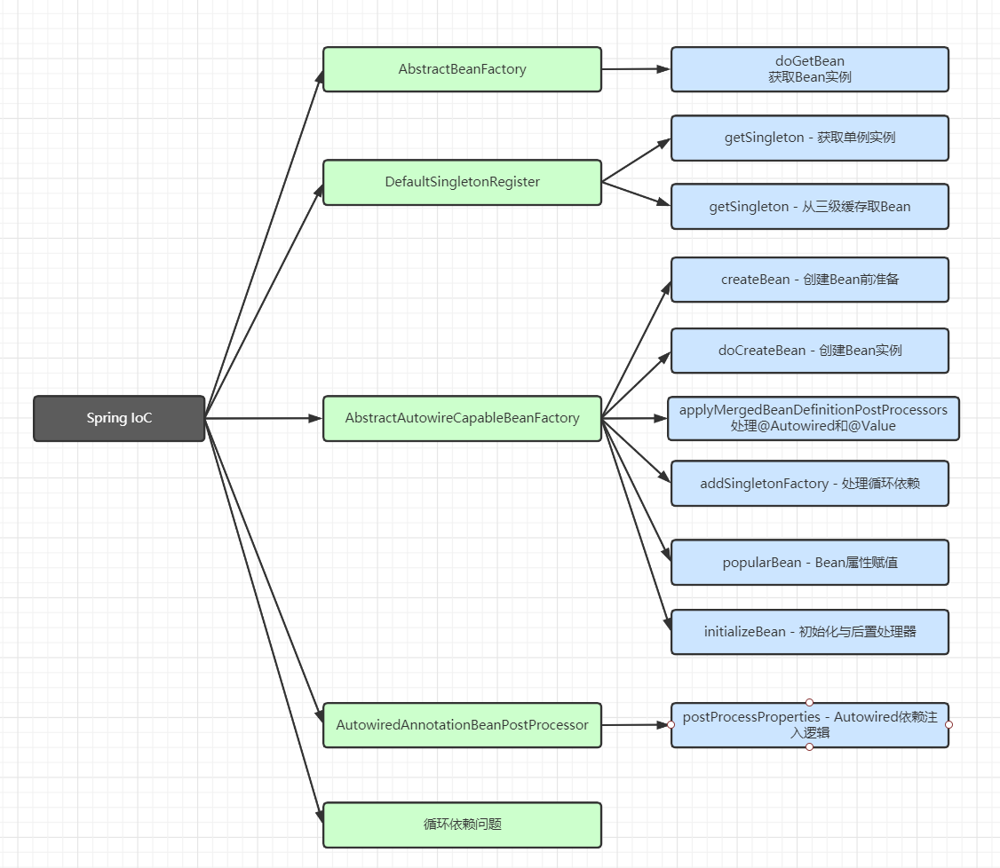
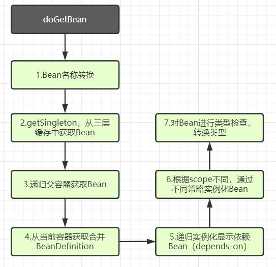
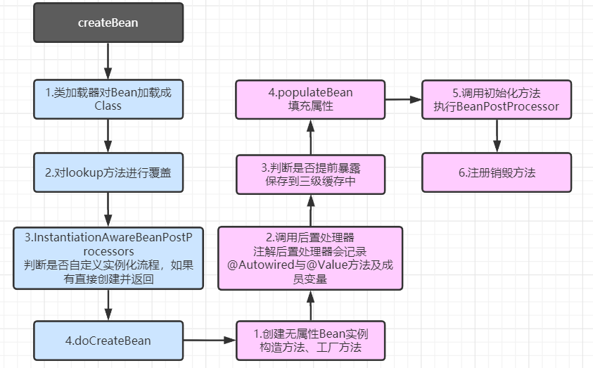
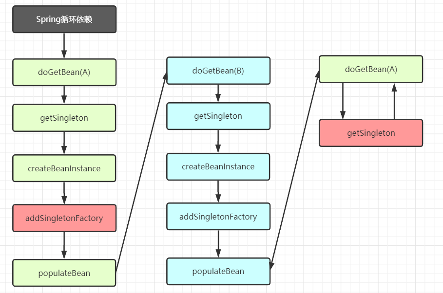
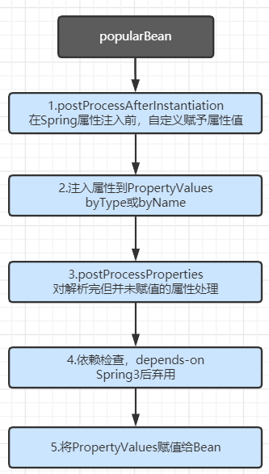

上一节，我们大体研究了Spring IoC容器初始化的过程，但是我们留了一个点，就是在finishBeanFactoryInitialization方法中，会进行所有单例非懒加载的Bean实例的创建，我们这一节，就是对其中方法实现进行解析。

首先我们先看一下Bean创建过程中大体流程，以及相关类接口



## doGetBean

首先我们直接从AbstractBeanFactory中的doGetBean方法进攻

### 流程图



### 源码分析

接下来是对doGetBean()方法的源码查看，会精简一些日志打印，catch异常的代码

```java
protected <T> T doGetBean(final String name, @Nullable final Class<T> requiredType,
      @Nullable final Object[] args, boolean typeCheckOnly) throws BeansException {

   // 处理Bean名称，主要有三种情况
   // 1.原始BeanName，2.别名BeanName，3.FactoryBean的BeanName-'&'
   final String beanName = transformedBeanName(name);
   Object bean;

   // 从一级，二级，三级级缓存中取当前Bean，查看缓存是否存在
   Object sharedInstance = getSingleton(beanName);
   // 如果缓存中存在
   if (sharedInstance != null && args == null) {
      // 如果是普通的Bean，直接返回，如果是FactoryBean，返回其getObject
      bean = getObjectForBeanInstance(sharedInstance, name, beanName, null);
   }
   // 缓存中不存在，需要进行创建
   else {
      // 这里主要是判断是否有prototype原型模式的Bean正在创建
      // 如果有，说明处于循环依赖状态，直接抛出异常
      // 循环依赖：A -> B -> A，第一个A创建时依赖B，将A放入正常创建的集合中，创建B时依赖A，发现A已经存在，即抛出异常
      if (isPrototypeCurrentlyInCreation(beanName)) {
         throw new BeanCurrentlyInCreationException(beanName);
      }

      // 判断该Bean是否存在域父BeanFactory容器中
      BeanFactory parentBeanFactory = getParentBeanFactory();
      // 递归到父容器查找该Bean，如果有直接返回
      if (parentBeanFactory != null && !containsBeanDefinition(beanName)) {
         // Not found -> check parent.
         String nameToLookup = originalBeanName(name);
         if (parentBeanFactory instanceof AbstractBeanFactory) {
            return ((AbstractBeanFactory) parentBeanFactory).doGetBean(
                  nameToLookup, requiredType, args, typeCheckOnly);
         }
         else if (args != null) {
            // Delegation to parent with explicit args.
            return (T) parentBeanFactory.getBean(nameToLookup, args);
         }
         else if (requiredType != null) {
            // No args -> delegate to standard getBean method.
            return parentBeanFactory.getBean(nameToLookup, requiredType);
         }
         else {
            return (T) parentBeanFactory.getBean(nameToLookup);
         }
      }

      if (!typeCheckOnly) {
         markBeanAsCreated(beanName);
      }

      // 进入创建Bean的逻辑中
      try {
         // 首先合并parent属性的BeanDefinition
         // <bean id="a" class="A" parent="b"/> <bean id="b" class="B"/>
         final RootBeanDefinition mbd = getMergedLocalBeanDefinition(beanName);
         checkMergedBeanDefinition(mbd, beanName, args);

         // 处理依赖Bean情况，depends-on
         // 依赖Bean意思主要是需要先实例化依赖的Bean，即递归创建所依赖的Bean
         String[] dependsOn = mbd.getDependsOn();
         if (dependsOn != null) {
            for (String dep : dependsOn) {
               if (isDependent(beanName, dep)) {
                  throw new BeanCreationException(mbd.getResourceDescription(), beanName,
                        "Circular depends-on relationship between '" + beanName + "' and '" + dep + "'");
               }
               registerDependentBean(dep, beanName);
               try {
                  getBean(dep);
               }
               catch (NoSuchBeanDefinitionException ex) {
               }
            }
         }

         // 创建单例Bean，该方法中最重要逻辑之一
         if (mbd.isSingleton()) {
            // 这里使用匿名内部类来创建Bean实例，getSingleton中实例使用createBean来创建实例
            // 对于createBean中方法，也非常复杂，会在下一章详细解析
            sharedInstance = getSingleton(beanName, () -> {
               try {
                  return createBean(beanName, mbd, args);
               }
               catch (BeansException ex) {
               }
            });
            // 判断Bean是否为普通Bean返回，为FactoryBean返回getObject
            bean = getObjectForBeanInstance(sharedInstance, name, beanName, mbd);
         }
         // prototype形式的Bean进行创建
         else if (mbd.isPrototype()) {
            // It's a prototype -> create a new instance.
            Object prototypeInstance = null;
            try {
               beforePrototypeCreation(beanName);
               prototypeInstance = createBean(beanName, mbd, args);
            }
            finally {
               afterPrototypeCreation(beanName);
            }
            bean = getObjectForBeanInstance(prototypeInstance, name, beanName, mbd);
         }
         // 其他形式创建
         else {
            String scopeName = mbd.getScope();
            final Scope scope = this.scopes.get(scopeName);
            if (scope == null) {
               throw new IllegalStateException("No Scope registered for scope name '" + scopeName + "'");
            }
            try {
               Object scopedInstance = scope.get(beanName, () -> {
                  beforePrototypeCreation(beanName);
                  try {
                     return createBean(beanName, mbd, args);
                  }
                  finally {
                     afterPrototypeCreation(beanName);
                  }
               });
               bean = getObjectForBeanInstance(scopedInstance, name, beanName, mbd);
            }
            catch (IllegalStateException ex) {
            }
         }
      }
      catch (BeansException ex) {
         cleanupAfterBeanCreationFailure(beanName);
         throw ex;
      }
   }

   // 创建完毕后，对创建出的Bean进行类型检查
   // 对所需Bean类型进行转换
   if (requiredType != null && !requiredType.isInstance(bean)) {
      try {
         T convertedBean = getTypeConverter().convertIfNecessary(bean, requiredType);
         if (convertedBean == null) {
            throw new BeanNotOfRequiredTypeException(name, requiredType, bean.getClass());
         }
         return convertedBean;
      }
   }
   return (T) bean;
}
```

这里最终要的方法是个同名方法，getSingleton()，第一个是从缓存中查找Bean，第二个是使用匿名内部类创建Bean，对于创建Bean的方法，会在下一节进行解析，我们主要看一下从缓存查找Bean。

```java
protected Object getSingleton(String beanName, boolean allowEarlyReference) {
   // singletonObjects为一级缓存，一级缓存主要存放完全创建好的Bean
   Object singletonObject = this.singletonObjects.get(beanName);
   if (singletonObject == null && isSingletonCurrentlyInCreation(beanName)) {
      // 一级缓存不存在，需查询二级缓存，这里需要使用同步锁，以防在查询过程中，Bean被创建并被放入一级缓存中
      synchronized (this.singletonObjects) {
         // earlySingletonObjects为二级缓存，主要存在单独没有属性注入的Bean
         singletonObject = this.earlySingletonObjects.get(beanName);
         if (singletonObject == null && allowEarlyReference) {
            // singletonFactories三级缓存查找
            ObjectFactory<?> singletonFactory = this.singletonFactories.get(beanName);
            if (singletonFactory != null) {
               // 如果存在，会使用getObject创建此Bean，并存入二级缓存，删除三级缓存中的
               singletonObject = singletonFactory.getObject();
               this.earlySingletonObjects.put(beanName, singletonObject);
               this.singletonFactories.remove(beanName);
            }
         }
      }
   }
   return singletonObject;
}
```

也是非常清晰，主要了解每级缓存名称以及存放了什么

看完了doGetBean的大体逻辑，我们要实际进攻创建Bean的方法createBean了

## createBean

### 流程图



### 源码分析

```java
@Override
protected Object createBean(String beanName, RootBeanDefinition mbd, @Nullable Object[] args)
      throws BeanCreationException {
   // 克隆BeanDefinition来操作
   RootBeanDefinition mbdToUse = mbd;

   // 获取Bean的Class，判断该Bean是否可以被实例化
   Class<?> resolvedClass = resolveBeanClass(mbd, beanName);
   // 克隆BeanDefinition来操作
   if (resolvedClass != null && !mbd.hasBeanClass() && mbd.getBeanClassName() != null) {
      mbdToUse = new RootBeanDefinition(mbd);
      mbdToUse.setBeanClass(resolvedClass);
   }

   // 对lookup方法进行覆盖
   try {
      mbdToUse.prepareMethodOverrides();
   }

   try {
      // 这里会判断该类是否实现InstantiationAwareBeanPostProcessors
      // 该接口可以让用户自定义实现Bean，从而不使用Spring的创建逻辑
      // 该接口有两个抽象方法
      // applyBeanPostProcessorsBeforeInstantiation，创建自定义Bean
      // applyBeanPostProcessorsAfterInitialization，为Bean创建后进行初始化工作
      Object bean = resolveBeforeInstantiation(beanName, mbdToUse);
      if (bean != null) {
         // 如果不为null，直接返回，不进行接下来的创建操作了
         return bean;
      }
   }

   try {
      // 调用重载方法进行Bean的创建
      Object beanInstance = doCreateBean(beanName, mbdToUse, args);
      if (logger.isTraceEnabled()) {
         logger.trace("Finished creating instance of bean '" + beanName + "'");
      }
      return beanInstance;
   }
}

protected Object doCreateBean(final String beanName, final RootBeanDefinition mbd, final @Nullable Object[] args)
      throws BeanCreationException {

   // BeanWrapper可以操作Bean的属性
   BeanWrapper instanceWrapper = null;
   // 判断是否为单例
   if (mbd.isSingleton()) {
      instanceWrapper = this.factoryBeanInstanceCache.remove(beanName);
   }
   if (instanceWrapper == null) {
      // 创建Bean，创建出来的Bean是无属性的，当然如果是有参构造，部分成员变量是有属性的
      // 创建方式有三种：
      // 1.无参构造 2.有参构造 3.工厂方法创建
      // 使用的创建策略为Cglib创建，利用反射
      instanceWrapper = createBeanInstance(beanName, mbd, args);
   }
   // 获取被包装的Bean
   final Object bean = instanceWrapper.getWrappedInstance();
   Class<?> beanType = instanceWrapper.getWrappedClass();
   if (beanType != NullBean.class) {
      mbd.resolvedTargetType = beanType;
   }

   // Allow post-processors to modify the merged bean definition.
   synchronized (mbd.postProcessingLock) {
      // 判断该Bean是否有后置处理过
      if (!mbd.postProcessed) {
         try {
            // 实现对Bean的后置处理
            // 其中有一个重要的后置处理器：AutowiredAnnotationPostProcessor
            // 该后置处理器重要作用就是获取被@Autowired，@Value修饰的属性，用于后面依赖注入
            applyMergedBeanDefinitionPostProcessors(mbd, beanType, beanName);
         }
         mbd.postProcessed = true;
      }
   }

   // 重要，处理循环依赖的解决方案，向容器缓存单例Bean对象
   // 判断该类是否单例，是否允许循环依赖，是否为创建中的Bean
   boolean earlySingletonExposure = (mbd.isSingleton() && this.allowCircularReferences &&
         isSingletonCurrentlyInCreation(beanName));
   if (earlySingletonExposure) {
      if (logger.isTraceEnabled()) {
         logger.trace("Eagerly caching bean '" + beanName +
               "' to allow for resolving potential circular references");
      }
      // 如果全部满足，会将此无属性Bean存入三级缓存中，防止循环依赖
      addSingletonFactory(beanName, () -> getEarlyBeanReference(beanName, mbd, bean));
   }

   // Initialize the bean instance.
   Object exposedObject = bean;
   try {
      // 依赖注入，对属性进行填充
      populateBean(beanName, mbd, instanceWrapper);
      // 调用初始化方法，以及BeanPostProcessor，（method-init）
      exposedObject = initializeBean(beanName, exposedObject, mbd);
   }

   // 主要是判断初始化方法执行后的Bean与执行前的Bean是否一致，因为是单例，所以需要保证一致
   // 如果不一致进行一些处理，不重点关注
   if (earlySingletonExposure) {
      Object earlySingletonReference = getSingleton(beanName, false);
      if (earlySingletonReference != null) {
         if (exposedObject == bean) {
            exposedObject = earlySingletonReference;
         }
         else if (!this.allowRawInjectionDespiteWrapping && hasDependentBean(beanName)) {
            String[] dependentBeans = getDependentBeans(beanName);
            Set<String> actualDependentBeans = new LinkedHashSet<>(dependentBeans.length);
            for (String dependentBean : dependentBeans) {
               if (!removeSingletonIfCreatedForTypeCheckOnly(dependentBean)) {
                  actualDependentBeans.add(dependentBean);
               }
            }
            if (!actualDependentBeans.isEmpty()) {
            }
         }
      }
   }

   // Register bean as disposable.
   try {
      // 注册相关销毁逻辑
      registerDisposableBeanIfNecessary(beanName, bean, mbd);
   }

   return exposedObject;
}
```

## 循环依赖问题

对于Spring中的循环依赖，是面试最常考的问题，有几种情形，我们分别进行分析

- 构造器循环依赖注入，（单例模式、原型模式）
- setter循环依赖注入，（单例模式、原型模式）

### 原型模式

首先我们分析原型模式的两种注入方式，

通过前面源码查看，我们假设当前为setter注入方式，对于setter注入方式，我们会在doCreateBean()方法中的populateBean()方法进行注入。

此时A依赖B，B依赖A，那么在B创建时，就会使用doGetBean(A)

回顾`doGetBean`方法

```java
if (isPrototypeCurrentlyInCreation(beanName)) {
   throw new BeanCurrentlyInCreationException(beanName);
}
```

该段代码就是校验是否存在prototype形式的Bean循环依赖，可以看出，Spring是不支持prototype形式循环依赖的。

即当A创建过程中，会添加到ThreadLocal中，标识该类正在创建过程中，所以当B再次获取A时，走到该段代码，就会从ThreadLocal获取到A，即if命中，抛出异常

### 单例模式Setter注入

当doCreateBean时，如果满足提前暴露条件，会将创建出的无属性Bean使用`addSingletonFactory`方法存入三级缓存中

这时再当A依赖B，B依赖A情况出现时，调用`doGetBean(A)`

```java
// 从一级，二级，三级缓存中取当前Bean，查看缓存是否存在
Object sharedInstance = getSingleton(beanName);
```

这时会就从三级缓存拿到无属性的A，所以B就会被成功创建出来，然后A随着B的创建于属性注入，A也会被成功创建。

即Spring是支持单例模式Setter循环依赖注入的。

### 单例模式构造器模式注入

当doCreateBean时，因为是构造器模式注入，所以在createBeanInstance时就会进行创建

```java
// 创建Bean，创建出来的Bean是无属性的，当然如果是有参构造，部分成员变量是有属性的
// 创建方式有三种：
// 1.无参构造 2.有参构造 3.工厂方法创建
// 使用的创建策略为Cglib创建，利用反射
instanceWrapper = createBeanInstance(beanName, mbd, args);
```

而此时就会进行依赖注入，但是当前并没有走到`populateBean()`这个方法，就更别说`addSingletonFactory`方法的执行了。

所以在B获取A依赖时，无法从缓存中获取A实例，就会一直循环依赖导致报错。

所以Spring不支持单例模式构造器方式循环依赖注入。

### 总结循环依赖

Spring仅支持单例模式Setter循环依赖



## populateBean

该方法主要用作在Bean创建后的依赖注入，方法内部调用很深比较复杂，我们大致了解下大体框架流程即可

### 流程图



### 源码解析

```java
protected void populateBean(String beanName, RootBeanDefinition mbd, @Nullable BeanWrapper bw) {

   // 判断该Bean是否实现InstantiationAwareBeanPostProcessors接口
   // 如果有实现，调用postProcessAfterInstantiation方法
   // 该方法可以在属性设置前，去修改Bean的属性值，并且可以控制是否让Spring继续向下设置属性
   // 即可以接管Spring设置属性的权利
   if (!mbd.isSynthetic() && hasInstantiationAwareBeanPostProcessors()) {
      for (BeanPostProcessor bp : getBeanPostProcessors()) {
         if (bp instanceof InstantiationAwareBeanPostProcessor) {
            InstantiationAwareBeanPostProcessor ibp = (InstantiationAwareBeanPostProcessor) bp;
            if (!ibp.postProcessAfterInstantiation(bw.getWrappedInstance(), beanName)) {
               continueWithPropertyPopulation = false;
               break;
            }
         }
      }
   }

   if (!continueWithPropertyPopulation) {
      return;
   }

   // 从BeanDefinition中取出属性值
   // 如果是使用注解，该属性值会被实例化，但是为空
   PropertyValues pvs = (mbd.hasPropertyValues() ? mbd.getPropertyValues() : null);

   // 判断Bean是否具有Autowired的属性
   // 注意此处不是@Autowired，而是xml形式的配置<bean ··· autowire="byName"/>
   // 因为@Autowired再创建Bean的时候调用后置处理器，就将其属性值保存到meta容器中了
   int resolvedAutowireMode = mbd.getResolvedAutowireMode();
   if (resolvedAutowireMode == AUTOWIRE_BY_NAME || resolvedAutowireMode == AUTOWIRE_BY_TYPE) {
      MutablePropertyValues newPvs = new MutablePropertyValues(pvs);
      // Add property values based on autowire by name if applicable.
      // 使用ByName形式解析注入属性值
      if (resolvedAutowireMode == AUTOWIRE_BY_NAME) {
         autowireByName(beanName, mbd, bw, newPvs);
      }
      // 使用ByType形式解析注入属性值
      if (resolvedAutowireMode == AUTOWIRE_BY_TYPE) {
         autowireByType(beanName, mbd, bw, newPvs);
      }
      pvs = newPvs;
   }

   // 再次判断是否实现InstantiationAwareBeanPostProcessors接口
   boolean hasInstAwareBpps = hasInstantiationAwareBeanPostProcessors();
   // 判断是否具有depends-on，Spring3后弃用
   boolean needsDepCheck = (mbd.getDependencyCheck() != AbstractBeanDefinition.DEPENDENCY_CHECK_NONE);

   PropertyDescriptor[] filteredPds = null;
   // 如果实现了接口，调用postProcessProperties为其属性赋值
   // 注意，这里会为注解和xml配置方式的一起赋值
   // 对于注解，会使用AutowiredAnnotationPostProcessor的此方法进行属性的赋值
   if (hasInstAwareBpps) {
      if (pvs == null) {
         pvs = mbd.getPropertyValues();
      }
      for (BeanPostProcessor bp : getBeanPostProcessors()) {
         if (bp instanceof InstantiationAwareBeanPostProcessor) {
            InstantiationAwareBeanPostProcessor ibp = (InstantiationAwareBeanPostProcessor) bp;
            PropertyValues pvsToUse = ibp.postProcessProperties(pvs, bw.getWrappedInstance(), beanName);
            if (pvsToUse == null) {
               if (filteredPds == null) {
                  filteredPds = filterPropertyDescriptorsForDependencyCheck(bw, mbd.allowCaching);
               }
               pvsToUse = ibp.postProcessPropertyValues(pvs, filteredPds, bw.getWrappedInstance(), beanName);
               if (pvsToUse == null) {
                  return;
               }
            }
            pvs = pvsToUse;
         }
      }
   }
   // 依赖检查，depends-on，3以后弃用
   if (needsDepCheck) {
      if (filteredPds == null) {
         filteredPds = filterPropertyDescriptorsForDependencyCheck(bw, mbd.allowCaching);
      }
      checkDependencies(beanName, mbd, filteredPds, pvs);
   }

   if (pvs != null) {
      // 将PropertyValues中的值赋值到Bean中
      applyPropertyValues(beanName, mbd, bw, pvs);
   }
}
```