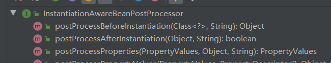
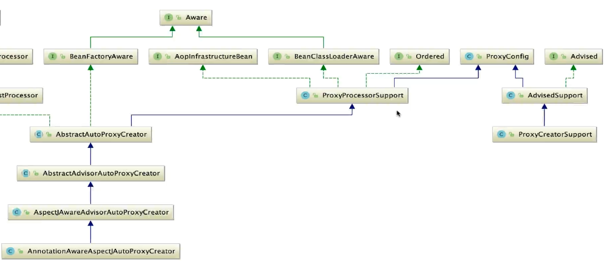
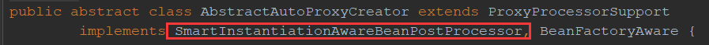
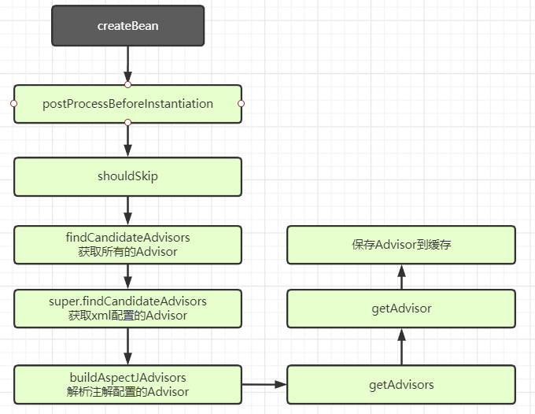

本节我们开始对AOP进攻，在学习AOP前，我们要先了解几个关键的BeanPostProcessor后置处理器

## BeanPostProcessor

因为AOP和后置处理器有大关系，所以我们要先看一下后置处理器。

最主要的是`InstantiationAwareBeanPostProcessor`以及他的子接口`SmartInstantiationAwareBeanPostProcessor`

### InstantiationAwareBeanPostProcessor

该接口通过前面的学习应该不会陌生，很多地方都用到此接口，比如创建Bean之前，会调用此接口看看有没有用户自定义的Bean创建方式，就不会向下执行了，以及创建后的初始化操作。

此接口主要有3个方法，如下



- `postProcessBeforeInstantiation`
  - 调用时机：`createBean `-》  `resolveBeforeInstantiation `-》 `applyBeanPostProcessorsBeforeInstantiation`
  - 方法功能：使用户可以接收Bean的创建逻辑，而不是交给Spring创建
- `postProcessAfterInstantiation`
  - 调用时机：`createBean `-》  `doCreateBean `-》 `initializeBean `-》 `postProcessAfterInstantiation`
  - 方法功能：在Spring为属性注入值之前，让用户可以接手注入值的权利，并且可以控制在之后是否还需要Spring进行属性注入
- `postProcessProperties`
  - 调用时机：`createBean `-》  `doCreateBean `-》 `populateBean `-》`postProcessProperties`
  - 方法功能：在Spring处理完默认的属性后，对更细粒度的属性进行处理，比如@Autowired，@Resources

### SmartInstantiationAwareBeanPostProcessor

该接口为`InstantiationAwareBeanPostProcessor`的扩展接口

```java
public interface SmartInstantiationAwareBeanPostProcessor extends InstantiationAwareBeanPostProcessor {

   // 用来确定Bean的最终类型，当Spring在构建过程中无法确定类型时就会调用此方法确定类型
   @Nullable
   default Class<?> predictBeanType(Class<?> beanClass, String beanName) throws BeansException {
      return null;
   }

   // 为Bean选择合适的构造器来实例化对象
   // 该方法调用时机在创建无属性Bean的时候
   // createBean -> doCreateBean -> createBeanInstance
   @Nullable
   default Constructor<?>[] determineCandidateConstructors(Class<?> beanClass, String beanName)
         throws BeansException {

      return null;
   }

   // 获取需要提前暴露的Bean，保证循环依赖问题
   // 调用时机在doCreateBean向缓存添加提前暴露Bean的时候
   default Object getEarlyBeanReference(Object bean, String beanName) throws BeansException {
      return bean;
   }

}
```

------

了解完后置处理器后，我们就开始进行AOP的源码解析，对于AOP来说，我们一般都是使用注解形式进行操作，对于常规XML配置已经很少用了，因为较为繁琐，因此本篇也是以注解为基础，进行AOP解析。

对于注解使用AOP，我们大体有一个源码解析流程：

- 注册 解析AOP的服务
- 解析加载横切逻辑
- 将横切逻辑织入到目标Bean中

## 注册解析AOP的服务

使用注解时，我们一般通过在启动器类上添加`@EnableAspectJAutoProxy`来开启AOP服务

```java
@Target(ElementType.TYPE)
@Retention(RetentionPolicy.RUNTIME)
@Documented
@Import(AspectJAutoProxyRegistrar.class)
public @interface EnableAspectJAutoProxy {

   // 设置AOP动态代理的使用方式
   // false为JDK，true为Cglib
   boolean proxyTargetClass() default false;

   // 为了解决无法使用代理的场景，false为不处理
   // true表示可以从AopContext中获得（ThreadLocal），从而可以从Spring上下文中获取当前代理对象
   boolean exposeProxy() default false;

}
```

可以看到此注解有两个属性，并且import了一个类看名字也知道是关于注册的，所以我们再进入`AspectJAutoProxyRegistrar`

```java
class AspectJAutoProxyRegistrar implements ImportBeanDefinitionRegistrar {

   // 注册AOP解析器到容器中
   @Override
   public void registerBeanDefinitions(
         AnnotationMetadata importingClassMetadata, BeanDefinitionRegistry registry) {

      // 注册AOP解析器到容器中
      AopConfigUtils.registerAspectJAnnotationAutoProxyCreatorIfNecessary(registry);

      // 获取之前注解上配置的两个属性值，即ProxyTargetSource和exposeProxy
      AnnotationAttributes enableAspectJAutoProxy =
            AnnotationConfigUtils.attributesFor(importingClassMetadata, EnableAspectJAutoProxy.class);
      // 为AOP解析器赋上属性值
      if (enableAspectJAutoProxy != null) {
         if (enableAspectJAutoProxy.getBoolean("proxyTargetClass")) {
            AopConfigUtils.forceAutoProxyCreatorToUseClassProxying(registry);
         }
         if (enableAspectJAutoProxy.getBoolean("exposeProxy")) {
            AopConfigUtils.forceAutoProxyCreatorToExposeProxy(registry);
         }
      }
   }

}
```

通过源码，不难发现，对于注册AOP解析器的逻辑基本都在`registerAspectJAnnotationAutoProxyCreatorIfNecessary`方法中，进去看看

```java
public static final String AUTO_PROXY_CREATOR_BEAN_NAME =
			"org.springframework.aop.config.internalAutoProxyCreator";

@Nullable
public static BeanDefinition registerAspectJAnnotationAutoProxyCreatorIfNecessary(BeanDefinitionRegistry registry) {
   return registerAspectJAnnotationAutoProxyCreatorIfNecessary(registry, null);
}

@Nullable
public static BeanDefinition registerAspectJAnnotationAutoProxyCreatorIfNecessary(
      BeanDefinitionRegistry registry, @Nullable Object source) {
    // 再次调用，这时传入了AnnotationAwareAspectJAutoProxyCreator类，就是实际创建AOP解析器的类
   return registerOrEscalateApcAsRequired(AnnotationAwareAspectJAutoProxyCreator.class, registry, source);
}

@Nullable
private static BeanDefinition registerOrEscalateApcAsRequired(
    Class<?> cls, BeanDefinitionRegistry registry, @Nullable Object source) {
    // 断言判断注册器是否为null
    Assert.notNull(registry, "BeanDefinitionRegistry must not be null");

    // 这里判断容器中是否已经有AOP创建器，并且名称类型相同（用户自定义的，一般不存在）
    // 如果有根据优先级选择使用
    if (registry.containsBeanDefinition(AUTO_PROXY_CREATOR_BEAN_NAME)) {
        BeanDefinition apcDefinition = registry.getBeanDefinition(AUTO_PROXY_CREATOR_BEAN_NAME);
        if (!cls.getName().equals(apcDefinition.getBeanClassName())) {
            int currentPriority = findPriorityForClass(apcDefinition.getBeanClassName());
            int requiredPriority = findPriorityForClass(cls);
            if (currentPriority < requiredPriority) {
                apcDefinition.setBeanClassName(cls.getName());
            }
        }
        return null;
    }

    // 将AOP解析器注册到容器中，赋上一些属性
    RootBeanDefinition beanDefinition = new RootBeanDefinition(cls);
    beanDefinition.setSource(source);
    // 最高优先级
    beanDefinition.getPropertyValues().add("order", Ordered.HIGHEST_PRECEDENCE);
    // 基础服务权限
    beanDefinition.setRole(BeanDefinition.ROLE_INFRASTRUCTURE);
    registry.registerBeanDefinition(AUTO_PROXY_CREATOR_BEAN_NAME, beanDefinition);
    return beanDefinition;
}
```

很简单的就将AOP解析器注册到容器中了

对于此解析器是何时被加载到容器中，其实是Spring注解自动装配中的逻辑，就是在`refresh `-》 `invokeBeanFactoryPostProcessor`时，调用`PostProcessor`方法，会进行注册

## AOP大家族介绍

在解析加载横切逻辑之前，我们先看一下AOP的相关类，眼熟一下，简单了解一下其职责，对我们后续查看源码更有帮助



- Aware：之前介绍过，可以对IOC容器的一些管理器进行操作
- AopInfrastructureBean：空接口，实现该接口说明此类为AOP相关的类
- ProxyConfig：为AOP生成器提供一些统一配置，比如使用什么代理方式生成代理类
- Advised：标识一个被代理的类，里面可以操作Advisors
- Advisors：每一个Advisor保存一个advice和对应的pointcut，此接口是SpringAOP自己实现的，**不属于AOP规则里的术语**
- AdvisedSupport：生成代理拦截器链
- ProxyCreatorSupport：最重要的就是创建代理对象
- AbstractAutoProxyCreator：解析加载横切逻辑等
- TargetSource：目标来源，即需要被代理的对象
  - 为什么SpringAOP要使用TargetSource而不直接使用Target呢？因为可以灵活拓展，通过不同的实现方式，对于目标源的获取也不同，他可以是单例的每次代理都是相同的目标对象，也可以是prototype模式使用新的目标对象，也可以模仿连接池从池中取目标对象

## 解析加载横切逻辑

首先我们需要找到解析加载横切逻辑的入口，通过前面我们了解到`AbstractAutoProxyCreator`是解析加载横切逻辑的类，所以我们先看看他实现了哪些接口



这不就是之前学习的后置处理器吗？

### 源码解析

在`createBean`方法执行时调用的后置处理器，所以我们直接看看`postProcessBeforeInstantiation`方法

```java
@Override
public Object postProcessBeforeInstantiation(Class<?> beanClass, String beanName) {
   // 引入缓存机制，防止Bean重复加载
   Object cacheKey = getCacheKey(beanClass, beanName);

   // 判断Bean是否已经解析过，解析过跳过
   if (!StringUtils.hasLength(beanName) || !this.targetSourcedBeans.contains(beanName)) {
      if (this.advisedBeans.containsKey(cacheKey)) {
         return null;
      }
      // 1.判断当前Bean是否为AOP基础服务Bean
      // 2.判断该类是否应该跳过AOP解析
      // 其中 最重要方法shouldSkip，会对切面中的横切逻辑进行解析加载到缓存中 也是主要研究的方法
      if (isInfrastructureClass(beanClass) || shouldSkip(beanClass, beanName)) {
         // 如果是基础服务Bean，将其添加到容器中
         // 标识该类已经处理过，并且设为false为不需要AOP增强的Bean
         this.advisedBeans.put(cacheKey, Boolean.FALSE);
         return null;
      }
   }

   // 获取用户自定义的TargetSource，即被目标对象
   TargetSource targetSource = getCustomTargetSource(beanClass, beanName);
   // 如果存在自定义目标对象，会直接为其创建代理对象并返回
   // 这样就结束该Bean的创建流程，类似创建Bean时自定义Bean创建
   if (targetSource != null) {
      if (StringUtils.hasLength(beanName)) {
         this.targetSourcedBeans.add(beanName);
      }
      Object[] specificInterceptors = getAdvicesAndAdvisorsForBean(beanClass, beanName, targetSource);
      Object proxy = createProxy(beanClass, beanName, specificInterceptors, targetSource);
      this.proxyTypes.put(cacheKey, proxy.getClass());
      return proxy;
   }

   return null;
}
```

通过源码查看，我们好像发现了解析加载横切逻辑的入口，`shouldSkip()`方法

```java
@Override
protected boolean shouldSkip(Class<?> beanClass, String beanName) {
   // TODO: Consider optimization by caching the list of the aspect names
   // 获取所有Advisors，Advisor就代表一个横切逻辑，和一个pointCut
   List<Advisor> candidateAdvisors = findCandidateAdvisors();
   // 循环判断此Bean是否为Aspect，如果是跳过
   for (Advisor advisor : candidateAdvisors) {
      if (advisor instanceof AspectJPointcutAdvisor &&
            ((AspectJPointcutAdvisor) advisor).getAspectName().equals(beanName)) {
         return true;
      }
   }
   return super.shouldSkip(beanClass, beanName);
}
```

进入`shouldSkip`方法中，会发现首先会获取所有候选Advisor，并判断当前传入的类是否为切面类，如果是则跳过

通过该方法可以发现，在这里获取Advisors，那是不是解析创建Advisor也是这里实现的呢？在往下分析

```java
@Override
protected List<Advisor> findCandidateAdvisors() {
   // 获取xml配置方式的Advisor，调用父类的获取方法，这里不做研究
   List<Advisor> advisors = super.findCandidateAdvisors();
   // 获取注解方式的Advisor
   if (this.aspectJAdvisorsBuilder != null) {
      // 主要解析方法，buildAspectJAdvisors
      advisors.addAll(this.aspectJAdvisorsBuilder.buildAspectJAdvisors());
   }
   return advisors;
}

public List<Advisor> buildAspectJAdvisors() {
    // 从缓存查找aspect列表，防止多次解析浪费性能
    List<String> aspectNames = this.aspectBeanNames;

    if (aspectNames == null) {
        synchronized (this) {
            aspectNames = this.aspectBeanNames;
            // 双重锁机制
            if (aspectNames == null) {
                List<Advisor> advisors = new ArrayList<>();
                aspectNames = new ArrayList<>();
                // 从容器中获取所有bean，因此耗费性能较大，所以才会加入缓存机制
                String[] beanNames = BeanFactoryUtils.beanNamesForTypeIncludingAncestors(
                    this.beanFactory, Object.class, true, false);
                // 遍历所有的Bean
                for (String beanName : beanNames) {
                    if (!isEligibleBean(beanName)) {
                        continue;
                    }
                    // 获取Bean对应的Class，如果获取不到，跳过
                    Class<?> beanType = this.beanFactory.getType(beanName);
                    if (beanType == null) {
                        continue;
                    }
                    // 判断此Bean是否为Aspect切面，即添加了@Aspect注解
                    if (this.advisorFactory.isAspect(beanType)) {
                        // 如果是，则会进入开始解析横切逻辑
                        aspectNames.add(beanName);
                        // 获取该Bean保存的相关横切逻辑属性，会在后面使用
                        AspectMetadata amd = new AspectMetadata(beanType, beanName);
                        if (amd.getAjType().getPerClause().getKind() == PerClauseKind.SINGLETON) {
                            MetadataAwareAspectInstanceFactory factory =
                                new BeanFactoryAspectInstanceFactory(this.beanFactory, beanName);
                            // 这里为重点方法，解析横切逻辑
                            // 将一个个advice和pointcut拆分成一个个Advisor保存
                            List<Advisor> classAdvisors = this.advisorFactory.getAdvisors(factory);
                            if (this.beanFactory.isSingleton(beanName)) {
                                this.advisorsCache.put(beanName, classAdvisors);
                            }
                            else {
                                this.aspectFactoryCache.put(beanName, factory);
                            }
                            advisors.addAll(classAdvisors);
                        }
                        else {
                            // Per target or per this.
                            if (this.beanFactory.isSingleton(beanName)) {
                                throw new IllegalArgumentException("Bean with name '" + beanName +
                                                                   "' is a singleton, but aspect instantiation model is not singleton");
                            }
                            MetadataAwareAspectInstanceFactory factory =
                                new PrototypeAspectInstanceFactory(this.beanFactory, beanName);
                            this.aspectFactoryCache.put(beanName, factory);
                            advisors.addAll(this.advisorFactory.getAdvisors(factory));
                        }
                    }
                }
                this.aspectBeanNames = aspectNames;
                return advisors;
            }
        }
    }

    if (aspectNames.isEmpty()) {
        return Collections.emptyList();
    }
    // 从缓存取Advisor并返回
    List<Advisor> advisors = new ArrayList<>();
    for (String aspectName : aspectNames) {
        List<Advisor> cachedAdvisors = this.advisorsCache.get(aspectName);
        if (cachedAdvisors != null) {
            advisors.addAll(cachedAdvisors);
        }
        else {
            MetadataAwareAspectInstanceFactory factory = this.aspectFactoryCache.get(aspectName);
            advisors.addAll(this.advisorFactory.getAdvisors(factory));
        }
    }
    return advisors;
}
```

通过源码可以看出，确实是实现了解析逻辑，最重要的方法为`getAdvisors()`

```java
@Override
public List<Advisor> getAdvisors(MetadataAwareAspectInstanceFactory aspectInstanceFactory) {
   // 获取Aspect的Class
   Class<?> aspectClass = aspectInstanceFactory.getAspectMetadata().getAspectClass();
   // 获取Aspect 类name
   String aspectName = aspectInstanceFactory.getAspectMetadata().getAspectName();
   // 校验切面
   validate(aspectClass);

   // We need to wrap the MetadataAwareAspectInstanceFactory with a decorator
   // so that it will only instantiate once.
   MetadataAwareAspectInstanceFactory lazySingletonAspectInstanceFactory =
         new LazySingletonAspectInstanceFactoryDecorator(aspectInstanceFactory);

   // 用于保存Advisor
   List<Advisor> advisors = new ArrayList<>();
   // 循环所有切面类中的除了@PointCut注解标识的方法
   // 即@Before，@After，@Around等
   for (Method method : getAdvisorMethods(aspectClass)) {
      // 将方法解析成Advisor，重点方法
      Advisor advisor = getAdvisor(method, lazySingletonAspectInstanceFactory, advisors.size(), aspectName);
      // 保存到集合中
      if (advisor != null) {
         advisors.add(advisor);
      }
   }

   // If it's a per target aspect, emit the dummy instantiating aspect.
   if (!advisors.isEmpty() && lazySingletonAspectInstanceFactory.getAspectMetadata().isLazilyInstantiated()) {
      Advisor instantiationAdvisor = new SyntheticInstantiationAdvisor(lazySingletonAspectInstanceFactory);
      advisors.add(0, instantiationAdvisor);
   }

   // Find introduction fields.
   for (Field field : aspectClass.getDeclaredFields()) {
      Advisor advisor = getDeclareParentsAdvisor(field);
      if (advisor != null) {
         advisors.add(advisor);
      }
   }

   // 返回Advisors
   return advisors;
}
```

该方法会将切面中所有方法循环创建成Advisor，调用getAdvisor方法，当然不包括`@PointCut`标注的方法

```java
@Override
@Nullable
public Advisor getAdvisor(Method candidateAdviceMethod, MetadataAwareAspectInstanceFactory aspectInstanceFactory,
      int declarationOrderInAspect, String aspectName) {
   // 验证是否合法
   validate(aspectInstanceFactory.getAspectMetadata().getAspectClass());

   // 获取Advice注解标签，比如@Before，并获取其中的pointCut属性的值，找到对应的切点表达式
   // 解析成AspectJExpressionPointcut,并且该对象中保存了对切点表达式的解析
   AspectJExpressionPointcut expressionPointcut = getPointcut(
         candidateAdviceMethod, aspectInstanceFactory.getAspectMetadata().getAspectClass());
   if (expressionPointcut == null) {
      return null;
   }

   // 将切点和advice保存到Advisor中
   return new InstantiationModelAwarePointcutAdvisorImpl(expressionPointcut, candidateAdviceMethod,
         this, aspectInstanceFactory, declarationOrderInAspect, aspectName);
}
```

通过层层代码递进，我们理一下思路：

- 首先在后置处理器时，会判断当前创建的Bean是否为切面类，如果是则跳过
- 当判断是否为切面类的时候，就需要获取所有的Advisors，判断是否为对应的切面类
- 获取Advisors有注解版和xml版两种，这里只分析注解版
- 注解版首先会加载所有BeanFactory管理的类名称，获取其Class对象并判断是否使用@Aspect注解标注
- 如果是切面类，获取该切面所有Advisor（Advisor为Advice和PointCut的组合）
- 循环创建Advisor时，会获取标注的注解，比如@Before，并获取其pointCut属性，将切点表达式解析，绑定到Advisor中，即Advice和切点成为一对一关系，方便后面织入
- 此时全部Advisor解析完成，因为Bean较多，不可能每次进来一个Bean就重新解析一遍，所以加入了缓存机制，将Advisors保存到集合中，这样下次加载就会从缓存中取
- 并且后续织入逻辑也是从缓存中取Advisors来进行织入逻辑的执行

### 流程图



## 将横切逻辑织入到目标Bean

将横切逻辑织入到Bean中，其实就是生成代理对象，其入口是在doCreateBean的popularBean属性注入后，执行initializeBean时，会调用后置处理器的postProcessAfterInitialization方法

所以我们直接去AbstractAutoProxyCreator中查看该方法

```java
@Override
public Object postProcessAfterInitialization(@Nullable Object bean, String beanName) {
   if (bean != null) {
      // 从缓存中取key
      Object cacheKey = getCacheKey(bean.getClass(), beanName);
      // 如果是循环依赖提前暴露的Bean，会在getEarlyBeanReference中生成代理类
      // 这里就是判断bean不是提前暴露的Bean，才会使用下面的wrapIfNecessary生成
      if (this.earlyProxyReferences.remove(cacheKey) != bean) {
         // 将横切逻辑织入Bean，生成返回代理对象
         return wrapIfNecessary(bean, beanName, cacheKey);
      }
   }
   return bean;
}

protected Object wrapIfNecessary(Object bean, String beanName, Object cacheKey) {
    // 一系列校验
    if (StringUtils.hasLength(beanName) && this.targetSourcedBeans.contains(beanName)) {
        return bean;
    }
    if (Boolean.FALSE.equals(this.advisedBeans.get(cacheKey))) {
        return bean;
    }
    if (isInfrastructureClass(bean.getClass()) || shouldSkip(bean.getClass(), beanName)) {
        this.advisedBeans.put(cacheKey, Boolean.FALSE);
        return bean;
    }

    // 获取筛选出来的Advisors
    // 即获取切点表达式与该Bean有关系的Advisor出来
    Object[] specificInterceptors = getAdvicesAndAdvisorsForBean(bean.getClass(), beanName, null);
    // 筛选后，判断是否为null
    if (specificInterceptors != DO_NOT_PROXY) {
        this.advisedBeans.put(cacheKey, Boolean.TRUE);
        // 不为null，创建代理对象返回
        Object proxy = createProxy(
            bean.getClass(), beanName, specificInterceptors, new SingletonTargetSource(bean));
        this.proxyTypes.put(cacheKey, proxy.getClass());
        return proxy;
    }

    this.advisedBeans.put(cacheKey, Boolean.FALSE);
    return bean;
}
```

通过源码查看，发现主要有两个重要方法，

- 筛选和此Bean有关的横切逻辑getAdvicesAndAdvisorsForBean
- 生成代理对象createProxy

对于如何筛选和Bean有关的横切逻辑的源码，比较复杂，这里不做研究了，大体就是对表达式进行解析，然后判断传入的Bean是否与表达式配置的全限定类型相关

### 生成代理对象

```java
protected Object createProxy(Class<?> beanClass, @Nullable String beanName,
      @Nullable Object[] specificInterceptors, TargetSource targetSource) {

   if (this.beanFactory instanceof ConfigurableListableBeanFactory) {
      AutoProxyUtils.exposeTargetClass((ConfigurableListableBeanFactory) this.beanFactory, beanName, beanClass);
   }

   // 创建一个ProxyFactory，为创建代理类的工厂
   ProxyFactory proxyFactory = new ProxyFactory();
   // 从ProxyConfig中获取相关配置
   proxyFactory.copyFrom(this);

   // 判断proxyTargetClass属性是否为true
   // true直接使用cglib进行动态代理
   // false会进入方法
   if (!proxyFactory.isProxyTargetClass()) {
      // 判断该Bean是否有接口实现，如果没有，设置proxyTargetClass为true
      // 使用cglib创建
      if (shouldProxyTargetClass(beanClass, beanName)) {
         proxyFactory.setProxyTargetClass(true);
      }
      // 如果存在接口，使用JDK动态代理实现
      else {
         // 将接口全部存入ProxyFactory中
         evaluateProxyInterfaces(beanClass, proxyFactory);
      }
   }

   // 主要用来包装Advisor
   // 因为Advisor有三种，Advice，Advisor，Intercept
   // 需将三种全部包装为Advisor
   Advisor[] advisors = buildAdvisors(beanName, specificInterceptors);
   proxyFactory.addAdvisors(advisors);
   proxyFactory.setTargetSource(targetSource);
   // 用户可以自定义实现此接口，实现自定义生成代理类的配置
   customizeProxyFactory(proxyFactory);

   proxyFactory.setFrozen(this.freezeProxy);
   // 这里主要判断前期是否已经筛选过Advisor了，因为筛选过所以为true
   if (advisorsPreFiltered()) {
      proxyFactory.setPreFiltered(true);
   }

   // 创建代理
   return proxyFactory.getProxy(getProxyClassLoader());
}
```

首先会进行一些前期处理，比如判断使用哪种动态代理技术生产代理类，以及Advisor的包装，然后进入创建代理的逻辑

```java
public Object getProxy(@Nullable ClassLoader classLoader) {
    // 首先创建动态代理工厂，分为JDK和Cglib两种
    // 然后根据代理工厂不同，调用同名方法以不同逻辑生成代理对象
    return createAopProxy().getProxy(classLoader);
}

protected final synchronized AopProxy createAopProxy() {
    if (!this.active) {
        activate();
    }
    return getAopProxyFactory().createAopProxy(this);
}

@Override
public AopProxy createAopProxy(AdvisedSupport config) throws AopConfigException {
    // 如果满足任何一个条件，比如之前设置的ProxyTargetClass等
    // 都会进入再次判断，否则直接使用JDK
    if (config.isOptimize() || config.isProxyTargetClass() || hasNoUserSuppliedProxyInterfaces(config)) {
        Class<?> targetClass = config.getTargetClass();
        if (targetClass == null) {
            throw new AopConfigException("TargetSource cannot determine target class: " +
                                         "Either an interface or a target is required for proxy creation.");
        }
        // 如果是接口或JDK代理类，使用JDK
        if (targetClass.isInterface() || Proxy.isProxyClass(targetClass)) {
            return new JdkDynamicAopProxy(config);
        }
        // 否则使用Cglib
        return new ObjenesisCglibAopProxy(config);
    }
    else {
        return new JdkDynamicAopProxy(config);
    }
}
```

因为Cglib或JDK生成动态代理对象的逻辑都比较统一，所以这里就不再看getProxy中的逻辑了


至此AOP注册AOP创建器以及解析加载横切逻辑，并织入生成代理对象的流程已经完成。

剩下的就是在执行目标方法时，会调用代理对象的invoke方法，通过调用器链的形式，顺序调用@Before，目标方法，@After等方法