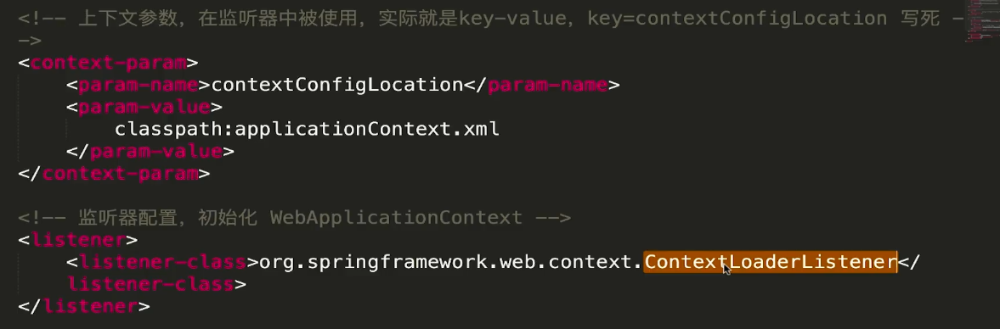
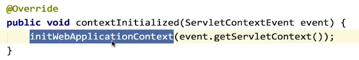
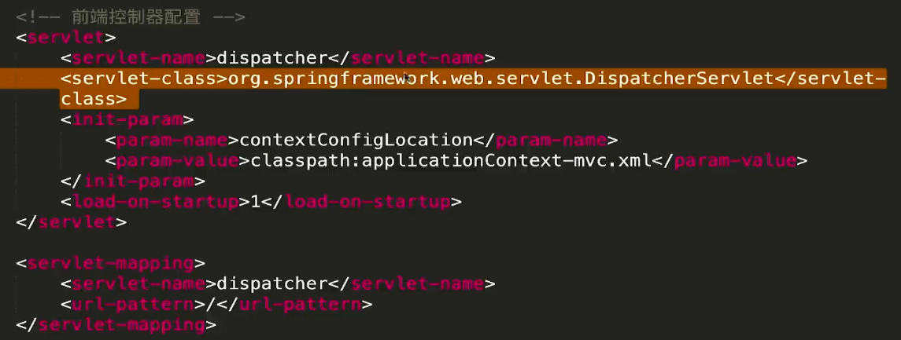
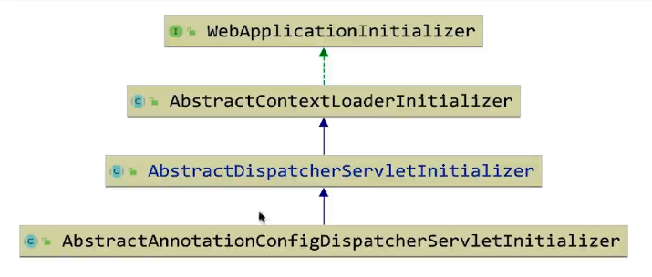

本章节解析Spring最后一个大成员，SpringMVC，也是非常重要的一员

## XML配置实现MVC

因为目前大多是注解开发，使用xml配置方式的人或公司越来越少，所以我们的重点放在注解实现，对于xml配置方式的实现，简单介绍一下。



在配置mvc时，都会在web.xml中配置上下文参数已经初始化监听器

对于初始化监听器，在Servlet初始化时，会监听调用初始化方法



这时就会读取contextConfigLocation配置，对Web容器进行初始化创建



对于前端控制器，也会配置一个配置文件，里面存放controller类以及请求路径的映射，在web容器初始化时，就会加载到web容器中，当用户请求进来，就会被前端控制器拦截，根据请求路径的映射，请求不同controller


## 注解方式实现MVC

对于Spring来说，我们不能直接使用纯注解方式实现MVC，就像SpringBoot一样，我们需要添加一些@Configuration标识的配置类，这样在Web容器加载时，才会根据我们的配置，像xml一样实现MVC。

### 注解方式初始化入口

首先我们全局搜索ServlettContainer，会发现一个SpringServletContainerInitializer类

```java
// 类似@Autowired，用来加载此类
@HandlesTypes(WebApplicationInitializer.class)
public class SpringServletContainerInitializer implements ServletContainerInitializer {

    @Override
    public void onStartup(@Nullable Set<Class<?>> webAppInitializerClasses, ServletContext servletContext)
        throws ServletException {

        // 主要看这里，Web容器初始化的地方，会循环调用所有初始化器
        // 初始化器就是一开始的注解加载进来的
        for (WebApplicationInitializer initializer : initializers) {
            initializer.onStartup(servletContext);
        }
    }

}
```

这里会发现加载了初始化器，我们向下查看


会发现有三个实现类，其中DispatcherServlet应该就是我们要找的，进入查看

```java
public abstract class AbstractDispatcherServletInitializer extends AbstractContextLoaderInitializer {

    /**
    * The default servlet name. Can be customized by overriding {@link #getServletName}.
    */
    public static final String DEFAULT_SERVLET_NAME = "dispatcher";


    @Override
    public void onStartup(ServletContext servletContext) throws ServletException {
        super.onStartup(servletContext);
        // 注册前端控制器
        registerDispatcherServlet(servletContext);
    }

    protected void registerDispatcherServlet(ServletContext servletContext) {
        String servletName = getServletName();
        Assert.hasLength(servletName, "getServletName() must not return null or empty");
		// 创建web ioc容器，模板方法，由子类实现
        WebApplicationContext servletAppContext = createServletApplicationContext();
        Assert.notNull(servletAppContext, "createServletApplicationContext() must not return null");
		// 创建DispatcherServlet，模板方法，由子类实现
        FrameworkServlet dispatcherServlet = createDispatcherServlet(servletAppContext);
        Assert.notNull(dispatcherServlet, "createDispatcherServlet(WebApplicationContext) must not return null");
        dispatcherServlet.setContextInitializers(getServletApplicationContextInitializers());

        ServletRegistration.Dynamic registration = servletContext.addServlet(servletName, dispatcherServlet);
        if (registration == null) {
            throw new IllegalStateException("Failed to register servlet with name '" + servletName + "'. " +
                                            "Check if there is another servlet registered under the same name.");
        }

        registration.setLoadOnStartup(1);
        // 映射路径，这里getServletMappings方法是个模板方法，由子类实现
        registration.addMapping(getServletMappings());
        registration.setAsyncSupported(isAsyncSupported());

        // 创建拦截请求编码，也是模板方法
        Filter[] filters = getServletFilters();
        if (!ObjectUtils.isEmpty(filters)) {
            for (Filter filter : filters) {
                registerServletFilter(servletContext, filter);
            }
        }

        customizeRegistration(registration);
    }
}
```

这里我们发现了四个重要的模板方法，往下看看还有没有更深层的子类实现

```java
public abstract class AbstractAnnotationConfigDispatcherServletInitializer
      extends AbstractDispatcherServletInitializer {

   @Override
   @Nullable
   protected WebApplicationContext createRootApplicationContext() {
      Class<?>[] configClasses = getRootConfigClasses();
      if (!ObjectUtils.isEmpty(configClasses)) {
         AnnotationConfigWebApplicationContext context = new AnnotationConfigWebApplicationContext();
         context.register(configClasses);
         return context;
      }
      else {
         return null;
      }
   }

   @Override
   protected WebApplicationContext createServletApplicationContext() {
      AnnotationConfigWebApplicationContext context = new AnnotationConfigWebApplicationContext();
      Class<?>[] configClasses = getServletConfigClasses();
      if (!ObjectUtils.isEmpty(configClasses)) {
         context.register(configClasses);
      }
      return context;
   }

   // 模板方法，配置RootConfig的Bean，Root存放Service，dao层的对象
   @Nullable
   protected abstract Class<?>[] getRootConfigClasses();

   // 模板方法，由子类实现，配置Servlet的ConfigBean为哪些，servlet存放model，controller对象
   @Nullable
   protected abstract Class<?>[] getServletConfigClasses();

}
```

这样，我们就找到了MVC的初始化时的四个关键类



并且具有四个模板方法，用来代替xml的配置方式，接下来我们简单实现一下注解使用mvc

### 注解方式进行配置

注解使用mvc，想要配置，就需要继承最下层的initializer类，来实现四个模板方法

首先我们要创建RootConfig和MvcConfig，一个用来配置和视图无关的对象，比如Service，一个用来配置和Mvc有关的对象

```java
@Configuration
@ComponentScan("com.enbuys.spring.demo.service")
public class RootConfig {
}

@Configuration
@ComponentScan("com.enbuys.spring.demo.controller")
@EnableWebMvc
public class MvcConfig {

    public InternalResourceViewResolver viewResolver(){
        InternalResourceViewResolver viewResolver = new InternalResourceViewResolver();
        viewResolver.setPrefix("/WEB-INF/jsp/");
        viewResolver.setSuffix(".jsp");
        return viewResolver;
    }
}
```

然后我们配置MVC的初始化配置

```java
public class StartWebApplication extends AbstractAnnotationConfigDispatcherServletInitializer {
    // 配置SpringContext
    @Override
    protected Class<?>[] getRootConfigClasses() {
        return new Class[]{RootConfig.class};
    }

    // 配置前端控制器
    @Override
    protected Class<?>[] getServletConfigClasses() {
        return new Class[]{MvcConfig.class};
    }

    // 配置映射
    @Override
    protected String[] getServletMappings() {
        return new String[]{"/"};
    }

    // 配置编码
    @Override
    protected Filter[] getServletFilters() {
        return super.getServletFilters();
    }
}
```