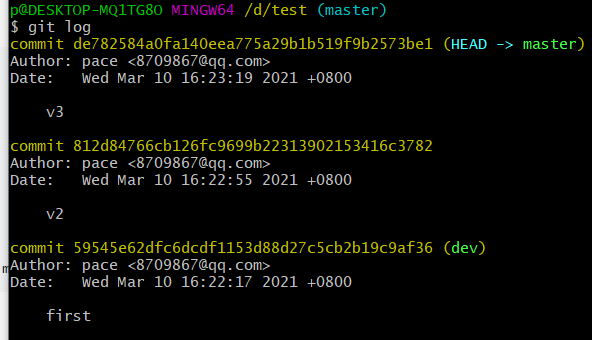
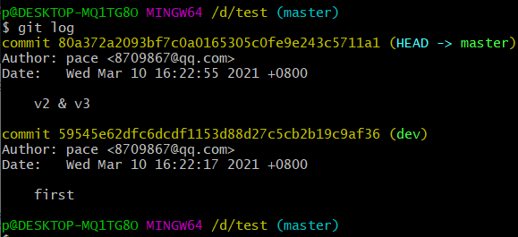
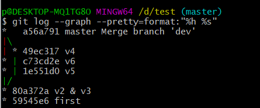
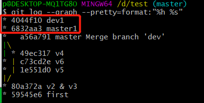
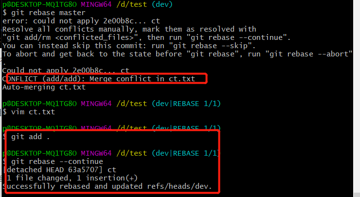
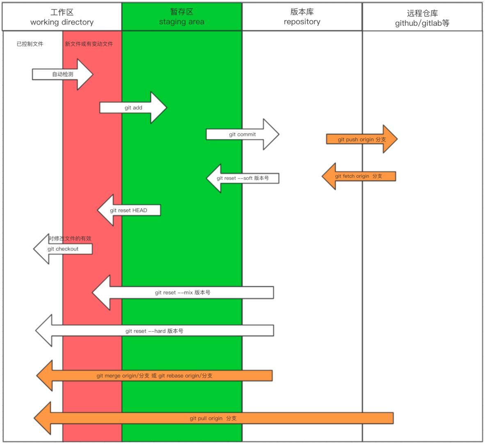

## 基本操作

工作区 -》 暂存区 -》 版本库 - 》远程仓库

​	git add		git commit	git push

```
1.工作区已修改文件回退 红色-》白色
git checkout -- a.txt  #回退某个文件
git checkout -- . 	#全部回退

2.暂存区回退工作区 绿色-》红色
git reset HEAD a.txt
git reset HEAD .

3.版本库回退暂存区 消失-》绿色
git reset --soft 版本号

4.版本库回退工作区 消失-》红色
get reset --mix 版本号

5.版本库整个回退 消失-》白色
git reset --hard 版本号

版本号查看：
git log
git log --graph 	可以通过流程图查看
git log --graph --pretty=format:"%h %s"
回退的版本恢复：git reflog
```


## 分支相关

```
1.创建分支
git branch dev
2.查看分支
git branch
3.切换分支
git checkout dev

4.合并分支，master合并dev
	4.1.首先需要切回master分支
	git checkout master
	4.2.然后合并dev分支
	git merge dev (冲突需要修复)
```


## 远程仓库相关

```
git remote add origin 地址
git push -u origin 分支

git clone 地址
git checkout 分支
git merge master

git add commit push

git pull origin 分支 = git fetch + git merge （会有冲突需要解决）
```


## rebase变基

变基有三个应用场景，主要目的是让版本工作流更加清晰明了

### 一、合并commit记录



这里我们有三个记录，其中v2，v3是一个大版本的两个小的提交记录，我们想把v2和v3合并成一个大版本，就可以使用rebase

```
git rebase -i HEAD~2 从头合并2个版本
git rebase -i id  从id到最新的版本号合并
```

然后需要将下面版本的pick改为s，表示向上面版本合并



合并完成后，v2v3变成了一条记录

### 二、合并分支记录

如下图，在正常分支开发中，dev分支和master的工作流是有分叉的，如果不想要分叉，变成下面那种一条主线的应该怎么做呢？就要使用到rebase


这里我们模拟

```
创建dev分支，并merge主分支，然后提交
回到主分支后，提交两个版本，merge dev分支
```

然后我们查看日志



这就是merge会导致分支日志分叉，那么我们想简化分支，在合并分支的时候把分叉带回到主链路应该怎么做呢？

```
0.dev分支创建一个测试版本，主分支创建一个测试版本
1.切回需要合并的分支
git checkout dev
2.变基主分支
git rebase master
3.切回主分支
git checkout master
4.合并dev分支
git merge dev
```



这样dev分支提交记录就合并到一条线上了，没有像下面一样分叉

### 三、远程仓库拉取代码

在拉取代码时经常使用`git pull`，但是这个相当于`fetch+merge`，`merge`就肯定有分叉，那么怎么让他不分叉呢？

就是把`pull`改成`fetch+rebase`

小Tips：

>当fetch出现冲突时，可以去修改冲突的文件，然后add到暂存区，然后git rebase --continues即可
>
>

## 生命周期

