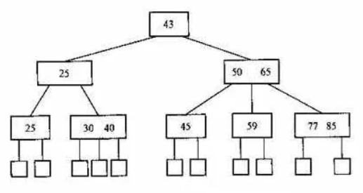
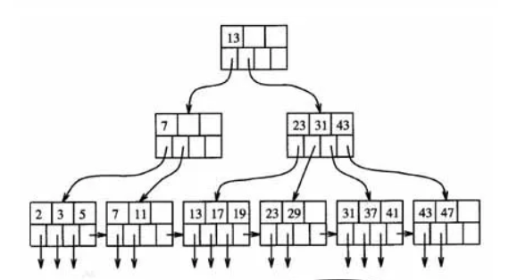

这里我们思考两个问题：为什么索引数据结构使用B+Tree？InnoDB与MyISAM都是B+Tree索引，他们有没有区别？

## 一、为什么索引数据结构使用B+Tree

在研究B+Tree之前我们先思考，使用链表，数组做索引的数据结构如何？

### 1.1 使用链表，数组做索引

我们知道链表的时间复杂度为O(n)，如果使用链表做索引，比如有10000个数据，排序后需要查询的再第5000个，便需要遍历5000次才能找到这个数据，效率太低。

使用数组+二分查找的话，虽然效率变高，复杂度为O(logN)，但是增删改的速度太慢，仍需多次遍历才可以。

上面说的**效率**是一方面，还有一方面是存储方式，我们知道，数据库存的东西都很大索引也非常大，如果使用这些做数据结构话，是**无法一次性加载到内存中**的。

### 1.2 使用平衡二叉树做索引

我们再次思考，如果使用AVL树呢？复杂度为O(logN)，相比普通二叉树会由于内部排列退化成链表，似乎AVL树是个不错的选择。但也不好，为什么？

（1）**当数据量大的时候，树的高度会比较高，数据量大的时候，查询会比较慢**；

（2）**每个节点只存储一个记录，可能导致一次查询有很多次磁盘IO**；

### 1.3 B-Tree更适合做索引

特点是：

(1)不再是二叉搜索，而是m叉搜索；

(2)叶子节点，非叶子节点，都存储数据；

(3)中序遍历，可以获得所有节点；

B树是一种多路存储树，它将节点大小设置为磁盘页的大小，充分利用了**磁盘预读**的功能。每次读取磁盘页时就会读取一整个节点。也正因每个节点存储着非常多个关键字，**树的深度就会非常的小**。进而要执行的磁盘读取操作次数就会非常少，更多的是在内存中对读取进来的数据进行查找。

B树的查询，主要发生在内存中，而平衡二叉树的查询，则是发生在磁盘读取中。因此，虽然B树查询查询的次数不比平衡二叉树的次数少，但是相比起磁盘IO速度，内存中比较的耗时就可以忽略不计了。因此，B树更适合作为索引。

### 1.4 B+Tree比B树更优的索引

B+树是B树的一个变种，在B树的基础上**添加了指针链表**，它的**数据都在叶子节点上**。

为什么说B+树更适合作为索引呢？因为select不一定只有一条，如果是多条select查询，B树需要做局部的中序遍历，而B+树的数据全在叶子节点，不需要跨层，同时是链表性质只需要头尾节点便可获取到数据。

比如我们需要找7~19的数据，如上图，使用B树需要多次中序遍历才可以全部查出来。而使用B+树，因为链表连接的性质，在叶子节点就可以获取了。效率大大提升。

### 1.5 Hash索引与B+树优劣势

Hash索引与B+树索引在不同场景有不同的优势。

如果只需要选一个数据，Hash会更快，因为其O(1)性质。但是数据库中经常会选择多条，这时候由于B+树索引有序，并且又有链表相连，它的查询效率比hash就快很多了。

而且索引一般在磁盘上，无法一次性加载到内存中，所以使用B+树分批**加载内存**，且**树的高度低**，可以大大提高查找效率。

并且，**InnoDB不支持Hash索引**

## 二、InnoDB与MyISAM的B+Tree索引区别

### 2.1 MyISAM索引

MyISAM存储引擎的**索引与行记录是分开存储的**，称作非聚集索引。

其主键索引与普通索引没有本质差异：

- 有连续聚集的区域**单独存储行记录**
- 主键索引的叶子节点，存储主键，与**对应行记录的指针**
- 普通索引的叶子结点，存储索引列，与**对应行记录的指针**

*画外音：MyISAM的表可以没有主键。*

当需要查询数据时，先查询索引，找到B+树的叶子节点，再通过指针定位到数据行记录。

由图可知，此表具有id与name的索引树，叶子指向表中行记录的地址指针。

### 2.2 InnoDB索引

InnoDB的**主键索引与行记录数据是存储在一起的**，也叫做聚集索引。

- 没有单独区域存储行记录
- 主键索引的叶子节点，**存储主键，与对应行记录（而不是指针）**

聚集索引只有一个并且必须有，当InnoDB引擎建表时如果没有特定指定主键，会自动选择一个主键。InnoDB有多个普通索引与一个聚集索引。

对于InnoDB表，这里的启示是：

（1）**不建议使用较长的列做主键**，例如char(64)，因为所有的普通索引都会存储主键，会导致普通索引过于庞大；

（2）建议使用趋势递增的key做主键，由于数据行与索引一体，这样不至于插入记录时，有大量索引分裂，行记录移动；

上图可以看出，叶子节点直接存储了主键与行数据。

### 2.3 总结

MyISAM和InnoDB都使用B+树来实现索引：

- MyISAM的索引与数据**分开存储**
- MyISAM的**索引叶子存储指针**，主键索引与普通索引无太大区别
- InnoDB的**聚集索引和数据行统一存储**
- InnoDB的**聚集索引存储数据行本身，普通索引存储主键**
- InnoDB**一定有且只有一个聚集索引**
- InnoDB建议使用趋势递增整数作为主键，而**不宜使用较长的列作为主键**

