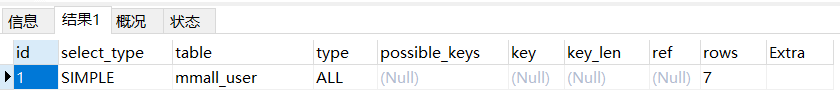
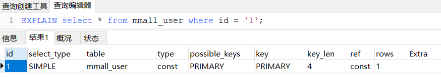
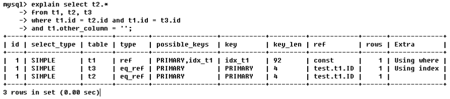

## 一、什么是Explain

Explain是mysql中的一个关键字，加在查询的前面可以**模拟优化器执行查询语句**，从而了解到MySQL是如何执行这个sql语句的。用来分析你的查询语句或者表结构瓶颈。

## 二、Explain的作用

- 表的读取顺序
- 数据读取操作的操作类型
- 哪些索引可以使用
- 哪些索引被实际使用
- 表之间的引用
- 每张表有多少行被优化查询

## 三、Explain的使用

`EXPLAIN select * from mmall_user;`通过这条查询语句，可以获得如下结果：

下面来介绍一下各字段的含义

### 3.1 id字段

> id字段表示查询的序列号，由数字组成，**用来表示select查询中的顺序。**

该顺序：

- **id值越大，优先级越高**
- **相同id情况下，由上到下优先级递减**

### 3.2 select_type字段

> 查询的类型，**用于区别普通查询，子查询，联合查询等复杂查询**。

- SIMPLE：普通查询
- PRIMARY：查询中包含任何复杂的子部分，最外层查询被标记为PRIMARY
- DERIVED：from列表中进行的子查询会被标记为DERIVED，MYSQL会递归执行这些子查询，并放入**临时表**
- SUBQUERY：在SELECT或WHERE中包含的子查询

等等，具体看思维导图

### 3.3 table字段

> 被查询的哪张表

### 3.4 type字段

> 显示的是访问类型，**为较为重要的指标**，查看索引使用情况。

由好到差：**system>const>eq_ref>ref>range>index>ALL**

- system：表只有一行记录，const的特例，一般不会出现
- const：通过索引一次就找到了，类似`where id = 1`
- eq_ref：唯一索引扫描，对于每个索引表中只有一条记录与之匹配，`select * from t1,t2 where t1.id = t2.id`，这里t2的type就是eq_ref
- ref：非唯一索引扫描，会匹配某个单独值的所有行，此类型通常出现在多表的 join 查询, 针对于非唯一或非主键索引, 或者是使用了最左前缀规则索引的查询。
- **range**：通过给定范围扫描，where中出现了between、<、>、in等
- **index**：只遍历索引树，而不是遍历整表，速度比ALL快**（all和index都是读全表，但是index从索引读取，all从硬盘读取）**
- **ALL**：遍历全表查询

### 3.5 possible_keys字段

> 指有可能会用到的索引，null，一个或多个。**被列出的索引不一定会用到**。

### 3.6 key字段

> 实际被用到的索引，如果没有就为NULL。

有可能会出现possible_keys中为NULL，而key字段却出现了索引的情况。比如使用了覆盖索引（所查询的列整合与多列索引匹配）

### 3.7 key_len字段

> 表示索引使用的字节数，具有特定的计算公式根据字段类型进行计算，可以通过该列查询使用的索引长度

### 3.8 ref字段

> 显示索引的哪一列被使用了，如果可能的话，是一个常数。哪些列或常量被用于查找索引列上的值

### 3.9 rows字段

> 这一列显示了**估计**要找到所需的行而要读取的行数，这个值是个估计值，原则上值越小越好。

### 3.10 Extra字段

> 包含不适合在其他列中显示但**十分重要的额外信息**

常见的取值如下：

- **Using index**：使用覆盖索引，表示查询索引就可查到所需数据，不用扫描表数据文件，往往说明性能不错。
- Using Where：在存储引擎检索行后再进行过滤，使用了where从句来限制哪些行将与下一张表匹配或者是返回给用户。
- Using temporary：在查询结果排序时会使用一个临时表，一般出现于排序、分组和多表 join 的情况，查询效率不高，建议优化。
- using join buffer：使用了连接缓存
- **Using filesort**：对结果使用一个外部索引排序，而不是按索引次序从表里读取行，一般有出现该值，都建议优化去掉，因为这样的查询 CPU 资源消耗大。例如下图：

第一次查询，没有按索引顺序col2-col3，而是直接跳过col2根据col3排序，这样mysql内部就认为索引排序不好，所以自动再次外部排序，浪费大量资源。

第二次查询，按照索引顺序，就没有再次排序。

