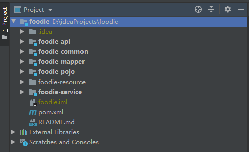

# 单体项目实现

在开发一个电商项目时，谁也不是一蹴而就的，淘宝也是从单体慢慢演变成现在的千亿万亿架构。

所以，我们通过单体到微服务容器化，一步步演进，学习，增强自身。

## 单体项目结构

> foodie-resource是存放一些配置文件的比如数据库sql脚本等，不需要关注

刚开始，我们会使用maven+springboot+通用Mybatis实现一个单体项目

如图，项目结构是经典的分层结构，外层一个整体root模块，内部包含多个子模块，通过Maven install将其打包在一起。

