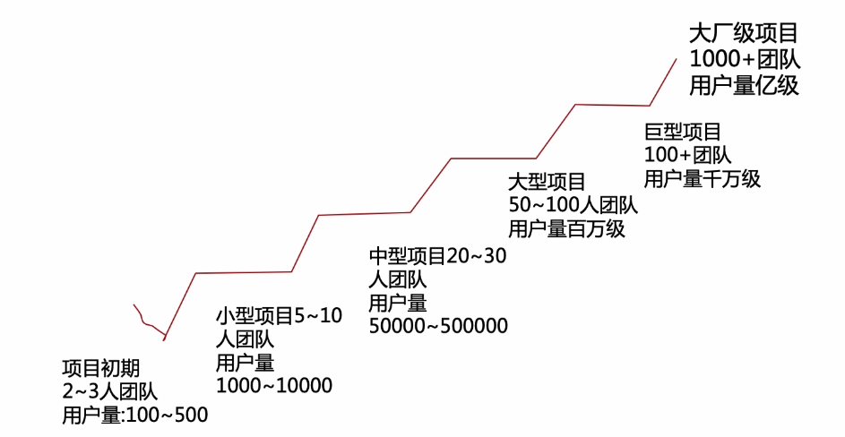
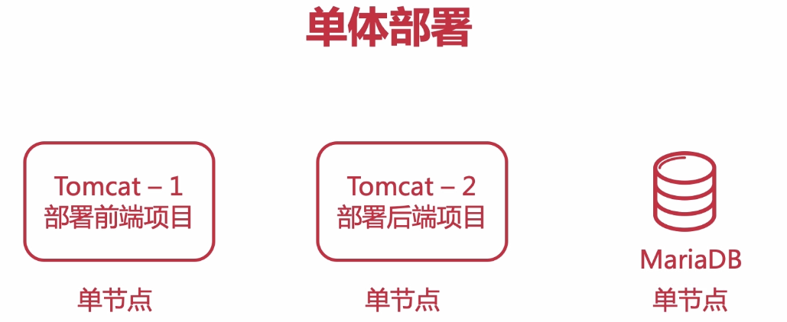

## 项目衍变之路

在之前，我们实现了天天吃货单体架构版本，使用简单的SpringBoot配合Mybatis实现，可谓是单体中的单体，因为连redis这种常见的缓存都没有使用

项目地址：<https://github.com/PAcee1/foodie/tree/v1.0>

接下来我们看一张图

我们目前就处于项目初期，实现了简单的单体架构，而对于系统发展，我们的天天吃货越来越受到关注，当用户量增加时，单体架构有些支撑不住了，这时我们就需要将我们的单体架构往集群发展，

再往后，又具有分布式，微服务。

所以我们的目的，就是一步步衍变我们这个天天吃货项目，使其从一个无人问津的单体架构，转变成承载上千万用户的微服务架构。

当然更多的是架构上的学习。

## 单体向集群衍变

### 单体

目前阶段，我们的天天吃货部署在阿里云上，使用的简单的单体部署方式，如下图

单体架构的优点：

- 项目小，运维部署简单方便
- 迭代周期短
- 2-3个人即可实现开发测试上线

单体架构的缺点：

- 单节点宕机会造成所有服务不可用
- 耦合度高
- 性能差，并发能力有限

### 集群

集群是什么意思这里就不赘述了，这里简单说下集群和分布式的区别，集群是所有节点功能相同，每个都可以独立运行，分布式是各个节点干不同的事，如下图：

订单集群内有4个节点，商品集群内部有2个节点，而对于订单，商品，其他这样的业务拆分，是分布式，所以加起来就是分布式集群

集群优点：

- 可用性
- 可扩展性
- 提高性能

使用集群时需要注意的点：

- 用户会话：使用Redis解决
- 定时任务：所有节点都会重复执行一次，使用MQ解决或单独创建一个定时任务节点
- 内网互通