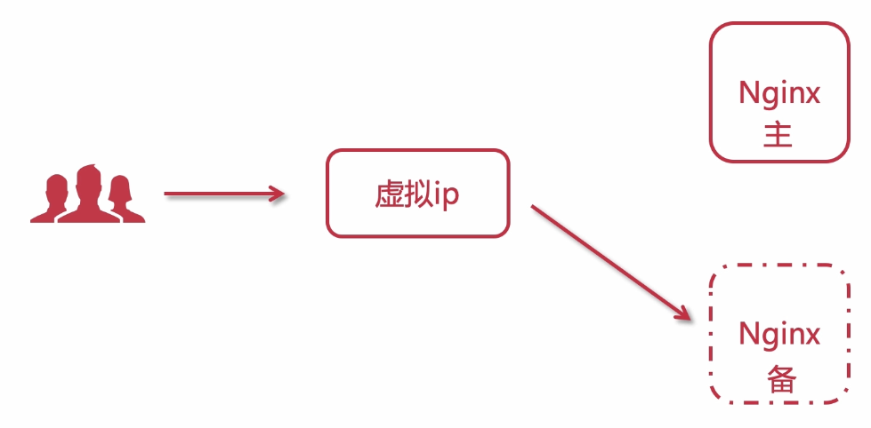
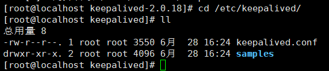
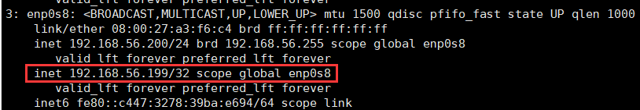
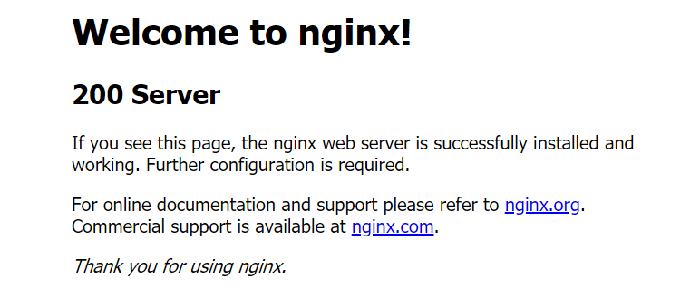
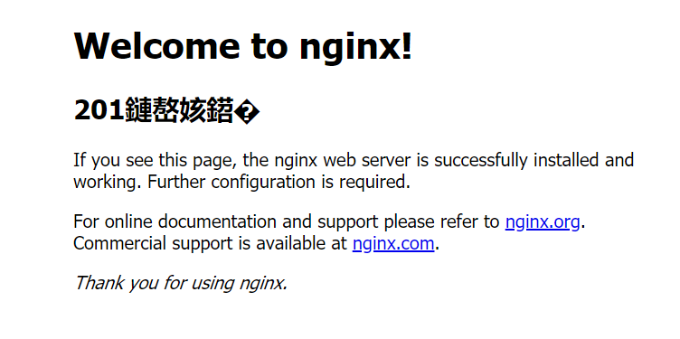
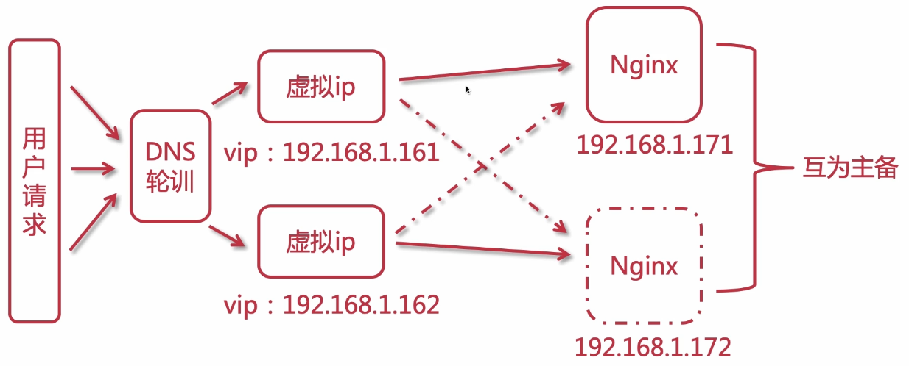

## Nginx HA

之前我们学习了Nginx基础知识以及高级特性，但是我们会发现一个问题，Nginx是单节点的，那么会不会出现Nginx挂掉导致我们的服务访问不了呢？

答案是一定的，所以我们这节主要就是来看如何让Nginx实现高可用（High Availabled）

Nginx实现高可用，有一个非常好用的中间件，Keepalived

### Keepalived

- 解决单点故障
- 组件免费
- 实现HA高可用
- 基于VRRP，虚拟路由冗余协议

它的主要使用原理就是VRRP，简单来说，就是有一个虚拟IP（VIP）来管理各个节点，VIP绑定到主节点真实IP上，当用户访问时，访问VIP来达到访问Nginx的效果，但是当主节点挂掉，VIP会自动检测（心跳机制），并使用选举机制选择一个合适的从节点上升为主节点，VIP与其绑定，达到高可用目的。



注意：主从节点的版本等软硬件配置应相同

### Keepalived安装

首先我们需要准备两个Nginx服务器，做主备

准备好后，需要在两个Nginx上都按照Keepalived中间件，这里我使用版本是2.0.18

1.将Keepalived下载后放到虚拟机中

2.解压Keepalived

```
tar -zxvf keepalived-2.0.18.tar.gz
```

3.配置Keepalived

```
cd keepalived-2.0.18
./configure --prefix=/usr/local/keepalived --sysconf=/etc
# prefix安装位置，sysconf核心配置文件存放位置，必须固定etc
```

4.如果出现警告

`WARNING - this build will not support IPVS with IPv6. Please install libnl/libnl-3 dev libraries to support IPv6 with IPVS.`

安装依赖

```
yum install libnl libnl-devel -y
```

5.重新执行configure

6.安装

```
make
make install
```

7.查看核心配置文件，检查是否正确安装



> 在两个虚拟机都安装Keepalived

### Keepalived配置

```
cd /etc/keepalived
vi keepalived.conf
```

#### 主节点配置

```
! Configuration File for keepalived
# 全局配置
global_defs {
   #可以配置邮箱，当节点出问题时，会自动发送邮件

   # 唯一路由ID，当前Keepalived安装节点的唯一标识ID
   router_id keep_200
}

# 当前Server节点
vrrp_instance VI_1 {
    # 标志此节点为主节点
    state MASTER
    # 网卡绑定，使用ip addr查看
    interface enp0s8
    # 保证主备节点id一直即可
    virtual_router_id 51
    # 权重，主节点大于备用节点，如果有多个备用节点，谁高谁当选主节点
    priority 100
    # 主备同步检查时间间隔，单位秒
    advert_int 1
    # 认证权限密码，防止非法节点
    authentication {
        auth_type PASS
        auth_pass 1111
    }
    # vip
    virtual_ipaddress {
        192.168.56.199
    }   
} 
```

主要使用到的配置就是这些，全局配置和节点配置

配置完毕后可以启动Keepalived查看

```
cd /usr/local/keepalived/sbin
./keepalived
```

然后输入`ip addr`查看vip是否成功配置



会发现vip成功配置，说明启动成功

#### 备用节点配置

```
# 全局配置
global_defs {
   #可以配置邮箱，当节点出问题时，会自动发送邮件

   # 唯一路由ID，当前Keepalived安装节点的唯一标识ID
   router_id keep_201
}

# 当前Server节点
vrrp_instance VI_1 {
    # 标志此节点为备用节点
    state BACKUP
    # 网卡绑定，使用ip addr查看
    interface enp0s8
    # 保证主备节点id一直即可
    virtual_router_id 51
    # 权重，主节点大于备用节点，如果有多个备用节点，谁高谁当选主节点
    priority 50
    # 主备同步检查时间间隔，单位秒
    advert_int 1
    # 认证权限密码，防止非法节点
    authentication {
        auth_type PASS
        auth_pass 1111
    }
    # vip，要和主节点相同
    virtual_ipaddress {
        192.168.56.199
    }
}
```

#### 测试

配置完成后，启动两个Keepalived进行测试

首先访问<http://192.168.56.199/>



发现显示的是200虚拟机上的Nginx，说明访问主节点成功

这时我们把主节点上的Keepalived关闭，再次访问测试



会发现这时会去访问201备用节点了，说明备用节点当前因为主节点宕机上升为主节点。符合预期

### Keepalived配置Nginx自动重启

当Nginx挂掉时，Keepalived不会自动切换到备用节点，只有Keepalived挂掉才会自动替换。

那么我们应该就有两种方法来解决这种问题：1.重启Nginx，2.主动切换Keepalived（关闭主节点Keepalived）

所以我们实现方式就是需要写一个shell脚本，并配置到Keepalived配置文件中

1.添加Nginx重启检测脚本

```
vim /etc/keepalived/check_nginx.sh
```

编写脚本

```shell
#!/bin/bash

A=`ps -C nginx --no-header |wc -l`
# 判断Nginx是否宕机
if [ $A -eq 0 ];then
    /usr/local/nginx/sbin/nginx
    # 启动后等待3秒再次检查Nginx，如果未成功启动，停止Keepalived使用备用节点
    sleep 3
    if [ `ps -C nginx --no-header |wc -l` -eq 0 ];then
    	killall keepalived
    fi
fi
```

添加权限

```
chmod +x /etc/keepalived/check_nginx.sh
```

2.配置Keepalived监听Nginx检测脚本

```
vi /etc/keepalived/keepalived.conf
```

```
# 脚本
vrrp_script check_nginx{
    script "/etc/keepalived/check_nginx.sh"
    interval 4 # 每搁4秒运行一次
    weight 10 # 脚本运行成功后，权重增加10
}

# 当前Server节点
vrrp_instance VI_1 {
	···
	# 添加脚本
	track_script{
        check_nginx # 追踪上面配置的脚本
	}
	···
}
```

3.重启Keepalived生效

### Keepalived双主热备

之前我们双机主备架构，可以完美的提供7X24小时不停机服务，但是还是有一些问题，因为是双机主备，所以主节点备节点配置相同，但是如果主节点一直使用没问题，备用节点需要一直续租，在花费大量金钱的同时还没有作用，造成性能浪费。

双主热备就是配置两个主节点，即两个Keepalived，并互为备用节点，这样当用户请求域名时，使用DNS轮询到两个虚拟IP，就会把流量分给两个服务器，这样就不会造成资源浪费。



#### Keepalived配置

一台服务器配置：

```
# 全局配置
global_defs {
   router_id keep_201
}

# 当前主节点
vrrp_instance VI_1 {
    state MASTER
    interface enp0s8
    # 保证主备节点id一直即可
    virtual_router_id 51
    priority 50
    advert_int 1
    authentication {
        auth_type PASS
        auth_pass 1111
    }
    virtual_ipaddress {
        192.168.56.198
    }
}

# 备用节点
vrrp_instance VI_1 {
    state BACKUP
    interface enp0s8
    # 保证主备节点id一直即可
    virtual_router_id 52
    priority 50
    advert_int 1
    authentication {
        auth_type PASS
        auth_pass 1111
    }
    virtual_ipaddress {
        192.168.56.199
    }
}
```

另一台配置

```
# 全局配置
global_defs {
   router_id keep_201
}

# 当前主节点
vrrp_instance VI_1 {
    state MASTER
    interface enp0s8
    # 保证主备节点id一直即可
    virtual_router_id 52
    priority 50
    advert_int 1
    authentication {
        auth_type PASS
        auth_pass 1111
    }
    virtual_ipaddress {
        192.168.56.199
    }
}

# 备用节点
vrrp_instance VI_1 {
    state BACKUP
    interface enp0s8
    # 保证主备节点id一直即可
    virtual_router_id 51
    priority 50
    advert_int 1
    authentication {
        auth_type PASS
        auth_pass 1111
    }
    virtual_ipaddress {
        192.168.56.198
    }
}
```

可以很轻松的就配置完成双主热备Keepalived

#### 云服务器DNS配置

以阿里云为例：

进入域名解析


这里设置两个相同的一级域名，并设置两个不同的记录值即IP

然后进入权重配置


开启并设置权重，即可完成DNS配置

这样，我们双主热备高可用Nginx+Keepalived就配置完成