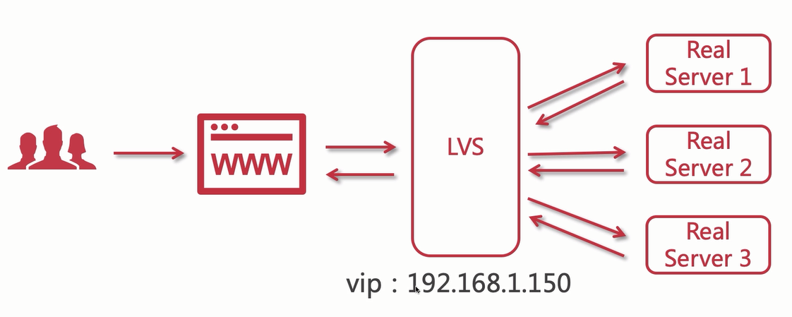
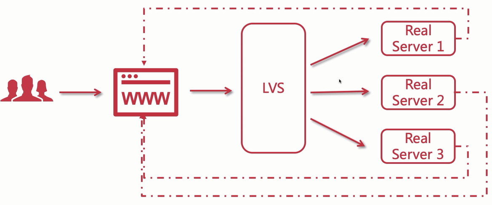
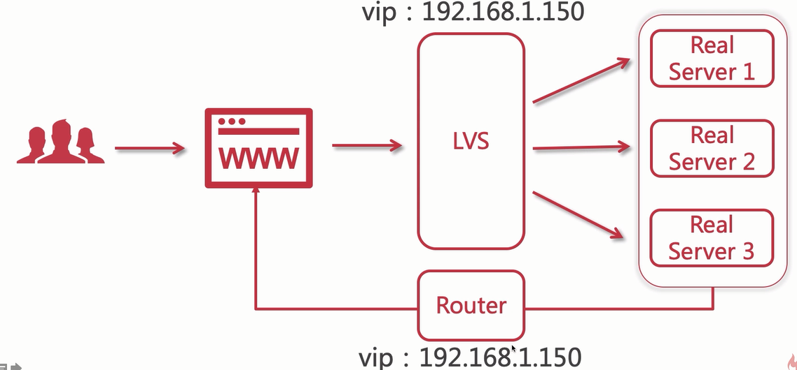

## LVS介绍

LVS是一个负载均衡器，是将多个真实的Linux服务器组成集群，对其进行负载均衡。他是运行在Linux操作系统上的。有点类似Nginx，但他是四层协议，更加快速。

## LVS与Nginx

那么LVS和Nginx有什么区别呢？我们为什么需要一起使用？

- LVS基于四层网络协议，效率更高
- Nginx之前都是单节点，承受压力有限，组成集群可以支撑更高并发
- LVS就是用来充当Nginx集群的调度者

为什么使用LVS充当Nginx集群调度者呢？

因为Nginx接受请求时，必须控制其请求响应，但是LVS可以不进行响应，只接收请求，这样效率更高。

就好比有一扇大门Nginx，客人可以进可以出，如果他最多承受100人，那么有50人要出的时候 他最多可以接收50个客人进来。但是LVS只许进不许出，所以他最大承受100人进入，效率，并发量都大大提高。

## LVS三种模式

LVS有三种工作模式可以选择

### NAT模式

NAT模式就和Nginx一样，请求响应都是由LVS进行的，LVS所在服务器绑定一个vip，来进行请求接收响应。

注意：

- LVS处在外网，用户可以请求，获取响应
- 3个真实服务器，处在内网，用户无法直接响应
- 此模式类似Nginx，不适用与超大型并发请求

### TUN模式

TUN模式，每个服务器都有自己的网卡，请求需要响应时，会创建独立的隧道，进行通信响应，不会经过LVS。

大大提高并发吞吐量，但是有一个硬性要求，**每个节点必须配一个网卡**

### DR模式

DR模式，使用路由，所有真实服务器都在内网，他们统一包裹起来，当请求响应时，通过一个路由器，来进行响应，

LVS具有虚拟IP，路由也绑定一个虚拟IP，就可以实现对客户端的响应。

这种直接路由模式，既不需要每个服务器配置一个网卡，又可以实现高并发的承载，是非常好用的一种模式。

## TODO

这里我们简单介绍了一下LVS，以及为何现在主流集群负载均衡解决方案为LVS+Keepalived+Nginx。

对于如何配置LVS就偏向于Linux，运维方面，过于专业了。这里先暂停了解，后面有时间再进行学习。

对于云服务器来说，阿里云是不支持自己使用LVS的必须买他的负载均衡，腾讯云支持

