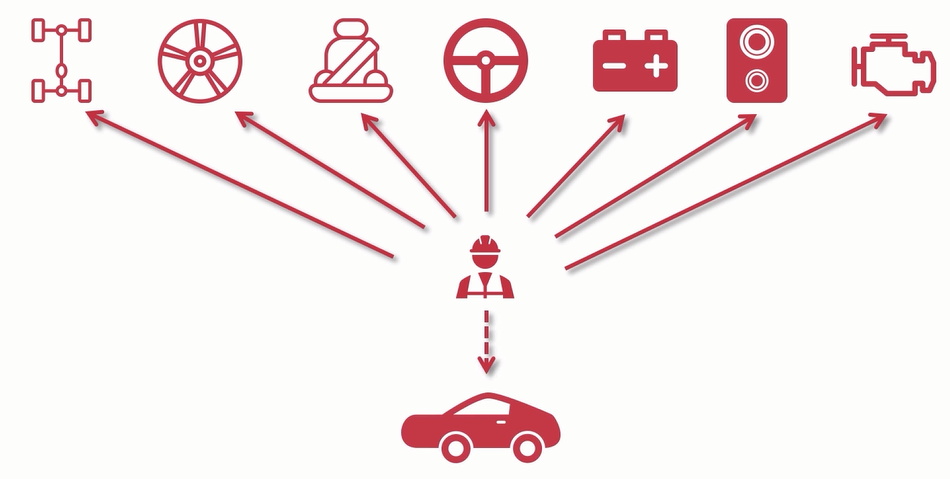
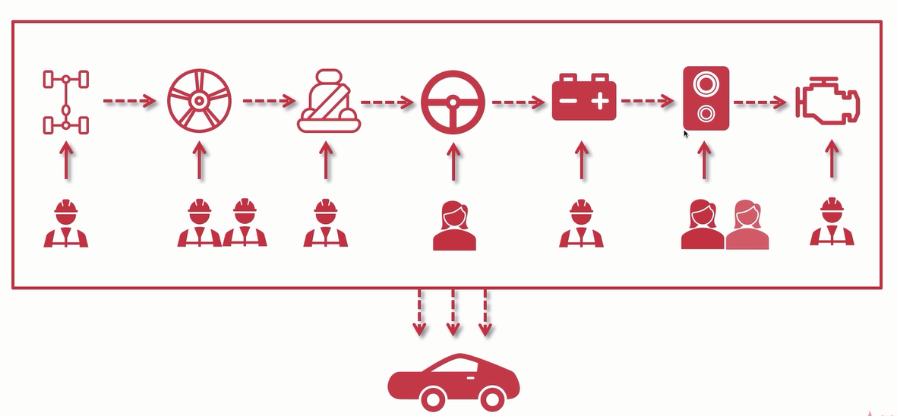

## 为什么要使用分布式架构

之前我们学习了如何将单体架构演变成集群架构，来接收更大的并发量。

但是我们会发现，出现服务器变成集群来提高并发后，其实它还是一个单体架构。

为什么这么说呢？

因为所有功能模块其实还是包含在一起的，举例来说，比如造车工厂就是我们这个项目工厂，现在我们如下图：

汽车的组装，全部都是由一个人或者说一个厂子来完成的。

这会出现什么问题呢？

- 这个厂子要会很多技能，包括厂子里的工人也要会很多技能
- 当有bug出现时，需要拆整个汽车，才能找到问题所在
- 一个人或者一个厂子的能力有限，如果这时来了100万台汽车订单，就算一个厂一天20辆，你加再多的集群（工厂）也很难满足这么大的订单

所以为了解决这种问题，慢慢衍生出了分布式架构

分布式架构，就算将各个功能模块进行拆分，拆分成独立的组件独立的项目功能，独立的部署，当互相需要调用时，使用http进行通信调用，如下图：

每个功能划分成一个厂，大大加快生产效率，即提高并发能力，当有某个厂开发效率慢时，可以单独引入集群，增加其效率即并发能力，更加灵活，承受并发量更大。

并且当某个环节出问题时，只需重新部署单个环节，而不用全盘拆分。

## 分布式架构优缺点

通过上面的介绍，不难看出分布式架构的优点：

- 业务解耦
- 提高并发能力
- 持续运维方便
- 模块化，重用性高

分布式架构虽好，但也是有缺点的

- 架构复杂
- 系统间通信耗时
- 第一次部署多个系统时复杂
- 学习成本高

## 分布式架构需要考虑的问题

将单体架构重构成分布式，不单单是业务拆分那么简单，还要考虑很多问题。

- 异步解耦
- 幂等性问题
- 分布式中间件的融合

这也是我们接下来需要学习的，我们会将单体集群架构慢慢衍变成分布式集群架构