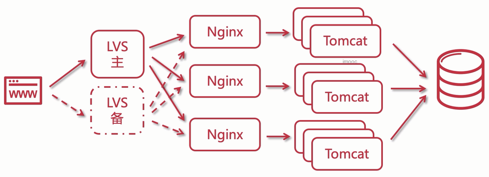
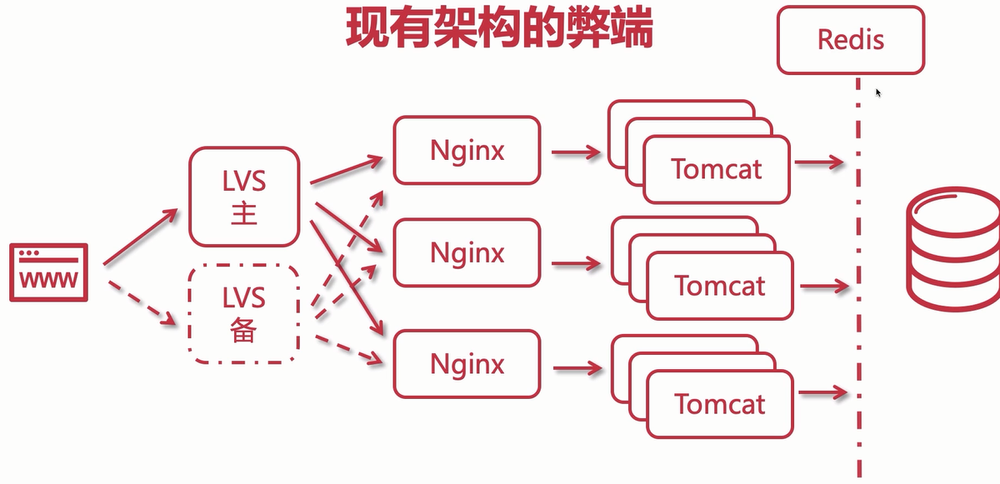

## 为什么要使用Redis

通过之前集群架构的升级，目前架构是这样

这样会发现一个问题，前面请求被分流，这样可以承载更高的并发请求，但是后面只有一个数据库，肯定会出现瓶颈，严重会导致数据库崩溃，运行所有sql都非常慢。

为了处理这个问题，我们必须引入缓存，如下图

当应用请求数据库之前，先查询缓存，如果缓存中有数据了，直接返回，不通过数据库，缓存最常用的就是Redis了，因为其nosql特性，导致性能很高，也是主流的缓存中间件。

## Redis简单介绍

Redis一般来说都比较熟悉了，这里再回顾一下