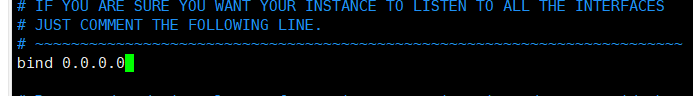
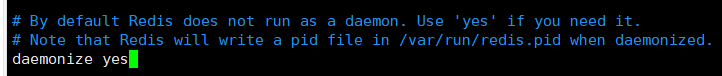
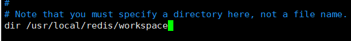
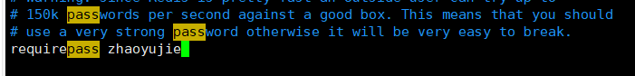
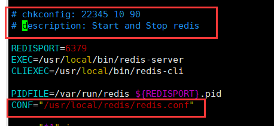
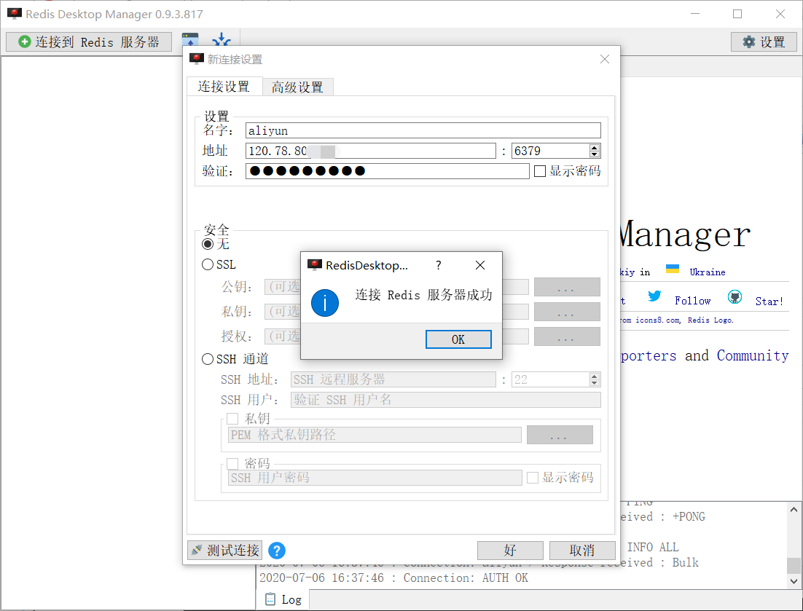
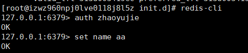
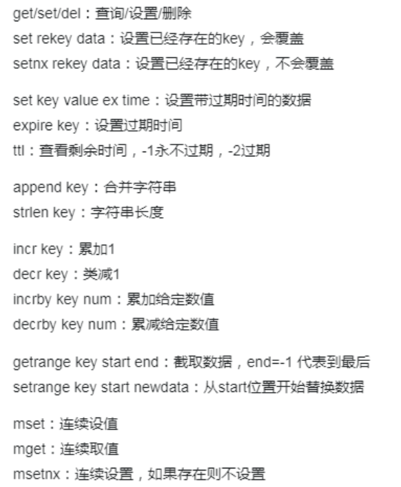
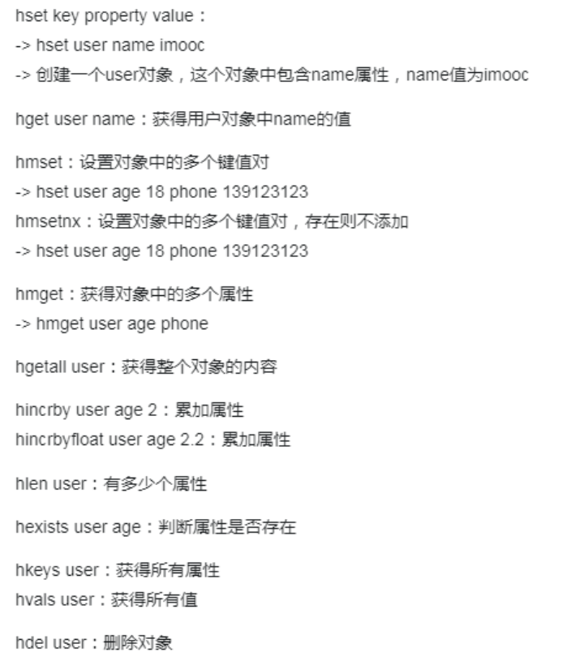
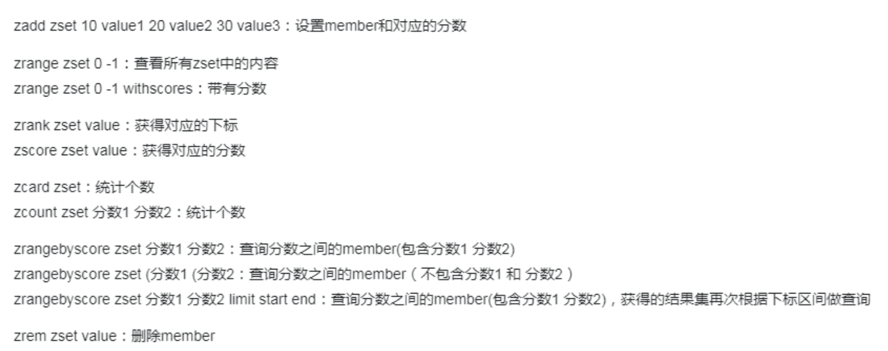

## 为什么要使用缓存


通过之前集群架构的升级，目前架构是这样

这样会发现一个问题，前面请求被分流，这样可以承载更高的并发请求，但是后面只有一个数据库，肯定会出现瓶颈，严重会导致数据库崩溃，运行所有sql都非常慢。

为了处理这个问题，我们必须引入缓存，如下图


当应用请求数据库之前，先查询缓存，如果缓存中有数据了，直接返回，不通过数据库，缓存最常用的就是Redis了，因为其nosql特性，导致性能很高，也是主流的缓存中间件。

## Redis简单介绍

Redis一般来说都比较熟悉了，这里再回顾一下

### 为什么选择Redis

常用的分布式缓存中间件有很多，为什么选择Redis呢？我们分别看看几种优缺点

Ehcache：

- 基于Java，再JVM使用速度很快，简单方便
- 不支持集群，不支持分布式

Memcache：和Redis一样式nosql，keyvalue存储

- 简单，内存使用率高，多核多线程
- 不支持持久化，无法容灾

Redis：功能强大

- 支持容灾持久化，主从同步集群，数据结构丰富，内存数据库
- 单线程处理

总结：大型项目使用Redis更好

### Redis安装配置使用

**Redis安装**

1.下载Redis安装包放到linux系统上

2.解压

```
tar -zxvf redis-5.0.5.tar.gz
```

3.安装gcc环境

```
yum install -y gcc-c++
```

4.进入目录安装

```
cd redis-5.0.5.tar.gz
make
make install
```

安装完成后开始配置Redis，一般情况下最简单的就是修改配置文件，然后使用redis-server启动

**但是我们这次配置成脚本启动，并实现开机自启动**

1.进入utils目录，将`redis_init_script`拷贝到`/etc/init.d`下

```
cp redis_init_script /etc/init.d/
```

2.配置redis配置文件，创建/usr/local/redis并存放配置文件

```
mkdir /usr/local/redis -p
cd /home/software/redis-5.0.5
cp redis.conf /usr/local/redis/
cd /usr/local/redis/
mkdir workspace # 用于保持redis工作目录
```

3.修改配置文件

```
vim redis.conf
```

绑定ip改为0.0.0.0，这样其他服务器才可以访问此服务器



daemonize改为yes，即后台启动



修改工作目录



设置redis密码



保存

4.修改redis_init_script



5.赋予文件权限

```
chmod 777 redis_init_script 
```

6.启动Redis

```
./redis_init_script start
chkconfig redis_init_script on
```

**使用Redis**

这里我使用客户端进行连接，redis-desktop-manager



当然也可以使用redis的命令行客户端

```
redis-cli
auth pwd #输入密码
set key value
get key
del key
```



### Redis多种数据类型

Redis有五大数据类型：String，zset，set，hash，list，这里我们简单介绍一下

#### String

String是最基本也是最常用的数据类型，由键值对组成

主要命令有：



#### hash

类似map，用来存储结构化数据，比如对象，但是不能嵌套



#### list

列表，比如：[1,2,a,b,c]


#### set

set也是列表，和list差不多，但是list可以保存重复数据，这个不可以，对于重复数据会自动去重

#### zset

排序的set，是有序的，可以去重可以排序，比如可以对用户积分排序



## 项目中改造整合Redis

### 首页优化

首页中的轮播图和分类都是不常变的，所以他们都可以添加到缓存中去。

这里我会设置默认失效时间为1天，即每天重新刷新数据，根据需要可以动态修改，比如开发后台管理系统，当修改首页轮播图时，重置缓存；或者在轮播图中添加超时字段，每个轮播图循环添加到缓存并设置超时时间。

代码：

```java
// 引入Redis，缓存轮播图信息
// 判断Redis是否存在
String carouselStr = redisOperator.get("carousel");
List<Carousel> carousels = null;
if(StringUtils.isBlank(carouselStr)) {
    carousels = carouselService.queryAll(YesOrNo.YES.type);
    // 默认设置一天的过期时间
    redisOperator.set("carousel", JsonUtils.objectToJson(carousels),60*60*24);
}else {
    carousels = JsonUtils.jsonToList(carouselStr, Carousel.class);
}
/**
* 问题：这里设置默认一天过期时间，如何改造？
* 1.创建后台管理系统，一旦轮播图修改，缓存重置
* 2.轮播图表添加过期时间字段，进行循环设置缓存
*/
return ResponseResult.ok(carousels);
```

### 购物车优化

因为我们的购物车使用Cookie+Redis实现，也就是京东的实现方式，所以改造面比较大。

- 添加购物车优化

```java
// 添加商品到Redis购物车中
String shopcatStr = redisOperator.get("shopcart:" + userId);
List<ShopcartBO> shopcartList = null;
// 判断缓存是否存在
if(!StringUtils.isBlank(shopcatStr)){
    shopcartList = JsonUtils.jsonToList(shopcatStr, ShopcartBO.class);
    // 如果存在，判断当前添加商品是否已经存在，存在则数量添加，不存在则直接添加
    boolean isHaving = false;
    for (ShopcartBO bo : shopcartList) {
        if(bo.getSpecId().equals(shopcartBO.getSpecId())){
            // 数量添加
            bo.setBuyCounts(bo.getBuyCounts() + shopcartBO.getBuyCounts());
            isHaving = true;
        }
    }
    if(!isHaving){
        shopcartList.add(shopcartBO);
    }
}else {
    // 不存在，新建购物车
    shopcartList = new ArrayList<>();
    // 直接添加到购物车
    shopcartList.add(shopcartBO);
}

// 重新存放到Redis
redisOperator.set("shopcart:"+userId , JsonUtils.objectToJson(shopcartList));
```

- 删除购物车商品优化

```java
// 从购物车删除商品
String shopcatStr = redisOperator.get("shopcart:" + userId);
// 判断缓存是否存在
if(!StringUtils.isBlank(shopcatStr)){
    List<ShopcartBO> shopcartList = JsonUtils.jsonToList(shopcatStr, ShopcartBO.class);
    for (ShopcartBO bo : shopcartList) {
        if(bo.getSpecId().equals(itemSpecId)){
            // 从list中删除
            shopcartList.remove(bo);
            break;
        }
    }
    // 更新Redis
    redisOperator.set("shopcart:"+userId , JsonUtils.objectToJson(shopcartList));
}
```

- 创建订单时更新购物车优化

```java
/**
 * 获取购物车缓存
 */
// 从购物车删除商品
String shopcatStr = redisOperator.get("shopcart:" + orderBO.getUserId());
// 判断缓存是否存在
if(StringUtils.isBlank(shopcatStr)){
    return ResponseResult.errorMsg("购物数据出错，无购物车");
}
List<ShopcartBO> shopcartList = JsonUtils.jsonToList(shopcatStr, ShopcartBO.class);

/**
 * 1.创建订单
 */
OrderVO orderVO = orderService.create(orderBO,shopcartList);
String orderId = orderVO.getOrderId();

/**
 * 2.清除购物车中数据
 */
// 从redis获取购物车数据，对商品清除，同步cookie
shopcartList.removeAll(orderVO.getNeedRemoveList());
redisOperator.set("shopcart:" + orderBO.getUserId(),JsonUtils.objectToJson(shopcartList));
// 当前直接重置cookie的购物车
CookieUtils.setCookie(request,response,"shopcart","",true);
```

- 登录时同步购物车优化

此点逻辑稍微复杂，主要是redis与cookie合并问题

```java
/**
 * 同步cookie和redis购物车
 * @param userId
 */
private void SyncShopcart(String userId,
                          HttpServletRequest request,
                          HttpServletResponse response){
    /**
     * 同步逻辑：
     * 1.redis没有购物车，cookie有：将cookie的直接放到redis中
     *                  cookie没有：不做处理
     * 2.redis有购物车，cookie有：
     *                      商品在redis，不在cookie，同步到cookie
     *                      商品在cookie，不在redis，同步到redis
     *                      商品都存在，以cookie的数量为准（参考京东）
     *                cookie没有：将redis商品数据同步到cookie中
     */
    // 获取redis
    String redisShopcart = redisOperator.get("shopcart:" + userId);
    // 获取cookie
    String cookieShopcart = CookieUtils.getCookieValue(request, "shopcart", true);

    if(StringUtils.isBlank(redisShopcart)){
        if(!StringUtils.isBlank(cookieShopcart)){
            // redis不存在，cookie存在，同步到redis
            redisOperator.set("shopcart:" + userId,cookieShopcart);
        }
    }else {
        if(StringUtils.isBlank(cookieShopcart)){
            // redis存在，cookie不存在，同步到cookie
            CookieUtils.setCookie(request,response,"shopcart", redisShopcart,true);
        }else {
            // 都存在，进行合并
            List<ShopcartBO> shopcartListRedis = JsonUtils.jsonToList(redisShopcart, ShopcartBO.class);
            List<ShopcartBO> shopcartListCookie = JsonUtils.jsonToList(cookieShopcart, ShopcartBO.class);

            // 存放cookie需要删除的商品
            List<ShopcartBO> needRemoveList = new ArrayList<>();

            // 循环寻找相同商品
            for (ShopcartBO scRedis : shopcartListRedis) {
                String specIdRedis = scRedis.getSpecId();
                for (ShopcartBO scCookie : shopcartListCookie) {
                    String specIdCookie = scCookie.getSpecId();

                    if(specIdRedis.equals(specIdRedis)){
                        // 将Cookie商品数量覆盖Redis商品的数量
                        scRedis.setBuyCounts(scCookie.getBuyCounts());
                        // 将cookie相同商品添加到待删除商品集合 , 方便后期合并
                        needRemoveList.add(scCookie);
                    }
                }
            }

            // Cookie删除商品
            shopcartListCookie.removeAll(needRemoveList);

            // 合并商品，同步到redis和cookie
            shopcartListRedis.addAll(shopcartListCookie);
            String mergeShopcart = JsonUtils.objectToJson(shopcartListRedis);
            redisOperator.set("shopcart:" + userId,mergeShopcart);
            CookieUtils.setCookie(request,response,"shopcart", mergeShopcart,true);
        }
    }
}
```

