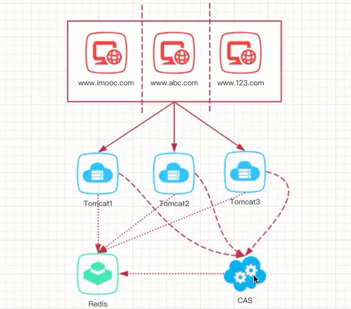
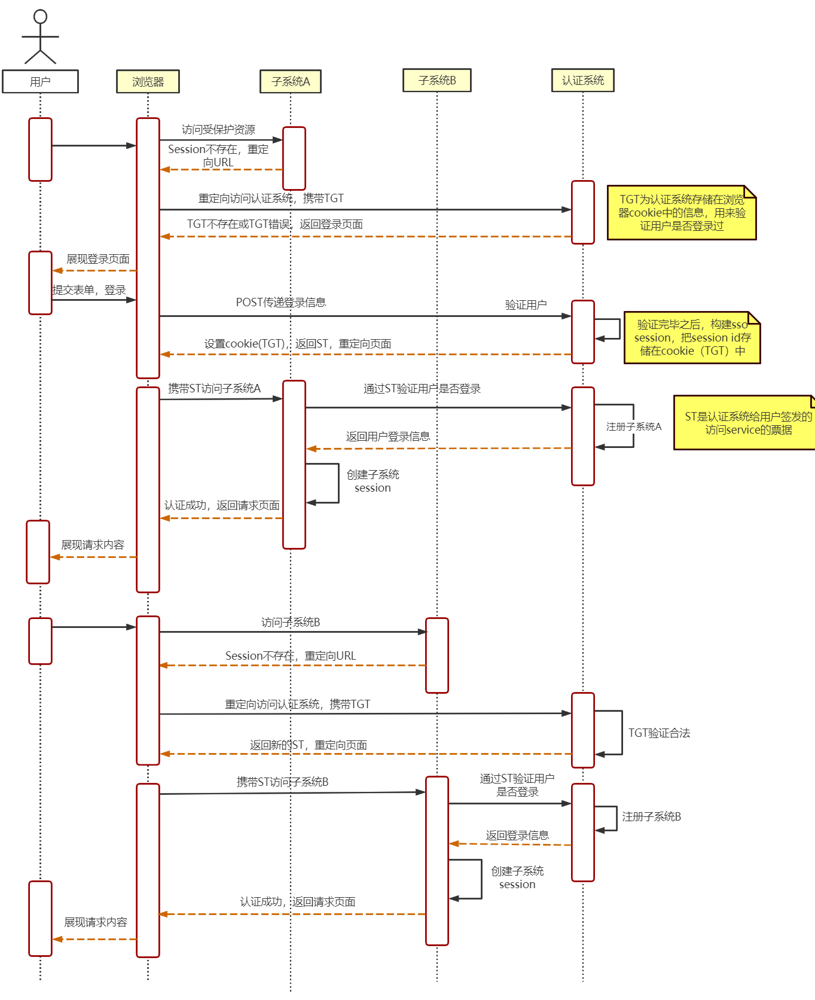

## 分布式会话

在之前我们单体项目时，使用的都是cookie+session来存储用户登录信息。

当用户退出浏览器后，再次进入，因为后台session的存在，也会保存登录状态。

但是这样是有问题的，当我们项目从单体上升到分布式集群，因为Session是保存在服务端，即Tomcat上。搞成分布式集群后，有多个Tomcat同时提供服务，可能用户请求A服务器，保存了登录状态，再次请求B服务器，发现没有Session，就会让他重新登录，这是非常严重的问题。

由此原因，出现了分布式会话。

常见的分布式会话有两种实现方式：

- 使用Redis缓存中间件，存储Session
- 使用Spring提供的Spring Session来实现

### Redis实现

基于我们这个项目，需要改动3个点：

- 注册时添加用户状态到Redis中
- 退出时删除
- 修改用户信息与头像时更新用户信息

核心代码：

```java
// 3.保存Session到Redis
// 创建Token，使用UUID
String userToken = UUID.randomUUID().toString().trim();
redisOperator.set("redis_user_token:" + user.getId(),userToken);
UsersVO usersVO = new UsersVO();
BeanUtils.copyProperties(user,usersVO);
usersVO.setUserToken(userToken);

// 4.设置cookie
CookieUtils.setCookie(request,response,"user",
                      JsonUtils.objectToJson(usersVO),true);
```

优缺点：

- 灵活，耦合度小，可以独立使用，不基于Spring
- 需手动维护配置，较麻烦

### SpringSession实现

1.引入依赖

```xml
<dependency>
    <groupId>org.springframework.boot</groupId>
    <artifactId>spring-session-data-redis</artifactId>
</dependency>
<dependency>
    <groupId>org.springframework.boot</groupId>
    <artifactId>spring-boot-starter-security</artifactId>
</dependency>
```

2.配置使用Redis作为存储SpringSession的介质

```yml
spring:
 session:
  store-type: redis
```

3.开启SpringSession使用以及关闭SpringSecurity

```java
@SpringBootApplication(exclude={SecurityAutoConfiguration.class})
// tk Mybatis扫描Mapper
@MapperScan(basePackages = "com.pacee1.mapper")
// 扫描Component
@ComponentScan(basePackages = {"com.pacee1","org.n3r.idworker"})
@EnableScheduling // 开启定时任务
@EnableRedisHttpSession
public class MainApplication {
    public static void main(String[] args) {
        SpringApplication.run(MainApplication.class,args);
    }
}
```

4.在需要保存会话的方法上添加HttpServletRequest，并获取Session进行设置

```java
@GetMapping("setSession")
public Object setSession(HttpServletRequest request){
	HttpSession session = request.getSession();
	session.setAttribute("userInfo","new User");
	return "ok";
}
```

这样既可设置分布式会话

优缺点：

- 使用方便简单，可以使用多种Nosql存储会话，比如Redis，MongoDB等
- 与Spring紧密耦合

### 拦截器实现

实现分布式会话后，后端也需要添加拦截器，来判断用户是否登录且有权限访问接口。

实现逻辑：

- 对需要登录的接口进行拦截
- 判断用户id和token是否存在
- 判断用户id是否能从Redis缓存中查到token
- 判断前端传的token和Redis中的token是否一致

代码实现：

拦截器：

```java
public class UserTokenInterceptor implements HandlerInterceptor {

    @Autowired
    private RedisOperator redisOperator;

    /**
     * 请求前拦截方法
     * @param request
     * @param response
     * @param handler
     * @return
     * @throws Exception
     */
    @Override
    public boolean preHandle(HttpServletRequest request, HttpServletResponse response, Object handler) throws Exception {
        String userId = request.getHeader("headerUserId");
        String userToken = request.getHeader("headerUserToken");

        if(StringUtils.isNotBlank(userId) && StringUtils.isNotBlank(userToken)){
            // 通过Redis获取
            String userUniqueToken = redisOperator.get("redis_user_token:" + userId);
            if(StringUtils.isNotBlank(userUniqueToken)){
                if(!userUniqueToken.equals(userToken)){
                    System.out.println("用户异地登录");
                    returnError(response,ResponseResult.errorMsg("用户异地登录"));
                    return false;
                }
            }else {
                System.out.println("用户未登录");
                returnError(response,ResponseResult.errorMsg("用户未登录"));
                return false;
            }
        }else {
            System.out.println("用户未登录");
            returnError(response,ResponseResult.errorMsg("用户未登录"));
            return false;
        }
        return true;
    }

    private void returnError(HttpServletResponse response,
                             ResponseResult responseResult){
        OutputStream os = null;
        try {
            response.setCharacterEncoding("utf-8");
            response.setContentType("text/json");
            os = response.getOutputStream();
            os.write(JsonUtils.objectToJson(responseResult).getBytes("utf-8"));
            os.flush();
        }catch (Exception e){
            e.printStackTrace();
        }finally {
            try {
                os.close();
            } catch (IOException e) {
                e.printStackTrace();
            }
        }
    }
}
```

注册拦截器到Spring容器：

```java
@Configuration
public class MvcConfig implements WebMvcConfigurer {

    @Bean
    public RestTemplate restTemplate(){
        return new RestTemplate(new OkHttp3ClientHttpRequestFactory());
    }

    /**
     * 本地路径映射
     * @param registry
     */
    @Override
    public void addResourceHandlers(ResourceHandlerRegistry registry) {
        registry.addResourceHandler("/**") // 所有路径
                .addResourceLocations("classpath:/META-INF/resources/") // Swagger2的映射
                .addResourceLocations("file:E:/pic/foodie-image/") // 添加图片本地映射
                .addResourceLocations("file:/file/image/");
    }

    @Bean
    public UserTokenInterceptor userTokenInterceptor(){
        return new UserTokenInterceptor();
    }

    @Override
    public void addInterceptors(InterceptorRegistry registry) {
        registry.addInterceptor(userTokenInterceptor())
                .addPathPatterns("/shopcart/add")
                .addPathPatterns("/shopcart/del")
                .addPathPatterns("/address/add")
                .addPathPatterns("/address/list")
                .addPathPatterns("/address/update")
                .addPathPatterns("/address/setDefault")
                .addPathPatterns("/address/delete")
                .addPathPatterns("/orders/*")
                .addPathPatterns("/center/*")
                .addPathPatterns("/userInfo/*")
                .addPathPatterns("/myorders/*")
                .addPathPatterns("/mycomments/*")
                .excludePathPatterns("/myorders/deliver")
                .excludePathPatterns("/orders/notifyMerchantOrderPaid")
        ;

        WebMvcConfigurer.super.addInterceptors(registry);
    }
}
```

## 单点登录

单点登录有两种，一种是同一个顶级域名下的单点登录，另一种是不同域名下的单点登录。

### 相同域下的单点登录

相同顶级域名，Cookie是可以共享的，所以只需考虑分布式会话的处理问题，即我们上面的解决方案。

所以，相同域下的单点登录非常简单：

- Cookie域设置为顶级域名，如：`.a.com`
- 使用Redis解决Session问题

### 不同域下的单点登录

不同域下因为Cookie无法共享的问题，所以无法做到使用Cookie+Redis简单实现单点登录，这时就需要引出CAS系统。



CAS是中央认证服务，当不同域名请求时，所有认证工作都交给他，让他来管理认证工作，即可实现单点登录。具体时序图如下：



大致逻辑：

1. 用户访问A系统，A系统需要登录后才能访问
2. 将请求重定向到认证系统，即CAS，并携带returnUrl
3. CAS判断此用户信息是否已经登录过（如果登录过具有特殊token保存在全局），如果没有登录，返回CAS的登录页
4. 用户输入用户名密码，交给CAS认证
5. CAS认证通过后，创建用户会话，创建全局门票，创建临时票据（ST）
6. CAS通过returnUrl，返回给A系统
7. A系统拿着ST再次校验，并从CAS获取用户信息
8. CAS校验ST成功后，返回用户信息
9. A系统将用户信息保存到本地，登录成功

然后用户再请求B系统：

1. 用户请求B系统，B系统需要登录后才能访问
2. 重定向到认证系统，并携带returnUrl
3. CAS判断此用户信息，发型在全局门票中拥有，创建ST，并通过returnUrl返回给B系统
4. B系统拿着ST请求CAS获取用户信息
5. CAS校验ST并返回用户信息
6. B系统拿到用户信息，认证成功

这里有一对需要说明，为什么系统请求CAS后，需要再次拿着ST获取用户信息，而不是直接让CAS返回用户信息呢？

为了安全，可以设想一下，如果有人拿到了A系统的returnUrl，并直接使用postman等工具伪造用户信息直接请求returnUrl，是不是A系统拿到伪造的用户信息后，就直接让他得逞了呢？