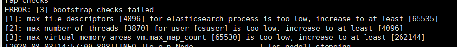
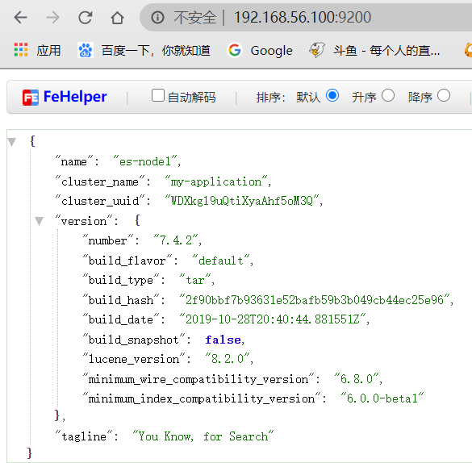
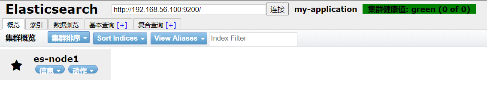

# 分布式搜索引擎

## 为什么使用ES

对于分布式搜索引擎来说，一般有三种，Lucene，Solr，ElasticSearch，那么为什么现在绝大部分都是使用ES呢？

- Lucene：是类库，就好像是一个jar包，引用它来进行使用，是搜索引擎的基础，但是它的api使用复杂，并且没有集群支持，必须自己纯手工搭建集群，需要考虑大量问题。
- Solr：基于Lucene实现的分布式搜索脚手架，和ES相似，也是非常成熟的一款搜索引擎中间件
- ElasticSearch：也是基于Lucene的分布式搜索引擎
  - 是一种更年轻的产品，其最大特点就是实时，在新建索引后，只需等待1秒就可以搜索到新加的索引信息
  - 并且对于超大的数据量搜索速度依旧高效
  - 上手简单
  - 对于数据分析，具有Elastic Stack全家桶

通过上面的介绍，我们可以发现ES更年轻，对于Solr有的它基本都可以实现，而对于它的实时分析搜索，是Solr不复存在的，在新建索引时，Solr会使用较长的时间进行同步后，才可以搜索到新增的数据。并且ES并不是只有实时分布式搜索这么简单，它完善的数据分析全家桶Elastic Stack也是加分项。

综上，ElasticSearch是一款好用，火爆，最流行的分布式搜索引擎，所以我们选择ES来充当分布式搜索引擎中间件的角色。

## ES的相关知识

对于ElasticSearch，我在之前已经详细介绍过，可以看这个专栏：http://www.pacee1.com/categories/elasticsearch/

我们这一篇，主要目的是从0到微服务，过程中的分布式搜索引擎，所以主要是在项目中整合ElasticSearch，而对于一些基础知识点，就不重复介绍了。

## ES安装

首先我们需要下载ES，这里我使用的版本是7.4.2，下载地址：https://www.elastic.co/cn/downloads/past-releases/elasticsearch-7-4-2

下载Linux版本。

下载完毕后将压缩包放到linux上，解压后保存到`/usr/local`下

```
mv elasticsearch-7.4.2 /usr/local
```

然后就可以开始修改配置文件了

### 配置ES

- 核心配置文件`elasticsearch.yml`

```yml
# 集群名称
cluster.name: my-application

# 节点名称
node.name: es-node1

# 数据保存路径
path.data: /usr/local/elasticsearch-7.4.2/data
# Path to log files:
# 日志保存路径
path.logs: /usr/local/elasticsearch-7.4.2/logs

# Set the bind address to a specific IP (IPv4 or IPv6):
# 可以访问的IP，所有都可以访问
network.host: 0.0.0.0

# 集群节点相关，基础主节点，改为当前节点
cluster.initial_master_nodes: ["es-node1"]
```

- jvm配置文件`jvm.options`

```
# 因为在虚拟机，内存没有这么大，所以改小
-Xms128m
-Xmx128m
```

到此，关于核心配置已经配置完毕了。

### 启动ES

因为ES的规定，不能使用root用户直接启动，所以我买需要创建用户并分配权限，使用这个用户启动。

```
useradd esuser
chown -R esuser /usr/local/elasticsearch-7.4.2
su esuser
cd bin
./elasticsearch -d
```



启动后会发现报错，这里我们需要切回root用户，并增大内存

```
vim /etc/security/limits.conf

* soft nofile 65536
* hard nofile 131072
* soft nproc 2048
* hard nproc 4096
```

```
vim /etc/sysctl.conf

# 最下方添加
vm.max_map_count=262145

# 保存后刷新
sysctl -p
```

然后就可以重新启动了，访问 ip:9200，查看是否成功启动



### 安装ES-HEAD

ES-HEAD是ES的可视化工具，其安装方法多种多样，常用的就是在Chrome上当插件安装，或者安装到linux上绑定ES。

这里我们使用在Chrome上安装插件（需科学上网）


安装完毕后打开输入es地址，即可



