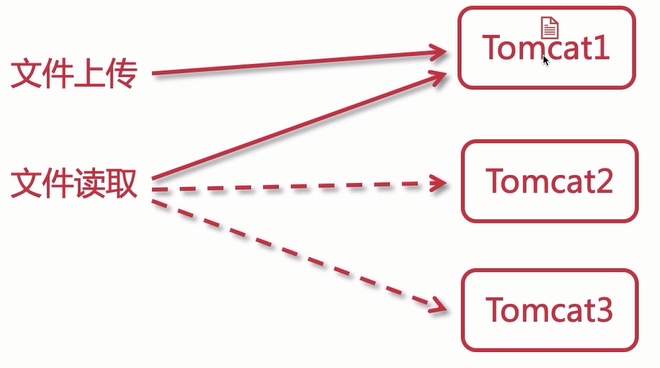
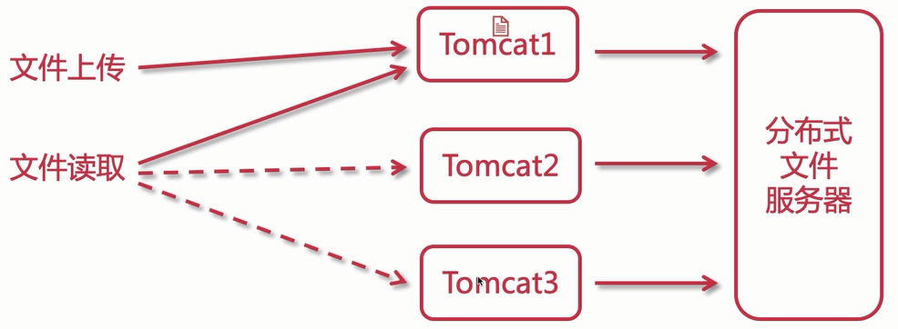
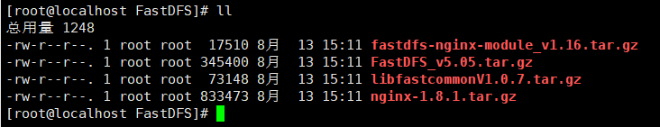
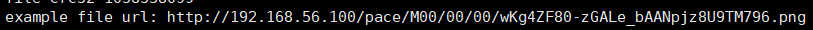
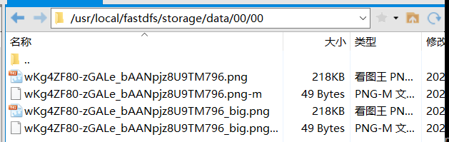

# 分布式文件系统

## 为什么需要实现分布式文件系统

现阶段，我们对于文件的存储，上传和读取，都是依赖tomcat实现的，会有哪些问题呢？直接存储到linux磁盘上

- 单向存储：只能存不能取，如果读取需要依靠tomcat虚拟目录或者nginx
- 不支持集群：可用性差
- 文件数据冗余：也是高可用性差，挂了就不能用了，会冗余
- 可扩展性差

目前文件上传的问题：



如果有三台tomcat集群，当文件上传到一台上时，因为没有同步机制，所以当用户通过Nginx负载均衡请求到其他两台tomcat时，是无法读取到文件的。

那么，加入分布式文件系统，会怎么样呢？



如上图，通过分布式文件系统这个中间件，将文件的管理权全部交由他，这时不管哪个tomcat上传文件时，都会上传给分布式文件系统，读取时也是从系统中拿，就完美解决了问题。

并且分布式文件系统他的扩展性高，可以搭建集群高可用。

## 分布式文件系统介绍

对于分布式文件系统的介绍，在之前的文章中详细描述了。

[分布式文件系统FastDFS](http://www.pacee1.com/2020/02/19/学成在线/学成在线06-分布式文件系统FastDFS/)

## FastDFS安装

### 环境准备

Centos7.x一台或两台

下载安装包：

- libfatscommon：FastDFS分离出的一些公用函数包
- FastDFS：FastDFS本体
- fastdfs-nginx-module：FastDFS和nginx的关联模块
- nginx：发布访问服务



### 安装步骤

1.安装必备环境

```
yum -y install zlib zlib-devel pcre pcre-devel gcc gcc-c++ openssl openssl-devel libevent libevent-devel perl unzip net-tools wget
yum -y install libevent
```

2.安装libfastcommon

```
tar -zxvf libfastcommonV1.0.7.tar.gz
cd libfastcommon-1.0.7
./make.sh
./make.sh install
```

3.安装FastDFS

```
tar -zxvf FastDFS_v5.05.tar.gz
cd FastDFS
./make.sh
./make.sh install
```

安装完FastDFS后，需要将libfastcommon移动到`/usr/lib`

```
cp /usr/lib64/libfastcommon.so /usr/lib
```

将FastDFS的默认配置文件拷贝到`/etc/fdfs`下

```
cd conf
cp * /etc/fdfs/
```

### 配置Tracker

配置文件存放位置：`/etc/fdfs/tracker.conf`

配置Tracker，只需修改其配置文件即可，而区分Tracker还是Storage也是通过配置文件来实现的。

所需修改的内容如下：

```properties
# 存数据文件和日志文件的地址，修改
base_path=/usr/local/fastdfs/tracker
```

只需修改地址即可，其他使用默认，其他一些较为重要的配置：

```properties
# 绑定的ip 为空即所有都可以访问
bind_addr=
# port端口，访问时需要使用，默认22122
port=22122
#存储策略，0为轮训，1为指定具体group，2为负载均衡
store_lookup=2
```

启动Tracker

```
/usr/bin/fdfs_trackerd /etc/fdfs/tracker.conf
```

### 配置Storage

修改配置文件`/etc/fdfs/storage.conf`

```properties
# 修改组名
group_name=pace
# 修改storage的工作空间
base_path=/usr/local/fastdfs/storage
# 修改storage的存储空间
store_path0=/usr/local/fastdfs/storage
# 修改tracker的地址和端口号，用于心跳
tracker_server=192.168.56.100:22122
# 后续结合nginx的一个对外服务端口号
http.server_port=8888
```

创建目录`mkdir /usr/local/fastdfs/storage -p`

启动（需先启动Tracker）：`/usr/bin/fdfs_storaged /etc/fdfs/storage.conf`

### 测试使用FDFS

修改配置文件`/etc/fdfs/client.conf`

```properties
base_path=/usr/local/fastdfs/client
tracker_server=192.168.56.100:22122
```

进入`/home`下载一张图片`wget http://www.pacee1.com/img/avatar.png`

测试上传：`/usr/bin/fdfs_test /etc/fdfs/client.conf upload /home/avatar.png`





上传成功

### 安装配置Nginx

**首先安装配置 fastdfs-nginx-module**

1.解压修改配置

```
tar -zxvf fastdfs-nginx-module_v1.16.tar.gz

# 进入修改config
cd fastdfs-nginx-module/src
vim config
```

将下面代码中的`/local`删除

```
CORE_INCS="$CORE_INCS /usr/local/include/fastdfs /usr/local/include/fastcommon/"
CORE_LIBS="$CORE_LIBS -L/usr/local/lib -lfastcommon -lfdfsclient"
```

2.移动修改配置文件

```
cp mod_fastdfs.conf /etc/fdfs/
cd /etc/fdfs
vim mod_fastdfs.conf
```

需要修改的配置：

```properties
base_path=/usr/local/fastdfs/tmp
tracker_server=192.168.56.100:22122
group_name=pace
url_have_group_name = true
store_path0=/usr/local/fastdfs/storage
```

这样，module就配置完毕了

**然后安装配置Nginx**

1.解压安装Nginx

```
tar -zxvf nginx-1.8.1.tar.gz
cd nginx-1.8.1
```

使用configuration配置nginx

```
./configure \
--prefix=/usr/local/nginx \
--pid-path=/var/run/nginx/nginx.pid \
--lock-path=/var/lock/nginx.lock \
--error-log-path=/var/log/nginx/error.log \
--http-log-path=/var/log/nginx/access.log \
--with-http_gzip_static_module \
--http-client-body-temp-path=/var/temp/nginx/client \
--http-proxy-temp-path=/var/temp/nginx/proxy \
--http-fastcgi-temp-path=/var/temp/nginx/fastcgi \
--http-uwsgi-temp-path=/var/temp/nginx/uwsgi \
--http-scgi-temp-path=/var/temp/nginx/scgi \
--add-module=/home/software/FastDFS/fastdfs-nginx-module/src
```

安装

```
make
make install
```

2.配置Nginx

进入nginx目录

```
cd /usr/local/nginx/conf/
```

修改配置文件，写入以下内容

```
pid    /usr/local/nginx/logs/nginx.pid;

http {
    
	server {
		listen       8888;
		server_name  localhost;
		location ~/pace/M00/ {
			ngx_fastdfs_module;
		}
	}

}
```

创建目录：`mkdir /usr/local/nginx/logs`

启动：`/usr/local/nginx/sbin/nginx -c /usr/local/nginx/conf/nginx.conf`

总结启动命令

```
/usr/bin/fdfs_trackerd /etc/fdfs/tracker.conf
/usr/bin/fdfs_storaged /etc/fdfs/storage.conf
/usr/local/nginx/sbin/nginx -c /usr/local/nginx/conf/nginx.conf
```

## FDFS整合Foodie项目

**1.创建module `foodie-fs`**

**2.添加依赖**

```xml
<dependencies>
    <dependency>
        <groupId>com.pacee1</groupId>
        <artifactId>foodie-service</artifactId>
        <version>1.0-SNAPSHOT</version>
    </dependency>
    <dependency>
        <groupId>com.github.tobato</groupId>
        <artifactId>fastdfs-client</artifactId>
        <version>1.26.7</version>
    </dependency>
</dependencies>
```

**3.将api层的配置，启动器类以及跨域配置复制过来**

**4.创建Service**

```java
@Service
public class FdfsServiceImpl implements FdfsService {

    @Autowired
    private FastFileStorageClient fastFileStorageClient;

    /**
     * 使用FastDFS上传图片
     * @param file
     * @param fileExtName
     * @return
     * @throws Exception
     */
    @Override
    public String upload(MultipartFile file,String fileExtName) throws Exception {
        StorePath storePath = fastFileStorageClient.uploadFile(file.getInputStream(), file.getSize(), fileExtName, null);
        String fullPath = storePath.getFullPath();
        return fullPath;
    }
}
```

**5.创建文件配置文件以及配置类**

`file.properties`：

```properties
file.host=http://192.168.56.100:8888/
```

FileResource

```java
@Component
@PropertySource("classpath:file.properties")
@ConfigurationProperties(prefix = "file")
public class FileResource {

    private String host;

    public String getHost() {
        return host;
    }

    public void setHost(String host) {
        this.host = host;
    }
}
```

**6.创建Controller**

```java
@RestController
@RequestMapping("fdfs")
public class FdfsController {

    @Autowired
    private FileResource fileResource;

    @Autowired
    private CenterUserService centerUserService;
    @Autowired
    private FdfsService fdfsService;
    @Autowired
    private RedisOperator redisOperator;

    @PostMapping("/uploadFace")
    @ApiOperation(value = "修改用户头像",notes = "修改用户头像接口")
    public ResponseResult uploadFace(
            @RequestParam String userId, MultipartFile file,
            HttpServletRequest request, HttpServletResponse response) throws Exception{
        String path = null;

        // 开始文件上传
        if(file != null){
            // 文件名称
            String filename = file.getOriginalFilename();
            if(StringUtils.isNotBlank(filename)){
                // 文件重命名，face-userId.jpg
                String[] strings = filename.split("\\.");
                String suffix = strings[strings.length - 1];

                // 判断文件格式是否正确
                if(!suffix.toLowerCase().equals("png") &&
                        !suffix.toLowerCase().equals("jpg") &&
                        !suffix.toLowerCase().equals("jpeg")){
                    return ResponseResult.errorMsg("文件格式不正确");
                }

                // 上传图片到fdfs
                path = fdfsService.upload(file, suffix);
                System.out.println(path);
            }
        }else {
            return ResponseResult.errorMsg("头像不存在");
        }

        if(StringUtils.isNotBlank(path)){
            // 更新用户信息到数据库
            // 组装图片网络路径
            String faceUrl = fileResource.getHost() + path;
            Users users = centerUserService.updateUserFace(userId, faceUrl);

            // 清空用户敏感信息
            users = setUserNull(users);

            // 保存Session到Redis
            String userToken = UUID.randomUUID().toString().trim();
            redisOperator.set("redis_user_token:" + users.getId(),userToken);
            UsersVO usersVO = new UsersVO();
            BeanUtils.copyProperties(users,usersVO);
            usersVO.setUserUniqueToken(userToken);

            // 设置cookie
            CookieUtils.setCookie(request,response,"user",
                    JsonUtils.objectToJson(usersVO),true);
        }else {
            return ResponseResult.errorMsg("上传头像失败");
        }

        return ResponseResult.ok();
    }

    private Users setUserNull(Users user) {
        user.setPassword(null);
        user.setBirthday(null);
        user.setCreatedTime(null);
        user.setEmail(null);
        user.setUpdatedTime(null);
        return user;
    }
}
```

**7.修改前端请求地址**

```js
uploadFace(e) {
    ···
    var fileServer = app.fdfsUrl + '/fdfs/uploadFace?userId=' + userInfo.id;
    axios.defaults.withCredentials = true;
    axios.post(
        //serverUrl + '/userInfo/uploadFace?userId=' + userInfo.id, 
        fileServer,
        ···
}
```

**8.启动测试**

