# 分布式锁

## 分布式锁介绍

锁的概念我们在之前的学习中都知道，为了**防止多个线程对同一个变量修改导致一系列问题**，对于这个问题，我们的解决方案都是**使用同步**，比如synchronize 关键字，或者Lock接口保证原子性。

那么既然这样可以解决，分布式锁又是干嘛的，请注意，我们刚刚说的解决方案是**单机环境**的，一个进程中的多个线程，实际是**JVM进行控制**的。

那么如果我们部署分布式项目，多个Tomcat搭建集群那么就有多个JVM，如下

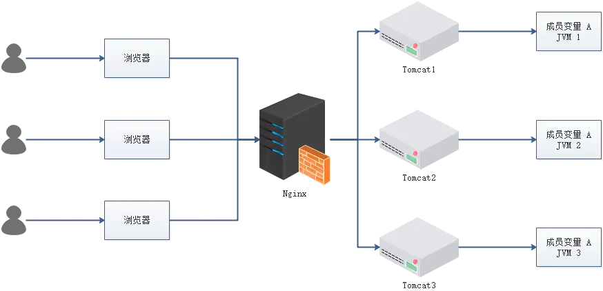

- 成员变量 A 存在 JVM1、JVM2、JVM3 三个 JVM 内存中，成员变量 A 同时都会在 JVM 分配一块内存
- 当三个请求发送过来时，正好每个请求通过轮训请求到不同的三个变量A，因为所在内存不同，数据不共享，所以肯定会出现问题的，每个请求修改A后，下一个请求修改的还是原来的A数据
- 注：该成员变量 A 是一个有状态的对象

如果我们业务中确实存在这个场景的话，我们就需要一种方法解决这个问题！

为了**保证一个方法或属性在高并发情况下的同一时间只能被同一个线程执行**，在传统单体应用单机部署的情况下，可以使用并发处理相关的功能进行互斥控制。但是，随着业务发展的需要，原单体单机部署的系统被演化成分布式集群系统后，由于**分布式系统多线程、多进程并且分布在不同机器上**，这将使原单机部署情况下的并发控制锁策略失效，单纯的应用并不能提供分布式锁的能力。为了解决这个问题就需要一种**跨机器的互斥机制来控制共享资源的访问**，这就是分布式锁要解决的问题！

## 分布式锁应该具备哪些条件

- 在分布式系统环境下，一个方法在同一时间只能被一个机器的一个线程执行
- 高可用的获取锁与释放锁
- 高性能的获取锁与释放锁
- 具备可重入特性（可理解为重新进入，由多于一个任务并发使用，而不必担心数据错误）
- 具备锁失效机制，防止死锁
- 具备非阻塞锁特性，即没有获取到锁将直接返回获取锁失败

## 单体应用超卖问题

接下来，我们以最经典的超卖问题，一点点从单体锁实现方式到各种分布式锁实现方式的实现。

### 前期代码准备

表：创建了三张表

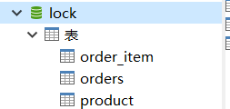

java工程：springboot

- dao，pojo，使用通用mapper
- service层：实现减少库存，创建订单

```java
@Service
@Slf4j
public class OrderService {

    @Resource
    private OrderMapper orderMapper;
    @Resource
    private OrderItemMapper orderItemMapper;
    @Resource
    private ProductMapper productMapper;

    // 商品id
    private int purchaseProductId = 100100;
    // 购买数量
    private int purchaseProductNum = 1;


    @Transactional(rollbackFor = Exception.class)
    public Integer createOrder() throws Exception{
        Product product = productMapper.selectByPrimaryKey(purchaseProductId);
        if(product == null){
            throw  new  Exception("购买商品"+purchaseProductId + "不存在");
        }

        // 商品库存
        Integer currCount = product.getCount();
        // 校验库存
        if(currCount < purchaseProductNum){
            throw  new  Exception("商品"+purchaseProductId + "仅剩" + currCount + "件，无法购买");
        }
        // 计算剩余库存
        Integer leftCount = currCount - purchaseProductNum;
        product.setCount(leftCount);
        productMapper.updateByPrimaryKeySelective(product);

        // 新建订单
        Orders orders = new Orders();
        orders.setId(new Random().nextInt(10000)+1);
        orders.setOrderAmount(product.getPrice().multiply(new BigDecimal(purchaseProductNum)));
        orders.setReceiverName("xx");
        orders.setOrderStatus("1");
        orderMapper.insertSelective(orders);

        // 新建订单商品
        OrderItem orderItem = new OrderItem();
        orderItem.setId(new Random().nextInt(10000)+1);
        orderItem.setOrderId(orders.getId());
        orderItem.setProductId(product.getId());
        orderItem.setPurchaseNum(purchaseProductNum);
        orderItem.setPurchasePrice(product.getPrice());
        orderItemMapper.insertSelective(orderItem);
        return orders.getId();
    }

}
```

- 测试类：实现并发下单操作

```java
@SpringBootTest
@RunWith(SpringRunner.class)
public class LockStudyApplicationTests {

    @Autowired
    private OrderService orderService;

    @Test
    public void contextLoads() throws Exception {
        // 闭锁
        CountDownLatch countDownLatch = new CountDownLatch(5);
        // 线程等待，有5个线程时才执行
        CyclicBarrier cyclicBarrier = new CyclicBarrier(5);

        // 分配5个线程
        ExecutorService es = Executors.newFixedThreadPool(5);
        // 循环跑5个线程
        for (int i = 0; i < 5; i++) {
            // 线程执行
            es.execute(() -> {
                try {
                    // 所有线程等待，等到5个线程同时到时，才会同时执行，即并发
                    cyclicBarrier.await();
                    Integer orderId = orderService.createOrder();
                    System.out.println("订单id为"+orderId);
                } catch (Exception e) {
                    e.printStackTrace();
                }finally {
                    // 闭锁减一
                    countDownLatch.countDown();
                }

            });
        }
        // 当闭锁全部执行完后，才执行后面的代码
        // 目的是和数据库连接池有关，如果主线程执行完了，那么连接会关闭，之后的线程就无法执行了，影响操作
        countDownLatch.await();

        es.shutdown();
    }

}
```

### 超卖现象一 数据库行锁

- 系统中库存为一，但是卖出了两笔订单

这种问题，就是经典的超卖现象，A和B两个买家同时拍下商品并提交订单。

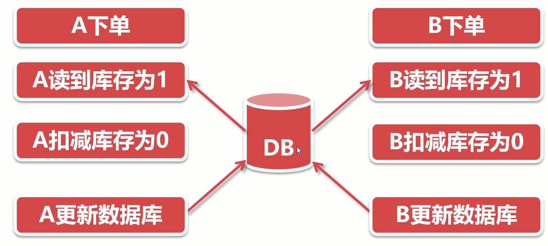

**解决方案**

1. 不在程序中扣减库存，而是在数据库中
2. 数据库传递库存增量，为-1，库存数+增量数
3. 通过update语句计算库存，并使用行锁进行控制并发

**现象**：当前执行代码后，会发现出现5笔订单，但是库存为0

**代码修改**：Service层

```java
/*// 计算剩余库存
Integer leftCount = currCount - purchaseProductNum;
product.setCount(leftCount);
productMapper.updateByPrimaryKeySelective(product);*/
// 使用update 库存增量 修改库存
productMapper.updateProductCount(purchaseProductId,purchaseProductNum);
```

mapper

```xml
<update id="updateProductCount">
  update product
  set count = count - #{purchaseProductNum}
  where id = #{purchaseProductId}
</update>
```

修改过后进行测试

会发现还是会出现5条订单，但商品数量不再是0而是-4了。

说明还有问题，这就需要下面现象二来进行解决。

### 超卖现象二 同步锁

- 系统中库存数量变成了负数，并且还有多个订单生成

问题出现在校验库存那里，并发校验库存，导致出现库存充足的假象。

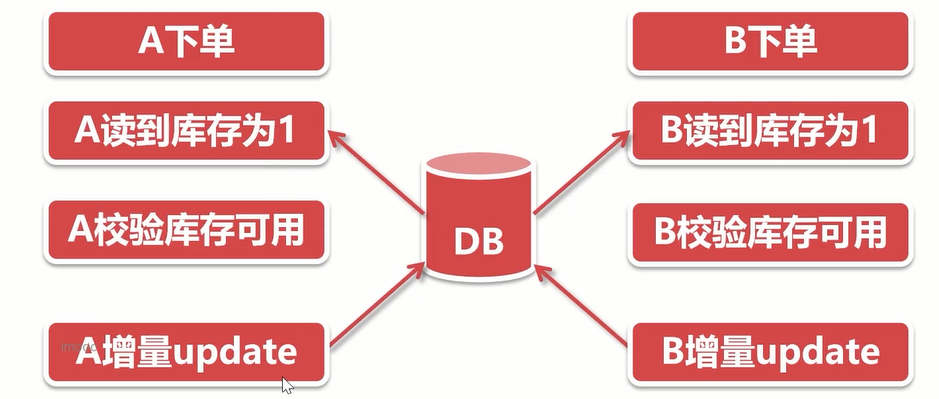

**解决方案**

- 校验库存和扣减库存操作加锁
- 使两步操作绑定在一起，使其形成原子性操作
- 并发时，只有获得锁的线程才可以校验扣减库存
- 库存扣减结束后释放锁，这样可以确保库存不为负数

**具体实现** 

基于Synchronized解决（最基础的同步锁），代码会进行一些省略

- **方法锁**

将synchronized加在方法上，只有获取到该锁的线程才可以执行此方法

```java
@Autowired
private PlatformTransactionManager platformTransactionManager;
@Autowired
private TransactionDefinition transactionDefinition;

//@Transactional(rollbackFor = Exception.class)
public synchronized Integer createOrder() throws Exception{
    // 手动控制事务
    TransactionStatus transaction = platformTransactionManager.getTransaction(transactionDefinition);

    Product product = productMapper.selectByPrimaryKey(purchaseProductId);
    if(product == null){
        // 手动回滚
        platformTransactionManager.rollback(transaction);
        throw new Exception("购买商品"+purchaseProductId + "不存在");
    }

    // 商品库存
    Integer currCount = product.getCount();
    // 校验库存
    if(currCount < purchaseProductNum){
        platformTransactionManager.rollback(transaction);
        throw new Exception("商品"+purchaseProductId + "仅剩" + currCount + "件，无法购买");
    }
    /*// 计算剩余库存
    Integer leftCount = currCount - purchaseProductNum;
    product.setCount(leftCount);
    productMapper.updateByPrimaryKeySelective(product);*/
    // 使用update 库存增量 修改库存
    productMapper.updateProductCount(purchaseProductId,purchaseProductNum);

    // 新建订单

    // 新建订单商品

    // 手动提交事务
    platformTransactionManager.commit(transaction);
    return orders.getId();
}
```

主在方法上加锁，并手动控制事务（不然在第一个还没提交时，第二个进来会获取到脏数据）

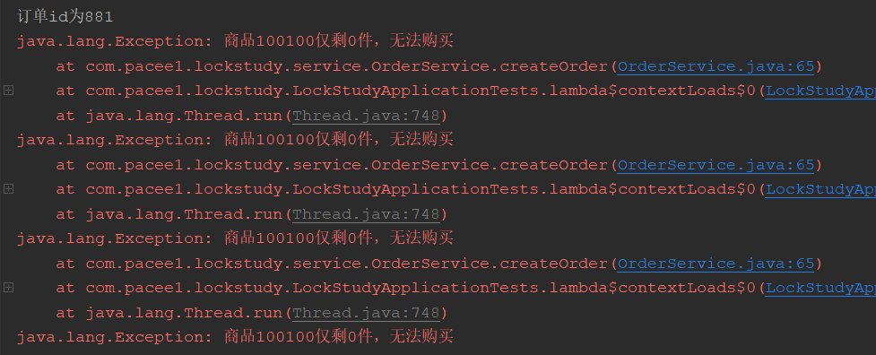

- **块锁**

```java
public Integer createOrder() throws Exception{
    Product product = null;
    // 块锁
    synchronized(this){
        // 手动控制事务
        TransactionStatus transaction = platformTransactionManager.getTransaction(transactionDefinition);
        product = productMapper.selectByPrimaryKey(purchaseProductId);
        if(product == null){
            // 手动回滚
            platformTransactionManager.rollback(transaction);
            throw new Exception("购买商品"+purchaseProductId + "不存在");
        }

        // 商品库存
        Integer currCount = product.getCount();
        // 校验库存
        if(currCount < purchaseProductNum){
            platformTransactionManager.rollback(transaction);
            throw new Exception("商品"+purchaseProductId + "仅剩" + currCount + "件，无法购买");
        }
        /*// 计算剩余库存
        Integer leftCount = currCount - purchaseProductNum;
        product.setCount(leftCount);
        productMapper.updateByPrimaryKeySelective(product);*/
        // 使用update 库存增量 修改库存
        productMapper.updateProductCount(purchaseProductId,purchaseProductNum);

        // 手动提交事务
        platformTransactionManager.commit(transaction);
    }

    // 新建订单

    // 新建订单商品

    return orders.getId();
}
```

在方法的实际代码块上加锁，也可以达到同步

- **ReentranLock**

该锁是JUC并发包中的锁，使用也相当简单

```java
// 并发包中的锁
private Lock lock = new ReentrantLock();

//@Transactional(rollbackFor = Exception.class)
public Integer createOrder() throws Exception{
    Product product = null;

    // 锁住
    lock.lock();
    try{
        // 控制事务，查询库存，校验库存，减少库存
    }finally {
        // 释放锁
        lock.unlock();
    }

    // 新建订单

    // 新建订单商品

    return orders.getId();
}
```

### 局限性

通过之前的学习，我们知道如果是单体项目的话，处于一个JVM，使用Java自带的同步锁进行同步控制，是没有问题的。但是如果是集群呢？有多个JVM启动呢？就会出现问题

为了证实确实会出现问题，这里我们进行测试一下。

使用Springboot项目，并创建一个Controller

```java
@RestController
public class OrderController {

    private Lock lock = new ReentrantLock();

    @RequestMapping("lock")
    public String lock(){
        System.out.println("我进入方法");
        lock.lock();
        System.out.println("我进入锁了");
        try {
            Thread.sleep(10000);
        } catch (InterruptedException e) {
            e.printStackTrace();
        }
        lock.unlock();
        return "执行完成！";
    }

}
```

然后启动两个应用，使用PostMan进行请求

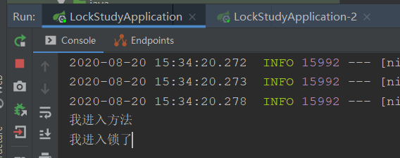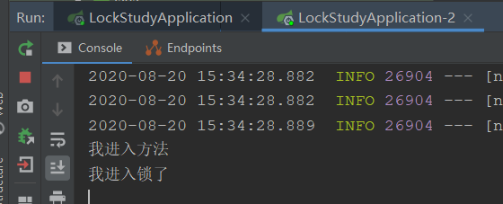

会发现两个方法都能进入，说明分布式项目中，使用基础的锁是无效的，必须使用分布式锁才可以。

## 分布式应用锁

为了解决上面的问题，接下来我们会学习各式各样的分布式锁，各有各的优缺点

### 数据库分布式锁

对于数据库来说，在`select`语句后加上`for update`来访问同一条数据，这样就会将这条数据加上锁，其他线程想修改这条数据就只能等待。

**代码实现**

mapper：

```xml
<select id="selectForUpdate" resultType="com.pacee1.lockstudy.pojo.DbLock">
  select * from db_lock
  where business_code = #{businessCode}
  for update
</select>
```

controller：

```java
@RestController
public class LockController {

    @Resource
    private DbLockMapper dbLockMapper;

    @RequestMapping("distributedLock")
    @Transactional(rollbackFor = Exception.class)
    public String distributedLock() throws Exception{
        System.out.println("我进入方法");

        // 数据库锁锁住
        DbLock dbLock = dbLockMapper.selectForUpdate("demo");
        if(dbLock == null){
            throw new Exception("锁不存在");
        }

        System.out.println("我进入锁了");
        try {
            Thread.sleep(10000);
        } catch (InterruptedException e) {
            e.printStackTrace();
        }
        System.out.println("执行完成");
        return "执行完成！";
    }

}
```

通过之前的了解，代码主要实现步骤就是在获取数据时，将此条数据锁住，第二个进程请求过来时，因为被数据库锁住，所以无法获取数据，就只能等待，当第一个线程全部执行完毕，提交后，释放锁，第二个线程才可以执行。这样就实现了分布式锁。

**测试**

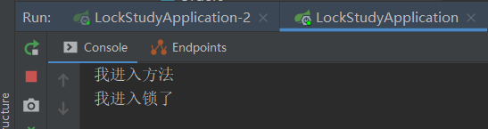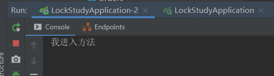

当同时发送请求时，应用一进入了方法并获得锁，应用二进入了方法，但锁被占用，只能等待锁释放才能进入，说明我们数据库分布式锁成功实现。

**优缺点**

- 实现简单，易于理解和操作
- 并发量大时，对数据库压力大
- 锁的数据库应与业务数据库分开（减小对业务性能影响）

### Redis分布式锁

使用Redis实现分布式锁也是非常常见的一种，主要使用setNX命令

**实现逻辑**

- 获取锁

```
SET resource_name my_random_value NX PX 30000
resource_name：资源名称，根据业务不同设置不同的key
my_random_value：随机值，UUID，用于释放锁时的校验，只有相同的随机值，才可以释放锁
NX：key不存在时可以设置成功，存在时不予设置，原子性操作
PX：key过期时间，出现异常情况时，锁会自动释放，后面的30000即30秒后自动过期
```

利用NX的原子性，多个线程并发时，只有一个线程可以获得锁。设置成功即获得锁，执行业务完将锁释放。如果出现异常没有释放锁，有PX设置锁的有效期，会自动释放锁。

- 释放锁

释放锁使用delete操作，但是释放锁之前需要校验随机数是否相同，所以我们需要写一个LUA脚本

```lua
if redis.call("get",KEYS[1]) == ARGV[1] then
	return redis.call("del",KEYS[1])
else
    return 0
end
```

- 为什么要校验随机值？

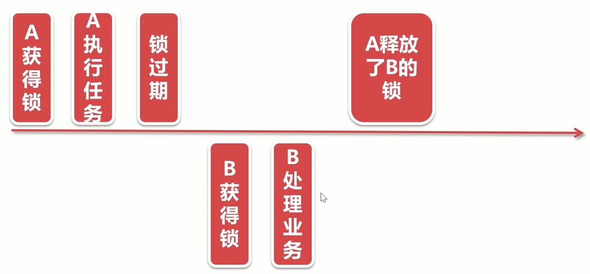

通过上图可以看到，如果不校验随机值，A如果执行任务时间过长导致锁过期，当执行完毕后，会将B的锁释放，那么B业务还没执行完毕，别的线程就又进来了，会造成数据的错乱。

**代码实现**

```java
@RestController
@RequestMapping("redis")
@Slf4j
public class RedisLockController {

    @Autowired
    private RedisTemplate redisTemplate;

    @RequestMapping("distributedLock")
    @Transactional(rollbackFor = Exception.class)
    public String distributedLock() throws Exception{
        log.info("我进入方法");

        String key = "redisKey";
        String value = UUID.randomUUID().toString();

        // 获取锁
        RedisCallback<Boolean> redisCallback = connection -> {
            // 设置NX
            RedisStringCommands.SetOption setOption = RedisStringCommands.SetOption.ifAbsent();
            // 设置过期时间
            Expiration expiration = Expiration.seconds(30);
            // key
            byte[] keyB = redisTemplate.getKeySerializer().serialize(key);
            // value
            byte[] valueB = redisTemplate.getValueSerializer().serialize(value);

            Boolean result = connection.set(keyB, valueB, expiration, setOption);
            return result;
        };
        Boolean lock = (Boolean) redisTemplate.execute(redisCallback);

        if(lock){
            // 获取锁后的业务操作
            log.info("获得锁");
            try {
                Thread.sleep(10000);
            }finally {
                // 释放锁
                // 编写LUA脚本
                String script = "if redis.call(\"get\",KEYS[1]) == ARGV[1] then\n" +
                        "\treturn redis.call(\"del\",KEYS[1])\n" +
                        "else\n" +
                        "    return 0\n" +
                        "end";
                RedisScript<Boolean> redisScript = RedisScript.of(script,Boolean.class);
                List keys = Arrays.asList(key);
                Object result = redisTemplate.execute(redisScript, keys, value);

                log.info("释放锁结果：" + result);
            }
            return "执行完成！";
        }else {
            log.info("我没有获得锁，直接结束");
            return "结束！";
        }
    }

}
```

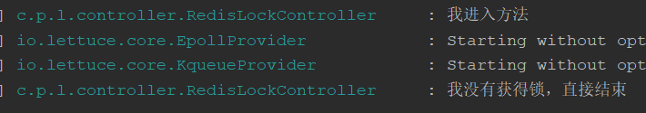

经过测试，因为线程一占用了锁，所以线程二访问时会直接结束，说明Redis实现的分布式锁成功。

> 通过Redis分布式锁，还可以解决分布式定时任务的问题，对于定时任务，可以使用ElasticJob等中间件，但是如果使用Spring Task，就需要考虑分布式问题，使用Redis分布式锁可以解决SpringTask分布式使用问题。

### Zookeeper分布式锁

#### 环境搭建

首先我们需要下载安装Zookeeper，http://archive.apache.org/dist/zookeeper/zookeeper-3.4.12/zookeeper-3.4.12.tar.gz

下载完毕后解压压缩包，进入conf文件夹，复制`zoo_sample.cfg`改名为`zoo.cfg`

修改配置：

```
dataDir=/zookeeper-data
```

然后进入bin文件夹，点击执行`zkServer.cmd`启动Zookeeper

启动成功后，点击`zkCli.cmd`命令行测试

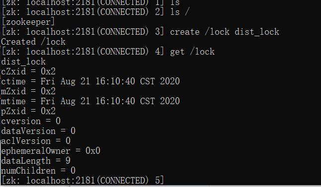

说明安装成功

#### 实现原理

Zookeeper监听机制：Zookeeper可以对某个节点进行监听，当此节点发生改变时，进行一系列自定义操作。

Zookeeper的瞬时节点：Zookeeper具有持久节点和瞬时节点，瞬时节点有序且会话结束就会消失。

使用上面两个特性，我们的分布式锁的实现原理如下：

1. 当线程并发请求时，会创建多个瞬时节点，且**节点间是有序**的
2. **序号最小的线程最先获得锁**，执行业务，当**执行完毕后，删除节点**
3. **其他线程监听前一个序号的节点**，例如2号节点监听1号节点
4. 这样1号节点执行完删除后，**2号节点监听到就会执行它的业务代码**
5. 以此类推，会**同步执行完毕所有线程**

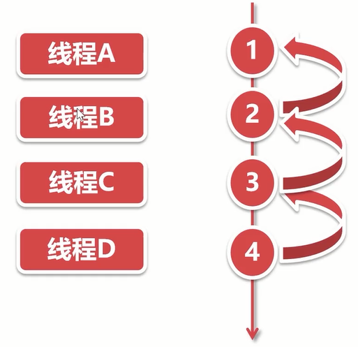


#### 代码实现

```java
@Slf4j
public class ZkLock implements AutoCloseable, Watcher {

    private ZooKeeper zooKeeper;

    private String zNode;

    public ZkLock() throws IOException {
        // 初始化ZK
        zooKeeper = new ZooKeeper("localhost:2181",10000,this);
    }

    // 获取锁
    public Boolean getLock(String businessCode){
        try {
            // 1.判断该业务代码的节点是否存在，不存在创建
            Stat stat = zooKeeper.exists("/" + businessCode, false);
            if(stat == null){
                // 不存在 创建
                // 参数分别是，节点名称，节点数据，权限（开放权限），节点类型（瞬时节点或持久节点）
                zooKeeper.create("/"+businessCode,businessCode.getBytes(),
                        ZooDefs.Ids.OPEN_ACL_UNSAFE,CreateMode.PERSISTENT);
            }

            // 2.创建瞬时有序节点 /order/order_0001
            zNode = zooKeeper.create("/"+businessCode+"/"+businessCode+"_",businessCode.getBytes(),
                    ZooDefs.Ids.OPEN_ACL_UNSAFE,CreateMode.EPHEMERAL_SEQUENTIAL);

            // 3.获取全部节点并进行排序
            List<String> children = zooKeeper.getChildren("/" + businessCode, false);
            Collections.sort(children);

            // 4.判断当前节点是否为第一个节点，是则返回true
            String firstNode = children.get(0);
            if(zNode.endsWith(firstNode)){
                return true;
            }

            // 5.不是第一个节点，需要将其监听前一个节点
            String preNode = firstNode;
            for (String child : children) {
                if (zNode.endsWith(child)){
                    // 监听前一个节点
                    zooKeeper.exists("/"+businessCode+"/"+preNode,true);
                }else {
                    // 如果不是，说明当前节点不是前一个节点，将preNode赋值
                    preNode = child;
                }
            }

            // 6.没有获取到线程，需要一直等待，直到被监听的节点被删除，即锁释放
            synchronized (this){
                wait();
            }
            return true;
        } catch (Exception e) {
            e.printStackTrace();
        }
        return false;
    }

    @Override
    public void close() throws Exception {
        // 删除节点
        zooKeeper.delete(zNode,-1);
        zooKeeper.close();
        log.info("我已经释放了锁");
    }

    @Override
    public void process(WatchedEvent event) {
        // 监听的节点改变后，会进入这个方法
        // 就要唤起等待的线程
        if(event.getType() == Event.EventType.NodeDeleted){
            // 如果节点状态是被删除，唤起线程
            synchronized (this){
                notify();
            }
        }
    }
}
```

测试Controller：

```java
@RestController
@RequestMapping("zk")
@Slf4j
public class ZkLockController {

    @RequestMapping("distributedLock")
    @Transactional(rollbackFor = Exception.class)
    public String distributedLock(){
        log.info("我进入方法");

        // jdk1.7写法，这样会自动运行AutoClose接口的close方法，就像在finally里写一样
        try(ZkLock zkLock = new ZkLock()){
            Boolean lock = zkLock.getLock("order");
            if(lock){
                log.info("我获取了锁");
                // 进行业务代码编写
                Thread.sleep(10000);
            }
        } catch (IOException e) {
            e.printStackTrace();
        } catch (Exception e) {
            e.printStackTrace();
        }
        log.info("执行完成");
        return "执行完成！";
    }

}
```

### Curator分布式锁

Curator是Zookeeper高级客户端，封装了大量Zookeeper操作，使之变得更简单，更稳定。

之前我们使用Zookeeper原生命令操作，实现了分布式锁，而Curator客户端中，已经封装好了对分布式锁的获取释放操作。所以使用Curator可以更简单的实现分布式锁。

官方教程：http://curator.apache.org/getting-started.html

代码实现：

在启动类上添加Curator客户端初始化

```java
@SpringBootApplication
// tk Mybatis扫描Mapper
@MapperScan(basePackages = "com.pacee1.lockstudy.dao")
public class LockStudyApplication {

    public static void main(String[] args) {
        SpringApplication.run(LockStudyApplication.class, args);
    }

    @Bean(initMethod = "start",destroyMethod = "close")
    public CuratorFramework curatorFramework(){
        RetryPolicy retryPolicy = new ExponentialBackoffRetry(1000, 3);
        CuratorFramework client = CuratorFrameworkFactory.newClient("localhost:2181", retryPolicy);
        return client;
    }
}
```

然后编写获取释放锁代码：

```java
@RestController
@RequestMapping("zk")
@Slf4j
public class ZkLockController {

    @Autowired
    private CuratorFramework client;

    @RequestMapping("curator")
    @Transactional(rollbackFor = Exception.class)
    public String curator(){
        log.info("我进入方法");
        // 使用curator获取分布式锁
        InterProcessMutex lock = new InterProcessMutex(client, "/order");
        try{
            // 规定锁超时时间
            if(lock.acquire(30, TimeUnit.SECONDS)){
                log.info("我获取了锁");
                // 进行业务代码编写
                Thread.sleep(10000);
            }
        } catch (IOException e) {
            e.printStackTrace();
        } catch (Exception e) {
            e.printStackTrace();
        } finally {
            // 释放锁
            try {
                lock.release();
            } catch (Exception e) {
                e.printStackTrace();
            }
        }
        log.info("执行完成");
        return "执行完成！";
    }

}
```

可以看到，对比Zookeeper自己实现来说，使用封装好的高级客户端，省去了大量工作。

### Redisson分布式锁

Redisson和Curator一样，都是跟高级的客户端，Redisson是针对Redis进行的封装。

引入依赖：

```xml
<!-- redisson redis高级客户端 -->
<dependency>
    <groupId>org.redisson</groupId>
    <artifactId>redisson-spring-boot-starter</artifactId>
    <version>3.11.2</version>
</dependency>
```

配置Redis：

```yml
spring: 
	redis:
        host: 120.78.80.109
        database: 1
        password: xxx
```

代码实现：

```java
@Autowire
private RedissonClient redissonClient;

@RequestMapping("redisson")
@Transactional(rollbackFor = Exception.class)
public String redisson(){
    log.info("我进入方法");
    RLock rlock = redissonClient.getLock("order");
    try{
        rlock.lock(30,TimeUnit.SECONDS);
        log.info("我获取了锁");
        // 进行业务代码编写
        Thread.sleep(10000);
    } catch (Exception e) {
        e.printStackTrace();
    } finally {
        // 释放锁
        rlock.unlock();
    }
    log.info("执行完成");
    return "执行完成！";
}
```

### 多种分布式锁优缺点

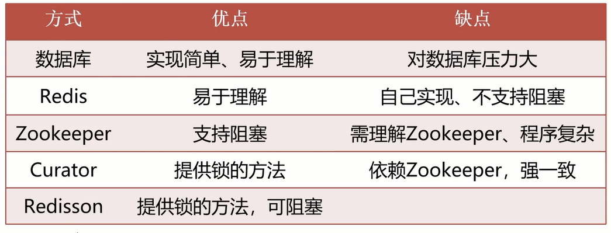

