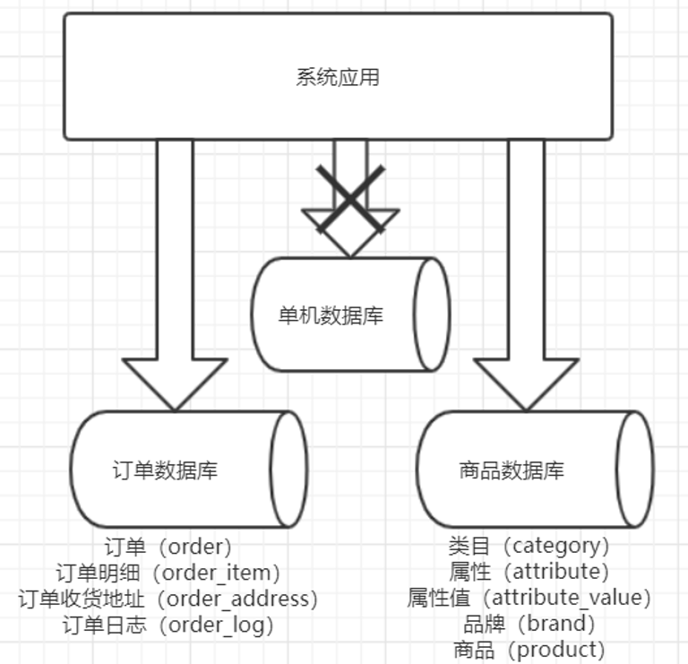
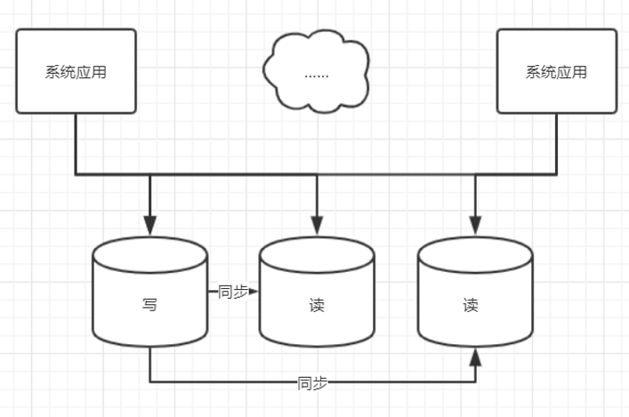
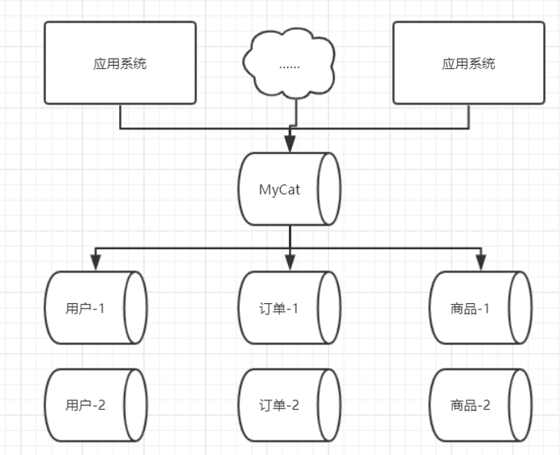
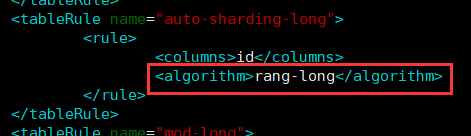
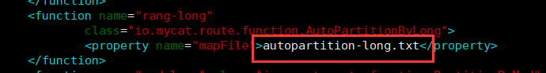
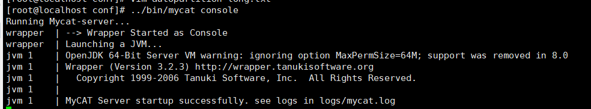
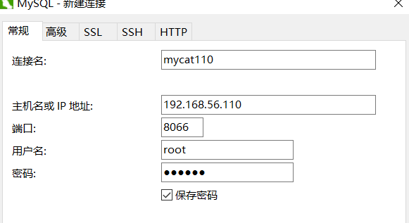
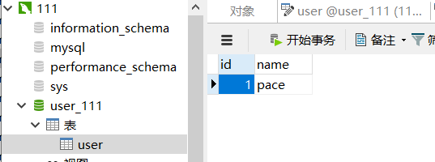

# 数据库分库分表

## 什么是分库分表

随着业务的发展，客户数量越来越多，数据量也会越来愈大，海量数据存储在一个数据库中，必然会出现性能瓶颈，单机情况下，扩展也非常困难。

为了解决这一问题，出现了分库分表这个概念，使用一些第三方中间件，实现将一个数据库中的数据，切分到多个数据库中存储。对于如何切分，是重中之重。

切分分为垂直切分和水平切分

### 垂直切分

**垂直切分就是按照业务逻辑切分**，将不同业务所使用的表，切分到不同的数据库中，如下图：



垂直切分一定要考虑的就是各个业务，功能模块独立统一，减少交互，耦合度低，这样使用垂直切分就相对容易。

但是也会有问题，比如上面的图，如果需求要我们查询某个商品产生了多少订单，就会出现**跨数据库连接**的问题，这种跨数据库是非常影响性能的，只能通过调用接口来获取数据后再进行维度查询，但是这样会对业务复杂度增加。

所以，对于系统架构人员需要进行平衡。

**优点**

- 拆分后业务清晰，规则清晰
- 系统更容易扩展和整合
- 数据维护简单

**缺点**

- 部分业务需要跨库join，接口调用，增加复杂度
- 跨库事务难以处理
- 垂直切分后，某些业务的数据还是很庞大，仍存在单体瓶颈

### 水平切分

**水平切分就是将某个大表中的数据切分**，保存到多张表中，比如订单表，订单尾号奇数偶数切分放到不同的表中，根据不同的规则，将某张表进行切分。


在做水平切分时，需要特别关注按什么维度切分！比如上面说的奇数偶数切分，但是如果需求是要某个用户下所有订单，那么就需要从表1和表2分别取这个用户的订单，再进行整合。

所以水平切分最重要的是维度的选择，也是真正考验架构师的时候。

**优点**

- 解决单体瓶颈
- 拆分规则封装性好，开发人员无需关心拆分细节
- 提高系统稳定性和负载能力

**缺点**

- 仍存在分片事务一致性问题
- 拆分规则很难规定
- 二次拓展时，数据迁移维护难度大

### 总结

分库分表有利有弊，但最终肯定还是利大于弊，我们需要完全的考虑问题，并想出解决方案，不管是水平还是垂直，都具有的缺点有：

- 分布式事务问题
- 跨库join问题
- 多数据源管理问题

而针对多数据管理问题，很多第三方中间件都提出了解决方案，主要有以下两种

- 客户端模式：每个应用中，配置自己需要的数据源，**使用jar包中的API直接访问数据库**，在模块内完成数据整合，Sharding-jdbc
- 中间件模式：由中间件代理掌管所有数据源，**只需请求中间件**，开发人员无需关注拆分细节，直接使用，如MyCat

## 什么是读写分离

我们知道，在应用层当并发压力大时，为解决单点故障，我们使用集群部署应用，即分布式。

那么数据库可以实现直接扩展吗？不可以，因为如果直接扩展，应用层不知道是从DB1还是DB2去读取数据。

这时就有了读写分离数据库的概念：



比如分出三台数据库服务器，一台用于写操作，两台用于读操作，写数据库会将数据同步给读数据库。

那么这种解决方案是不是都适用呢？

不是，需要考虑**同步服务挂掉或同步延迟过大**的问题，如果挂掉，会导致读出来的数据还是原来的数据，对于一些需要实时的业务，危害是特别大的，就比如支付操作，支付完应该将订单状态改为已支付，如果还是原来的未支付状态，必然会遭到用户大量投诉。

所以，**读写分离适用于数据实时性要求不高的场景**。

## MyCat

### 简单介绍

MyCat是一个开源的分布式数据库中间件，对于我们来说，只需知道他可以方便的管理分库分表，当我们想要请求分库分表后的数据表时，只需请求MyCat，它会形成一种代理，请求到实际应该请求的数据库上。



MyCat应用场景很多：

- 读写分离，支持主从切换
- 分库分表
- 大数据分析
- 多租户应用

对于我们的学习来说，需要学习的功能是读写分离和分库分表。

### 基础概念

- 逻辑库：由一个或多个数据库组成的集群，叫逻辑库，开发人员只需知道有一个数据库连接的概念，无需知道这个数据库被拆分成什么样
- 逻辑表：读写数据的表就是逻辑表，
- 分片节点：大数据表被水平切分后，每个分片表所在的数据库即分片节点
- 节点主机：拥有多个分片表的数据库为节点主机，其承担的压力更大
- 分片规则：分片的规则
- 全局序列号：当数据表被切分后，id的处理是一个问题，所以会有全局序列号的概念，用来保证数据唯一性

### 环境搭建

我们需要2台虚拟机安装Mysql，1台虚拟机安装MyCat。

安装jdk

```
yum -y install java-1.8.0-openjdk*
```

对于Mysql的安装，可以参考[官方文档](https://dev.mysql.com/doc/refman/8.0/en/linux-installation-yum-repo.html)

主要步骤：

```
https://dev.mysql.com/downloads/repo/yum/ 下载yum包放到linux上
yum install mysql80-community-release-el7-3.noarch.rpm 安装
yum install mysql-community-server
service mysqld start 启动
grep 'temporary password' /var/log/mysqld.log 查看密码
mysql -uroot -p 登录

ALTER USER 'root'@'localhost' IDENTIFIED BY 'Pace@1234'; 修改密码
create user 'pace'@'%' identified with mysql_native_password by 'Pace@1234'; 创建用户
grant all on *.* to 'pace'@'%'; 授权
flush privileges; 刷新
```

安装MyCat

下载安装包，http://www.mycat.org.cn/，我使用1.6.7.3版本，下载完毕后放到虚拟机上。

解压压缩包 `tar -zvxf Mycat-server-1.6.7.3-release-20190828135747-linux.tar.gz`

即安装完毕

新建数据库与表


### 快速入门

环境搭建完毕后，就可以配置MyCat来快速体验MyCat了，作为中间件的他可以方便的管理数据库集群，并且对于开发人员来说是透明的，我们只需要连接MyCat使用即可，就像之前使用单机Mysql一样。

**修改server.xml配置文件**

主要修改用户信息，其中的schemas逻辑库

```xml
<user name="root" defaultAccount="true">
    <property name="password">123456</property>
    <property name="schemas">user</property>

    <!-- 表级 DML 权限设置 -->
    <!--            
                <privileges check="false">
                        <schema name="TESTDB" dml="0110" >
                                <table name="tb01" dml="0000"></table>
                                <table name="tb02" dml="1111"></table>
                        </schema>
                </privileges>           
                 -->
</user>

<user name="user">
    <property name="password">user</property>
    <property name="schemas">user</property>
    <property name="readOnly">true</property>
</user>
```

**修改schemas.xml配置文件**

```xml
<?xml version="1.0"?>
<!DOCTYPE mycat:schema SYSTEM "schema.dtd">
<mycat:schema xmlns:mycat="http://io.mycat/">
    
    <!-- 修改逻辑库名称，和server.xml中对应 -->
    <schema name="user" checkSQLschema="true" sqlMaxLimit="100">
        <!-- auto sharding by id (long) -->
        <!-- 分片表 分片规则先使用默认的 -->
        <table name="user" dataNode="dn1,dn2" rule="auto-sharding-long" />

    </schema>
    
    
    <!-- dataHost即配置的name，database数据库中哪个库-->
    <dataNode name="dn1" dataHost="db111" database="user_111" />
    <dataNode name="dn2" dataHost="db112" database="user_112" />
    
    <dataHost name="db111" maxCon="1000" minCon="10" balance="0"
              writeType="0" dbType="mysql" dbDriver="native" switchType="1"  slaveThreshold="100">
        <heartbeat>select user()</heartbeat>
        <!-- can have multi write hosts -->
        <writeHost host="hostM1" url="192.168.56.111:3306" user="pace"
                   password="Pace@1234">
            <!-- can have multi read hosts -->
            <!--<readHost host="hostS2" url="192.168.1.200:3306" user="root" password="xxx" />-->
        </writeHost>
        <!-- <writeHost host="hostM2" url="localhost:3316" user="root" password="123456"/> -->
    </dataHost>
    <dataHost name="db112" maxCon="1000" minCon="10" balance="0"
              writeType="0" dbType="mysql" dbDriver="native" switchType="1"  slaveThreshold="100">
        <heartbeat>select user()</heartbeat>
        <writeHost host="hostM1" url="192.168.56.112:3306" user="pace"
                   password="Pace@1234">
        </writeHost>
    </dataHost>
</mycat:schema>

```

主要就是把我们数据库信息，以及使用的database，table配置上去

**修改规则**

因为我们使用的默认分片规则，查看一下规则配置文件rule.xml



分片字段为id，使用分片方法为rang-long，我们再去查询这个方法



会发现具体分片规则在这个文本中，在conf目录下查看这个文本

```txt
# range start-end ,data node index
# K=1000,M=10000.
0-500M=0
500M-1000M=1
# 有三个节点，因为我们只有两个节点，所以会报错，我们只需将最后一个节点注释掉即可
# 1000M-1500M=2
```

**启动MyCat**

../bin/mycat console (控制台启动，会打印日志)

../bin/mycat start （后台启动）



启动成功后，就可以使用Navicat测试使用



注意端口是8066，切需要关闭防火墙。

连接成功后，测试向数据库表插入一条数据

```sql
INSERT INTO `user` (id,`name`) VALUES (1,'pace');
```

插入成功后，我们会发现mycat中的表具有一条数据，并且111那个服务器的数据库也有一条数据



实际数据是存在111服务器上，mycat只是进行展示，而根据分片规则，id在0-5000000数据都会存在node0，即111节点，也印证分库分表成功。

### MyCat配置

MyCat主要分为server配置和schema配置

对于server配置来说，最重要的是用户的配置

```xml
<user name="root" defaultAccount="true">
    <property name="password">123456</property>
    <property name="schemas">user</property>
</user>

<user name="user">
    <property name="password">user</property>
    <property name="schemas">user</property>
    <property name="readOnly">true</property>
</user>
```

用户配置里名称密码，还有就是schemas的配置，这里schemas要和schema.xml中的名称一样。

**schema配置**

`datahost`：配置数据主机

```xml
<!-- name 节点名称，之后要在dataNode中使用
 	maxCon，minCon：最大最小连接时间
	balance：用于控制select请求往写节点（writeHost）还是读节点（readHost）发送
		0：默认配置，只向写节点发送
		1：当配置2个MS时，向M2，S1，S2发送，不发送给M1
		2：读写节点随机发送
		3：配置多个主从时，随机向读节点发送
	writeType：配置多个写节点时的负载规则
		0：默认，只向第一个节点发送，当第一个宕机后，才会发向第二个
		1：随机发送，1.5后废弃了
	switchType：主从切换配置
		1：自动切换
		2：基于Mysql主从状态切换
-->
<dataHost name="db111" maxCon="1000" minCon="10" balance="0"
          writeType="0" dbType="mysql" dbDriver="native" switchType="1"  slaveThreshold="100">
    <!-- 心跳检测 -->
    <heartbeat>select user()</heartbeat>
    <!-- 写节点 -->
    <writeHost host="hostM1" url="192.168.56.111:3306" user="pace"
               password="Pace@1234">
        <!-- 读节点 -->
        <!--<readHost host="hostS2" url="192.168.1.200:3306" user="root" password="xxx" />-->
    </writeHost>
    <!-- 多个写节点配置 -->
    <!-- <writeHost host="hostM2" url="localhost:3316" user="root" password="123456"/> -->
</dataHost>
 <!-- 多个数据节点 -->
<dataHost name="db112" maxCon="1000" minCon="10" balance="0"
          writeType="0" dbType="mysql" dbDriver="native" switchType="1"  slaveThreshold="100">
    <heartbeat>select user()</heartbeat>
    <writeHost host="hostM1" url="192.168.56.112:3306" user="pace"
               password="Pace@1234">
    </writeHost>
</dataHost>
```

`dataNode`：配置数据节点，用于选择数据库中的哪个database进行连接

```xml
<!-- dataHost即配置的name，database数据库中哪个库
	name会在schema上使用 -->
<dataNode name="dn1" dataHost="db111" database="user_111" />
<dataNode name="dn2" dataHost="db112" database="user_112" />
```

`schema`：逻辑库配置，主要用于配置分片表以及分片规则

```xml
<!-- name：修改逻辑库名称，和server.xml中对应
 	checkSQLschema：每次查询会检测database
	sqlMaxLimit：每次select查询，limit条数，防止数据过多影响性能-->
<schema name="user" checkSQLschema="true" sqlMaxLimit="100">
    <!-- auto sharding by id (long) -->
    <!-- 分片表 分片规则
 		name：表名
		dataNode：数据节点选择
		rule：分片规则的选择，与rule.xml中的tableRule对应 -->
    <table name="user" dataNode="dn1,dn2" rule="auto-sharding-long" />
</schema>
```


