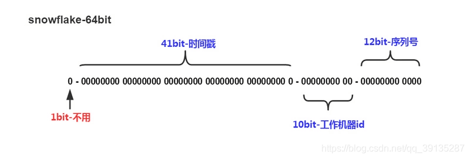

# 分布式全局ID

## 为什么需要分布式全局ID

在我们之前学习了分库分表来实现对数据库层面的优化，使其能承担更大的数据量满足业务的需求。

但是我们必须考虑一个问题就是ID的问题，现阶段大多数ID都是使用的数据库自增的方式，即从某个数开始进行累加。

那么当数据分片时，数据落到不同的分片，还会继续自增，必然会出现ID重复混乱的问题。

所以分布式全局ID，就是为了解决这么一个问题，提出的一些解决方案。

主要有：

- 使用UUID

- 雪花算法

## 使用UUID

UUID使用方式都很熟悉了，其特点是保证不唯一的32位字符串。

对于**MyCat来说，不支持**使用UUID的方式进行分片，而**Sharding-jdbc**是支持的。

Sharding-jdbc配置与分片类的编写如下：

```java
public class MySharding implements PreciseShardingAlgorithm<String>{
    @Override
    public String doSharding(Collection<String> availableTargetNames,PreciseShardingValue<String> shardingValue){
        // 获取ID
        String id = shardingValue.getValue();
        
        // 对ID进行取模，模为节点数量
        int mode = Math.abs(id.hashCode() % availableTargetNames.size());
        // 分片的节点
        String[] strings = availableTargetNames.toArray(new String[0]);
        
        
        // 返回第几个节点
        return strings[mode];
    }
}
```

编写完自己的分片类后，就可以去application.properties中配置分片规则

```properties
spring.shardingsphere.sharding.tables.t_order.table-strategy.standard.sharding-column=order_id
spring.shardingsphere.sharding.tables.t_order.table-strategy.standard.precise-algorithm-class-name=com.pacee1.sharding.MySHarding
spring.shardingsphere.sharding.tables.t_order.key-generator.column=order_id
spring.shardingsphere.sharding.tables.t_order.key-generator.type=UUID
```

这样既可在插入数据时，自动生成UUID作为ID，并且自动分片到不同的数据节点上

**优缺点**

- 唯一性，不重复
- 实现简单
- 每个ID无意义，无法排序
- 32位字符串，占用空间大，大数据查询影响性能

## 雪花算法

### 简介

每一片雪花都是不重复的，所以雪花算法的意思就是生成的ID都是独一无二的。



他是由64bit大小的纯数字组成，组成如上图

- 1bit的无效位，固定为0
- 41位的时间戳，可以用来排序，41位最多可以保存69年
- 10位的机器id，用来确定在哪一个数据节点保存，这样就避免了自增主键在不同节点会重复的问题。
  - 一般情况下，5位标识机器ID
  - 5位标识数据中心ID
- 12位的序列号，自增ID，可以保证同一节点同一毫秒生成多个ID序号，12位序列号，支持每个节点每毫秒产生4096个序号

### 具体实现

雪花算法生成ID，最主要的就是工作机器ID的生成，这里我使用的解决方案为：

- 机器ID即workId，使用hostName生成
- 数据中心ID即dataCenterID使用IP生成

```java
package com.my.blog.website.utils;
 
import org.apache.commons.lang3.RandomUtils;
import org.apache.commons.lang3.StringUtils;
import org.apache.commons.lang3.SystemUtils;
 
import java.net.Inet4Address;
import java.net.UnknownHostException;
 
/**
 * Twitter_Snowflake<br>
 * SnowFlake的结构如下(每部分用-分开):<br>
 * 0 - 0000000000 0000000000 0000000000 0000000000 0 - 00000 - 00000 - 000000000000 <br>
 * 1位标识，由于long基本类型在Java中是带符号的，最高位是符号位，正数是0，负数是1，所以id一般是正数，最高位是0<br>
 * 41位时间截(毫秒级)，注意，41位时间截不是存储当前时间的时间截，而是存储时间截的差值（当前时间截 - 开始时间截)
 * 得到的值），这里的的开始时间截，一般是我们的id生成器开始使用的时间，由我们程序来指定的（如下下面程序IdWorker类的startTime属性）。41位的时间截，可以使用69年，年T = (1L << 41) / (1000L * 60 * 60 * 24 * 365) = 69<br>
 * 10位的数据机器位，可以部署在1024个节点，包括5位datacenterId和5位workerId<br>
 * 12位序列，毫秒内的计数，12位的计数顺序号支持每个节点每毫秒(同一机器，同一时间截)产生4096个ID序号<br>
 * 加起来刚好64位，为一个Long型。<br>
 * SnowFlake的优点是，整体上按照时间自增排序，并且整个分布式系统内不会产生ID碰撞(由数据中心ID和机器ID作区分)，并且效率较高，经测试，SnowFlake每秒能够产生26万ID左右。
 */
public class SnowflakeIdWorker {
 
    // ==============================Fields===========================================
    /** 开始时间截 (2015-01-01) */
    private final long twepoch = 1489111610226L;
 
    /** 机器id所占的位数 */
    private final long workerIdBits = 5L;
 
    /** 数据标识id所占的位数 */
    private final long dataCenterIdBits = 5L;
 
    /** 支持的最大机器id，结果是31 (这个移位算法可以很快的计算出几位二进制数所能表示的最大十进制数) */
    private final long maxWorkerId = -1L ^ (-1L << workerIdBits);
 
    /** 支持的最大数据标识id，结果是31 */
    private final long maxDataCenterId = -1L ^ (-1L << dataCenterIdBits);
 
    /** 序列在id中占的位数 */
    private final long sequenceBits = 12L;
 
    /** 机器ID向左移12位 */
    private final long workerIdShift = sequenceBits;
 
    /** 数据标识id向左移17位(12+5) */
    private final long dataCenterIdShift = sequenceBits + workerIdBits;
 
    /** 时间截向左移22位(5+5+12) */
    private final long timestampLeftShift = sequenceBits + workerIdBits + dataCenterIdBits;
 
    /** 生成序列的掩码，这里为4095 (0b111111111111=0xfff=4095) */
    private final long sequenceMask = -1L ^ (-1L << sequenceBits);
 
    /** 工作机器ID(0~31) */
    private long workerId;
 
    /** 数据中心ID(0~31) */
    private long dataCenterId;
 
    /** 毫秒内序列(0~4095) */
    private long sequence = 0L;
 
    /** 上次生成ID的时间截 */
    private long lastTimestamp = -1L;
 
    private static SnowflakeIdWorker idWorker;
 
    static {
        idWorker = new SnowflakeIdWorker(getWorkId(),getDataCenterId());
    }
 
    //==============================Constructors=====================================
    /**
     * 构造函数
     * @param workerId 工作ID (0~31)
     * @param dataCenterId 数据中心ID (0~31)
     */
    public SnowflakeIdWorker(long workerId, long dataCenterId) {
        if (workerId > maxWorkerId || workerId < 0) {
            throw new IllegalArgumentException(String.format("workerId can't be greater than %d or less than 0", maxWorkerId));
        }
        if (dataCenterId > maxDataCenterId || dataCenterId < 0) {
            throw new IllegalArgumentException(String.format("dataCenterId can't be greater than %d or less than 0", maxDataCenterId));
        }
        this.workerId = workerId;
        this.dataCenterId = dataCenterId;
    }
 
    // ==============================Methods==========================================
    /**
     * 获得下一个ID (该方法是线程安全的)
     * @return SnowflakeId
     */
    public synchronized long nextId() {
        long timestamp = timeGen();
 
        //如果当前时间小于上一次ID生成的时间戳，说明系统时钟回退过这个时候应当抛出异常
        if (timestamp < lastTimestamp) {
            throw new RuntimeException(
                    String.format("Clock moved backwards.  Refusing to generate id for %d milliseconds", lastTimestamp - timestamp));
        }
 
        //如果是同一时间生成的，则进行毫秒内序列
        if (lastTimestamp == timestamp) {
            sequence = (sequence + 1) & sequenceMask;
            //毫秒内序列溢出
            if (sequence == 0) {
                //阻塞到下一个毫秒,获得新的时间戳
                timestamp = tilNextMillis(lastTimestamp);
            }
        }
        //时间戳改变，毫秒内序列重置
        else {
            sequence = 0L;
        }
 
        //上次生成ID的时间截
        lastTimestamp = timestamp;
 
        //移位并通过或运算拼到一起组成64位的ID
        return ((timestamp - twepoch) << timestampLeftShift)
                | (dataCenterId << dataCenterIdShift)
                | (workerId << workerIdShift)
                | sequence;
    }
 
    /**
     * 阻塞到下一个毫秒，直到获得新的时间戳
     * @param lastTimestamp 上次生成ID的时间截
     * @return 当前时间戳
     */
    protected long tilNextMillis(long lastTimestamp) {
        long timestamp = timeGen();
        while (timestamp <= lastTimestamp) {
            timestamp = timeGen();
        }
        return timestamp;
    }
 
    /**
     * 返回以毫秒为单位的当前时间
     * @return 当前时间(毫秒)
     */
    protected long timeGen() {
        return System.currentTimeMillis();
    }
 
    // 生成机器ID，由IP生成
    private static Long getWorkId(){
        try {
            String hostAddress = Inet4Address.getLocalHost().getHostAddress();
            int[] ints = StringUtils.toCodePoints(hostAddress);
            int sums = 0;
            for(int b : ints){
                sums += b;
            }
            return (long)(sums % 32);
        } catch (UnknownHostException e) {
            // 如果获取失败，则使用随机数备用
            return RandomUtils.nextLong(0,31);
        }
    }
 
    // 生成数据中心ID，由hostName生成
    private static Long getDataCenterId(){
        int[] ints = StringUtils.toCodePoints(SystemUtils.getHostName());
        int sums = 0;
        for (int i: ints) {
            sums += i;
        }
        return (long)(sums % 32);
    }
 
 
    /**
     * 静态工具类
     *
     * @return
     */
    public static synchronized Long generateId(){
        long id = idWorker.nextId();
        return id;
    }
 
    //==============================Test=============================================
    /** 测试 */
    public static void main(String[] args) {
        System.out.println(System.currentTimeMillis());
        long startTime = System.nanoTime();
        for (int i = 0; i < 50000; i++) {
            long id = SnowflakeIdWorker.generateId();
            System.out.println(id);
        }
        System.out.println((System.nanoTime()-startTime)/1000000+"ms");
    }
}
```

### 优点

- 使用雪花算法生成的ID具有规则，可以进行排序等操作
- 生成算法封装好后，ID生成简单
- 占用资源小，效率高