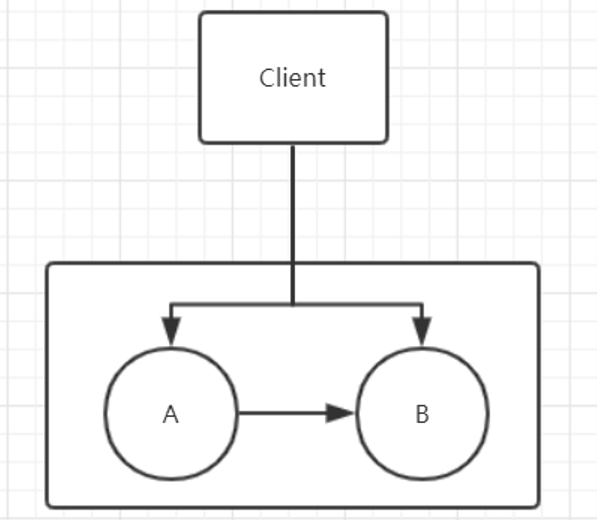

# 分布式事务

## CAP原理

对于分布式事务，我们第一个想到的就应该是CAP，那么CAP是什么呢？

- C-Consistent ：一致性，对于数据的增删改操作成功后，所有分布式数据节点在同一时间看到的数据都是一致的。一致性指的是数据一致性
- A-Availability ：可用性，服务可用，在规定的时间内完成响应。
- P-Partition tolerance：分区容错性，就是分布式必要的属性，当某个应用节点挂掉时，可用保证应用仍然可用，即分布式部署应用。

我们不可能同时满足三个属性，在分布式架构中，我们需要从AP和CP中选择一种。

**为什么P是必须要的呢？**

因为我们为了当某个节点挂掉，应用服务仍可用，才将架构升级成分布式架构，而这一点也就是P属性，所以我们必须满足P。如果不满足P，那么也不能称作分布式系统了。

**为什么CAP不能同时存在？**

既然P必须满足，为什么A和C不能同时满足呢？我们看下图：

AB是两个数据节点，A向B同步数据，并同时为客户端提供服务。已经确定P是满足的。

- 满足C一致性，那么当A和B数据同步出现问题时，即此时两个数据不同，那么就需要等待数据同步恢复，使其一致，才对外提供服务，这样就不满足A

- 满足A可用性，即A和B同步出现问题时，客户端仍然能访问我们的系统，那么A和B此时数据就是不同的，不满足一致性C

所以A和C在分布式系统中无法同时满足。

## ACID与BASE

关系型数据库中，事务处理遵循ACID理论。即

- A：原子性，一个事务里的操作要么全成功要么全不成功
- C：一致性，事务前数据与之后的数据要保持一致
- I：隔离性，事物间操作不互相干扰
- D：持久性：事务一旦被提交就是永久的改变

ACID保证的是完全一致性，也就是CAP中的CA。这也是关系型数据库里最鲜明的特点。但是他并不适用于分布式系统中，通过上面的介绍，分布式系统是从AP和CP中选择，因此，引出了BASE理论。

BASE是Basically Available（基本可用）, Soft-state（软状态）, Eventually consistent（最终一致）的缩写。

- BA：分布式系统出现故障时，允许损失部分功能可用性，来满足核心功能的可用性。就像淘宝双十一，下单操作同时进行，部分用户可能会被引导到下级页面，而另外的成功下单，即熔断限流降级操作。
- S：分布式系统中存在中间状态，中间状态不影响系统的使用。比如数据同步，一份数据一般都会有多个副本，我们允许不同节点间，其副本的延时同步，就是软状态的体现、
- E：即系统中数据，在一段时间后实现最终一致，而不要求在同一时间数据必须一致。

在分布式事务的解决方案中，它们都是依赖了ACID或者BASE的模型而实现的。像基于XA协议的两阶段提交和实物补偿机制就是基于ACID实现的。而基于本地消息表和基于MQ的最终一致方案都是通过BASE原理实现的。