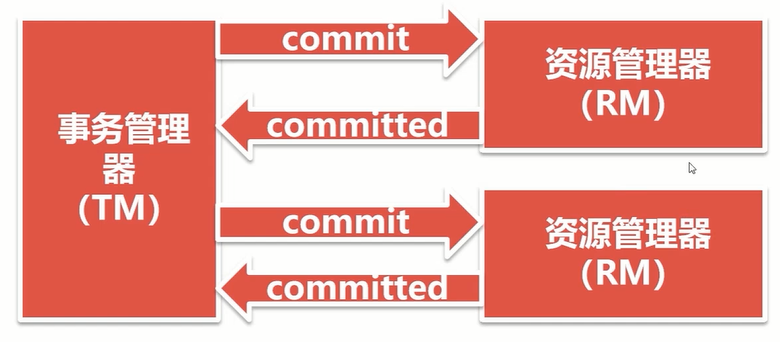
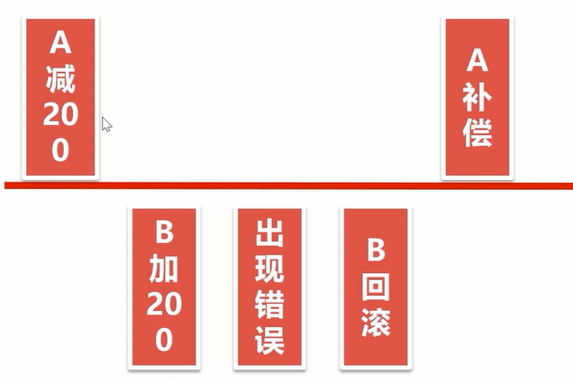
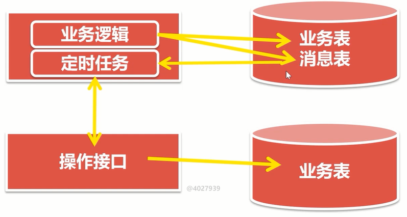
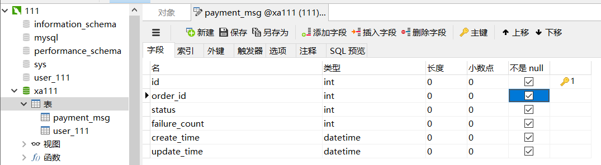
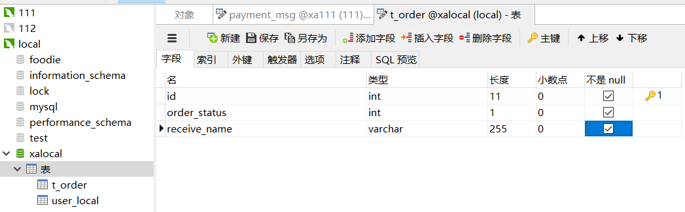

# 分布式事务

## CAP原理

对于分布式事务，我们第一个想到的就应该是CAP，那么CAP是什么呢？

- C-Consistent ：一致性，对于数据的增删改操作成功后，所有分布式数据节点在同一时间看到的数据都是一致的。一致性指的是数据一致性
- A-Availability ：可用性，服务可用，在规定的时间内完成响应。
- P-Partition tolerance：分区容错性，就是分布式必要的属性，当某个应用节点挂掉时，可用保证应用仍然可用，即分布式部署应用。

我们不可能同时满足三个属性，在分布式架构中，我们需要从AP和CP中选择一种。

**为什么P是必须要的呢？**

因为我们为了当某个节点挂掉，应用服务仍可用，才将架构升级成分布式架构，而这一点也就是P属性，所以我们必须满足P。如果不满足P，那么也不能称作分布式系统了。

**为什么CAP不能同时存在？**

既然P必须满足，为什么A和C不能同时满足呢？我们看下图：


AB是两个数据节点，A向B同步数据，并同时为客户端提供服务。已经确定P是满足的。

- 满足C一致性，那么当A和B数据同步出现问题时，即此时两个数据不同，那么就需要等待数据同步恢复，使其一致，才对外提供服务，这样就不满足A

- 满足A可用性，即A和B同步出现问题时，客户端仍然能访问我们的系统，那么A和B此时数据就是不同的，不满足一致性C

所以A和C在分布式系统中无法同时满足。

## ACID与BASE

关系型数据库中，事务处理遵循ACID理论。即

- A：原子性，一个事务里的操作要么全成功要么全不成功
- C：一致性，事务前数据与之后的数据要保持一致
- I：隔离性，事物间操作不互相干扰
- D：持久性：事务一旦被提交就是永久的改变

ACID保证的是完全一致性，也就是CAP中的CA。这也是关系型数据库里最鲜明的特点。但是他并不适用于分布式系统中，通过上面的介绍，分布式系统是从AP和CP中选择，因此，引出了BASE理论。

BASE是Basically Available（基本可用）, Soft-state（软状态）, Eventually consistent（最终一致）的缩写。

- BA：分布式系统出现故障时，允许损失部分功能可用性，来满足核心功能的可用性。就像淘宝双十一，下单操作同时进行，部分用户可能会被引导到下级页面，而另外的成功下单，即熔断限流降级操作。
- S：分布式系统中存在中间状态，中间状态不影响系统的使用。比如数据同步，一份数据一般都会有多个副本，我们允许不同节点间，其副本的延时同步，就是软状态的体现、
- E：即系统中数据，在一段时间后实现最终一致，而不要求在同一时间数据必须一致。

在分布式事务的解决方案中，它们都是依赖了ACID或者BASE的模型而实现的。像基于XA协议的两阶段提交和实物补偿机制就是基于ACID实现的。而基于本地消息表和基于MQ的最终一致方案都是通过BASE原理实现的。

## 分布式事务的问题

为什么事务这个问题需要单独拿出来说呢？

在单机环境中，我们只使用一个数据库，所以事务问题完全可以交由数据库来管理，也就是上面说的CA理论。但是通过分库分表来解决数据库压力，进而提升性能后，就需要考虑分布式事务的问题。因为数据库有多个，每个数据库事务只能管自己的，当一个业务逻辑操作需要修改订单库和商品库的数据，就无法单单使用单纯的数据库自带的事务来解决问题。因为如果一个插入失败，只会回滚本事，订单创建了，但是商品没有扣减库存。

所以我们需要解决方案，来解决这个问题，将不同数据库的操作，可以统一进行事务管理，提交回滚。

解决方案很多，各有各的好处，我们主要介绍以下几种：

- XA两阶段提交
- 事务补偿机制
- 基于本地消息表与定时任务实现最终一致性
- 基于MQ消息队列实现最终一致性

## XA两阶段提交

XA两阶段提交是很早提出的一种分布式事务的解决方案，主要有事务管理器（TM）和多个资源管理器（RM）组成。

两阶段的意思就是提交一个事务分为两个阶段，prepare和commit阶段。

### 实现原理

具体就是由TM来控制RM们的事务提交，分为两个阶段，如下

第一阶段：


TM发出准备命令，RM进行一些操作，成功后回复ready，表示成功。如果有某个RM发生错误，就会返回错误信息，TM就会对所有操作进行回滚。

第二阶段：



由TM统一发送事务提交命令，RM提交后，返回提交成功与否的状态。如果有失败，就需要人工介入提交失败的事务，因为一方已经commit就无法使用程序回滚了，必须人工介入。

**XA实现特点**

- 保证数据强一致性
- commit阶段出现问题时，需要人工介入处理事务不一致问题。
- 效率低下，普通数据库事务差10倍

### 具体实现

主要使用`atomikos`实现

前提：创建好两个数据库，数据源，数据表来进行测试，使用generactor生成mapper，model类。

配置数据源，并使用Atomikos管理：这里我使用一个本地数据库，一个111虚拟机上的服务器

DBLocal：这里图省事直接将JTA事务管理器配置在这里了，只需配置一个即可

```java
@Configuration
@MapperScan(value = "com.enbuys.studytransaction.dblocal.dao",sqlSessionFactoryRef = "sqlSessionFactoryBeanLocal")
public class DBConfigLocal {

    /**
     * 配置数据源，使用Atomikos控制，即TM
     * @return
     */
    @Bean("dbLocal")
    public DataSource dbLocal(){
        MysqlXADataSource xaDataSource = new MysqlXADataSource();
        xaDataSource.setUser("root");
        xaDataSource.setPassword("");
        xaDataSource.setUrl("jdbc:mysql://localhost:3306/xalocal?serverTimezone=UTC");

        // 通过Atomikos数据源
        AtomikosDataSourceBean atomikosDataSourceBean = new AtomikosDataSourceBean();
        atomikosDataSourceBean.setXaDataSource(xaDataSource);
        atomikosDataSourceBean.setUniqueResourceName("dbLocal");
        atomikosDataSourceBean.setPoolSize(5);

        return atomikosDataSourceBean;
    }


    @Bean("sqlSessionFactoryBeanLocal")
    public SqlSessionFactoryBean sqlSessionFactoryBean(@Qualifier("dbLocal") DataSource dataSource) throws IOException {
        SqlSessionFactoryBean sqlSessionFactoryBean = new SqlSessionFactoryBean();
        sqlSessionFactoryBean.setDataSource(dataSource);
        ResourcePatternResolver resolver = new PathMatchingResourcePatternResolver();
        sqlSessionFactoryBean.setMapperLocations(resolver.getResources("mybatis/dblocal/*.xml"));
        return sqlSessionFactoryBean;
    }

    /**
     * JTA事务管理器
     * @return
     */
    @Bean("xaTransaction")
    public JtaTransactionManager jtaTransactionManager(){
        UserTransaction userTransaction = new UserTransactionImp();
        UserTransactionManager userTransactionManager = new UserTransactionManager();

        return new JtaTransactionManager(userTransaction,userTransactionManager);
    }
}

```

DB111：

```java
@Configuration
@MapperScan(value = "com.enbuys.studytransaction.db111.dao",sqlSessionFactoryRef = "sqlSessionFactoryBean111")
public class DBConfig111 {

    /**
     * 配置数据源，使用Atomikos控制，即TM
     * @return
     */
    @Bean("db111")
    public DataSource db111(){
        MysqlXADataSource xaDataSource = new MysqlXADataSource();
        xaDataSource.setUser("pace");
        xaDataSource.setPassword("Pace@1234");
        xaDataSource.setUrl("jdbc:mysql://192.168.56.111:3306/xa111?serverTimezone=UTC");

        // 通过Atomikos数据源
        AtomikosDataSourceBean atomikosDataSourceBean = new AtomikosDataSourceBean();
        atomikosDataSourceBean.setXaDataSource(xaDataSource);
        atomikosDataSourceBean.setUniqueResourceName("db111");
        atomikosDataSourceBean.setPoolSize(5);

        return atomikosDataSourceBean;
    }


    @Bean("sqlSessionFactoryBean111")
    public SqlSessionFactoryBean sqlSessionFactoryBean(@Qualifier("db111") DataSource dataSource) throws IOException {
        SqlSessionFactoryBean sqlSessionFactoryBean = new SqlSessionFactoryBean();
        sqlSessionFactoryBean.setDataSource(dataSource);
        ResourcePatternResolver resolver = new PathMatchingResourcePatternResolver();
        sqlSessionFactoryBean.setMapperLocations(resolver.getResources("mybatis/db111/*.xml"));
        return sqlSessionFactoryBean;
    }
}
```

Service测试类：

```java
@Service
public class XAService {

    @Resource
    private UserLocalMapper userLocalMapper;
    @Resource
    private User111Mapper user111Mapper;

    @Transactional(transactionManager = "xaTransaction")
    public void testXA(){
        UserLocal userLocal = new UserLocal();
        userLocal.setId(1);
        userLocal.setName("aaabb");

        User111 user111 = new User111();
        user111.setId(1);
        user111.setName("aaabb");


        user111Mapper.insert(user111);
        userLocalMapper.insert(userLocal);
    }
}
```

使用起来并不复杂，主要是数据源的配置。**具体业务操作时，只需在事务注解上指定使用JTA的事务管理器即可**。

## TCC事务补偿机制

事务补偿机制也是一种解决分布式事务的方案。

什么是事务补偿机制呢？就是针对每个操作，都编写一个对应的撤销（补偿）操作，当执行失败时，调用撤销操作，进行事务补偿。

举个例子：

A给B转账，AB存在不同的银行（数据库），既然是转账，那么A就要扣钱，B要加钱，当A出错时，即没有扣钱可以直接回滚不影响，但是当A扣钱成功，但是B的账号加钱失败时，就需要调用A的补偿接口，来进行事务补偿，即将A扣的钱加回去。



通过对事务补偿机制的描述，我们应该大致知道了如何实现该方案。

- 对于每个分布式事务操作，都需要编写对应的补偿接口
- 在业务上添加一个数据源的@Transaction接口
- 对于其他数据源的接口，只能通过try/catch中对补偿接口的调用，实现事务补偿

到此，我们不难发现这种方案的优缺点：

- 优点：逻辑清晰，操作简单
- 缺点：
  - 数据一致性比XA还要差，因为调用补偿接口时，也可能出现错误
  - TCC属于应用层补偿方式，程序员需要写大量补偿代码，增加压力

## 基于本地消息表

这种解决方案，主要是采用BASE原理，来保证数据的最终一致性。允许一段时间的数据不一致，从而实现数据最终一致。需要根据系统需求来决定是否可以使用该方案。

### 实现原理

在一段业务中，将**本事务外**的操作，全部记录在消息表中，其他的事务提供操作接口，定时任务轮训本地消息表，将未执行的消息发送给操作接口进行调用，操作成功返回成功标识，失败返回失败标识，定时任务更新消息状态。

举个例子，订单支付功能，当用户下订单后，需要跳转支付宝支付，这样就是两个不同的事务即分布式事务。支付成功后，支付宝会将成功消息保存到消息表并会定时回调商城的接口，保存该用户支付状态，此时如果执行回调接口失败了，支付宝会轮训发送消息，调用回调接口。对此，消息表，操作接口，定时任务就全部明朗了。

- 对于屡次失败的消息，可以设置最大失败次数
- 超出最大失败次数后，不再调用接口
- 等待人工处理

**图解**：



- 支付成功后，将支付记录保存到业务表，将需要调用的回调接口存到消息表
- 定时任务轮训获取消息表中未完成的消息，调用对应的操作接口
- 操作接口进行业务执行，将对应业务数据保存到业务表
- 执行完毕后，将执行成功或失败信息发送给定时任务
- 定时任务更新消息状态

**优缺点**：

- 优点：避免分布式事务，实现最终一致性
- 缺点：注意重试时的幂等性操作

### 具体实现

这里我们复用上面的例子，当支付成功后，将消息写入支付消息表，定时任务读取消息表，然后调用回调接口，回调接口将订单状态写入订单表。

#### 数据库设计

这里和XA一样，复用XA的数据库，即一个本地Mysql，一个虚拟机MySql

需要创建两张表，支付消息表，与订单表

这里我在虚拟机111上的数据库上，创建支付消息表：



在本地local数据库上，创建订单表：


并使用generator生成到Java工程中。

配置数据源，因为我们的事务只需配置消息表那个数据库，即111的，对于local数据库事务管理，使用消息定时任务调用，不需要配置。

111数据源：

```java
@Configuration
@MapperScan(value = "com.enbuys.studytransaction.db111.dao",sqlSessionFactoryRef = "sqlSessionFactoryBean111")
public class DBConfig111 {

    @Bean("db111")
    public DataSource db111(){
        MysqlXADataSource xaDataSource = new MysqlXADataSource();
        xaDataSource.setUser("pace");
        xaDataSource.setPassword("Pace@1234");
        xaDataSource.setUrl("jdbc:mysql://192.168.56.111:3306/xa111?serverTimezone=UTC");

        return xaDataSource;
    }

    @Bean("sqlSessionFactoryBean111")
    public SqlSessionFactoryBean sqlSessionFactoryBean(@Qualifier("db111") DataSource dataSource) throws IOException {
        SqlSessionFactoryBean sqlSessionFactoryBean = new SqlSessionFactoryBean();
        sqlSessionFactoryBean.setDataSource(dataSource);
        ResourcePatternResolver resolver = new PathMatchingResourcePatternResolver();
        sqlSessionFactoryBean.setMapperLocations(resolver.getResources("mybatis/db111/*.xml"));
        return sqlSessionFactoryBean;
    }

    /**
     * 事务管理器
     * @return
     */
    @Bean("transaction")
    public PlatformTransactionManager jtaTransactionManager(@Qualifier("db111") DataSource dataSource){
        return new DataSourceTransactionManager(dataSource);
    }
}
```

Local的数据源不需要事务管理器，并且其他的配置大相径庭，改一下文件夹等名称即可。

#### 消息与订单操作

支付成功，创建消息：

```java
@Service
public class PaymentService {

    @Resource
    private PaymentMsgMapper paymentMsgMapper;

    @Transactional("transaction")
    public int pay(int orderId){
        // 支付成功，向消息表插入一条记录
        PaymentMsg paymentMsg = new PaymentMsg();
        paymentMsg.setId(new Random().nextInt());
        paymentMsg.setOrderId(orderId);
        paymentMsg.setStatus(0); // 状态
        paymentMsg.setFailureCount(0); // 失败次数
        paymentMsg.setCreateTime(new Date());
        paymentMsg.setUpdateTime(new Date());

        int result = paymentMsgMapper.insert(paymentMsg);
        return result;
    }
}
```

修改订单状态：

```java
@Service
public class OrderService {

    @Resource
    private OrderMapper orderMapper;

    // 修改订单状态
    public int updateOrder(int orderId){
        // 支付成功，向消息表插入一条记录
        Order order = orderMapper.selectByPrimaryKey(orderId);
        order.setOrderStatus(1);

        return orderMapper.updateByPrimaryKeySelective(order);
    }
}

@RestController
public class OrderController {

    @Autowired
    private OrderService orderService;

    @GetMapping("/order/{id}")
    public String updateOrder(@PathVariable int id){
        try {
            int result = orderService.updateOrder(id);
            if(result != 1){
                return "fail";
            }
            return "success";
        }catch (Exception e){
            return "fail";
        }

    }
}
```

#### 定时任务

```java
@Service
public class OrderScheduler {

    @Resource
    private PaymentMsgMapper paymentMsgMapper;

    @Autowired
    private RestTemplate restTemplate;

    @Scheduled(cron = "0/10 * * * * ?")
    public void orderScheduler(){
        // 查询所有未发送的消息
        PaymentMsgExample paymentMsgExample = new PaymentMsgExample();
        paymentMsgExample.createCriteria().andStatusEqualTo(0);
        List<PaymentMsg> paymentMsgs = paymentMsgMapper.selectByExample(paymentMsgExample);
        if(paymentMsgs == null || paymentMsgs.size() ==0 ){
            return ;
        }
        // 循环未发送的消息，取orderId，调用修改订单状态接口
        for (PaymentMsg paymentMsg : paymentMsgs) {
            Integer orderId = paymentMsg.getOrderId();
            // 调用回调接口
            ResponseEntity<String> responseEntity = restTemplate.exchange("http://localhost:8080/order/" + orderId,
                    HttpMethod.GET, null, String.class);
            String result = responseEntity.getBody();
            // 如果成功，修改状态
            if(result.equals("success")){
                paymentMsg.setStatus(1);
                paymentMsgMapper.updateByPrimaryKeySelective(paymentMsg);
            }else {
                // 失败，增加失败次数，判断是否大于5次，大于5次修改状态为2
                Integer failureCount = paymentMsg.getFailureCount();
                failureCount++;
                if(failureCount > 5){
                    paymentMsg.setStatus(2);
                    paymentMsgMapper.updateByPrimaryKeySelective(paymentMsg);
                }else {
                    paymentMsg.setFailureCount(failureCount);
                    paymentMsgMapper.updateByPrimaryKeySelective(paymentMsg);
                }
            }
        }
    }
}
```

然后再启动器上添加`@EnableScheduling`注解