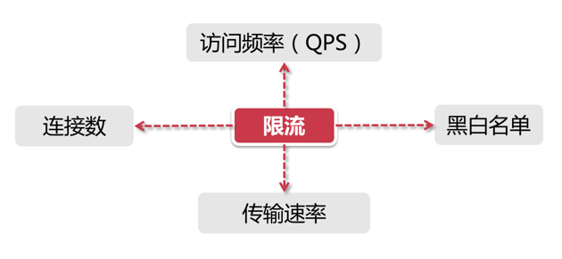
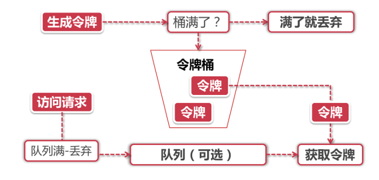
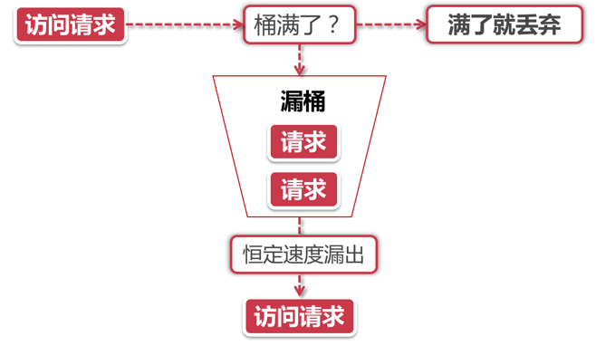
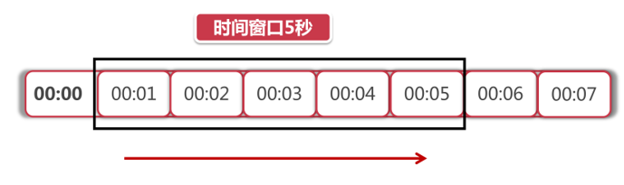
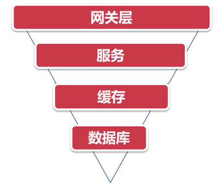

# 分布式限流

## 分布式限流介绍

### 什么是分布式限流

我们都坐过火车，都在12306买过火车票，当春运的时候，火车票很难抢，我们必须在他规定的时间发售时去抢票，可能对于这一时间点，因为列车只有那么多固定的座位，但是会有**大量的请求并发**过来，那么对于12306来说，怎么去抵挡这些流量，以致不导致系统的崩溃呢？看下面这张图：

验证码！当流量太多时，可以通过限流控制，**将一些请求直接舍弃**，这样可能实际进入我们服务的请求只有一半，但是对于舍弃的请求，我们又不能直接说明请求失败，你是淘汰者。12306就暗藏杀机的放出了图形验证码，让那些被淘汰的请求很难找出的图片又或者无论正确与否都返回验证失败。

这就是限流。

通过上面的介绍，我们知道了限流，**对于限流来说，也是有几种维度**，来进行限流的：

- 访问频率：就比如设定对此接口或服务来说，一秒只能接收100个请求，就是访问频率的限制
- 连接数：可以针对Ip进行限制，每个IP连接数小于5，也可以针对应用，所有连接数不大于200
- 传输速率：最经典的就是百度网盘，会员10m/s，非会员100kb/s，就是针对传输速率的限制
- 黑白名单：这个很好理解，比如某个IP在同一时间发出大量请求，就可以让应用将其加入黑名单，不接受任何此IP的请求，也就是传说中的封IP，白名单就是不管多少请求，都会一并接收。

我们之后要学习的**主要是QPS和连接数**维度

那么问题来了，**分布式限流**又是什么意思？

我们刚刚一直在介绍限流，最简单的限流就是单机版的限流，不需要考虑很多，只需要考虑限流规则即可，但是到了分布式环境，因为各应用间以及各集群节点间，在一个节点设置了限流规则，但是请求降落到别的节点，不就完全没有效果了吗？

所以分布式限流一定要一个中心化节点，这样就可以获取所有集群节点状态，有两个主流分布式限流方案：

- 网关层限流：将所有限流规则控制在流量的入口处
- 中间件限流：将限流信息保存到某个中间件中（Redis），可以更细粒度的进行限流，比如在某个接口上进行限流，并且可以根据每个节点不同的业务，来编写自定义的限流规则。

注意：限流方案不是单一的，是可以组合的，可以又在网关层限流，又实现中间件接口限流。

## 限流算法

所有的限流方案，都是依赖于算法的，底层都是一些相同的算法，进行修改。主流算法有以下几个

### 令牌桶算法

主要有两个角色：

- 令牌：获取到令牌的请求，才能处理，不然被丢弃或排队
- 令牌桶：用来存放令牌，有一定的容量，满了之后的令牌会被丢弃

主要的实现原理：

- 会有一个匀速生成令牌的令牌生成器，匀速的向令牌桶扔令牌
- 当请求进来后，会从令牌桶中获取令牌，获取到令牌的请求才会被处理，没有获取到令牌的有以下两种解决方案，按需求来实现
  - 直接丢弃
  - 设置一个队列，将其放到队列中，当令牌生成了，进行获取处理；当有请求进来时，判断队列是否存在，存在进入队列，不存在直接获取令牌；并且该队列可以实现优先队列即优先级自定义

### 漏铜算法

漏铜和令牌桶相似，又有不同

当请求进来后，直接放入桶中，桶会根据一个恒定的速率漏出请求来处理，比如1秒10个请求，当桶满了之后，将请求丢弃。也是很简单的算法。

我们可以发现漏铜和令牌桶很相似，区别在哪呢？

- 速率，一个是恒定的，一个是不固定的，对于漏铜来说，因为其恒定的速率，所以不会出现突然的并发流量；而令牌桶，因为可以预存令牌，所以会出现突发流量，消耗所有令牌，其突发流量处理效率会比漏桶高，但是导向后台系统的压力也会相应增多。各有各的好处，看业务需求选择。

### 滑动窗口

图中黑色的大框就是时间窗口，我们设定窗口时间为5秒，它会随着时间推移向后滑动。我们将窗口内的时间划分为五个小格子，每个格子代表1秒钟，同时这个格子还包含一个计数器，用来计算在当前时间内访问的请求数量。那么这个时间窗口内的总访问量就是所有格子计数器累加后的数值。

比如说，我们在第一秒内有5个用户访问，第5秒内有10个用户访问，那么在0到5秒这个时间窗口内访问量就是15。如果我们的接口设置了时间窗口内访问上限是20，那么当时间到第六秒的时候，这个时间窗口内的计数总和就变成了10，因为1秒的格子已经退出了时间窗口，因此在第六秒内可以接收的访问量就是20-10=10个。

滑动窗口其实也是一种计算器算法，它有一个显著特点，当时间窗口的跨度越长时，限流效果就越平滑。打个比方，如果当前时间窗口只有两秒，而访问请求全部集中在第一秒的时候，当时间向后滑动一秒后，当前窗口的计数量将发生较大的变化，拉长时间窗口可以降低这种情况的发生概率

## 分布式限流的主流方案

### Guava

Guava提供了一系列以RateLimiter为首的限流工具类，但是它只能应用于单机，并不适合于分布式，但我们可以通过它先学习一下限流算法。

### 网关层限流

网关服务就是承接所有用户请求的地方，经过我的校验才可以进去系统，所以也是非常好的实现限流的地方：

通过上图，我们可以知道请求的路径

- 先通过网关层校验，转发到后台服务
- 服务承接流量，调用缓存获取数据
- 缓存无数据，从数据库中获取数据

这样像漏斗一样一层层递进，可以使请求层层过滤，最后给数据库的压力就比较小了，因为数据库的并发承受能力是最差的，所以要照顾它、

如果我们需要限流，那么肯定是在网关层进行限流最好，因为他是所有流量中心，主流的网关层限流有Nginx，SpringCloud中Gateway以及Zuul。

因为我们是分布式阶段，所以优先学习Nginx进行网关层限流

### 中间件限流

针对网关层限流，他其实并不受控制，因为网关是一个大服务，不能随意去改动，如果想改什么，可能需要开发人员去请求运维或专业网关团队去修改，会让开发人员不舒服。

那么开发人员就说我们要掌控主权，那么就可以使用中间件限流，将请求信息放到中间件中，我们想在哪里限流，直接获取前一秒的流量数据进行判断即可。

那么谁来存储这些临时数据呢？那就是Redis咯，非你莫属，性能高并且并发量强并且可以设置超时时间。最重要的是什么，Redis与Lua脚本，我们可以编写合适的限流算法在Lua脚本中，让我们的中间件限流封装的更合理，使用更简单。

### 限流组件

就是SpringCloud中的Sentinel，我们会在后续微服务化时介绍。