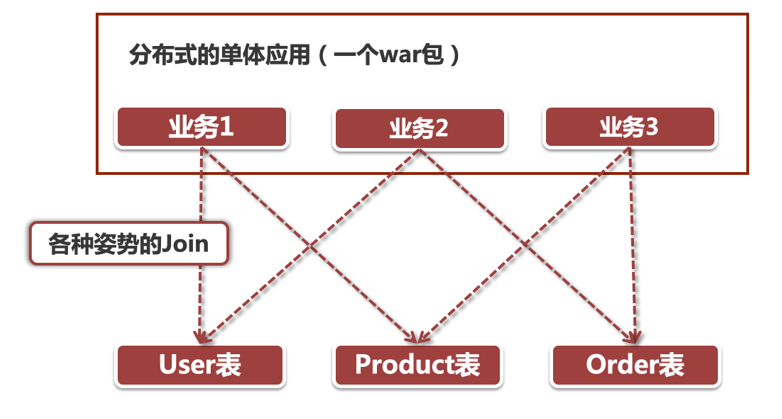
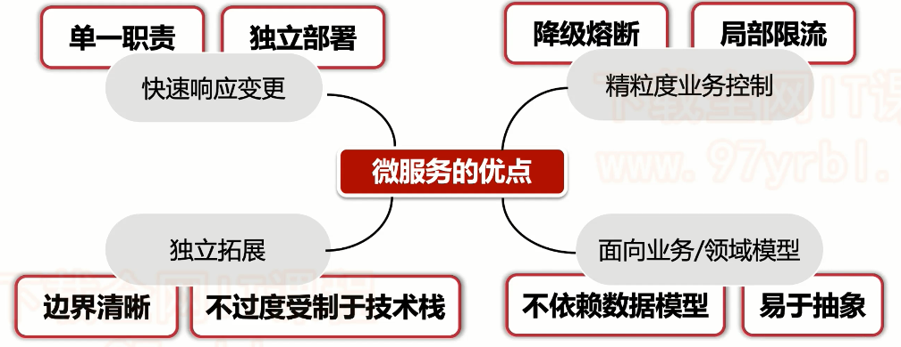
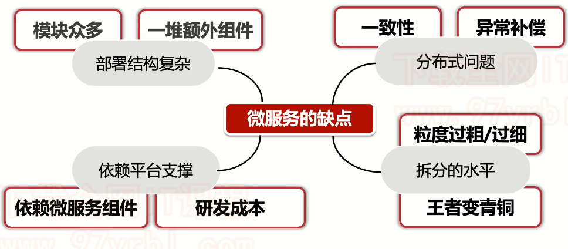
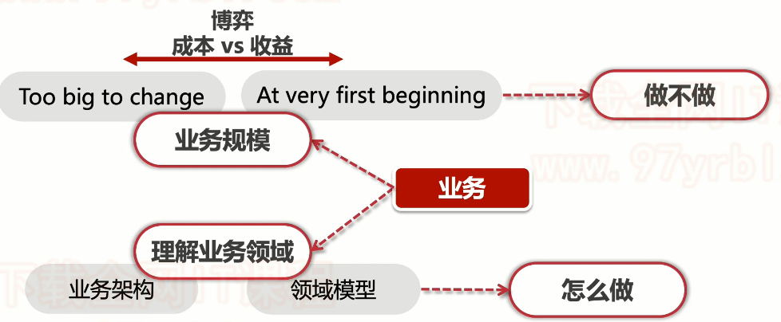

## 微服务介绍

微服务这个话题，一直火爆，到底什么是微服务呢？

服务我们知道，那么重点就在于“微”了，微就是针对团队，保持较小的规模，来负责独立的业务功能单元，这样将一个很大很冗余的团队，按照功能业务职责拆分成多个小团队，会大大增加效率，就好比以前玩《红警》这款游戏，你可以制作一大堆的特种兵，并让他们一起往前冲，攻击对面，那么可能因为人数太多，后面的人还在往前挤，前面的人就被对面几个狙击手一个个消灭了，最终全军覆没；但是如果我们将一大堆特种兵，编成一个个小队，多点突破，对面防守的就无法防御多点了。举个小例子，来体现微的好处。这里我们也可以发现，怎么样将大项目拆分成一个个小团队，也是重中之重。

简而言之，**微服务就是将一个大的单体项目，拆分成一个个微小的服务，将这些服务组成一起为外界提供服务**。

对于微服务来说，实现它的技术相对较多，比如最有名的SpringCloud，但是微服务中最重要的不是这些外功，而是内功，如何拆分微服务，**拆分时又需要满足什么设计思想**，这才是微服务的重中之重。那么微服务又有哪些重要的设计方法论呢？

### 设计方法论

- 拆迁办事处：通过上面介绍，我们可以发现微服务最直观感受就是“**拆**”，那么拆什么，怎么拆就成了需要理清的问题了，后面我们会详细介绍拆分规则。
- 单一职责：单一职责一直是黄金法则，在微服务里也是一样，每个微服务有自己的职责，不干扰别人也不接受别人干扰，所以这又涉及到**微服务如何拆分**，需要根据业务，进行合理拆分。单一职责不止涉及到拆分，还设计到团队的单一职责，就要求团队中将数据，开发，测试，运维，发布都规划到一个领域中，**一个团队完全掌控一个微服务的生命周期**，就可以实现快速迭代，小步快跑。
- 研发团队权利：既然一个团队完全负责自己的微服务，就需要给予它最大的权限，除了把生产环境弄爆炸，其他都可以团队内部审批解决。
- 独立部署：**每一个微服务模块都应当是一个独立打包，独立部署的应用**，在发布流程上与上下游应用没有直接的依赖，由开发团队直接负责线上发布操作。这种方式特别适合应用于微服务模块，保证快速迭代。在这种模式下对接口升级有特殊要求，如果你对接口进行了重大功能改造，同时又不能100%保证向前兼容的情况下，那么就需要提供一个新的接口，而不是在老接口上大动手脚，因为你无法保证上游应用可以兼容这些改动。当所有上游应用都切换到新接口后，老的接口没有流量了，这时候才可以将老接口下线。所以我们在很多互联网公司的项目里会看到一个业务功能对应好几个同名接口，但各个接口之间版本号不同（比如placeOrderV1，placeOrderV2）

## 为什么要使用微服务

我们直接通过单体应用的缺点来看为何使用微服务

当然，你可能会想到我们之前一直学的分布式应用，众多Web服务器构成的高可用集群，不过这些服务器中部署的应用却是千篇一律，什么意思呢？大家看过火影忍者吧，里面主人公经常用的一招叫“多重影分身之术”，将一个自己的本尊复制为成千上万个本尊。这里的服务器集群是一个道理，将一个巨无霸的单体应用复制成N个单体应用，组成一个分布式的服务集群，所以该存在的问题还是会存在，比如下面这些

### 数据问题

同一个war包内，在数据访问层面没有划分领域模型，比如说我们有User、Product和Order三张表，对于不同的Service来说，都通过直接访问数据库的方式来获取数据。这种做法有几个显而易见的缺点：

- **数据模型变更**：当数据模型变更时，所有引用改表的服务全部都要改变，这种改动是非常巨大复杂且耗时的。当然如果是微服务架构，比如变更Order表结构，只需要修改订单服务即可，对于其他上下游服务实际调用的事对外暴露的接口，返回的数据还是一样的，即**领域模型驱动不依赖与底层数据结构变更**。
- **底层组件变更**：如果我们想对Product表数据访问规则变动，比如Oracle改为Mysql，那么改动是特别大的，在传统的分布式应用中非常难以办到，但是在微服务架构下却没有那么困难，因为微服务间的访问依赖API接口+业务模型，我们只要在当前微服务中把这种底层组件的变更处理好，对上下游其他服务来讲这个变更其实是无感知的，因为在微服务接口暴露出的业务模型并不会有什么变化。

### 代码复用问题

一整块代码全部揉捏在一起，避免不了各种借鉴，留下一大堆的坑。

- 看别人代码太复杂，自己写了一个rewrite code，更优雅，这种代码越来越多，就会堆积成山
- 改了一个简单的if-else，别人就报生产事故了，找到当事人，又会因为我怎么知道你使用了我的接口来吵架

### 迭代问题

如果是一个大的war包，我们会发现，产品的发布节奏往往是以月甚至年来计，一个变更从评估到上线，拖个一年半载是很常见的事情，完全不适合现在互联网“糙快猛”的开发模式。

- **快速迭代**：互联网产品的迭代依靠小步快跑，尽快上线，尽快验证业务模式，有问题立即调整，一切都是“快字当头”。对于传统应用来说，发布节奏只能划归到一个千年等一回的发布窗口，再小的变更都得耗上很长的时间，可能每次发布都要经历很耗时的全链路回归测试。对微服务架构来说完全不存在这个问题，每个微服务模块由于职责边界足够清晰，规模可控便于快速变更和测试，完全可以让团队自己制定发布窗口，即便是上线前的回归测试也只局限在当前服务模块
- **回滚问题**：回滚对于传统的单war包分布式系统来说是个噩梦，好不容易等到了发布窗口，各个团队牟足了劲把所有变更都发布了出去，结果因为其中某个小改动引发的问题，导致全部回滚。又要苦苦等待下一个发布窗口。在微服务架构中，回滚只局限在某个微服务的范围内，只要把出问题的应用回滚就好了，不会影响上下游其他应用的发布节奏。

总而言之，微服务还是很好用的，对于大公司大业务大项目来说，可以很好的增加效率。

## 微服务的利弊

我们刚刚说了这么多微服务的好处，就没有弊端了吗？肯定不是

利：

弊：

通过上图，我们可以发现，在决定是否需要将原本的单体项目改造成微服务，需要考虑众多东西。

在改造微服务时，一开始就使用微服务，成本太高，风险大，系统特别庞大了再改造微服务，风险大，改造复杂，需要考虑特别全面，所以对于公司来说，要权衡利弊，在自身合适的时间段进行改造，最好就是业务处于中间阶段时进行改造。

## 微服务拆分

介绍了这么多微服务，我们会发现，怎么都离不开拆分，微服务的拆分可以说是重中之重，好的拆分会省去很多事，不好的拆分还不如使用单体应用。

微服务拆分时，因为每家公司业务不同，是一定没有一个完全正确的拆分规则和套路的，拆分粒度需要根据业务来规划，但是也不能一顿乱拆，拆分还是有一些设计模式的，可以根据一些拆分模式，参考着进行拆分。

### 压力模型拆分

顾名思义，根据请求量，压力来进行微服务拆分，识别出某些超高并发量的业务，尽可能把这部分业务独立拆分出来。

比如电商项目中，就可以根据压力模型拆分成三个维度：

- **高频高并发场景** 比如商品详情页，它既是一个高频场景（时时刻刻都会发生），同时也是高并发的场景（QPS - Query per seconds极高）
- **低频突发流量场景** 比如前面提到的秒杀，它并不是高频场景（偶尔发生），但是它会产生突发流量。再跟大家举一个例子，那就是“商品发布”，对新零售业务来说，当开设一个线下大型卖场以后，需要将所有库存商品一键上架，这里的商品总数是个非常庞大的数字（几十万+），瞬间就可以打出很高的QPS
- **低频流量场景** 这一类多为后台运营团队的服务接口，比如商品图文编辑，添加新的优惠计算规则，上架新商品。它发生的频率比较低，而且也不会造成很高的并发量。

### 业务模型拆分

业务模型拆分就是根据业务场景进行拆分，比如商品微服务，订单微服务这种根据业务维度进行拆分，但是更细粒度的维度还是有很多种的，比如主链路拆分，领域模型（DDD）拆分，用户群体拆分。

#### 主链路拆分

比如电商里，商品搜索->商品详情页->购物车模块->订单结算->支付业务就是一条主链路，将核心主链路与其他拆分开有很多好处，比如异常容错，制定多层次的降级策略；资源调配，当并发上来时，给予大量资源；服务隔断，将其他辅助业务隔离开，辅助业务不会影响到主链路

#### DDD领域模型拆分

领域驱动设计DDD，自从微服务火起来后，也带着它东山再起了，因为对于微服务来说，DDD是一个很好的拆分设计思路。

它主要观点就是领域，首先是根据业务找到实体以及值对象，比如用户，人是实体，地址是值对象，他们聚合在一起组成用户，多个聚合组成一个领域，每个领域各司其职互不干扰。举个例子来说：

阿里集团推出了一套大中台战略，将集团内部的公共领域服务从各个事业部中剥离出来，整合成了一个“集团级别”的大型中台业务。比如说IC订单系统，淘系商品服务，UMP营销优惠服务，汇金平台，用户账号系统等等。

从上面这个例子中我们可以看出，所谓领域模型，其实就是一套各司其职的服务集合。这里涉及到领域和合并和分拆。领域合并的例子就是淘系的营销优惠服务，曾经天猫和淘宝各有一套营销服务，如果不考虑底层技术，从业务层面来说它们做的事情是一样的，都属于营销优惠计算的领域范围，因此后面两条技术线整合成了一套UMP营销优惠服务。领域拆分的例子就太多了，我们做微服务规划的时候要确保各个领域之间有清晰的界限，比如商品服务，和订单服务，尽管他们之间有交集（都围绕商品主数据），但是毕竟是服务于不同领域（商品域和订单域），所以我们要将两者拆分成独立的服务。

如上图，考勤和请假是两个领域，请假中有请假和人员关系两个聚合，聚合中有着实体和值对象。

#### 用户群体拆分