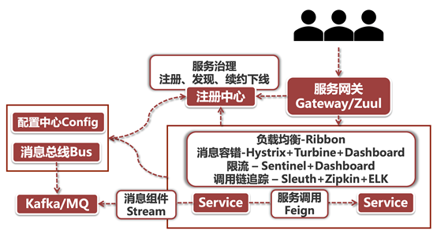
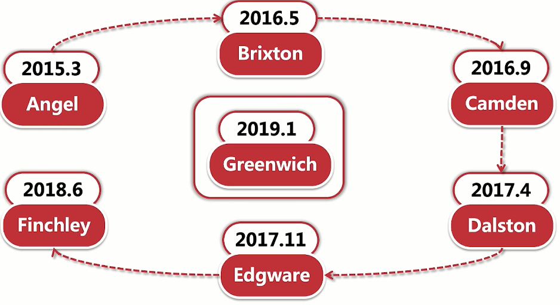
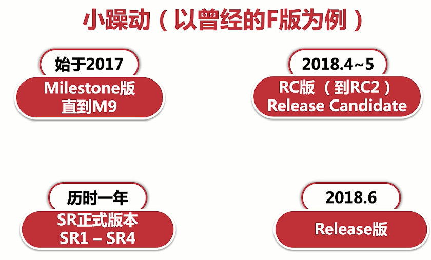
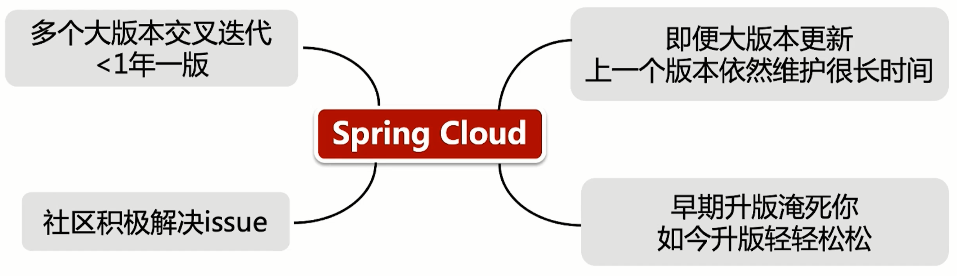
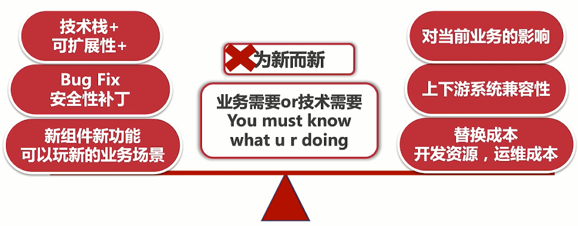
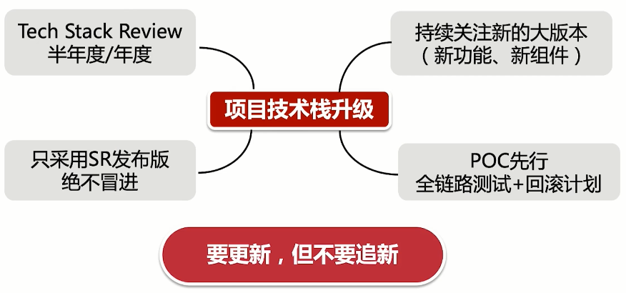

## 大话SpringCloud

我们前面说了这么多微服务，都是理论知识，我们如果搭建好战略战术，领域模型，如何将其落地呢？就需要使用实际的武功了，他就是SpringCloud。

SpringCloud是Spring Framework创造的新的**专门针对微服务的史诗级框架**，它的诞生也是微服务火起来中的一把火炬。

### 采百家所长

Spring Cloud是由Spring Framework直接挂牌的顶级项目，但他并不是由开源社区原生态打造的。前面提到过Spring Cloud吸纳了很多优秀框架，这些项目不光来自于开源社区，也来自于一线企业，比如Netflix和Alibaba就是两家对Spring Cloud有突出贡献的公司，这些业界大厂结合自身在高并发高可用领域积累的丰富经验，所贡献的组件也是作风硬朗能打胜仗。

**SpringCloud是一系列开源技术的集合**，取百家之所长，将微服务这么一个大的概念，分割成一个个小组件进行拼接落地，想要使用哪个就用哪个，比如我们之前说的服务治理负载均衡，服务限流，服务网关等待，都可以使用SpringCloud的组件库，只需要**简单的注解+配置**就可以应用到自己的系统中。

### 解决痛点难点

上一节我们说到微服务落地需要面临很多技术难题，在SpringCloud中，只有你想不到没有你做不到，因为它这块蛋糕太大了，很多好的公司好的组件都想要放进去，所以你想不到的东西别人可能已经加入到生态圈里了。

目前活跃在Spring Cloud舞台的有Netflix组件库和Alibaba组件库，大家对Alibaba应该比较熟悉，但是对Netflix可能不太熟悉（不过经常看美剧的同学肯定知道Netflix），它是一家流媒体的超级巨头，全球最大的收费视频网站。这些业界巨头自身有着非常复杂的在线业务，所以Spring Cloud**提供的组件都是实实在在为了解决各类业务难点痛点而生的**。我这里给大家举一个例子，每年阿里的双十一，为了抗住瞬时流量爆发的场景，必须有一个足够大心脏的流控措施，那么Sentinel就是基于这个背景之下诞生的组件，如今它被纳入了Spring Cloud Alibaba组件库。

### 生态体系构建

Spring Cloud不是垒砖头一样将各类组件搅和在一起使用，而是基于一系列的抽象和改造，**在原生组件的基础上抽象出了一套微服务的适配框架**，让各个组件可以无缝集成，共同构建了一套生态体系。

举一个比较恰当的例子帮助大家理解，那就是推送配置变更的场景。我们表面上是使用Spring Cloud Config组件来管理配置项，但批量推送则依赖于Spring Cloud Bus组件，而Bus底层依赖Spring Cloud Stream组件，Bus在Stream之上抽象出了一层消息广播的事件驱动模型，Stream它本身也是一套对底层消息中间件的抽象，将Kafka和RabbitMQ的交互抽象成了一系列Channel模型。这几个组件之间甚至根本不用什么繁重的配置，只要把依赖项引入Pom，就开始了合体的过程。

## SpringCloud整体架构

主流，也是我们要学习的SpringCloud中组件，架构，如下图：

主要分为：

- 服务治理：Eureka
- 负载均衡：Ribbon
- 服务间调用：Feign，因为基于http，但直接使用原生http太过于繁琐，所以封装了Feign组件，简单的像接口调用即可实现服务间调用
- 服务容错：Hystrix，其中Turbine和Dashboard是可视化工具，可以轻松的知道该微服务的请求状态
- 配置中心和消息总线：Config，用来管理配置，Bus消息总线是用来推送配置的，将修改的配置实时变更
- 调用链路追踪：Sleuth+Zipkin+ELK
- 消息驱动：Stream，整合Kafka和RabbitMQ，使消息队列使用更简单
- 限流组件：Sentinel，阿里出品的限流组件，双十一功臣之一

## SpringCloud中的三股势力

我们之前说SpringCloud是集大家之所长，大家主要有三家，Netflix，Alibaba和Spring Open Source。

### Netflix

是先有Spring Cloud还是先有Netflix？这是一个好问题。Netflix是一家大名鼎鼎的互联网传媒公司，但为什么它在开源软件领域有这么大的名声呢？这就不得不说起它和Spring Cloud的渊源了。

很久很久以前，天和地还没有分开，宇宙混沌一片。有个叫Netflix的公司，在这混沌之中，拿自身的业务动手，开启了一段微服务的改造之旅。在这段漫长的过程中，沉淀出了一系列优秀的微服务组件，比如大名鼎鼎的Eureka，Hystrix，Zuul等等，**这些组件经过Pivotal的一系列封装以后就构成了初代目Spring Cloud**。

目前Spring Cloud Netflix组件库是Spring Cloud中最受欢迎的项目，并且还拥有最广泛的群众基础，这么说吧，10个用Spring Cloud的公司，有八九个都会选用Netflix组件库全家桶来构建自己的技术栈。

### Alibaba

目前开源领域一大热门当属Spring Cloud，尽管前面有Netflix组件库占尽天时地利，可是不妨碍阿里巴巴集团一贯怼天怼地的做派。这不，Spring Cloud大家族中又添新丁，那就是–Spring Cloud Alibaba组件库。

从目前的势头来看，Alibaba组件库还是呈现一路高歌猛进的态势，其中多款组件已经站上擂台和Netflix组件展开直接竞争。得益于阿里集团的福报文化，加班不要命的码农们给这些组件添加了各种业务功能，从我个人使用这两个组件的感受来说，Netflix组件相对来说比较“纯粹和纯净”，Alibaba组件似乎透出一股“KPI导向”的味道（恨不得把能想到的功能全塞进去）。我们将以Netflix组件为主，同时也会重点学习几个Alibaba组件库的组件。

### Spring Open Source

这最后一股势力就是Spring自个儿了，由Spring自己独家挂牌的开源组件，可以说是“原配”组件了。都说原配的才是最好的，不过在上面两个重量级组件库面前还真不好说。同学们经常会看到这样一个情况，在某个领域中这三家的组件会扎堆出现。比如服务治理，这三家各自都有一个独立组件，想想大家都是Spring Cloud一家子，为何还整出了一副三足鼎立的态势呢？我们后面再说

### 总结各势力范围

| 针对方向     | Netflix                       | Alibaba                               | Spring              |
| ------------ | ----------------------------- | ------------------------------------- | ------------------- |
| 服务治理     | Eureka                        | Nacos，Dubbo                          | Consul              |
| 负载均衡     | Ribbon                        |                                       | SpringCloudBalancer |
| 服务调用     | Feign（OpenFeign）            |                                       |                     |
| 服务容错     | Hystrix + Turbine + Dashboard | Sentinel                              |                     |
| 限流         |                               | Sentinel                              |                     |
| 服务网关     | Zuul                          |                                       | Gateway             |
| 配置中心     | Archaius                      | Alibaba Cloud ACM                     | Config              |
| 消息总线     |                               |                                       | Bus                 |
| 消息驱动     |                               | RocketMQ                              | Stream              |
| 调用链路追踪 |                               |                                       | Sleuth              |
| 任务调度     |                               | Alibaba Cloud SchedulerX              | SpringCloud Task    |
|              | Sidecar（跨语言）             | Seata（分布式事物）， SMS（短信服务） |                     |

## SpringCloud版本介绍

SpringCloud发布至今产生了多个版本，它的版本号是由英文字母进行排序的，如下

可以发现，发布至今产生了多个版本，其中主流的版本有：

- Dalston：第一代SpringCloud的主流版本，至今还有很多公司再用
- Finchley：第二代SpringCloud的主流版本，目前也是选择之一
- Greenwich：最新的SpringCloud版本，想较于之前的版本也比较好用，也是我们使用的版本

上面介绍了SpringCloud的大版本，当然SpringCloud各个大版本中还具有小版本，比如：

- M版：测试版本，不推荐使用
- RC版：发布之前准备的版本
- Release版：正式发布版
- SR版：正式稳定版本，推荐使用SR版本

SpringCloud版本这么多，社区的维护规则又是怎么样的呢？

可以看到，不管是哪个版本，SpringCloud都会支持维护，尽职尽责到底；但是如果你要升级版本，早期版本升级是有很多坑的，比如D版到F版，很多配置的名称就都改变了，某些组件使用方式也发送了改变，但是到了F版之后，升级就轻轻松松了，所以可以说SpringCloud成熟还是F版开始成熟的。

那么SpringCloud版本升级速度这么快，半年一年就升级一次大版本的，我们应该如何抉择我们系统中的版本升级呢？

那么就需要权衡利弊了，根据公司业务需求，判断升级是否必要，是否可以直观带来业务效益或技术效益。

推荐升级策略为：

- 半年度或年度的来讨论一次是否需要升级版本
- 关注新的大版本的新功能新组件，看看是否有直接和业务挂钩的
- 只使用SR正式稳定版，其他版本不使用
- POC先行，轻量级可行性验证，是否可以升级