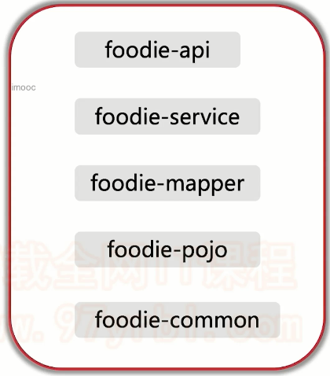
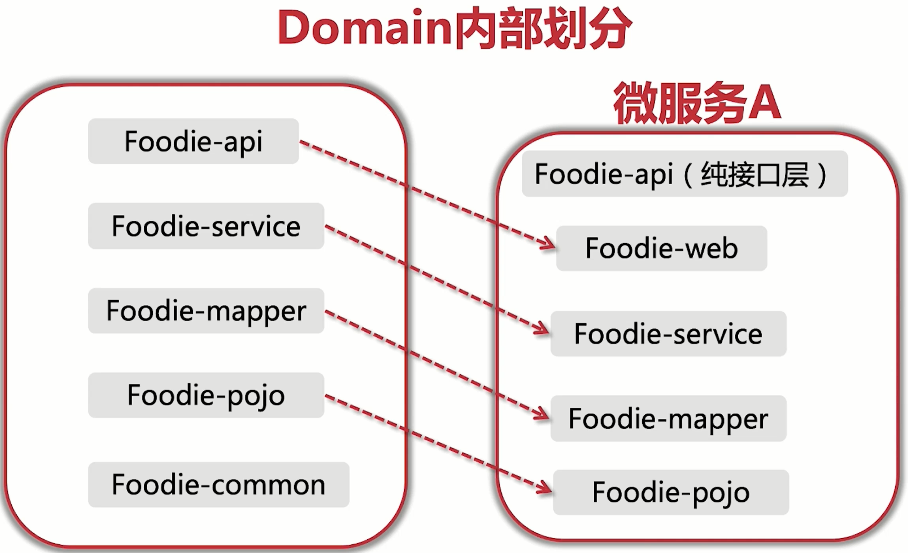
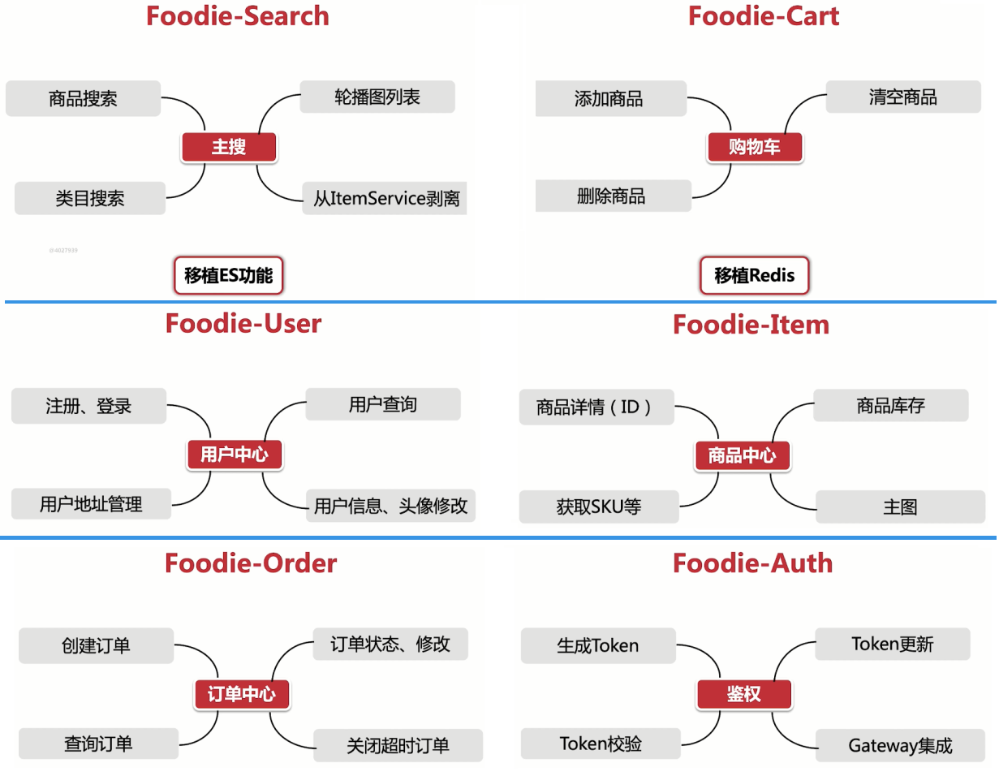

## Foodie微服务化改造

了解完微服务后，我们需要开始思考一下Foodie如何拆分成微服务了。

我们知道，之前的Foodie其实就是单体应用，我们主要改造的结构是：



根据这些我们可以思考如何拆分，这里有几点

- pom依赖拆分，因为微服务化之后，我们需要在pom中只添加自己需要的依赖，而避免依赖冲突
- 微服务模块的拆分，因为我们的项目还是一个学习项目，业务并不复杂，所以拆分粒度不需要很细，只需适中拆分，比如商品就拆成商品微服务即可，而不是像淘宝那样，一个商品可以拆分成十几个微服务
- 公共组件剥离，一些公共的组件，我们可以放到一个模块中引用
- 中间件剥离，将需要用到的中间件放在一个模块中，组成微服务，比如微服务里的服务网关Gateway，容错限流组件，配置中心组件等

通过这么一分析，我们可以将Foodie项目改造成以下目录结构：

```
foodie-cloud -- 为了方便git存储，我们放到一个Repository中
├── common -- 存放公共组件，公共依赖项
├── domain -- 业务微服务，比如订单微服务，商品微服务
├── platform -- 平台组件，比如配置中心，网关，限流
```

分析完整体拆分思路后，我们就可以具体的分析我们的业务应该如何拆分了

### Domain层

根据业务规则，我们始终粒度可以拆分成以下几个微服务


- foodie-search：搜索微服务
- foodie-item：商品微服务
- foodie-cart：购物车微服务
- foodie-auth：鉴权微服务
- foodie-user：用户微服务
- foodie-order：订单微服务

那么我们每个微服务内部的目录结构应该如何改变呢？



因为我们要微服务间使用Feign进行调用，所以不能直接调用controller层，这里我们新的api层为专门为其他微服务提供的调用接口，而远来与UI层交互的controller层放在了web中。

还有一个变化就是common这个目录被剥离出来，放到了foodie-cloud-common中

### 各个微服务功能划分

