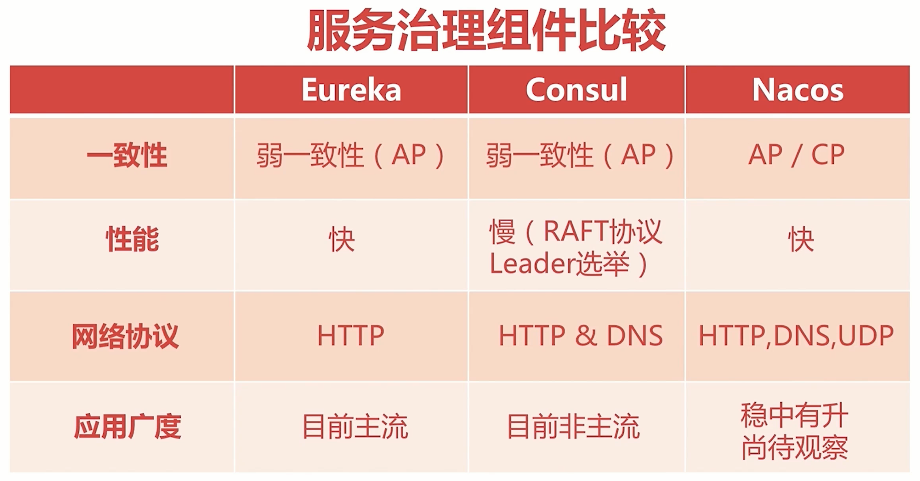

## 什么是服务治理

学习SpringCloud服务治理之前，我们先了解一下服务治理的基本概念。

**服务治理的目标**：

- 高可用性：即多微服务节点，及时海啸地震闪电，导致机房崩溃，只要有一个节点存活，就依旧能提供服务
- 分布式调用：多节点机房可能存在不同的地方，可能是跨市跨省跨国跨洲，复杂的网络环境，也可以使用服务治理实现精准调用
- 生命周期：服务的上线，持续运行以及下线，都由服务治理来管理
- 健康检查：服务节点是否因特殊情况宕机了，没有心跳了，服务治理就需要将其剔除下线，影响业务可用性，等什么时候复活了，再拉他上线

**服务治理为了目标需要解决的问题（3W1H）**：

- Who are u：服务节点想要被治理，我得知道你是谁吧？这里包括三个维度
  - IP+端口
  - 服务名称
  - 健康状态，可用还是下线
- Where are u from：这里是针对请求的，我想要请求服务，需要询问服务治理中心，获取节点的地址来请求
- How are u doing：针对服务治理中心，用于判断服务节点是否因为不可控因素宕机了，我们需要将其剔除下线
- When you die：针对服务节点，服务节点如果因为自身原因主动申请下线，需要告知服务治理中心

**那么为了解决问题，服务治理提供了哪些方案呢**？

- Who are u：服务注册 - 服务节点主动注册到服务治理中心
- Where are u from：服务发现 - 服务治理中心拉取注册信息
- How are u doing：心跳检测、服务续约、服务剔除 - 定时检测心跳，服务是否存活，如果宕机，将其剔除，如果复活，将其续约
- When you die：服务下线 - 服务节点主动下线

**服务治理的技术选型**

我们主要使用的是目前最红最火的Eureka

## 注册中心

我们了解完服务治理后，就要一点点学习其中的知识了，首当其冲的当然是注册中心，也就是上面介绍的服务治理中心，用于管理服务

### 初识注册中心

前面说到，注册中心是用来解决Who are u服务注册的问题的，获取所有节点的身份信息，服务名称以及存活状态，那么他要如何获取这么多的服务节点呢？有两种思路：

- 注册中心主动的向网络中所有机器发送消息，联系他们，看看是否需要加入到我的怀抱
- 守株待兔，等着服务自己找上门来

一般来说，几乎所有的注册中心架构实现方式都是第二种，为什么呢？

我们看看第一种有哪些弊端：

- 模型复杂；在复杂的网络世界，向所有节点发送广播，无意义对着全世界喊我爱你，看看有谁回应你，而在现实的分布式网络环境中，响应模型更加复杂
- 网络消耗大：因为要对所有节点发送广播，那肯定包含非服务节点的，无疑增加网络通信成本
- 服务端压力大：因为要对所有节点广播，如果有大量服务节点接收广播返回响应，那么服务端还需要接收响应进行操作，加大压力，因为我们注册中心并不会有很多节点高可用，一般就两三个，所以无疑影响业务

所以，我们的Eureka就是选择的第二种，建立起注册中心门户后，只需等着服务节点找上门来就可以了，它需要保存服务节点的IP，端口，服务名称，服务状态信息，当然，他自身还有其他事情要做，比如**检测服务节点心跳，判断是续约还是剔除**，注册中心一般都是多节点实现，所以还需要进行**注册信息同步**，将多个节点的服务同步，这样的好处也很明显，完全解决了上面三个弊端。

**服务节点报道**

服务节点报道时，是怎么找到注册中心，并向其注册呢？就是由我们配置注册中心的地址，所以知道往哪去注册，地址主要有三个维度：

- Region：地理上的分区，一般使用默认，当多机房环境，机房地址在不同位置时，进行配置，比如在中国，`region=east_china`
- Zone：分区下的机房，也一般使用默认，多机房环境进行配置，比如上海，配合Region，即`zone=sh`
- Url：Eureka的启动地址，例如：`http://localhost:20000/eureka/`

配置完维度后，服务找到了注册中心，需要告诉注册中心什么呢？

- 我会的服务名叫什么，我提供什么服务？`spring.application.name=user`
- 我住在哪里，我的地址：`localhost:10000`
- 其他的一些信息，后面再了解，这里大致了解一些，服务注册到注册中心，要带一些信息

