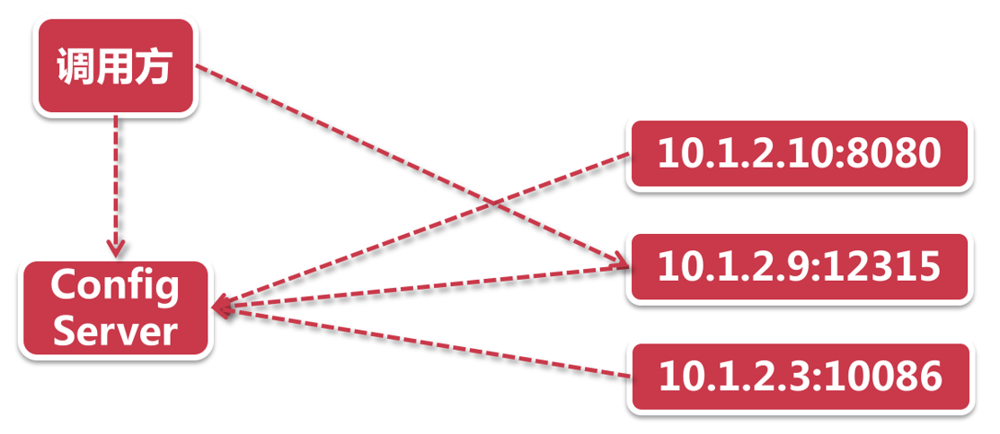
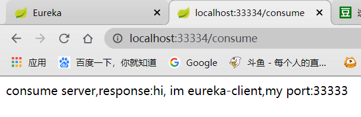
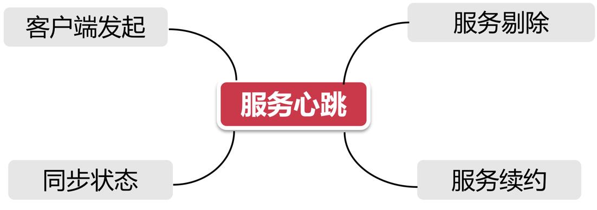
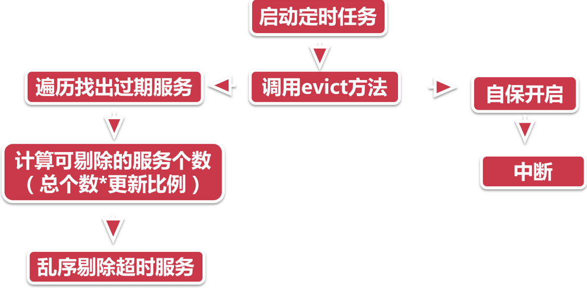
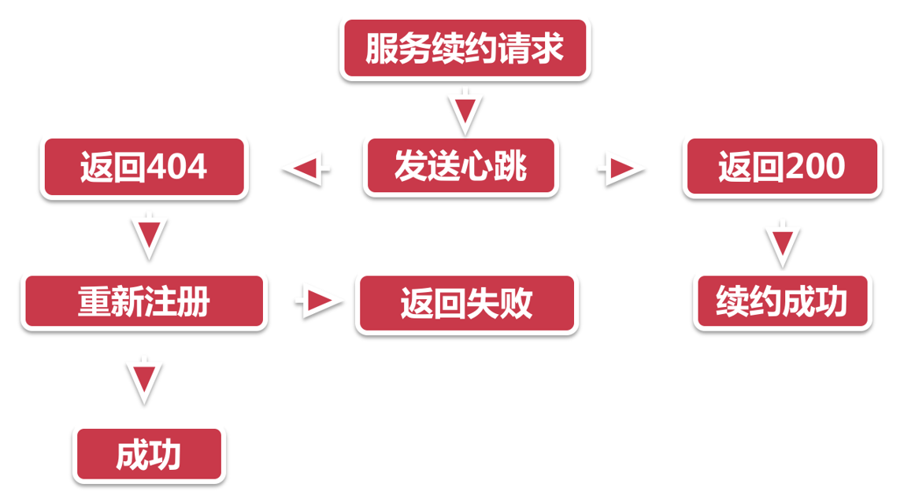
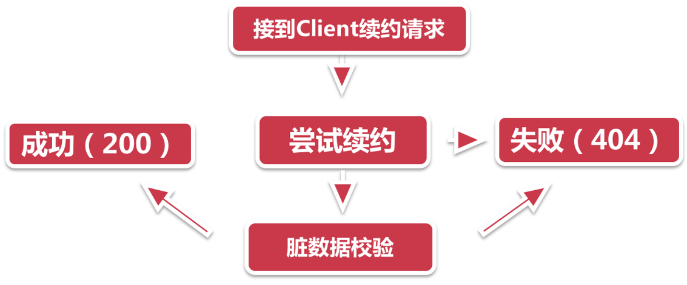
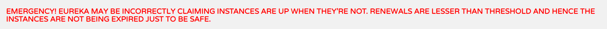
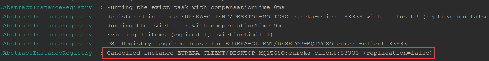
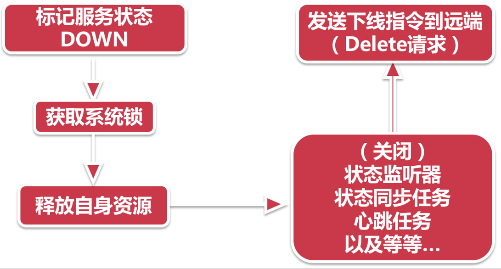
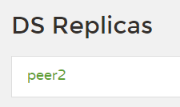

## 什么是服务治理

学习SpringCloud服务治理之前，我们先了解一下服务治理的基本概念。

**服务治理的目标**：

- 高可用性：即多微服务节点，及时海啸地震闪电，导致机房崩溃，只要有一个节点存活，就依旧能提供服务
- 分布式调用：多节点机房可能存在不同的地方，可能是跨市跨省跨国跨洲，复杂的网络环境，也可以使用服务治理实现精准调用
- 生命周期：服务的上线，持续运行以及下线，都由服务治理来管理
- 健康检查：服务节点是否因特殊情况宕机了，没有心跳了，服务治理就需要将其剔除下线，影响业务可用性，等什么时候复活了，再拉他上线

**服务治理为了目标需要解决的问题（3W1H）**：

- Who are u：服务节点想要被治理，我得知道你是谁吧？这里包括三个维度
  - IP+端口
  - 服务名称
  - 健康状态，可用还是下线
- Where are u from：这里是针对请求的，我想要请求服务，需要询问服务治理中心，获取节点的地址来请求
- How are u doing：针对服务治理中心，用于判断服务节点是否因为不可控因素宕机了，我们需要将其剔除下线
- When you die：针对服务节点，服务节点如果因为自身原因主动申请下线，需要告知服务治理中心

**那么为了解决问题，服务治理提供了哪些方案呢**？

- Who are u：服务注册 - 服务节点主动注册到服务治理中心
- Where are u from：服务发现 - 服务治理中心拉取注册信息
- How are u doing：心跳检测、服务续约、服务剔除 - 定时检测心跳，服务是否存活，如果宕机，将其剔除，如果复活，将其续约
- When you die：服务下线 - 服务节点主动下线

**服务治理的技术选型**


我们主要使用的是目前最红最火的Eureka

## 注册中心

我们了解完服务治理后，就要一点点学习其中的知识了，首当其冲的当然是注册中心，也就是上面介绍的服务治理中心，用于管理服务

### 初识注册中心

前面说到，注册中心是用来解决Who are u服务注册的问题的，获取所有节点的身份信息，服务名称以及存活状态，那么他要如何获取这么多的服务节点呢？有两种思路：

- 注册中心主动的向网络中所有机器发送消息，联系他们，看看是否需要加入到我的怀抱
- 守株待兔，等着服务自己找上门来

一般来说，几乎所有的注册中心架构实现方式都是第二种，为什么呢？

我们看看第一种有哪些弊端：

- 模型复杂；在复杂的网络世界，向所有节点发送广播，无意义对着全世界喊我爱你，看看有谁回应你，而在现实的分布式网络环境中，响应模型更加复杂
- 网络消耗大：因为要对所有节点发送广播，那肯定包含非服务节点的，无疑增加网络通信成本
- 服务端压力大：因为要对所有节点广播，如果有大量服务节点接收广播返回响应，那么服务端还需要接收响应进行操作，加大压力，因为我们注册中心并不会有很多节点高可用，一般就两三个，所以无疑影响业务

所以，我们的Eureka就是选择的第二种，建立起注册中心门户后，只需等着服务节点找上门来就可以了，它需要保存服务节点的IP，端口，服务名称，服务状态信息，当然，他自身还有其他事情要做，比如**检测服务节点心跳，判断是续约还是剔除**，注册中心一般都是多节点实现，所以还需要进行**注册信息同步**，将多个节点的服务同步，这样的好处也很明显，完全解决了上面三个弊端。

**服务节点报道**

服务节点报道时，是怎么找到注册中心，并向其注册呢？就是由我们配置注册中心的地址，所以知道往哪去注册，地址主要有三个维度：

- Region：地理上的分区，一般使用默认，当多机房环境，机房地址在不同位置时，进行配置，比如在中国，`region=east_china`
- Zone：分区下的机房，也一般使用默认，多机房环境进行配置，比如上海，配合Region，即`zone=sh`
- Url：Eureka的启动地址，例如：`http://localhost:20000/eureka/`

配置完维度后，服务找到了注册中心，需要告诉注册中心什么呢？

- 我会的服务名叫什么，我提供什么服务？`spring.application.name=user`
- 我住在哪里，我的地址：`localhost:10000`
- 其他的一些信息，后面再了解，这里大致了解一些，服务注册到注册中心，要带一些信息

### 实现注册中心

在之前21节笔记中，我们创建了一个父工程来管理SpringCloud，springboot的版本，所以我们直接在这个工程下创建module即可，创建一个eureka文件夹，在其中创建`eureka-server`的module

1.pom添加注册中心依赖

```xml
<dependencies>
    <dependency>
        <groupId>org.springframework.cloud</groupId>
        <artifactId>spring-cloud-starter-netflix-eureka-server</artifactId>
    </dependency>
</dependencies>
```

只需添加eureka-server的依赖

2.创建启动器类

```java
@SpringBootApplication
@EnableEurekaServer // 注册中心
public class EurekaServerApplication {
    public static void main(String[] args) {
        SpringApplication.run(EurekaServerApplication.class,args);
    }
}
```

3.添加配置文件

```yml
spring:
  application:
    name: eureka-server
server:
  port: 22222
eureka:
  instance:
    hostname: localhost # eureka节点名称
  client:
    register-with-eureka: false # 不注册自己
    fetch-registry: false # 不需要拉取服务注册表
```

启动后访问：`localhost:22222`即可看到注册中心ui页面，里面存放节点信息以及一些其他信息

## 服务注册

### 初识服务注册

学习完注册中心后，就要看看服务要怎么注册到注册中心上了。

服务注册是个高深技术，需要细品，我们先简单了解一些，SpringCloudEureka的服务注册，大概做了哪些事，用了哪些技术：


- 扫描注解：服务注册开始，我们必须自报家门，使用`@EnableDiscoveryClient`注解，表示我们是来服务注册的
- 发起注册：扫描到我们的注解后，就开始注册拉，其中的`DiscoveryClient`类就运行起register方法，这个类是一个门面类，最外层，是很多节点的服务调用入口。此时`DiscoveryClient`使用代理+装饰器模式，转而运行`SessionedEurekaHttpClient`装饰器
- 装饰器代理：`SessionedEurekaHttpClient`还有一个大爹，`EurekaHttpClientDecorator`，Eureka的一众连接器，都是它的子孙，也就是标准的装饰器模式，就像俄罗斯套娃一样，一层比一层的buff多
- 代理注册：接下来，就是Eureka大显神通，使用加了一层层buff的装饰器，使用代理+回调的方式实现注册

通过一个笼统的概括，我们还是不太明白Eureka具体是怎么注册的，只是知道了，**Eureka注册需要添加一个注解，通过这个注解被扫描后，使用装饰器+代理的模式实现注册**

接下来我们看看实际是如何注册的，注册一击！


- 代理模式注册：之前我们说Eureka注册，是一层层的装饰器来调用实现，那么我们就需要从`RetryableEurekaHttpClient`这个装饰器最重要的一层，来展开，我们可以发现他的名字是Retry，“失败重试”，就可以知道具有复活buff
- 获取HttpClient：这个`HttpClient`是`RetryableEurekaHttpClient`中的一个代理对象，它封装了上次我们注册成功的注册中心地址等信息，如果有，就直接再次同步注册，如果没有，就需要获取Server列表
- 获取Server列表：这里是从我们的配置文件中获取注册中心的地址
  - 如果没有，直接886，抛出异常，等下一次定时任务发起注册的时候再尝试
  - 如果有，那么获取第x台机器（注意这个x）作为目标注册机器
- 发送注册请求：这里就到了杀招。使用`JerseyApplicationCLient`装饰器的`register`方法，来实际注册到注册中心，这里回携带大量的信息，其中关键的事：我的服务名称，服务IP，节点状态
  - 注册成功？返回正确标识
  - 注册失败？你这个不行我换一个试试，这里就会重新获取Server获取第**x+1**台服务器信息，重新注册尝试；如果还是不行，当复活币使用完毕全部注册失败，就拉闸抛出异常，等下一次定时任务调用时再注册吧

### 实现服务注册

接下来我们直接实现一个注册中心，看看需要哪些东西，创建一个module，`eureka-client`

1.pom添加client依赖

```xml
<dependencies>
    <dependency>
        <groupId>org.springframework.cloud</groupId>
        <artifactId>spring-cloud-starter-netflix-eureka-client</artifactId>
    </dependency>
    <dependency>
        <groupId>org.springframework.boot</groupId>
        <artifactId>spring-boot-starter-web</artifactId>
    </dependency>
</dependencies>
```

2.创建Client启动器，并添加服务节点注解

```java
@SpringBootApplication
@EnableDiscoveryClient
public class EurekaClientApplication {
    public static void main(String[] args) {
        SpringApplication.run(EurekaClientApplication.class,args);
    }
}
```

3.添加配置，主要是注册中心的地址

```yml
spring:
  application:
    name: eureka-client
server:
  port: 33333
eureka:
  client:
    service-url:
      defaultZone: http://localhost:22222/eureka
```

4.创建一个Controller测试

```java
@RestController
public class Controller {

    @Value("${server.port}")
    private String port;

    @GetMapping("/sayHi")
    public String sayHi(){
        String hi = "hi, im eureka-client,my port:" + port;
        return hi;
    }
}
```

这样，就可以把该服务节点注册到注册中心


## 服务消费

### 初识服务消费

我们创建了注册中心以及服务节点，作为服务消费者，应该如何调用服务节点呢？

当然不是，这里有两种访问方式：

- 基于客户端的服务发现：消费者向注册中心获取服务节点的地址，然后直接访问服务节点。这里注册中心如何挑选节点给消费者，就是之后要学习的**负载均衡Ribbon**做的事



- 基于服务端的服务发现：我们会发现刚刚那种方式有点累，要先获取地址，消费者要自己去商场购物，那我能不能在家躺着就把东西买了呢？就需要另外一个人帮他，Router，服务端代理，当消费者想要请求时，只需请求这个服务端Router，由他去找注册中心要地址然后访问，最后把结果给消费者

|              | 客户端模式               | 服务端模式             |
| ------------ | ------------------------ | ---------------------- |
| 性能         | 快，网络转发少，直接请求 | 慢，网络转发多         |
| 负载均衡策略 | 需要考虑                 | 不需要考虑             |
| 运维成本     | 低，没有额外的网络组件   | 高，需要额外的网络组件 |

如果使用服务端模式，就需要多一个SpringCloud组件，而使用客户端模式就不需要，可以看出SpringCloud的灵活性，使用哪种都可以

### 实现服务消费

实现方式和服务注册时的服务节点一样，主要不同就是Controller层的服务消费：

```java
@RestController
public class Controller {

    @Autowired
    private LoadBalancerClient client;
    @Autowired
    private RestTemplate restTemplate;

    @GetMapping("/consume")
    public String consume(){
        // 获取服务地址
        ServiceInstance instance = client.choose("eureka-client");
        // 请求该地址
        String target = String.format("http://%s:%s/sayHi",instance.getHost(),instance.getPort());
        String response = restTemplate.getForObject(target, String.class);
        String result = "consume server,response:" + response;
        return result;
    }
}
```

这里我们使用SpringCloud自带的LoadBalanceerClient来根据服务节点名称获取地址



## 心跳续约剔除自保



### 服务心跳

Eureka中，服务心跳伴随着服务节点的一生，是一个非常重要的知识点，服务心跳关联中很多服务功能，如上图：

- **客户端发起**：服务心跳是由服务节点向注册中心发起的，注册中心守株待兔，等着服务节点上门交租金
- **同步状态**：服务是有状态的，在告诉注册中心我还活着的同时，要告诉它我现在有没有生病或者很健康等
- **服务剔除**：注册中心就躺着就行了吗？不是，注册中心会隔一段时间检查各个节点是否还存活，不然不是浪费我的资源嘛
- **服务续约**：服务节点心跳的同时，会给注册中心续约

服务注册时，要带很多信息进行注册，但是心跳时就不需要带这么多信息了，有几个重要信息：

- 注册中心地址：要知道注册中心地址，才能发送心跳，而自身标识，服务名称节点ID参数是放在请求URL中的，如：`apps/${app_name}/${instance_id}`
- 服务状态：当前我的状态，UP, DOWN, STARTING, OUT_OF_SERVICE, UNKNOWN
- `lastDirtyTimeStamp`：最后一次同步时间，**很重要的一个信息点**，服务续约中使用；`InstanceInfo`封装了该属性以及另一个搭档`isInstanceInfoDirty`，当`isInstanceInfoDirty=true`的时候，表示当前节点自从`lastDirtyTimeStamp`以后的时间都处于未同步的状态

服务心跳有两个重要配置：

```properties
## 客户端指标
## 每隔多少秒心跳一次
eureka.instance.lease-renewal-interval-in-seconds=10 
## 当多少秒内没有发送心跳，视为我挂了
eureka.instance.lease-expiration-duration-in-seconds=20
```

### 服务剔除

服务剔除也是很重要的一个点，可以试想，如果没有服务剔除，一些节点挂掉了，当用户请求时，负载均衡到这些挂掉的节点，就会返回404了



- 启动定时任务：注册中心在启动时会开启一个定时任务，每隔60秒进行一次服务剔除，这个间隔时间可以使用`eureka.server.eviction-interval-timer-in-ms=30000`进行设置
- 调用`evict`：此时会直接通过`AbstractInstanceRegistry`类的`eviction`方法进行服务剔除
- 自保模式：这是注册中心的保命招，后面会详细说，这里我们只需知道开启后，就不进行服务剔除了

- 找出过期服务进行剔除：这里遍历服务节点，找出过期服务，判断过期服务的依据有两个，1.标记为已过期的服务 2.最后一次心跳时间+设置的心跳超时时间 < 当前时间的为过期服务
- 找到过期服务后，不是所有的过期服务都要剔除，因为如果有100个服务，100个都过期了，全部剔除会直接影响它的稳定性，所以它**设置了一个系数（默认0.85）**，100个服务最多剔除85个，剩下的会留在下一次打上已过期标识，下一次剔除，剔除时会乱序剔除

### 服务续约

服务续约相较于剔除来说，就比较复杂了，因为它需要两点来完成：

- 服务节点同步状态到注册中心，表示我要续约！
- 注册中心会进行续约校验，校验通过才续约成功

#### 发送Renew请求



- 服务续约的入口和之前一样，也是由一个定时任务定时调用`DiscoverClient`中的`renew`方法开始的
- 发送心跳，会带有两个重要参数，服务状态（UP）和`lastDirtyTimeStamp`最后同步时间
- 如果返回成功，则续约成功，更新`lastDirtyTimeStamp`
- 如果返回失败，即404，表示注册中心不认可你这个服务，需要重新注册
- 重新注册前，会设置两点：1.`lastDirtyTimeStamp`设置为当前时间，2.标记自己为脏节点，然后主动调用服务注册流程，如果成功，会清除脏节点标识

#### 注册中心续约校验

注册中心可不是全盘接受的，你想续约，先体检一下



- 接受请求 `InstanceResource`下的`renewLease`方法接到了服务节点的续约请求
- 尝试续约，这里就会开始判断了
  - 注册过没有，没有爬
  - 状态是什么，UNKNOW？也给我爬
- 如果都没问题，就要进行重要复杂的脏数据校验了，其实**就是判断服务节点带来的`lastDirtyTimeStamp`，是否大于与在注册中心保存的该节点的`lastDirtyTimeStamp`**，如果大于，就说明在大于的这段时间，服务节点不知道跑哪去了，干了注册中心不知道的事（脏数据），校验不通过

### 服务自保

再说服务剔除的时候，会发现当开启服务自保后，就不再进行服务剔除了，所以两个就是有你没我的存在。

为什么需要服务自保呢？因为有时候，无心跳的服务不一定是不可用的，可能是因为网络原因，导致无法请求到注册中心了，如果强行剔除，可能会导致业务大面积瘫痪。

服务自保的开启有两个触发开关：

- 自动开关：**服务自保机制会检查过去15分钟以内，成功续约的节点占所有节点的比例，如果低于85%，就会自动开启自保机制**，在理想情况下服务节点的续约成功率应该接近100%，如果突然发生网络问题，比如一部分机房无法连接到注册中心，这时候续约成功率有可能大幅降低。但考虑到Eureka采用客户端的服务发现模式，客户端手里有所有节点的地址，如果服务节点只是因为网络原因无法续约但其自身服务是可用的，那么客户端仍然可以成功发起调用请求。这样就避免了被服务剔除给错杀；如果出现自动开启，会显示下面的红字



- 手动开关：`eureka.server.enable-self-preservation=false`设置为false后就永不开启服务自保机制

### 实现服务剔除续约

接下来我们动手实现测试一下服务剔除

1.注册中心配置

```yml
eureka:
  server:
    enable-self-preservation: false # 关闭自我保护
```

2.服务节点配置

```yml
eureka:
  instance:
    # 这里要测试服务剔除，所以设置的心跳时间大于超时时间
    lease-renewal-interval-in-seconds: 60 # 每次心跳间隔时间
    lease-expiration-duration-in-seconds: 5 # 当超过多少秒内没有心跳，让注册中心剔除我们
```

3.启动注册中心与服务节点



会发现在服务剔除方法调用时，将我们的服务节点剔除了

### 服务下线

由服务节点主动的向注册中心发出下线指令



- 首先标记服务状态为DOWN，EurekaServiceRegistry.deregister中完成
- 然后获取系统锁，保证线程安全，它是由CAS实现的，基于底层操作系统的乐观锁
- 然后会释放自身资源，因为服务启动时会带起很多其他的操作，比如心跳，同步任务，监听器等等
- 最后就是发送Delete请求到注册中心，注册中心接收到后就会删除

## 高可用注册中心

我们之前实现的注册中心是单节点的，单节点的问题不再赘述了，如何实现高可用注册中心呢？对于SpringCloud Eureka来说实现非常简单

1.修改host

```
127.0.0.1 peer1
127.0.0.1 peer2
```

2.创建两个Module，eureka-server-peer1和eureka-server-peer2

3.其他pom以及启动器都和原来一样创建

4.配置文件修改

peer1：

```yml
spring:
  application:
    name: eureka-server-peer1
server:
  port: 22222
eureka:
  instance:
    hostname: peer1
  client:
    service-url:
      defaultZone: http://peer2:22223/eureka

```

peer2：

```yml
spring:
  application:
    name: eureka-server-peer2
server:
  port: 22223
eureka:
  instance:
    hostname: peer2
  client:
    service-url:
      defaultZone: http://peer1:22222/eureka
```

这样就配置好了，主要就是配置文件配置，让两个注册中心互相注册



