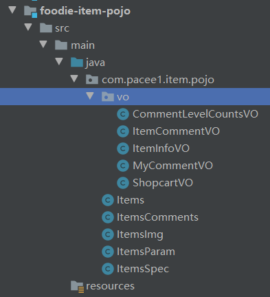
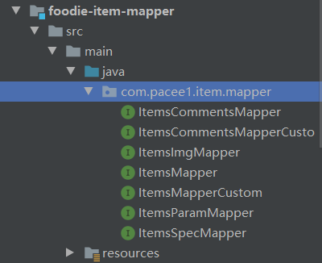
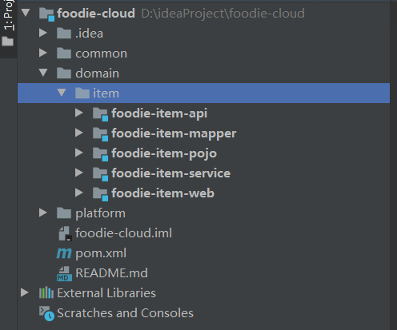
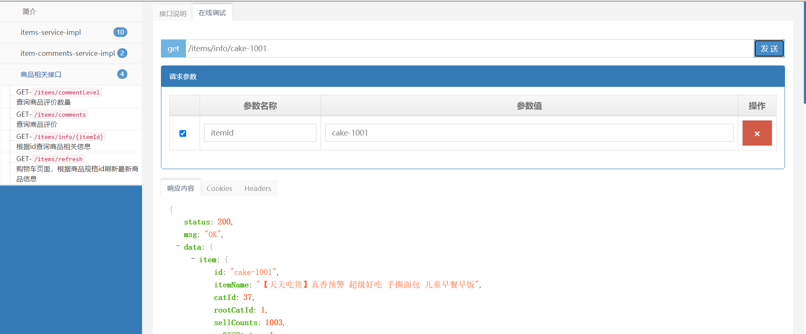

## 创建注册中心

首先我们需要在项目中创建注册中心Module，这里我们创建在`platform`文件夹下，具体的工程结构可以看21章笔记

创建`registry-center`的方式和之前创建注册中心一样

配置：

```yml
# 1

spring:
  application:
    name: registry-center
  profiles:
    active: dev

server:
  port: 22222

eureka:
  instance:
    hostname: localhost
  # 不注册自己
  client:
    register-with-eureka: false
    fetch-registry: false
```

pom：

```xml
<dependencies>
    <dependency>
        <groupId>org.springframework.cloud</groupId>
        <artifactId>spring-cloud-starter-netflix-eureka-server</artifactId>
    </dependency>
</dependencies>

<!-- 设置打包时主类 -->
<build>
    <plugins>
        <plugin>
            <groupId>org.springframework.boot</groupId>
            <artifactId>spring-boot-maven-plugin</artifactId>
            <configuration>
                <mainClass>com.pacee1.EurekaServerApplication</mainClass>
            </configuration>
            <executions>
                <execution>
                    <goals>
                        <goal>repackage</goal>
                    </goals>
                </execution>
            </executions>
        </plugin>
    </plugins>
</build>
```

## 商品微服务改造

商品微服务包含商品和评论

首先在domain下创建item文件夹。

### pojo模块

然后创建`foodie-item-pojo`模块

加入pom依赖：

```xml
<dependencies>
    <dependency>
        <groupId>javax.persistence</groupId>
        <artifactId>persistence-api</artifactId>
        <version>1.0</version>
    </dependency>
    <dependency>
        <groupId>org.hibernate.validator</groupId>
        <artifactId>hibernate-validator</artifactId>
    </dependency>
</dependencies>
```

然后创建`com.pacee1.item.pojo`包，并将pojo类转移到其中，只转移和商品Item相关的，如下：



注意需要修改包的路径

### mapper模块

mapper模块需要引入pojo，所以依赖是这样的

```xml
<dependencies>
    <dependency>
        <groupId>${project.groupId}</groupId>
        <artifactId>foodie-item-pojo</artifactId>
        <version>${project.version}</version>
    </dependency>

    <dependency>
        <groupId>${project.groupId}</groupId>
        <artifactId>foodie-cloud-common</artifactId>
        <version>${project.version}</version>
    </dependency>
</dependencies>
```

然后创建`com.pacee1.item.mapper`包，并将mapper类转移到其中，只转移和商品Item相关的，如下：



然后将xml文件转移到`resources.mapper`中，**修改包路径！**

**这里需要注意！ItemsMapperCustom中具有两个搜索功能，我们需要把它注释掉或删除掉，因为搜索功能放到了搜索微服务中**

### api模块

之前说过，api模块用于服务间调用，所以存放Service接口

创建`foodie-item-api`

pom依赖：

```xml
<dependencies>
    <dependency>
        <groupId>${project.groupId}</groupId>
        <artifactId>foodie-cloud-shared-pojo</artifactId>
        <version>${project.version}</version>
    </dependency>

    <dependency>
        <groupId>${project.groupId}</groupId>
        <artifactId>foodie-item-pojo</artifactId>
        <version>${project.version}</version>
    </dependency>

    <dependency>
        <groupId>org.springframework.boot</groupId>
        <artifactId>spring-boot-starter-web</artifactId>
    </dependency>

    <!-- feign依赖 -->
</dependencies>
```

然后创建`com.pacee1.item.service`包，并将ItemService接口复制过来

修改包路径等，并删除两个搜索功能，**并且添加@RestController！因为服务间调用需要使用Http协议，并为方法上添加@XXMapping注解，请求路径**

然后创建ItemCommensService，将商品评论功能移植进来：

```java
@RequestMapping("item-comments-api")
public interface ItemCommentsService {

    /**
     * 我的评价查询 分页
     *
     * @param userId
     * @param page
     * @param pageSize
     * @return
     */
    @GetMapping("myComments")
    public PagedGridResult queryMyComments(@RequestParam("userId") String userId,
                                           @RequestParam(value = "page", required = false) Integer page,
                                           @RequestParam(value = "pageSize", required = false) Integer pageSize);

    @PostMapping("saveComments")
    public void saveComments(@RequestBody Map<String, Object> map);
}
```

### service模块

service模块是api模块的实现

创建`foodie-item-service`，添加依赖：

```xml
<dependencies>
    <dependency>
        <groupId>${project.groupId}</groupId>
        <artifactId>foodie-item-api</artifactId>
        <version>${project.version}</version>
    </dependency>

    <dependency>
        <groupId>${project.groupId}</groupId>
        <artifactId>foodie-item-mapper</artifactId>
        <version>${project.version}</version>
    </dependency>
</dependencies>
```

创建`com.pacee1.item.service.impl`包，并将实现类复制进来，修改引用类路径，**并将@Service修改为@RestController注解，因为实际请求api模块时，请求的是Service模块的实现类**

创建ItemCommentsServiceImpl实现刚刚创建的评论接口：

```java
@RestController
public class ItemCommentsServiceImpl implements ItemCommentsService {

    @Autowired
    private ItemsCommentsMapperCustom itemsCommentsMapperCustom;

    @Transactional(propagation = Propagation.SUPPORTS)
    @Override
    public PagedGridResult queryMyComments(@RequestParam("userId") String userId,
                                           @RequestParam(value = "page", required = false) Integer page,
                                           @RequestParam(value = "pageSize", required = false) Integer pageSize) {
        PageHelper.startPage(page,pageSize);
        List<MyCommentVO> myCommentVOS = itemsCommentsMapperCustom.queryCommentList(userId);

        return setPagedGridResult(myCommentVOS,page);
    }

    @Override
    public void saveComments(@RequestBody Map<String, Object> map) {
        itemsCommentsMapperCustom.saveCommentList(map);
    }

    /**
     * 封装分页结果
     * @param list
     * @param page
     * @return
     */
    private PagedGridResult setPagedGridResult(List<?> list,Integer page){
        PageInfo<?> pageInfo = new PageInfo<>(list);
        PagedGridResult result = new PagedGridResult();
        result.setPage(page);
        result.setRows(list);
        result.setRecords(pageInfo.getTotal());
        result.setTotal(pageInfo.getPages());

        return result;
    }
}
```

### web模块

web模块就是放controller类的地方了，并且需要引用EurekaClient作为服务节点，注册到注册中心

创建`foodie-item-service`，添加依赖：

```xml
<dependencies>
    <dependency>
        <groupId>${project.groupId}</groupId>
        <artifactId>foodie-item-service</artifactId>
        <version>${project.version}</version>
    </dependency>
    <dependency>
        <groupId>${project.groupId}</groupId>
        <artifactId>foodie-cloud-web-components</artifactId>
        <version>${project.version}</version>
    </dependency>

    <dependency>
        <groupId>org.springframework.cloud</groupId>
        <artifactId>spring-cloud-starter-netflix-eureka-client</artifactId>
    </dependency>
</dependencies>
```

创建ItemApplication

```java
@SpringBootApplication
// tk Mybatis扫描Mapper
@MapperScan(basePackages = "com.pacee1.item.mapper")
// 扫描Component
@ComponentScan(basePackages = {"com.pacee1","org.n3r.idworker"})
@EnableDiscoveryClient
public class ItemApplication {
    public static void main(String[] args) {
        SpringApplication.run(ItemApplication.class,args);
    }
}
```

移植ItemController，并删除搜索方法两个接口

最后添加配置文件，将原先的`application.yml`、`application-dev.yml`、`application-prod.yml`、`log4j.properties`移植

并创建`bootstrap.yml`用于存放eureka相关配置，这里单独拎出来是为了方便后面配置中心的改造

```yml
# Eureka
eureka:
  client:
    service-url:
      defaultZone: http://localhost:22222/eureka
```

添加修改一些配置：application

```yml
# 添加
spring:
 application:
  name: foodie-item-service
# 修改
mybatis:
 type-aliases-package: com.pacee1.item.pojo # 所有POJO类所在包路径
server:
  port: 10001
```

这样我们整个商品微服务就基本改造完成了



接着我们就可以测试一下，先启动注册中心，然后启动商品微服务，在swagger2上进行测试

http://localhost:10001/doc.html



访问成功，说明改造成功，商品微服务搭建成功