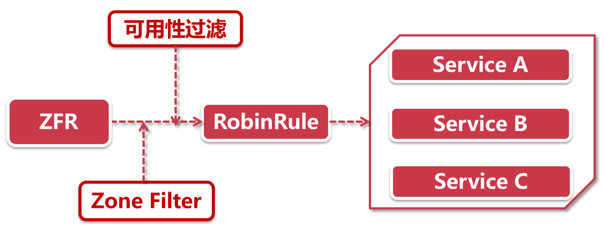
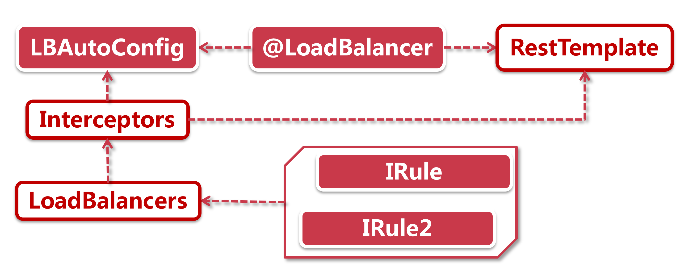
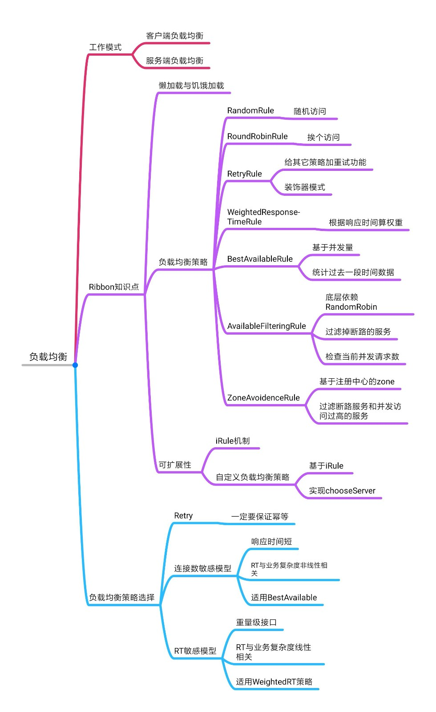

## 负载均衡介绍

负载均衡这个概念其实很简单，我们先举个生活中的例子，薅羊毛：

有一群羊，你要薅100根羊毛，如何选择羊就是负载均衡要干的事，100根羊毛就相当于100个请求，一群羊就是服务节点，如果没有负载均衡，我们只挑一群羊中的某个羊狠狠地薅，就成下面这个样子了：


所以**负载均衡就是将请求均匀的分发到每个服务节点上**。

负载均衡的核心概念：

- 雨露均沾
- 不能让某个节点特别累
- 要累就一起累

负载均衡相当重要，为什么呢？看看下面这个系统：


淘宝的UMP系统，也就是计算折扣优惠的系统，在淘宝主链路中起着相当重要的角色，所以他的并发量请求量也是非常大的，可以排在淘宝全部服务的Top5。

这么一个大并发量的系统，其背后的集群节点肯定数不胜数，就一个微服务就需要5000台机器来支持，如果没有负载均衡，**那5000台机器你要怎么选择？就要依靠负载均衡**


还有一点，平常的时候我们部署5000台集群，但是如果到了618双十一，就要双倍三倍的集群节点增加，那么请问：**虚拟机添加，对单机性能有没有影响？没有**，不管你怎么加，单机的性能就是那样的，那为什么要加机器？因为我们**实际承接的性能是单机乘以节点数量，这些都是依靠负载均衡实现的**，如果没有负载均衡，你节点加的再多，可能请求到的就只有几台几十台。

所以，**负载均衡是一个很简单的概念，实现起来也简单，但他的作用绝对不简单**

### 客户端与服务端

负载均衡具有客户端负载均衡实现与服务端负载均衡实现两种，两种各有各的好处。

**客户端负载均衡**：


客户端可以获取所有服务节点的机器列表，如Eureka，客户端可以获取注册中心的所有可用服务列表，然后通过自己制定的负载均衡策略，可以获知该请求的服务节点进行请求。

主要有三点：

- 机器列表保存在客户端
- 机器列表是动态变化的
- 负载均衡策略由客户端自己制定

**服务端负载均衡**：


服务端负载均衡依靠一个中间件来实现，客户端是没有机器列表的，客户端的请求会发送到中间服务端负载均衡组件，然后就等着响应就可以了，实际负载均衡以及请求后面的服务节点获取数据，都是由服务端负载均衡组件实现的。客户端更轻松，少了负载均衡任务

**客户端与服务端优缺点**：


- 客户端负载均衡策略是编写在客户端里的，所以对于开发团队来说修改灵活，随意修改，但是服务端的负载均衡一般是由运维团队修改的，开发团队没有权限进行修改
- 客户端运维成本低，和之前一样jar包部署即可，但是服务端无意义添加了一个工作项，所以成本也就提高了
- 客户端要保存服务列表在自身，所以需要向注册中心拉取，所以强依赖与注册中心，而服务端不依赖
- 客户端一般来说都是鱼微服务框架在一起的，比如Ribbon，Feign，Hystrix；而服务端都是与传统Tomcat绑定使用

那么我们应该如何选择呢？当然是**客户端+服务端一起使用**，这样负载均衡策略更加完整，并发性能更高

## 初识Ribbon

Ribbon其实是一个简单的小组件，用于负载均衡

我们拿小时候的经典动画片，圣斗士星矢来举例子，黄金圣衣是最厉害的装备，其中天秤座圣衣是最特殊的一件，因为他有几个特点：

- 丰富的武器库，由12件兵器组成，煎炸烹炒样样精通
- 适配性好，谁穿都行，五小强谁都可以用

Ribbon就像天秤座圣衣一样，有着一模一样的特点：

- **丰富的组件库** 整套负载均衡由7个具体策略组成，不管你是什么特殊需求，都有合适的策略供你选择
- **给谁都能用** 适配性好，跟谁都能搭配，SpringCloud里的五小强（eureka，feign，gateway，zuul，hystrix），谁拿都能用

更牛的是Ribbon可以脱离SpringCloud单独在项目中使用~

## 走近Ribbon

既然谁都可以用，我们上一节刚学了Eureka，我们看看Eureka是如何和Ribbon组合使用的，如下图，其中**红边白底的是Ribbon的组件**


请求进来，到Eureka Client消费，Eureka通过服务发现获取到一大堆的服务地址，但是他不知道调用哪个，这个任务就交给Ribbon来完成了。

- IPing：这是一个healthcheck机制，用来Ping一下目标机器是否还在线的，一般情况下IPing不会主动发起healthcheck请求，而是使用静默处理，返回true就默认表示所有节点都可用（和Eureka集成的时候，会检测节点的UP状态）
- IRule：这就是负载均衡组件库了，他是一个规则接口，有大量的负载均衡实现类，会有一个默认的实现类，当请求过来后，就会调用IRule接口，实际使用默认的实现类或配置的实现类，来进行负载均衡策略选择一台服务节点进行调用，把请求转发过去

Ribbon的体系架构相对简单，职责也比较单一，只应用于负载均衡，知识点不多，因此特别适合快速通关。考虑到Ribbon和Hystrix以及Feign有千丝万缕的关系，因此，关于Ribbon的retry部分知识，我将放到Feign和Hystrix中来展开

## 实现Ribbon

Ribbon是一个很简单的组件，实现起来也非常简单，我们这里先简单的使用它最基本的负载均衡功能，尝试一下

我们在之前的`spring-cloud-study`工程下创建`ribbon\ribbon-counsumer`模块

1.添加依赖

```xml
<dependencies>
    <dependency>
        <groupId>org.springframework.cloud</groupId>
        <artifactId>spring-cloud-starter-netflix-eureka-client</artifactId>
    </dependency>
    <dependency>
        <groupId>org.springframework.cloud</groupId>
        <artifactId>spring-cloud-starter-netflix-ribbon</artifactId>
    </dependency>
    <dependency>
        <groupId>org.springframework.boot</groupId>
        <artifactId>spring-boot-starter-web</artifactId>
    </dependency>
</dependencies>
```

2.添加配置文件

```yml
spring:
  application:
    name: ribbon-consumer
server:
  port: 31000
eureka:
  client:
    service-url:
      defaultZone: http://localhost:22222/eureka
```

3.添加Controller

```java
@RestController
public class Controller {

    @Autowired
    private RestTemplate restTemplate;

    @GetMapping("/sayHi")
    public String sayHi(){
        String result = restTemplate.getForObject("http://eureka-client/sayHi", String.class);
        return result;
    }
}
```

这里可以发现，和我们之前的Eureka-client没什么区别嘛，是的，因为它使用起来真得很简单，只需要下面一步

4.添加Application

```java
@SpringBootApplication
@EnableDiscoveryClient
public class RibbonClientApplication {

    @Bean
    @LoadBalanced
    public RestTemplate restTemplate(){
        return new RestTemplate();
    }

    public static void main(String[] args) {
        SpringApplication.run(RibbonClientApplication.class,args);
    }
}
```

没错，就一个@LoadBalanced注解即可，这样就赋予了RestTemplate负载均衡的能力~

5.测试

开启注册中心，开启两个Eureka-Client，修改端口，分别以30000和30001启动，最后启动Ribbon-Consumer

打开注册中心，会发现3个节点注册上去


然后就可以访问 http://localhost:31000/sayHi 测试


然后会发现会轮训的访问两个节点，说明负载均衡成功，Ribbon使用成功

## Ribbon高级知识点

### Ribbon懒加载

Ribbon是懒加载的，即第一次调用方法时，才会去加载LoadBalancer，可以通过日志发现：


在13秒的时候项目就启动起来了，但是当我们29秒请求接口的时候，再开始下面那句初始化LoadBalancer，所以他是懒加载的。

那么这种懒加载会不会出现问题呢？有可能，如果你第一个访问的接口耗时比较长，因为第一次需要初始化LoadBalancer，所以初始化时间+接口访问时间有可能会超出超时时间，导致访问失败。

那么有没有办法不让他懒加载呢？可以，使用以下配置：开启饥饿加载

```yml
ribbon:
  eager-load:
    clients: ribbon-cousumer # 开启的ribbon服务名称，就是当前服务名称
    enabled: true
```

然后查看日志


启动后就直接初始化了

### 修改负载均衡策略

这里我们先简单介绍两个负载均衡策略，以便我们修改，更多的负载均衡策略我们在下一小节详细介绍：

- RandomRule：顾名思义，随机访问
- RoundRobinRule：轮训访问

接着我们就来看看如何修改默认的负载均衡策略，这里主要有三种方式

#### 全局配置

```java
@Configuration
public class RibbonLSConfig {

    @Bean
    public IRule defaultLBStrategy(){
        return new RandomRule();
    }
}
```

想要使用什么策略，就new什么策略返回

#### 服务维度配置

服务维度配置有两种方式，基于注解与基于配置文件的

基于配置文件：

```yml
# 修改服务维度负载均衡策略
# 服务名称 + ribbon + NFLoadBalancerRuleClassName : 策略全限定类名
eureka-client:
  ribbon:
    NFLoadBalancerRuleClassName: com.netflix.loadbalancer.RandomRule
```

基于注解实现：

```java
@RibbonClient(name = "eureka-client",configuration = com.netflix.loadbalancer.RandomRule.class)
```

需要注意：

- 全局维度优先级大于服务维度的，即配置了全局维度，服务维度就不再生效了
- 注解实现的服务维度优先级高于配置文件实现

#### 方法维度配置

方法维度我们放在后面学习Feign的时候实现

### 负载均衡策略们

#### RandomRule

随机选择节点访问，看上去很简单，随便想一下就能知道他的原理，但其实不是那么简单，它底层使用了**自旋锁+yield**的方式进行重试，并编写了大量防御性编程，都是我们可以学习的。

让我们瞅瞅它的源码：

```java
public class RandomRule extends AbstractLoadBalancerRule {
    public RandomRule() {
    }

    @SuppressWarnings({"RCN_REDUNDANT_NULLCHECK_OF_NULL_VALUE"})
    public Server choose(ILoadBalancer lb, Object key) {
        // 防御性编程。判断负载均衡对象是否存在
        if (lb == null) {
            return null;
        } else {
            Server server = null;
            // 自旋锁
            while(server == null) {
                /* 注意这里，判断线程是否断开
                *  为什么要这么判断呢？因为在下面有一个yield()方法
                *  当取不到可用服务时，让给其他线程，此时该线程就断开了
                *  所以直接返回null
                *  这样其他线程再进来获取服务，就实现了重试机制
                * */
                if (Thread.interrupted()) {
                    return null;
                }

                // 获取所有可用服务列表
                List<Server> upList = lb.getReachableServers();
                // 获取所有服务列表
                List<Server> allList = lb.getAllServers();
                int serverCount = allList.size();
                // 如果不存在服务列表，返回null，防御性编程
                if (serverCount == 0) {
                    return null;
                }

                // 调用chooseRandomInt方法，传入种子为服务数，生成随机数
                int index = this.chooseRandomInt(serverCount);
                // 从可用列表中获取该随机数的服务
                server = (Server)upList.get(index);
                // 判断服务是否存在，防御性编程
                if (server == null) {
                    /* 重点！
                    *  如果服务不存在，使用yield把资源让给别的线程来请求
                    * */
                    Thread.yield();
                    continue;
                } else {
                    // 如果服务存活，返回服务
                    if (server.isAlive()) {
                        return server;
                    }

                    // 如果服务不存活，将服务置为null并线程出让
                    // 这样下个线程进来，依旧可以进入while循环
                    server = null;
                    Thread.yield();
                }
            }

            return server;
        }
    }

    protected int chooseRandomInt(int serverCount) {
        return ThreadLocalRandom.current().nextInt(serverCount);
    }

    // 外层调用的方法，实际调用重载方法
    public Server choose(Object key) {
        return this.choose(this.getLoadBalancer(), key);
    }

    public void initWithNiwsConfig(IClientConfig clientConfig) {
    }
}
```

通过源码可以看到，**RandomRule使用自旋锁(while(server == null))+yield实现重试策略，非常巧妙**，并且编写了大量防御性编程，也是非常好的一种习惯，**防御性编程就是防范于未然，虽然你知道服务列表不可能为空，还是要判断一下**

#### RoundRobinRule

RoundRobinRule是轮训访问服务节点，听着很简单，也有大道理，既然是轮训就肯定有线程安全问题，不然顺序就错乱了，其底层使用**自旋锁+CAS保证线程安全**，就是我们需要学习的点

```java
public class RoundRobinRule extends AbstractLoadBalancerRule {
    private AtomicInteger nextServerCyclicCounter;
   
    // ···

    public RoundRobinRule() {
        // 初始化下标从第0个开始
        this.nextServerCyclicCounter = new AtomicInteger(0);
    }

    public Server choose(ILoadBalancer lb, Object key) {
        if (lb == null) {
            log.warn("no load balancer");
            return null;
        }
        Server server = null;
        int count = 0;

        // 这里和RandomRule不同，最多次数为10次，超出10次后会跳出
        while(server == null && count++ < 10) {
            List<Server> reachableServers = lb.getReachableServers();
            List<Server> allServers = lb.getAllServers();
            int upCount = reachableServers.size();
            int serverCount = allServers.size();

            // 判断服务器是否为空
            if (upCount != 0 && serverCount != 0) {
                // 使用自旋锁+CAS保证线程安全，获取下一个地址下标
                int nextServerIndex = this.incrementAndGetModulo(serverCount);
                // 获取服务
                server = (Server)allServers.get(nextServerIndex);
                // 判断服务
                if (server == null) {
                    Thread.yield();
                } else {
                    if (server.isAlive() && server.isReadyToServe()) {
                        return server;
                    }

                    server = null;
                }
                continue;
            }

            log.warn("No up servers available from load balancer: " + lb);
            return null;
        }
        if (count >= 10) {
            log.warn("No available alive servers after 10 tries from load balancer: " + lb);
        }

        return server;
    }

    // 重点就在这个方法，使用自旋锁+CAS实现线程安全的获取下一次地址
    private int incrementAndGetModulo(int modulo) {
        // 自旋锁
        for(;;){
            // 从AtomicInteger中获取当前下标，第一次进入的时候是0
            int current = this.nextServerCyclicCounter.get();
            // 获取下一次下标，(当前下标+1)%所有节点数
            int next = (current + 1) % modulo;
            /* 使用CAS操作，保证线程安全
            *  底层调用 unsafe.compareAndSwapInt()方法 该方法是由native修饰的，即是基于操作系统的编程实现，与Java无关
            *  这个方法主要是判断当前底层保存的这个数，和传入的第一个也就是current是否相等
            *  类似乐观锁机制，如果相等直接返回，不相等设置为第二个数即next
            *  这里会发现有两步操作，比较，设置，那还是原子性操作吗？底层这两部操作其实是一步操作，所以是原子性的
            * */
            if(this.nextServerCyclicCounter.compareAndSet(current, next))
                return next;
        }
    }

    public Server choose(Object key) {
        return this.choose(this.getLoadBalancer(), key);
    }

    public void initWithNiwsConfig(IClientConfig clientConfig) {
    }
}
```

通过源码阅读，我们会发现自旋锁+CAS听着高深，但其实是很简单实现线程安全的一种方式，在Netflix中，大量使用了这种机制

**这里有一个问题**

如果有4000台服务节点全部挂掉，当轮训进来时，每次都会从第一个节点开始判断是否可用，那么大量并发进来后，全部挤压到第一台，然后第二台，然后第三台，这样就会给机器带来更大的压力了，应该如何解决呢？

#### BestAvailableRule

该规则为找到非熔断最空闲的服务，话不多说，先看代码

```java
public class BestAvailableRule extends ClientConfigEnabledRoundRobinRule {
    private LoadBalancerStats loadBalancerStats;

    public BestAvailableRule() {
    }

    public Server choose(Object key) {
        // 如果当前loadBalancerStats负载均衡状态为null，使用父类的choose方法
        // 父类的choose方法是什么？通过继承类ClientConfigEnabledRoundRobinRule可以知道
        // 使用的是RoundRobinRule
        if (this.loadBalancerStats == null) {
            return super.choose(key);
        } else {
            // 获取所有服务
            List<Server> serverList = this.getLoadBalancer().getAllServers();
            // 设置最小的当前连接数为 最大值，为什么这么做？往后看
            int minimalConcurrentConnections = Integer.MAX_VALUE;
            // 获取当前时间，有什么用？ 往后看
            long currentTime = System.currentTimeMillis();
            Server chosen = null;
            // 循环Server列表，寻找最合适的服务
            for(Server server : serverList){
                // 获取当前服务的服务状态
                ServerStats serverStats = loadBalancerStats.getSingleServerStat(server);
                /* 重点一：判断该服务状态是否处于熔断状态 */
                if (!serverStats.isCircuitBreakerTripped(currentTime)) {
                    // 获取该服务的当前连接数
                    int concurrentConnections = serverStats.getActiveRequestsCount(currentTime);
                    /* 重点二：判断当前服务连接数，是否小于最小连接数
                    *  如果是，将最小连接数设置为当前服务连接数，并且将选择的服务设置为当前服务
                    *  这样，不断循环所有服务，就可以找到最空闲的服务返回
                    *  */
                    if (concurrentConnections < minimalConcurrentConnections) {
                        minimalConcurrentConnections = concurrentConnections;
                        chosen = server;
                    }
                }
            }

            // 如果没有选择到服务，使用轮训获取下一服务
            if (chosen == null) {
                return super.choose(key);
            } else {
                return chosen;
            }
        }
    }

    public void setLoadBalancer(ILoadBalancer lb) {
        super.setLoadBalancer(lb);
        if (lb instanceof AbstractLoadBalancer) {
            this.loadBalancerStats = ((AbstractLoadBalancer)lb).getLoadBalancerStats();
        }

    }
}
```

通过源码查看，我们会发现当loadBalancerStats不存在的时候，会使用RoundRobinRule策略进行选择，并且发现两个重点，第二个重点我们很清晰了，就是依靠连接数循环获取最空闲的服务，第一个重点判断是否熔断是怎么实现的呢？我们再看源码：

```java
public boolean isCircuitBreakerTripped(long currentTime) {
    // 获取当前熔断结束时间
    long circuitBreakerTimeout = getCircuitBreakerTimeout();
    // 如果不存在，小于0，返回false
    if (circuitBreakerTimeout <= 0) {
        return false;
    }
    // 判断熔断结束时间是否大于当前时间，大于返回true表示还在熔断状态，小于返回false，表示不处于
    return circuitBreakerTimeout > currentTime;
}
```

然后进入getCircuitBreakerTimeout，查看如何获取熔断超时时间

```java
// 获取熔断结束时间
private long getCircuitBreakerTimeout() {
    // 获取熔断时间
    long blackOutPeriod = getCircuitBreakerBlackoutPeriod();
    if (blackOutPeriod <= 0) {
        return 0;
    }
    // 用最后一次失败请求时间+熔断时间，为熔断结束时间
    return lastConnectionFailedTimestamp + blackOutPeriod;
}

// 获取熔断时间
private long getCircuitBreakerBlackoutPeriod() {
    // 每次请求都会保存在successiveConnectionFailureCount这个缓存数中
    // 获取失败次数
    int failureCount = successiveConnectionFailureCount.get();
    // 获取阈值
  	// 阈值从niws.loadbalancer.default.connectionFailureCountThreshold配置中获取，如果没有默认为3
    int threshold = connectionFailureThreshold.get();
    // 判断失败次数是否超出阈值，如果没有，则不熔断
    if (failureCount < threshold) {
        return 0;
    }
    // 接下来用来计算熔断时间，基本也是从配置或默认值中取来计算
    int diff = (failureCount - threshold) > 16 ? 16 : (failureCount - threshold);
    int blackOutSeconds = (1 << diff) * circuitTrippedTimeoutFactor.get();
    if (blackOutSeconds > maxCircuitTrippedTimeout.get()) {
        blackOutSeconds = maxCircuitTrippedTimeout.get();
    }
    // 返回熔断时间
    return blackOutSeconds * 1000L;
}
```

通过源码，我们基本知道了Ribbon此规则，是如何计算服务是否熔断以及熔断时间的，就是根据该服务失败请求是否超出阈值来判断。

我们再回过头**总结该策略**：

- 基于RoundRobinRule，如果获取不到LoadBalancerStats时，**使用轮训**
- 循环服务节点
  - **判断该服务是否熔断**，用失败请求是否超出阈值（默认为3）来判断，并计算熔断结束时间是否已经结束
  - 如果服务正常，**获取最小连接数**，连接数最小即并发量最小的被选中为服务节点
- 如果循环找不出服务节点，**还是使用轮训获取**

#### RetryRule

卷土重来，是一种重试规则，它本身是没有具体负载均衡策略的，它是一层包装器，用于包装其他的策略，底层依赖于其他的策略（默认为RoundRobinRule，可以通过构造方法修改），只是在其他策略至少，添加了一层失败重试的策略

让我们看看源码：

```java
public Server choose(ILoadBalancer lb, Object key) {
	// 获取当前时间
    long requestTime = System.currentTimeMillis();
    // 获取超时时间，这里是为了设定重试超时时间，而不是一直重试
    long deadline = requestTime + maxRetryMillis;

    Server answer = null;

    // 选择一个服务，这里subRule就是底层包装的策略
    answer = subRule.choose(key);

    // 如果服务不存在，且当时时间没有超过超时时间，进入重试
    if (((answer == null) || (!answer.isAlive()))
        && (System.currentTimeMillis() < deadline)) {

        // 指定一个断开任务，时间为超时时间减去当前时间
        InterruptTask task = new InterruptTask(deadline
                                               - System.currentTimeMillis());

        // 只要线程没有断开，就一直重试
        while (!Thread.interrupted()) {
            // 获取服务
            answer = subRule.choose(key);

            // 还是不行，即线程让步，让下一个来重试
            if (((answer == null) || (!answer.isAlive()))
                && (System.currentTimeMillis() < deadline)) {
                /* pause and retry hoping it's transient */
                Thread.yield();
            } else {
                break;
            }
        }

        // 如果获取到服务了，将任务取消
        task.cancel();
    }

    // 最后判断返回服务
    if ((answer == null) || (!answer.isAlive())) {
        return null;
    } else {
        return answer;
    }
}
```

#### WeightedResponseTimeRule

这个策略继承自RoundRobinRule，会根据**节点响应时间计算权重**，响应时间越长，权重越低，权重高低决定了机器被选中的概率高低，**响应时间越小权重越大被选中概率越高**。

在服务器刚启动的时候，因为数据不完全，所以**会先使用轮训策略，当获取到足够的响应时间权重后**，就会切换到权重模式，通过计算权重进行比较，来获取服务

#### **AvailabilityFilteringRule** 

可用性过滤策略，这个策略底层也是基于RoundRobinRule轮训规则的，但它又和BestAvailableRule策略很像，它会进行可用性过滤

- **是否处于熔断状态**，需要与Hystrix配合使用
- 判断当前**节点的连接数是否超出阈值**，超出说明**并发量大**，太忙了，不适合选择

如果都不满足这两点，说明该服务可用，会被选择

#### ZoneAvoidanceRule

这个策略相较于AvailableFilteringRule，多加了一层过滤，就是地区过滤



- **Zone Filter**: 在Eureka注册中一个服务节点有Zone, Region和URL三个身份信息，其中Zone可以理解为机房大区（未指定则由Eureka给定默认值），而这里会对这个Zone的健康情况过滤其下面所有服务节点
- **可用性过滤**：这里和AvailabilityFilteringRule的验证非常像，会过滤掉当前并发量较大，或者处于熔断状态的服务节点

#### 我该选什么策略

策略说多不算多，说少不算少，应该选什么策略，主要还是看业务

- Retry：不是很好的策略，如果发生网络闪断，调用方可以请求到提供方，但是提供方无法给调用方返回响应，但实际以及完成业务逻辑了，比如添加库存，那么调用方会不断重试，库存越来越多，就会产生大bug
- BestAvailableRule：对于一些响应请求（Response Time，简称RT）短的请求，它的业务处理消耗时间很短，比如2ms，但是网络开销很长，这时如果请求过多，连接数饱和，就会达到性能瓶颈，对于这种 **连接数敏感，响应时间短，不应该被连接数限制性能的业务，我们应该使用可用连接数负载均衡策略**
- WeightedResponseTimeRule：对于一些接口，它的RT与请求参数有关，比如10个请求参数，会大量使用cpu，内存等资源，响应时间长，但是2个请求参数，很快就会返回响应，这种**对响应时间敏感的，对重量级接口，尤其是根据参数不同会导致系统资源使用率浮动较大的接口（RT与业务复杂度线性相关），建议采用基于响应时间的负载均衡策略**
- AvailabilityFilteringRule：如果集成了熔断器，那么根据熔断状态做过滤，配合Hystrix使用是极好的

### 负载均衡原理解析

回想我们是如何开启负载均衡的，就是往RestTemplate上添加@LoadBalanced这个注解，那么为什么这么神奇一个注解就可以搞定负载均衡呢？我们来探究一下

这里我做一次天神，先提前告知原理，然后再进入源码看看实际实现：



- **@LoadBalanced** 这个注解一边挂在RestTemplate上，一边挂在LoadBalanceAutoConfiguration上，熟悉SpringBoot的都知道，看到AutoConfiguration，就知道和自动注册类有关，即程序启动的时候就会进行一系列的加载初始化，其实在@LoadBalanced注解上，还有一个`@Qualifier`注解，该注解与@Autowire的搭配，通过name属性，装配到指定位置上，这里「LoadBalanced」也是借助Qualifier实现了一个给RestTemplate打标签的功能，**凡是被打标的RestTemplate都会被传送到AutoConfig中做进一步改造**
- **LBAutoConfig**：从前一步打上标签的RestTemplate，都会被他获取到，通过它的装配，**会将一系列的拦截器装到RestTemplate中**，相当于为他全副武装，这样打仗的时候才能冲锋陷阵，负载均衡。当有http网络请求进来后，都会被Ribbon拦截，**找到对应的LoadBalancer进行监管，LoadBalancer就会找配置的负载均衡策略，对Http请求进行转发**

#### 源码解析

首先进入@LoadBalanced查看

```java
@Target({ ElementType.FIELD, ElementType.PARAMETER, ElementType.METHOD })
@Retention(RetentionPolicy.RUNTIME)
@Documented
@Inherited
@Qualifier
public @interface LoadBalanced {

}
```

我们会发现这个注解很简单，没有什么线索，但是有一个重要的就是@Qualifier，有了这个注解，@LoadBalanced就可以想@Autowire一样，标注在某个对象上来获取相对的实例引用，为什么说他重要呢？我们搜一下@LoadBalanced注解在哪里被引用

```java
public class LoadBalancerAutoConfiguration {

    @LoadBalanced
    @Autowired(required = false)
    private List<RestTemplate> restTemplates = Collections.emptyList();

    ···
}
```

我们会发现，在LoadBalancerAutoConfiguration上，通过@LoadBalanced注解，获取了RestTemplate对象集合，这些对象是被@LoadBalanced打上标签的，才会被注入进来，接着我们看看这些对象在哪里被使用了

```java
@Bean
public SmartInitializingSingleton loadBalancedRestTemplateInitializerDeprecated(
    final ObjectProvider<List<RestTemplateCustomizer>> restTemplateCustomizers) {
    return () -> restTemplateCustomizers.ifAvailable(customizers -> {
        // 循环RestTemplate
        for (RestTemplate restTemplate : LoadBalancerAutoConfiguration.this.restTemplates) {
            // 为每个RestTemplate进行改造，通过RestTemplateCustomizer
            for (RestTemplateCustomizer customizer : customizers) {
                customizer.customize(restTemplate);
            }
        }
    });
}
```

还是这个类，我们会发现在`loadBalancedRestTemplateInitializerDeprecated`方法中会被RestTemplateCustomize进行改造，那么改造他的这个类，是什么，会怎么改造呢？

```java
@Bean
public LoadBalancerInterceptor ribbonInterceptor(
    // 初始化负载均衡拦截器
    LoadBalancerClient loadBalancerClient,
    LoadBalancerRequestFactory requestFactory) {
    return new LoadBalancerInterceptor(loadBalancerClient, requestFactory);
}

@Bean
@ConditionalOnMissingBean
public RestTemplateCustomizer restTemplateCustomizer(
    final LoadBalancerInterceptor loadBalancerInterceptor) {
    return restTemplate -> {
        // 首先获取RestTemplate中自带的拦截器们
        List<ClientHttpRequestInterceptor> list = new ArrayList<>(
            restTemplate.getInterceptors());
        // 将负载均衡拦截器加入到拦截器集合
        list.add(loadBalancerInterceptor);
        // 重新为RestTemplate赋予拦截器
        restTemplate.setInterceptors(list);
    };
}
```

代码很简单，功能也很简单，就是为RestTemplate加上`LoadBalancerInterceptor`这个负载均衡拦截器，那么我们去看看这个拦截器主要是用来做什么的？

```java
@Override
public ClientHttpResponse intercept(final HttpRequest request, final byte[] body,
                                    final ClientHttpRequestExecution execution) throws IOException {
    // 获取请求路径，比如 http://eureka-client/sayHi
    final URI originalUri = request.getURI();
    // 获取请求服务名称，比如eureka-client
    String serviceName = originalUri.getHost();
    // 断言判断服务名称是否为null
    Assert.state(serviceName != null,
                 "Request URI does not contain a valid hostname: " + originalUri);
    // 调用LoadBalancer进行执行请求，传入服务名称
    return this.loadBalancer.execute(serviceName,
                                     this.requestFactory.createRequest(request, body, execution));
}
```

拦截器主要用来获取服务名称，并将请求给负载均衡器进行处理，然后我们看看负载均衡器是如何处理的

```java
public <T> T execute(String serviceId, LoadBalancerRequest<T> request, Object hint)
    throws IOException {
    // 获取负载均衡器
    ILoadBalancer loadBalancer = getLoadBalancer(serviceId);
    // 使用，进行挑选服务
    Server server = getServer(loadBalancer, hint);
    if (server == null) {
        throw new IllegalStateException("No instances available for " + serviceId);
    }
    // 服务存在，封装到RibbonServer中
    RibbonServer ribbonServer = new RibbonServer(serviceId, server,
                                                 isSecure(server, serviceId),
                                                 serverIntrospector(serviceId).getMetadata(server));

    // 最后实际发送http请求，并获取响应返回
    return execute(serviceId, ribbonServer, request);
}
```

主要就是通过负载均衡器找到一个服务，来进行请求调用获取返回结果，我们主要看一下如何挑选服务的

```java
//首先会进入到这个负载均衡器
public class ZoneAwareLoadBalancer<T extends Server> extends DynamicServerListLoadBalancer<T> {
     @Override
    public Server chooseServer(Object key) {
        // 判断Zone是否只有一个，说明只有一个地区，使用父类最基础的负载均衡器来挑选服务
        if (!ENABLED.get() || getLoadBalancerStats().getAvailableZones().size() <= 1) {
            logger.debug("Zone aware logic disabled or there is only one zone");
            return super.chooseServer(key);
        }
        ···
    }
}

// 最基础的负载均衡器
public class BaseLoadBalancer extends AbstractLoadBalancer implements
        PrimeConnections.PrimeConnectionListener, IClientConfigAware {
    public Server chooseServer(Object key) {
        if (counter == null) {
            counter = createCounter();
        }
        counter.increment();
        if (rule == null) {
            return null;
        } else {
            try {
                // 使用配置的rule来挑选服务
                return rule.choose(key);
            } catch (Exception e) {
                logger.warn("LoadBalancer [{}]:  Error choosing server for key {}", name, key, e);
                return null;
            }
        }
    }
}
```

源码通俗易懂，就是通过我们配置的IRule，来进行挑选服务，如果没有配置，使用默认的轮训策略

#### 总结

- @LoadBalanced注解中存放了@Qualifier注解，被他标记的RestTemplate，会被LoadBalancerAutoConfiguration捕获
- LBAutoConfiguration会为每个标记的RestTemplate添加LoadBalancerInterceptor负载均衡拦截器
- 负载均衡拦截器在http请求到来后，会根据服务名称挑选负载均衡器，将请求交由给他
- 负载均衡器通过服务名称找到配置的IRule，调用获取服务
- 最后封装到RibbonServer中发起Http请求并获取返回结果进行响应

### IPing机制解析

IPing是Ribbon闲着没事干，找乐子的一个机制，他会主动判断当前服务节点的状态，决定是否可以作为目标节点，只有可用，才会作为目标节点，主要有三种机制：

- DummyPing-自娱自乐：没有任何作用，直接返回true，默认所有节点可用，单独使用Ribbon时默认机制
- NIWSDiscoveryPing-隔山打牛：配合Eureka使用，借助Eureka的服务发现机制获取节点状态，如果为up即可用
- PingUrl-主动出击：主动的向服务节点发出http调用，响应才可用

一般来说，第二种机制就可以了，对于第三种机制一定要谨慎使用，不然某个接口本来并发压力就大，你RIbbon也要掺一脚，不是要了我这个老服务的命吗？

### 自制IRule机制

IRule是可以由我们自己实现，然后添加到Ribbon中使用的，自制IRule之前，我们需要看一下，IRule是如何加载到Ribbon中的？

#### 源码解析

直接看源码，先进入IRule，然后找他的使用，找Configuration名字的类，就会找到RibbonClientConfiguration

```java
public class RibbonClientConfiguration {
    @ConditionalOnMissingBean
    public IRule ribbonRule(IClientConfig config) {
        // 判断配置文件中是否配置了IRule
        if (this.propertiesFactory.isSet(IRule.class, name)) {
            // 如果有配置，创建配置的Rule实例并返回
            return this.propertiesFactory.get(IRule.class, config, name);
        }
        // 返回默认的IRule策略
        ZoneAvoidanceRule rule = new ZoneAvoidanceRule();
        rule.initWithNiwsConfig(config);
        return rule;
    }

    @Bean
    @ConditionalOnMissingBean
    public ILoadBalancer ribbonLoadBalancer(IClientConfig config,
                                            ServerList<Server> serverList, ServerListFilter<Server> serverListFilter,
                                            IRule rule, IPing ping, ServerListUpdater serverListUpdater) {
        // 判断配置文件中是否配置了负载均衡器
        if (this.propertiesFactory.isSet(ILoadBalancer.class, name)) {
            // 配置了返回对应的实例
            return this.propertiesFactory.get(ILoadBalancer.class, config, name);
        }
        // 将刚刚创建的IRule实例赋予进去
        return new ZoneAwareLoadBalancer<>(config, rule, ping, serverList,
                                           serverListFilter, serverListUpdater);
    }
}
```

这里我们会发现，会根据配置文件，查看是否配置了IRule，如果有就实例化配置的并返回，然后加载到负载均衡器中，接着我们看看他是如何从配置文件中取到IRule具体实例对象的？

```java
public <C> C get(Class<C> clazz, IClientConfig config, String name) {
    // 获取配置的类名称
   String className = getClassName(clazz, name);
   if (StringUtils.hasText(className)) {
      try {
          // 实例化类名称，实际就是使用newInstance()，所以我们需要在自定义的IRule中添加无参构造
         Class<?> toInstantiate = Class.forName(className);
         return (C) SpringClientFactory.instantiateWithConfig(toInstantiate,
               config);
      }
      catch (ClassNotFoundException e) {
         throw new IllegalArgumentException("Unknown class to load " + className
               + " for class " + clazz + " named " + name);
      }
   }
   return null;
}
```

通过源码可以看到，会通过getClassName方法获取类名称，然后实例化它，我们进入方法看看

```java
public String getClassName(Class clazz, String name) {
    // 判断配置中是否包含IRule这个对象
    if (this.classToProperty.containsKey(clazz)) {
        // 从中取出value，value为NFLoadBalancerRuleClassName
        String classNameProperty = this.classToProperty.get(clazz);
        // 然后从环境中取出 name + "." + NAMESPACE + "." + classNameProperty 的配置
        // 这个就是我们在上面服务维度修改配置的key名称，服务名称+ribbon+NFLoadBalancerRuleClassName
        // 类名称就是配置的名称，这里是com.netflix.loadbalancer.RoundRobinRule
        String className = environment
            .getProperty(name + "." + NAMESPACE + "." + classNameProperty);
        // 返回类名称
        return className;
    }
    return null;
}
```

最后会返回配置文件中配置的类名称，然后进行实例化

#### 自制IRule

看完了源码，我们知道只需将我们的IRule配置在配置文件，即可被加载，接着就是来造轮子了

这里我们制作一个一致性哈希实现的IRule

一致性Hash比较复杂，网络上有很多成熟的解决方案，我们这里简单实现以下

- 根据uri，请求名称与参数，来计算hash值
- 服务节点根据id，计算在环上的位置

```java
public class MyRule extends AbstractLoadBalancerRule implements IRule {
    @Override
    public void initWithNiwsConfig(IClientConfig iClientConfig) {

    }

    @Override
    public Server choose(Object key) {
        // 通过uri计算hash
        HttpServletRequest request = ((ServletRequestAttributes) RequestContextHolder.getRequestAttributes())
                .getRequest();
        String uri = request.getServletPath() + "?" + request.getQueryString();

        // 计算获取Server
        return route(uri.hashCode(), getLoadBalancer().getAllServers());
    }

    private Server route(int key, List<Server> allServers) {
        if (allServers == null) {
            return null;
        }

        // 创建一个Map，用来存放环上的服务位置
        TreeMap<Long,Server> treeMap = new TreeMap();
        for (Server server : allServers) {
            // 计算server所在位置
            for (int i = 0; i < 8; i++) {
                long hash = hash(server.getId() + i);
                // 保存到map中
                treeMap.put(hash,server);
            }
        }

        // 获取uri的hash值
        long address = hash(Integer.valueOf(key).toString());
        // 找到环中最靠近的下一个服务节点
        SortedMap<Long, Server> sortedMap = treeMap.tailMap(address);

        // 判断Server是否存在，不存在说明处在环的最后位置
        // 他该请求的节点是第一个服务
        if(sortedMap.isEmpty()){
            return treeMap.firstEntry().getValue();
        }

        return sortedMap.get(sortedMap.firstKey());
    }

    /**
     * 算法：RSHash（因Robert Sedgwicks在其《Algorithms in C》一书中展示而得名）
     * @param key
     * @return
     */
    public long hash(String key) {
        int a = 63689;
        int b = 378551;
        long hash = 0;
        for (int i = 0; i < key.length(); i++) {
            hash = hash * a + key.charAt(i);
            //System.out.println(hash);
            a = a * b;
            //System.out.println(a);
        }
        return (hash & 0x7FFFFFFF);
    }
}
```

自制IRule，我们需要实现IRule接口，并集成AbstractLoadBalancerRule类

实现完成后，我们只需将其加在配置文件中即可

```yml
eureka-client:
  ribbon:
    NFLoadBalancerRuleClassName: com.pacee1.springcloud.rule.MyRule
```

## 总结

