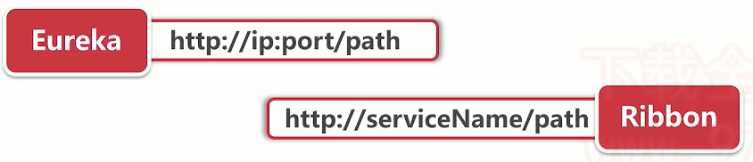
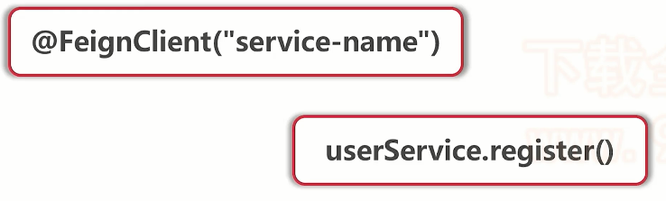
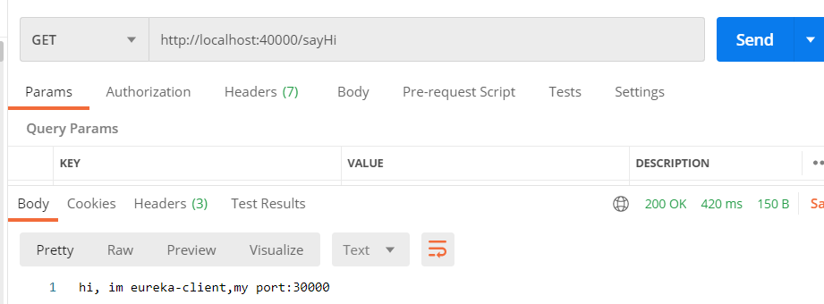
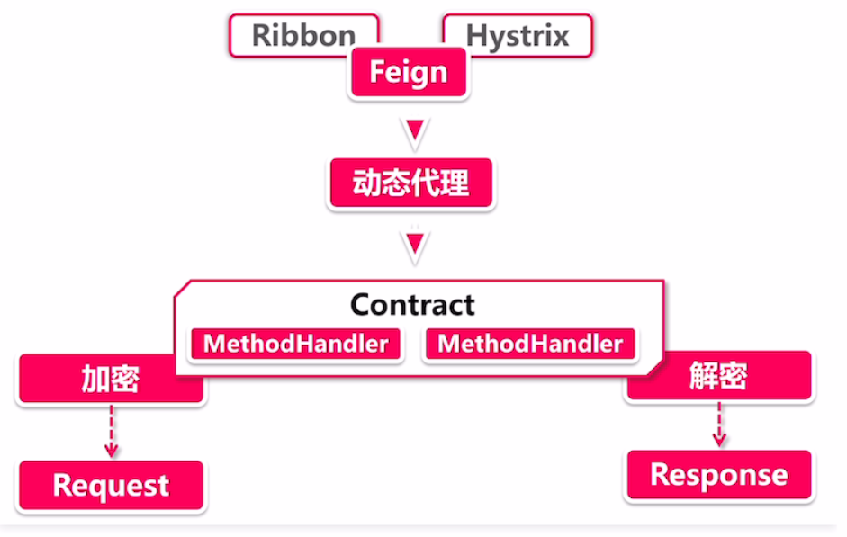
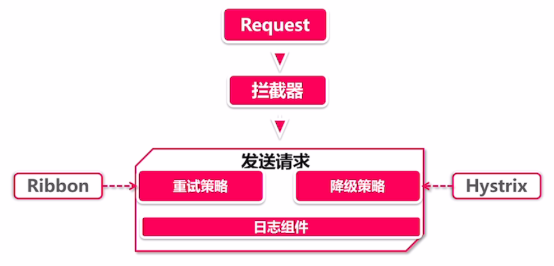
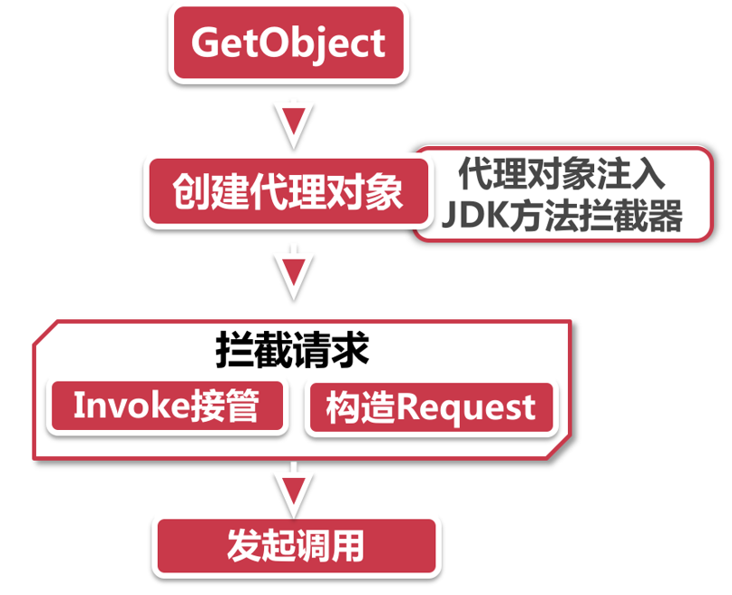
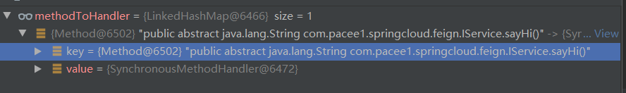
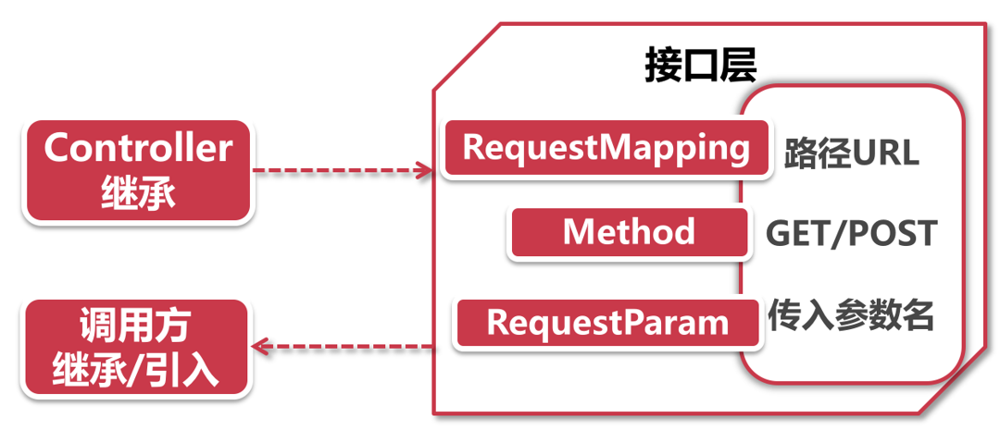

## Feign的介绍

通过之前的学习，我们对Feign的印象为，服务间调用的组件，那么就有疑问了，服务间调用从一开始的Eureka，Ribbon，都可以实现，为什么要使用Feign呢？而且看起来它还特别重要？

我们先看看之前Eureka以及Ribbon的调用方式：



具有强迫症and代码洁癖的人一眼就看出问题了：**请求地址需要拼接，并且写死在代码中**，这肯定忍不了了，再加上还需要配合RestTemplate使用才可以，也太麻烦了，每个Service或者Controller，只要一调用就需要把RestTemplate注入进来？

所以，Feign再次对服务间调用进行了优化，使服务间调用更简单了，并且有一些新的功能，我们先看看它是如何实现服务间调用的



- 只需要在接口上添加@FeignClient注解，并标识其服务名称
- 然后创建方法，并在方法上使用@GetMapping或Post，Put，Delete标识请求路径
- 然后就可以像调用方法一样进行服务间调用

如此方便快捷的配置与使用方式，Feign成为了SpringCloud微服务服务间通信与调用最火最热的组件

## 使用Feign

简单介绍完了Feign，让我们来实际使用一下，项目还是接着`spring-cloud-study`这个工程来创建

首先创建一个feign文件夹，并在下面创建`feign-consumer`模块

1.添加依赖

```xml
<dependencies>
    <dependency>
        <groupId>org.springframework.cloud</groupId>
        <artifactId>spring-cloud-starter-netflix-eureka-client</artifactId>
    </dependency>
    <dependency>
        <groupId>org.springframework.cloud</groupId>
        <artifactId>spring-cloud-starter-openfeign</artifactId>
    </dependency>
    <dependency>
        <groupId>org.springframework.boot</groupId>
        <artifactId>spring-boot-starter-web</artifactId>
    </dependency>
    <dependency>
        <groupId>org.springframework.boot</groupId>
        <artifactId>spring-boot-starter-actuator</artifactId>
    </dependency>
</dependencies>
```

2.创建Application

```java
@SpringBootApplication
@EnableDiscoveryClient
@EnableFeignClients
public class FeignConsumerApplication {
    public static void main(String[] args) {
        SpringApplication.run(FeignConsumerApplication.class,args);
    }
}
```

3.创建Feign接口，用于调用，该接口使用@FeignClient标识，会被Feign代理生成代理对象

```java
@FeignClient("eureka-client")
public interface IService {

    @GetMapping("/sayHi")
    public String sayHi();
}
```

- 接口添加@FeignClient注解，并标识服务名称
- 添加方法，并绑定请求路径与请求方式

4.添加Controller用于测试

```java
@RestController
public class Controller {
    
    @Autowired
    private IService service;

    @GetMapping("/sayHi")
    public String sayHi(){
        return service.sayHi();
    }
}
```

这里注入的IService就不再是我们创建的，而是由Feign接管，使用动态代理机制生成的代理Service对象

5.添加配置文件

```yml
spring:
  application:
    name: feign-consumer
server:
  port: 40000
eureka:
  client:
    service-url:
      defaultZone: http://localhost:22222/eureka
```

然后我们启动注册中心，Eureka-client，feign-consumer进行测试



请求40000端口，返回端口为30000是我们服务提供方，说明Feign使用成功

## Feign的架构

依照惯例，我们要开始扒开Feign的外衣了，Feign可不像Ribbon那么简单，NetFlix对Feign关爱有加，他就像是太子一样，Ribbon和Hystrix都是它的仆人

一句话总结Feign：**声明一个代理接口，服务调用者通过调用这个代理接口来实现服务消费**

Feign的链路相当复杂，我们主攻它最核心的东西，最核心的东西主要分为构建请求和发送请求

### 构建请求



1. **左右护法**：Feign作为太子，腕儿肯定大，左护法Ribbon，右护法Hystrix，只要引入Feign，因为其依赖关系，会自动引入其他两个
   - Ribbon：用来负载均衡以及失败重试
   - Hystrix：用于熔断机制，根据熔断器是否开启，判断是否发起此次调用
2. **动态代理**：方法调用时，Feign实际是通过代理对象进行发起Http请求远程调用，而这里就是生成代理对象的地方。Feign生成代理的使用了Builder模式，通过`Feign.build()`返回的构造器，来装配相关参数，然后使用ReflectFeign的`newInstance()`构造出代理实例，后面源码解析会详细研究
3. **Contract**：协议，就像Http协议一样，Feign也有自己的一套规范协议，只不过他不是解析Http请求，而是动态代理类。通过解析动态代理接口+Builder模式，会生成包含全部接口信息的MetondMetadata元数据，通过这些元数据生成MethodHandler对象，用于处理Request以及Response
   - Contract具有高度可扩展性，可以通过扩展将Feign集成到其他组件中

### 发送请求



1. **拦截器**：拦截器是Spring对于网络处理经典方案，从早期的Servlet，MVC，无一离不开拦截器，对于Feign也一样，Feign这里拦截器的作用主要是拦截Request请求以及Response响应，对其进行装饰，比如RequestInterceptor对Request对象构造请求头信息
2. **发送请求**：发送请求就又需要俩护法了
   - 重试：主要由Ribbon实现，当请求发送失败后，会根据制定的一些重试策略发起重试
   - 降级：Feign接口可以声明熔断降级策略，当请求发生异常，触发了熔断降级规则，就会被打入冷宫，具体Hystrix知识会在后面学习

## 源码解析

了解完架构后，我们就要深入源码进行研究了

### @EnableFeignClients

首先让我们看看这个全局的注解，起到什么作用，主要是干了什么？

```java
@Retention(RetentionPolicy.RUNTIME)
@Target(ElementType.TYPE)
@Documented
@Import(FeignClientsRegistrar.class)
public @interface EnableFeignClients {
    //···
}
```

进入注解，我们发现相关的信息较少，都是一些属性信息，但有一个关键点@Import，导入了FeignClientsRegistrar这个配置类，属性SpringBoot的都知道，@Import配合ImportBeanDefinitionRegistrar使用，可以实现配置类在启动阶段加载的功能

```java
class FeignClientsRegistrar
      implements ImportBeanDefinitionRegistrar, ResourceLoaderAware, EnvironmentAware {
}
```

进入Feign客户端注册类，果然看到了这个接口，那我们就去看看它的`registerBeanDefinitions`方法

```java
@Override
public void registerBeanDefinitions(AnnotationMetadata metadata,
      BeanDefinitionRegistry registry) {
    // 注册FeignClients上的配置
    registerDefaultConfiguration(metadata, registry);
    // 注册所有的FeignClient
    registerFeignClients(metadata, registry);
}
```

这里主要分为两步，清晰明了

- 注册@EnableFeignClients上的所有配置，因为这个注解可以配置一些属性，就是用来加载这些属性的，好为后面注册被@FeignClient标记的接口做准备
- 第二步就是注册所有被@FeignClient注解标注的接口

我们走进源码详细看一看，首先是`registerDefaultConfiguration`·方法

```java
private void registerDefaultConfiguration(AnnotationMetadata metadata,
                                          BeanDefinitionRegistry registry) {
    // 首先从注解上获取配置信息，因为我们没有配置，所以其实都是空的
    // 这个配置信息，主要是配置扫描的包，即FeignClient注解标记的接口所在的包
    Map<String, Object> defaultAttrs = metadata
        .getAnnotationAttributes(EnableFeignClients.class.getName(), true);

    if (defaultAttrs != null && defaultAttrs.containsKey("defaultConfiguration")) {
        String name;
        // 判断当前类，FeignConsumerApplication，是否有父类
        if (metadata.hasEnclosingClass()) {
            name = "default." + metadata.getEnclosingClassName();
        }
        else {
            // 没有，name设置为类的全限定类名
            name = "default." + metadata.getClassName();
        }
        // 注册我们的配置类
        registerClientConfiguration(registry, name,
                                    defaultAttrs.get("defaultConfiguration"));
    }
}

private void registerClientConfiguration(BeanDefinitionRegistry registry, Object name,
                                         Object configuration) {
    // 这里主要使用Spring的BeanDefinitionRegistry进行注册
    BeanDefinitionBuilder builder = BeanDefinitionBuilder
        .genericBeanDefinition(FeignClientSpecification.class);
    builder.addConstructorArgValue(name);
    builder.addConstructorArgValue(configuration);
    registry.registerBeanDefinition(
        name + "." + FeignClientSpecification.class.getSimpleName(),
        builder.getBeanDefinition());
}
```

通过源码查看，可以发现这一步其实很简单，就是获取注解上的配置信息，然后将被开启Feign注解标记的启动器类进行注册

接着我们看第二步，`registerFeignClients`

```java
public void registerFeignClients(AnnotationMetadata metadata,
                                 BeanDefinitionRegistry registry) {
    // 获取一个扫描包路径的Scanner
    ClassPathScanningCandidateComponentProvider scanner = getScanner();
    // 设置资源加载起
    scanner.setResourceLoader(this.resourceLoader);

    Set<String> basePackages;

    // 再次从EnableFeignClients注解上获取属性信息
    // 这里为什么不直接通过参数传入，而是重复获取呢？是因为该方法本身耗时很少，直接编写可以使代码更整洁明了，不然以参数形式传递，其实会更复杂
    Map<String, Object> attrs = metadata
        .getAnnotationAttributes(EnableFeignClients.class.getName());
    // 创建一个拦截器，拦截被FeignClient标记的类
    AnnotationTypeFilter annotationTypeFilter = new AnnotationTypeFilter(
        FeignClient.class);
    // 判断注解上属性是否为空，不为空则获取clients属性
    final Class<?>[] clients = attrs == null ? null
        : (Class<?>[]) attrs.get("clients");
    // 因为我们什么都没有声明，所以会走到这一步
    if (clients == null || clients.length == 0) {
        // 添加拦截器
        scanner.addIncludeFilter(annotationTypeFilter);
        // 获取默认的包扫描路径
        // 这里源码相对简单，为了方便阅读，就不放出来了
        // 主要逻辑是：
        // 		1.再次获取注解上的属性
        //		2.判断value、basePackages、basePackageClasses这些属性是否存在，这些属性主要用来配置扫描包的路径
        //		3.如果都不存在，默认获取启动器类FeignConsumerApp所在的包，为扫描的包返回
        basePackages = getBasePackages(metadata);
    }
    else {
        final Set<String> clientClasses = new HashSet<>();
        basePackages = new HashSet<>();
        for (Class<?> clazz : clients) {
            basePackages.add(ClassUtils.getPackageName(clazz));
            clientClasses.add(clazz.getCanonicalName());
        }
        AbstractClassTestingTypeFilter filter = new AbstractClassTestingTypeFilter() {
            @Override
            protected boolean match(ClassMetadata metadata) {
                String cleaned = metadata.getClassName().replaceAll("\\$", ".");
                return clientClasses.contains(cleaned);
            }
        };
        scanner.addIncludeFilter(
            new AllTypeFilter(Arrays.asList(filter, annotationTypeFilter)));
    }

    // 循环需要扫描的包
    for (String basePackage : basePackages) {
        // 获取包下所有被@FeignClient标记的类
        Set<BeanDefinition> candidateComponents = scanner
            .findCandidateComponents(basePackage);
        // 挨个循环这些类
        for (BeanDefinition candidateComponent : candidateComponents) {
            // 判断类是否加了注解，一定是
            if (candidateComponent instanceof AnnotatedBeanDefinition) {
                // verify annotated class is an interface
                // 将Bean转成注解类型的BeanDefinition
                AnnotatedBeanDefinition beanDefinition = (AnnotatedBeanDefinition) candidateComponent;
                // 获取该类元数据
                AnnotationMetadata annotationMetadata = beanDefinition.getMetadata();
                // 判断是否为接口，即我们的被代理类必须为接口才行
                Assert.isTrue(annotationMetadata.isInterface(),
                              "@FeignClient can only be specified on an interface");

                // 获取FeignClient注解上的属性，我们只配置了默认的属性name='eureka-client'
                Map<String, Object> attributes = annotationMetadata
                    .getAnnotationAttributes(
                    FeignClient.class.getCanonicalName());

                // 获取服务名称，即eureka-client
                String name = getClientName(attributes);
                // 同样的注册BeanDefinition
                registerClientConfiguration(registry, name,
                                            attributes.get("configuration"));
			   // 注册FeignClient，往下看方法
                registerFeignClient(registry, annotationMetadata, attributes);
            }
        }
    }
}

private void registerFeignClient(BeanDefinitionRegistry registry,
                                 AnnotationMetadata annotationMetadata, Map<String, Object> attributes) {
    // 获取类名称
    String className = annotationMetadata.getClassName();
  	// 注册元数据
    BeanDefinitionBuilder definition = BeanDefinitionBuilder
        .genericBeanDefinition(FeignClientFactoryBean.class);
    validate(attributes);
    // 将元数据塞入
    definition.addPropertyValue("url", getUrl(attributes));
    definition.addPropertyValue("path", getPath(attributes));
    String name = getName(attributes);
    definition.addPropertyValue("name", name);
    String contextId = getContextId(attributes);
    definition.addPropertyValue("contextId", contextId);
    definition.addPropertyValue("type", className);
    definition.addPropertyValue("decode404", attributes.get("decode404"));
    definition.addPropertyValue("fallback", attributes.get("fallback"));
    definition.addPropertyValue("fallbackFactory", attributes.get("fallbackFactory"));
    definition.setAutowireMode(AbstractBeanDefinition.AUTOWIRE_BY_TYPE);

    String alias = contextId + "FeignClient";
    AbstractBeanDefinition beanDefinition = definition.getBeanDefinition();

    // primary 用来区别两个接口同时实现同一个接口，说明两个接口是一样的Type，那么两个接口如果都添加了@FeignClient注解，就会出问题，primary就是用于区别他们的
    boolean primary = (Boolean) attributes.get("primary"); // has a default, won't be
    // null

    beanDefinition.setPrimary(primary);

    String qualifier = getQualifier(attributes);
    if (StringUtils.hasText(qualifier)) {
        alias = qualifier;
    }

    BeanDefinitionHolder holder = new BeanDefinitionHolder(beanDefinition, className,
                                                           new String[] { alias });
    // 完成注册
    BeanDefinitionReaderUtils.registerBeanDefinition(holder, registry);
}
```

源码较长，简单总结一下，**该方法就是获取扫描包路径，如果不存在，默认扫描启动器类所在的包，扫描出所有被@FeignClient标记的类，然后获取其属性，将其注册到BeanDefinition中，后续会由Spring统一管理**

### Feign的动态代理机制

我们上面了解到，Feign接口实际在调用时，是调用Feign生成的代理对象，从而发起http请求，那么我们就来看看Feign是如何生成代理对象，又是如何发起真正Http请求的



首先就是GetObject这个方法，为什么从这个方法入手呢？上一小段落，我们说到，在启动器类启动时，因为@EnableFeignClients注解的存在，被@FeignClients标记的类会被添加到BeanDefinition中，被Spring管理创建，那么在生成Bean的时候，就会调用FactoryBean的getObject方法，所以来到了FeignClientFactoryBean的getObject方法，让我们一探究竟：

```java
@Override
public Object getObject() throws Exception {
    // 实际调用getTarget()方法
    return getTarget();
}

<T> T getTarget() {
    // 获取Feign上下文对象，这已经生成上下文了？生成实际的代理Bean了？没有，这里包含的只是一些简单的信息
    FeignContext context = this.applicationContext.getBean(FeignContext.class);
    // 我们前面说到，Feign的创建是由Builder模式，也就是这里了，这里主要创建出一个Builder来，用来创建Feign代理对象
    Feign.Builder builder = feign(context);

    // 判断url属性是否为空
    if (!StringUtils.hasText(this.url)) {
        // 为空，为其拼接上http
        if (!this.name.startsWith("http")) {
            this.url = "http://" + this.name;
        }
        else {
            this.url = this.name;
        }
        // 这里，url其实就是 http://eureka-client
        this.url += cleanPath();
        // 然后进行构建代理对象，也是非常关键的一步
        // 在下面的流程是一样的，只不过如果，存在url，就进行一些其他处理，然后走到最后get，target方法，和这个loadBalance方法是一样的处理流程
        return (T) loadBalance(builder, context,
                               new HardCodedTarget<>(this.type, this.name, this.url));
    }
    if (StringUtils.hasText(this.url) && !this.url.startsWith("http")) {
        this.url = "http://" + this.url;
    }
    String url = this.url + cleanPath();
    Client client = getOptional(context, Client.class);
    if (client != null) {
        if (client instanceof LoadBalancerFeignClient) {
            // not load balancing because we have a url,
            // but ribbon is on the classpath, so unwrap
            client = ((LoadBalancerFeignClient) client).getDelegate();
        }
        builder.client(client);
    }
    Targeter targeter = get(context, Targeter.class);
    return (T) targeter.target(this, builder, context,
                               new HardCodedTarget<>(this.type, this.name, url));
}
```

在getTarget方法中，我们看到了，Feign实际使用Builder模式进行构建代理对象，实际的核心流程在loadBalance方法中，所以我们进去一探究竟

```java
protected <T> T loadBalance(Feign.Builder builder, FeignContext context,
                            HardCodedTarget<T> target) {
    // 创建了LoadBalanceFeignClient，这个Client很关键，是用来发送Http请求的，没看出来他很眼熟吗，就是Ribbon与Feign结合后的产物
    Client client = getOptional(context, Client.class);
    if (client != null) {
        // 将client也放进Builder中，这样之后创建目标类的时候，也会把Client加进去
        builder.client(client);
        // 生成HystrixTargeter对象，用于生成代理对象的
        Targeter targeter = get(context, Targeter.class);
        // 再次进入target，生成代理对象
        return targeter.target(this, builder, context, target);
    }

    throw new IllegalStateException(
        "No Feign Client for loadBalancing defined. Did you forget to include spring-cloud-starter-netflix-ribbon?");
}
```

这里的关键点就是LoadBalanceFeignClient也被创建放入Builder中，然后进入target方法一探究竟

```java
@Override
public <T> T target(FeignClientFactoryBean factory, Feign.Builder feign,
                    FeignContext context, Target.HardCodedTarget<T> target) {
    // 如果不是HystrixFeign，进入Feign的生成方法中
    if (!(feign instanceof feign.hystrix.HystrixFeign.Builder)) {
        return feign.target(target);
    }
    // 进行一系列关于Hystrix的处理，比如failback，failbackFactory等
	// 最后再使用Feign的生成方法生成目标对象
    return feign.target(target);
}

public <T> T target(Target<T> target) {
    return build().newInstance(target);
}

public Feign build() {
    //生成了一个SynchronousMethodHandler，看名字很有蹊跷，应该是后面实际invoke的地方~
    SynchronousMethodHandler.Factory synchronousMethodHandlerFactory =
        new SynchronousMethodHandler.Factory(client, retryer, requestInterceptors, logger,
                                             logLevel, decode404, closeAfterDecode, propagationPolicy);
    ParseHandlersByName handlersByName =
        new ParseHandlersByName(contract, options, encoder, decoder, queryMapEncoder,
                                errorDecoder, synchronousMethodHandlerFactory);
    // 最后返回了一个ReflectiveFeign，看名字也知道是动态代理了
    return new ReflectiveFeign(handlersByName, invocationHandlerFactory, queryMapEncoder);
}
```

这里的源码，也有些小细节

- Feign和Hystrix息息相关
- 生成了SynchronousMethodHandler被放入ReflectiveFeign中，看这名字，就相当到了动态代理，是不是实际代理方法invoke的地方？？
- ReflectiveFeign，实际生成目标对象的类，看名字就知道是动态代理了

最后，我们拨云见雾，终于找到newInstance方法了，这方法一看就是生成实例的地方，看看到底是什么样的代理对象藏得这么深

```java
// target参数中保存了：1.IService接口Type 2.name=eureka-client 3.url=http://eureka-client
public <T> T newInstance(Target<T> target) {
    // 创建两个Map
    // 保存了名称与Handler对照关系，名称为 接口名#方法名
    // 这里MethodHandler，保存的就是刚刚创建的SynchronousMethodHandler
    Map<String, MethodHandler> nameToHandler = targetToHandlersByName.apply(target);
    // 用来保存方法与Handler对照关系
    Map<Method, MethodHandler> methodToHandler = new LinkedHashMap<Method, MethodHandler>();
    List<DefaultMethodHandler> defaultMethodHandlers = new LinkedList<DefaultMethodHandler>();

    // 循环获取IService接口中所有方法
    for (Method method : target.type().getMethods()) {
        // 判断是否为Object，肯定不是，跳过
        if (method.getDeclaringClass() == Object.class) {
            continue;
        } else if (Util.isDefault(method)) { // 判断是否是默认的方法，也不是 不用管
            DefaultMethodHandler handler = new DefaultMethodHandler(method);
            defaultMethodHandlers.add(handler);
            methodToHandler.put(method, handler);
        } else {
            // 最后进入这里，往methodToHandler集合中存入方法，以及SynchronousMethodHandler
            methodToHandler.put(method, nameToHandler.get(Feign.configKey(target.type(), method)));
        }
    }
    // 这里就是JDK动态代理核心操作了，生成InvocationHandler
    // 将IService接口与我们创建的MethodToHandler相关联
    // 这样当请求IService接口时，就会交由InvocationHandler接管
    // 根据请求的方法，调用实际对应的MethodHandler方法
    InvocationHandler handler = factory.create(target, methodToHandler);
    T proxy = (T) Proxy.newProxyInstance(target.type().getClassLoader(),
                                         new Class<?>[] {target.type()}, handler);

    for (DefaultMethodHandler defaultMethodHandler : defaultMethodHandlers) {
        defaultMethodHandler.bindTo(proxy);
    }
    // 返回IService的代理对象
    return proxy;
}
```



#### 总结

Feign的动态代理机制是重中之重，我们再回过头来看这张图，总结一下


1. **getObject**：我们第一步就是getObject这个方法
   - 这个方法是在`FeignClientFactoryBean`中执行的，我们想要的是一个可以发起http远程调用的实体，实际生产的是一个代理对象
   - FeignClientFactoryBean封装了被@FeignClient标记的接口信息，比如Eureka服务名称，调用路径，降级处理逻辑等
2. **创建代理对象**：准备偷天换日
   - 实际是getTarget方法生成的代理对象，交由`HystrixTargeter`，因为这里没有用到Hystrix，所以直接进行创建
   - 创建代理对象，需要由`ReflectiveFeign.newInstance`来生产，底层使用Builder模式，将@FeignClient标记的接口名称，方法名，参数等一系列信息拿出来，通过反射拼接成Method类
   - 开始偷天换日，这里会将一个个的Method类与`SynchronousMethodHandler`关联起来，SynchronousMethodHandler是什么呢？就是换的那个日，实际调用都会来到他手里；通过JDK动态代理，InvocationHandler将接口与Method与MethodHandler关联起来，生成Proxy代理类
3. **代理请求**：当调用方法想要进行远程调用时，就会被InvocationHandler截胡
   - InvocationHandler根据其调用的方法名，通过刚刚封装起来的信息，找到SynchronousMethodHandler，交给他处理，实际使用它的invoke方法
   - SynchronousMethodHandler会将请求进行一系列的装饰，让别人认不出来这是假的，构造Request还涉及一系列的参数拼装，
4. **发起调用**：`client.execute(request, options)`，实际通过`LoadBalancerFeignClient`发起真正的Http请求，就是由Ribbon和Feign一起组成的一个组件类，负载均衡以及重试策略，都是在这里完成的

## Feign风格项目结构

通过Feign的学习，我们会发现一个关于接口的问题，Feign虽然大大简化了我们服务间调用的方式，但还是有一些麻烦，需要自己创建接口，并配置服务名称，编写方法，配置路径；其实这些都还好，可以忍，但是作为服务提供方，在Controller层是一模一样的配置，这就忍不了了，我们在服务提供方和调用方两个地方要写重复的一模一样的两个类，对于完美主义者，代码洁癖的程序员来说，必须要优化

### 理解结构

既然是一样的，那么我们能不能把重复的部分，抽出来，单独做一个接口呢？一个公共的接口类，并将路径等信息都放在里面，直接交给服务提供方管理，作为服务调用方，我们只需要引入



- **接口层**：由服务提供方编写，并将@RequestMapping，路径信息直接绑定上去，以及Http Method。更甚者，可以将@FeignClient注解也添加上去，这样的话，服务调用方引入后，都不需要自己写一个接口继承，直接配置扫包路径，注入即可，但是需要注意两个问题
  - @FeignClient注解，需要服务提供者在接口层添加feign依赖，需要注意依赖冲突问题，版本问题等
  - 在接口层添加注解后，需要注意Hystrix的Failback类，应遵循单一职责，对于Failback需要由服务调用方自己编写，这就需要还是写一个接口继承然后配置在@FeignClient上
- **Controller**：直接指向接口即可，如果需要其他额外的配置，就需要重新覆盖方法了，并且需要保证请求路径是相同的
- **调用方**：首先就是引入接口层依赖，然后根据接口层是否添加了@FeignClient的注解进行配置
  - 如果没有添加，就需要自己写一个接口，集成公共接口，然后编写@FeignClient以及Failback逻辑
  - 如果有添加，直接配置scan扫描路径，注入即可，需要注意降级熔断逻辑，如果需要必须再重新写一个接口

**坑**！

当在接口层添加@FeignClient注解后，如果在调用方需要添加容灾降级策略，就需要重新写一个接口实现公共接口，并重新写@FeignClient，这样就会出现两个@FeignClient的情况,使用@Autowire就需要特殊处理，因为有两个一样的代理类

- 在SpringCloud F版处理方法：`@FeignClient(primary = true)`
- 在SpringCloud G版处理方法：在配置文件中添加：`spring.main.allow-bean-definistion-overriding=true`，即允许注解的重载


