## 服务容错的解决方案

### 服务雪崩

缓存雪崩这个词，大伙应该都听说过，那么服务雪崩是什么呢？让我们看下面这张图

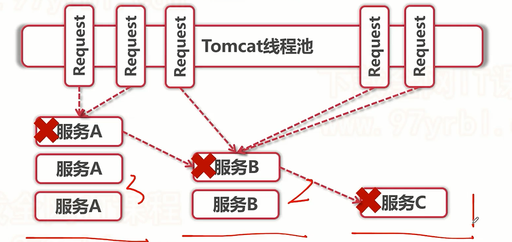

- 首先我们可以看到，服务A有3个节点，承接的请求多，服务B2个节点，请求中等，服务C 1个节点，请求最少
- 当服务C出现了问题，无法提供服务，因为服务B调用了服务C，所以会导致服务B也出现问题，同理导致服务A也崩了，这就是服务雪崩

可以看出这种问题很严重，应该如何处理呢？

SpringCloud微服务的著名合伙人之一Netflix又出来大展身手了，发布了Hystrix组件，专门用来服务容错的处理

- 服务降级：交由备选方案planB来处理请求
- 服务熔断：比服务降级更高一层，直接将服务断开不再使用

具体介绍后面再说

### 容器线程耗尽

这个是更加严重的一个问题，因为当容器的线程耗尽，你在此个容器下部署的所有集群节点，都会变为不可用状态，因为线程被耗尽，请求无法进来，如下图：

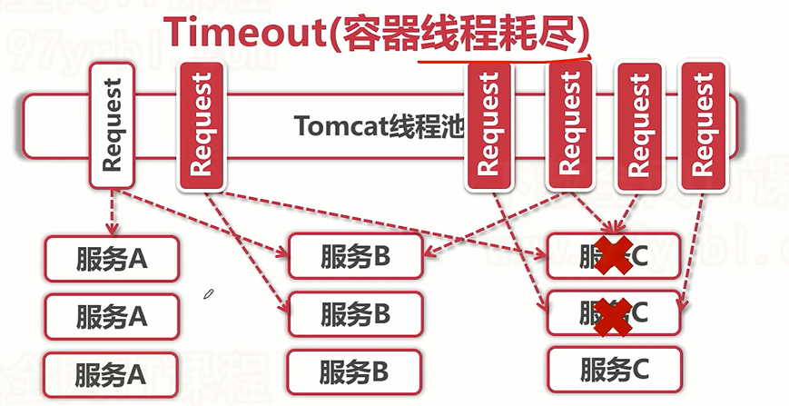

- 服务ABC的响应速度都很快，并且从线程池获取线程都是平均的
- 当服务C出现问题，他可以处理请求，但是会因为各种性能瓶颈，导致响应速度特别慢，比如1-2分钟才可以响应请求
- 那么请求进来，就会等待，一直耗着，这样越来越多的请求会在服务C这里耗着，导致后面容器线程全部耗尽

这种又应该怎么办呢？

Hystrix就有个独门武功，线程隔离

### 生产故障

遇到生产故障不要慌，我们解决了之后，要进行反思，如何可以降低故障频率呢？

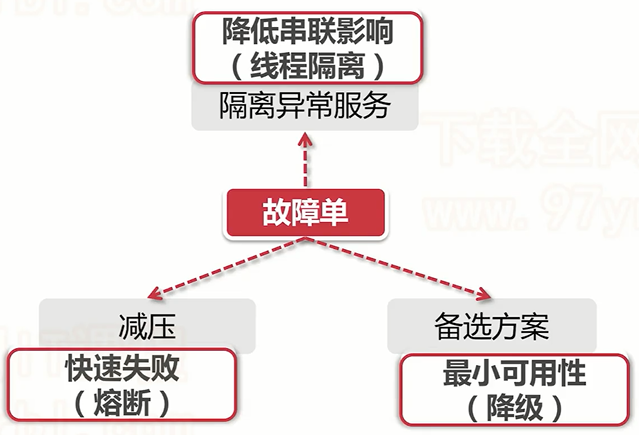

使用Hystrix就可以实现


从我们上面介绍，我们知道Hystrix有三个核心功能，断舍离！不是，服务降级，服务熔断，线程隔离~ 其实也就是断舍离

1. 断 - 服务熔断
2. 舍 - 服务降级
3. 离 - 线程隔离

接着我们就深入介绍这几个功能

## 服务降级

微服务架构一般都是强调高可用性，但是一致性的要求就没有这么高了，也就是说，在日常服务调用时，会出现服务调用异常的情况，比如：

- 当服务重启，需要先发送下线指令给注册中心，然后就下线了，注册中心多节点还没来得及同步，请求就过来了，请求到已经下线的服务，就会出现404
- 又或者我们刚刚上面说的雪崩问题，最上游的服务出现问题，下游所有应用都会受到牵连

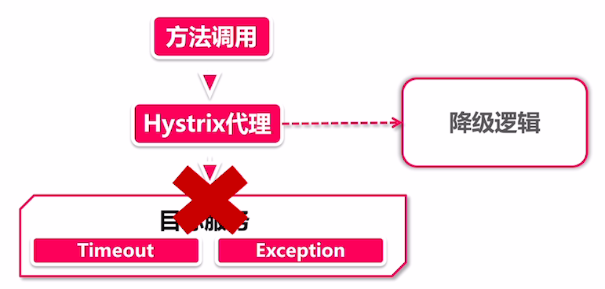

这时就需要服务降级来应对上面的情况了，加入HystrixClient调用目标请求发生异常后，会自动把该请求转到降级逻辑中来处理，是**由服务调用方编写的异常处理逻辑**。对于响应超时的场景，我们可以使用Hystrix设置超时时间，一旦发生超时，也会被认为出现了异常交由降级逻辑Fallack来处理

### 基本原理

借势我们介绍一下服务降级的相关原理，因为很复杂很复杂的逻辑，所以我们只看最核心的逻辑

Hystrix就好像六扇门，而服务降级可以说是锦衣卫，专门打老虎：

```java
@HystrixCommand(fallbackMethod = "putInPrison")
public String bigTiger(){
	throw RuntimeExcaption("Eat people");
}
```

上面就是锦衣卫@HystrixCommand，直接管在大老虎头（具体Method）上，当执行失败，就会关进监狱（调用降级方法）

当Hystrix和Feign一起使用时，还有一种配置方式，在@FeignClient注解上添加一个class，这样，Feign中所有方法都会被这个降级接口来处理

```java
@FeignClient(name = "feign-client",fallback = Fallback.class)
public interface Hello{
}
```

了解完如何使用的时候，我们会发现，基本都是依靠@HystrixCommand注解来实现，那么为何加了个注解就可以在方法失败后走向降级方法呢？

这时我们可能会思考到，使用**AOP**可不可以？设置切面，当发生异常时进行处理，其实就是这样。

因为源码非常繁琐，使用大量异步回调以及事件监听机制，我们直接看最核心流程：

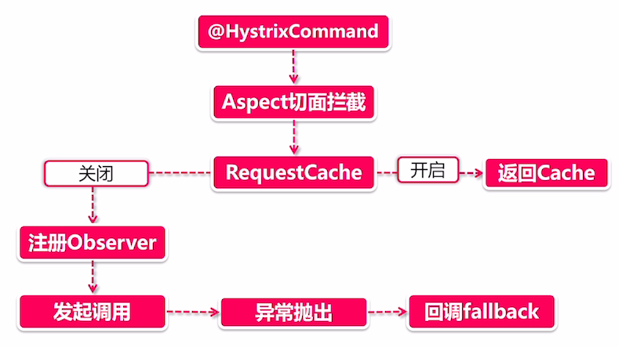

1. **@HystrixCommand注解**，标识方法被我掌管了
2. **AspectJ**：运用Spring切面能力，为@HystrixCommand注解标注的 方法设置切面，在方法调用时，首先执行切面逻辑
3. **RequestCache**：
   - 开启：尝试使用CacheKey从缓存中获取数据，不发起方法调用
   - 关闭，就来到非常复杂的流程了，Observer
4. **注册Observer**：观察者模式，说是观察者模式，其实运用了**大量的RxJava的异步回调函数**，当方法正常执行，抛出异常，结束或其他状态时，会触发对于的回调函数进行处理，而且回调函数里可能还嵌套回调函数（Hystrix程序员不知道怎么想的，估计有个怕失业的程序员，这谁接手不是一头雾水）
5. **发起调用**：注册好一系列回调函数后，就可以发起调用了，先会判断是否在熔断状态，如果断路器开启值机fallback，如果没有，发起调用
6. **异常fallback**：我前面做了这么一大堆文章，不就是在等你吗？当发生异常，Hystrix开心了，终于派上用场了，这时**异常就会触发步骤四中的回调函数，转给降级方法进行处理**

### 服务降级常用方案

#### 静默处理 - 沉默是金

静默处理，就是啥也不干，比如直接返回个null。

那么，为什么要这么做呢？把他直接通过try/catch包住不就行了？首先try/catch只能处理异常抛出情况，不能处理超时情况，其次就是开闭原则单一职责原则，既然可以使用fallback进行统一处理，为什么不用呢？

#### 默认值 - 瞒天过海

瞒天过海，就是骗人，无论你请求参数是什么，我们都返回一个默认的值。

这种处理方法，需要在特殊的业务逻辑中使用，比如商品详情页，需要调用营销接口，如果出现问题，就可以直接返回这个商品的原价，但是不能使用在创建订单，提交订单页面，因为这就和真实的金钱挂钩了，如果没有给用户进行打折，肯定会出现大量投诉

#### 想办法恢复服务 - 好好改造

这才是正儿八经积极进行处理的方式，fallback会尝试各种方式来恢复正确的返回值，有几个场景：

1. **缓存异常**：如果因为缓存故障导致的无法获取数据，可以在fallback逻辑中写入使用数据库查询来获取数据，但是不能用在热点数据，当然这也可以用在数据库故障，切换从缓存获取数据
2. **切换备库**：如果是主从备库这种结构，从主从库中无法获取数据出现了故障，我们可以主动切换备库来获取数据
3. **重试**：fallback中可以主动发起调用进行重试
4. **人工干预**：有些重要的接口，出现异常很严重的情况下，可以在fallback中为日志打点或触发监控组件预警等方式，同时进行人工干预

#### 多次降级 - 一错再错

当程序在fallback中再次报错，那么可以在fallback中再次进行fallback降级方法，一层套一层，这是很正常的，越是复杂核心的业务可能套娃套的越多~

当然如果一层一层全都报错，锦衣卫都管不住你了，就只能将你公之于众把异常抛到最外层

#### RequestCache

刚刚我们在原理解析里，发现有一个RequestCache，这是Hystrix一个特殊功能，可以通过@CacheResult和@CacheKey两个注解进行配置

```java
@CacheResult
@HystrixCommand
public String requestCache(@CacheKey Integer id)
```

这样第一次进入时，id为1，获取数据后，就会将返回的数据缓存到Hystrix里，下次再请求id为1的数据就会直接从Hystrix缓存中缓存

这个方式其实是一种**性能优化**而不是降级容错

### 实现Fallback降级

接着我们通过原先的`spring-cloud-study`这个项目，继续学习，实现Fallback服务降级

0.最开始，我们需要向Feign公共接口层添加一个error方法，并在feign-client实现

```java
@FeignClient("feign-client")
public interface IService {

    @GetMapping("/sayHi")
    String sayHi();

    @GetMapping("/error")
    String error();

}
```

在feign客户端实现：

```java
@RestController
public class Controller implements IService {

    @Override
    public String error() {
        throw new RuntimeException("error!!");
    }
    
    //···
}
```

1.首先创建`hystrix\hystirx-consumer`工程，然后添加依赖

```xml
<dependencies>
    <dependency>
        <groupId>org.springframework.cloud</groupId>
        <artifactId>spring-cloud-starter-netflix-eureka-client</artifactId>
    </dependency>
    <dependency>
        <groupId>org.springframework.boot</groupId>
        <artifactId>spring-boot-starter-web</artifactId>
    </dependency>
    <dependency>
        <groupId>com.pacee1</groupId>
        <artifactId>feign-client-intf</artifactId>
        <version>${project.version}</version>
        <!--如果有版本冲突，可以在此剔除Feign依赖，使用自己的Feign-->
        <!--<exclusions></exclusions>-->
    </dependency>
    <dependency>
        <groupId>org.springframework.cloud</groupId>
        <artifactId>spring-cloud-starter-netflix-hystrix</artifactId>
    </dependency>
</dependencies>
```

这里主要新增了hystrix的依赖

2.添加启动器类

```java
@SpringBootApplication
@EnableDiscoveryClient
@EnableFeignClients // 需要需要配置的Feign接口多，可以配置扫描路径
@EnableCircuitBreaker // 开启Hystrix
public class HystrixConsumerApp {

    public static void main(String[] args) {
        SpringApplication.run(HystrixConsumerApp.class,args);
    }
}
```

这里主要添加`@EnableCircuitBreaker`注解，开启服务容错

3.编写一个Fallback类，用于降级处理

```java
@Slf4j
@Component
public class Fallback implements MyService {

    @Override
    // 编写降级逻辑
    public String error() {
        log.info("error! Im Fallback Method");
        return "error! Im Fallback Method";
    }

    @Override
    public String sayHi() {
        return null;
    }

}
```

这里的MyService是下面一步创建的

4.创建MyService，用于继承公共接口层的接口，并写上我们自定义的fallback类

```java
@FeignClient(name = "feign-client",fallback = Fallback.class)
public interface MyService extends IService {
}
```

5.编写Controller用于测试

```java
@RestController
public class Controller {

    // 直接注入调用即可
    @Autowired
    private MyService myService;

    @GetMapping("/error")
    public String error(){
        return myService.error();
    }
}
```

6.最后编写配置文件，开启服务降级

```yml
spring:
  application:
    name: hystrix-consumer
  main:
    allow-bean-definition-overriding: true
server:
  port: 50000
eureka:
  client:
    service-url:
      defaultZone: http://localhost:22222/eureka
## 开启Feign下的Hystrix功能
feign:
  hystrix:
    enabled: true
## 开启服务降级
hystrix:
  command:
    defalut:
      fallback:
        enabled: true
```

然后开启注册中心，FeignClient以及HystrixConsumer

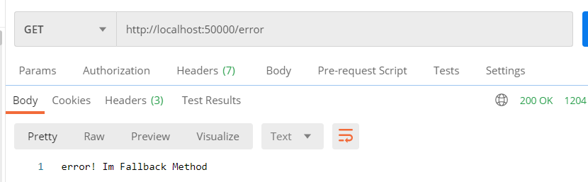

成功服务降级处理

### 实现Timeout降级

接着我们来测试一下超时导致的降级

0.首先我们需要编写一个超时接口，在公共接口层和服务提供方进行实现

```java
@FeignClient("feign-client")
public interface IService {

	//···
    
    @GetMapping("giveMeTime")
    String giveMeTime(@RequestParam("timeout") int timeout);

}
```

具体实现：

```java
@RestController
@Slf4j
public class Controller implements IService {

    @Value("${server.port}")
    private String port;

    //···

    @Override
    public String giveMeTime(int timeout) {
        try {
            Thread.sleep(timeout * 1000);
        } catch (InterruptedException e) {
            e.printStackTrace();
        }
        return port;
    }
}
```

1.在Fallback类中编写该方法的降级策略

```java
@Slf4j
@Component
public class Fallback implements MyService {

    //···

    @Override
    public String giveMeTime(@RequestParam("timeout") int timeout) {
        log.info("error! you are late!");
        return "error! you are late!";
    }
}
```

2.在配置文件中开启超时熔断降级规则

```yml
## 开启Feign下的Hystrix功能
feign:
  hystrix:
    enabled: true
  client:
    config:
      default:
        OkToRetryOnAllOperations: false
        ConnectTimeout: 2000
        ReadTimeout: 5000
        MaxAutoRetries: 1
## 开启服务降级
hystrix:
  command:
    #全局超时
    defalut:
      fallback:
        enabled: true
      execution:
        timeout:
          enabled: true
        isolation:
          thread:
            # 超时时间
            timeoutInMilliseconds: 2000
            # 超时后终止线程
            interruptOnTimeout: true
            # 取消后终止线程
            interruptOnFutureCancel: true
    # 方法层面配置超时
    MyService#giveMeTime(int):
      execution:
        isolation:
          thread:
            # 超时时间
            timeoutInMilliseconds: 4000
```

这里我们将Ribbon重试规则也放进来了，Ribbon和Hystrix的战争我们后面再说

对于Hystrix，我们可以进行全局设置或者方法层面的设置，全局设置使用default，方法层面的设置使用：`类名#方法名(参数类型)`来配置

方法层面配置优先于全局配置

**这里还有一种配置方式，就是注解配置**

```java
@GetMapping("/giveMeTime2")
@HystrixCommand(
        fallbackMethod = "timeoutFallback",
        commandProperties = {
                @HystrixProperty(
                        name = "execution.isolation.thread.timeoutInMilliseconds",
                        value = "2000")
        }
)
public String giveMeTime2(Integer timeout){
    return myService.giveMeTime(timeout);
}

public String timeoutFallback(Integer timeout){
    return "success";
}
```

在需要服务降级的方法上添加@HystrixCommand注解，并配置Properties为我们刚刚在配置文件中配置的属性，并设置value，并设置降级方法，即可

### 实现RequestCache减压

之前了解到，使用RequestCache可以实现减压，将结果缓存起来，如果下次相同参数的请求进来，会直接将其从缓存中获取返回，接着我们来尝试实现缓存减压

1.首先创建CacheService类，来编写Hystrix请求缓存的方法

```java
@Service
@Slf4j
public class CacheService {

    @Autowired
    private MyService service;

    @CacheResult
    @HystrixCommand(commandKey = "cacheKey") // 必须加上这个注解，标记被Hystrix管理
    public String sayHiCache(@CacheKey Integer num){
        log.info("request cache " + num);
        String hi = service.sayHi();
        log.info("after request cache " + num);
        return hi;
    }
}
```

2.在Controller中编写请求方法

```java
@GetMapping("/sayHi")
public String sayHi(@RequestParam Integer num){
	// 必须编写Hystrix上下文，因为在上下文中，才能获取缓存的数据
    @Cleanup HystrixRequestContext context = HystrixRequestContext.initializeContext();

    // 调用两次测试
    String hi = cacheService.sayHiCache(num);
    hi = cacheService.sayHiCache(num);
    return hi;
}
```

3.开启缓存配置，其实是默认开启的

```yml
## 开启服务降级
hystrix:
  command:
    #全局超时
    defalut:
      requestCache:
        enabled: true # 默认开启
```

调用测试：

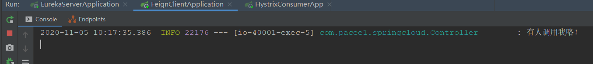

可以看到控制台只有一条日志，说明缓存成功

### 实现多层降级

那么，一错再错的时候应该怎么办呢？那就是多层降级

```java
@Slf4j
@Component
public class Fallback implements MyService {

    @Override
    // 编写降级逻辑
    @HystrixCommand(fallbackMethod = "fallback2")
    public String error() {
        log.info("error! Im Fallback Method");
        //return "error! Im Fallback Method";
        throw new RuntimeException("error! Im Fallback Method");
    }

    @HystrixCommand(fallbackMethod = "fallback3")
    public String fallback2(){
        log.info("fallback error! Im Fallback Method 2");
        throw new RuntimeException("fallback error! Im Fallback Method 2");
    }

    public String fallback3(){
        log.info("fallback 2 error! Im Fallback Method 3");
        return "fallback3 success";
    }
    //···
}
```

我们在error上设置降级逻辑fallback2，fallback2上设置fallback3

这样访问error方法，抛出异常后，最终会来到fallback3

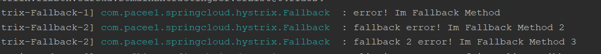

经测试，确实如此，但是会有问题，如果一直错怎么办？

fallback3也错了咋办呢？这就要到我们后面学习的服务熔断中去处理了

### 超时降级插曲

我们之前在实现超时降级的时候，说到，如果Ribbon设置的超时重试和Hystrix的超时降级，会不会冲突呢？

我们来揭开谜底~

两者是互相作用的关系，谁先达到指标，谁先触发，所以一般来说，**Hystrix超时降级时间要比Ribbon超时重试的时间要长，这样才可以合理运用到重试和降级两种容错方案**

接着我们来看看超时降级配置的一些东西：

```properties
# 全局配置
hystrix.command.default.execution.isolation.thread.timeoutInMilliseconds=1000
# 方法粒度配置
hystrix.command.ClassName#methodName(Integer).execution.isolation.thread.timeoutInMilliseconds=1000
```

上面的配置是基于“方法签名”生成的，其中ClassName#methodName(Integer)就是一串类名+方法名+方法参数的组合，对于复杂的方法，人工拼出这一套组合字符串也挺费脑子的，Feign提供了一个简单的工具根据反射机制生成字符串：

```java
Feign.configKey(MyService.class, MyService.class.getMethod("findFriend", Integer.class))
```

如果说上面的配置对于你来说太过于麻烦，那你可以采用下面的一种。

我们在声明@HystrixCommand的时候，可以给方法指定一个CommandKey，就像下面这样：

```java
@HystrixCommand(commandKey = "myKey"，fallbackMethod = "fallback")
```

这里我们给方法指定了commandKey为mykey，接下来只要使用myKey来替换方法签名就可以实现同样的效果，是不是更简单了？

```properties
hystrix.command.myKey.execution.isolation.thread.timeoutInMilliseconds=1000
```

## 服务熔断

服务熔断是建立在服务降级上的一种服务容错策略，是升级版。服务降级是服务发送HTTP请求，返回异常后，在启用planB，而服务熔断是什么，当断路器打开后，所有请求都直接去planB，不在尝试请求服务提供方

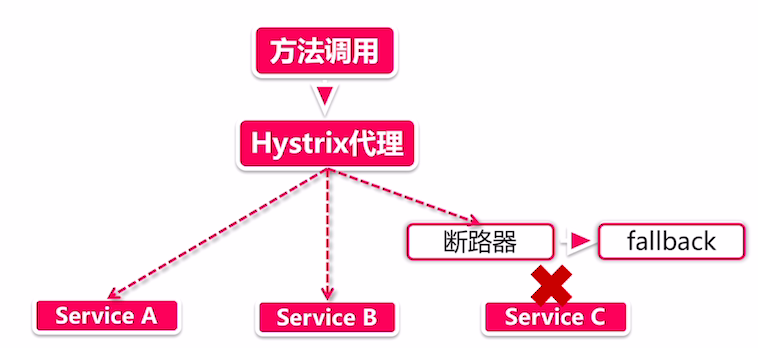

那么就会发现，断路器开启关闭的规则就很重要了，比如每10个请求，失败了80%就开启熔断。当然，熔断器打开后，也不可能一直开着，肯定会配有一些规则，主动判断关闭时机。

断路器 显著缓解QPS激增导致的雪崩效应

### 实现服务熔断

服务熔断的开启非常简单，只需要在配置文件中配置即可，这里为了方便查看，我们以properties的形式进行设置

```properties
## 正儿八经的参数
# 阈值。请求达到多少个后，开始判断是否开启熔断
hystrix.command.default.circuitBreaker.requestVolumeThreshold=5
# 请求失败比例，超过50%即开启熔断
hystrix.command.default.circuitBreaker.errorThresholdPercentage=50
# 当熔断开启后，多少秒后开启半开状态
hystrix.command.default.circuitBreaker.sleepWindowInMilliseconds=15000
# 时间窗口，多少秒内的请求
hystrix.command.default.metrics.rollingStats.timeInMilliseconds=20000
# 以上配置就是，20秒内请求达到5个后，如果失败比例大于50%就开启熔断，当开启后15秒，进入半开状态


## 打酱油的参数
# 开启熔断，默认开启
hystrix.command.default.circuitBreaker.enabled=true
# 强制开启熔断，即所有方法开启熔断
hystrix.command.default.circuitBreaker.forceOpen=false
# 强制关闭熔断
hystrix.command.default.circuitBreaker.forceClosed=false
```

然后我们就可以进行测试，当我们在20秒内请求5次错误后，查看是否会再进行服务间调用

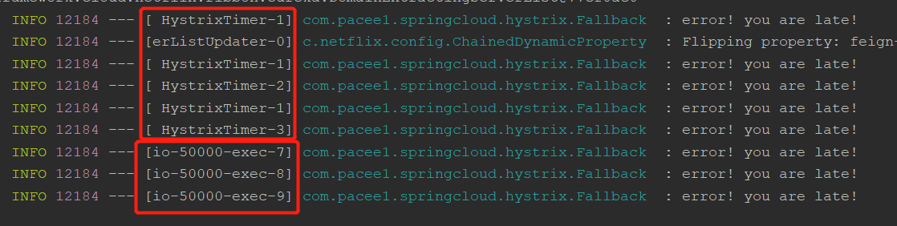

通过日志我们会发现，在5次失败后，再进行的调用就没有进行Feign服务间调用了，而是直接由Hystrix返回

这里我们也可以看一下Feign的日志：


### 基本原理

让我们来看看Hystrix熔断器是如何把大盗关入监狱的

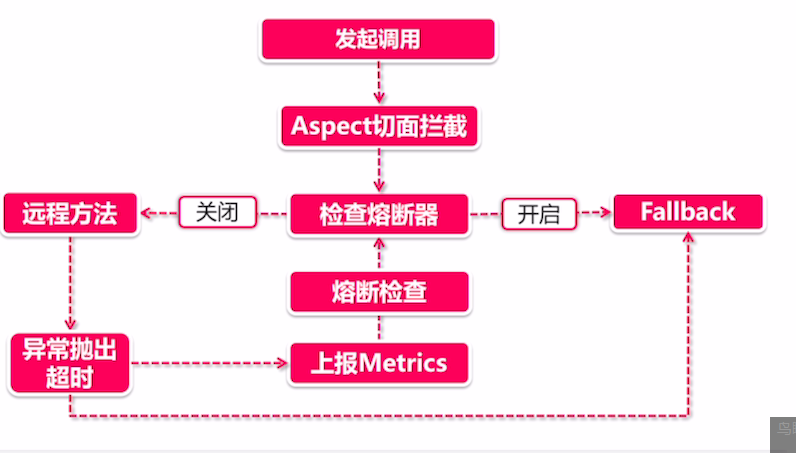

我们只关注熔断部分，省略服务降级：

1. **发起调用-切面拦截**：由于熔断是在降级基础上的，所以也是一样的通过AspectJ切面拦截进行触发。当方法标注@HystrixCommand注解发起调用时就会触发切面逻辑
2. **检查熔断器**：判断熔断器是否打开或关闭，如果打开，直接进入Fallback流程而不产生服务调用
3. **发起远程调用-发生异常**：当熔断器没有开启，会发起远程调用，如果出现了异常抛出，就会触发回调函数（Hystrix构造了大量的函数式回调函数，用于在服务异常等事件发生时调用）
4. **计算指标**：在异常发生后，会根据断路器的配置，计算是否达到熔断条件，如果达到，开启熔断器

**熔断半开启**

熔断半开启是什么意思呢？我们料想一下，如果监狱里的人越来越多，直接把他们放出去就有可能又犯罪（fallback），那应该怎么做呢？典狱长想了个好办法，劳动改造：

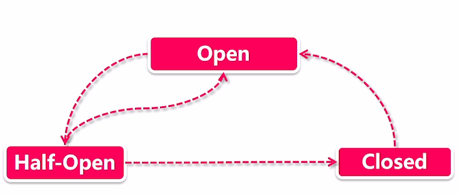

劳动改造分为三个阶段：

1. **熔断器open**：熔断开启，在牢里好好待着，所有请求进来都直接进入fallback里
2. **熔断器half-open**：熔断半开启，在fallback里待得挺久了，给个机会改过自新，给他一次真正发起远程调用的机会，如果调用成功，就给放了，如果调用失败，再回牢里改造
3. **熔断器closed**：熔断关闭，所有请求都会发出真正的服务调用

**熔断器阈值判断**

主要有两个维度：

- 在一定时间窗口内，发生异常的请求数量达到临界值
- 在一定时间窗口内，发生异常的请求数量占请求总数量的一定比例，比如80%都失败

## 线程隔离

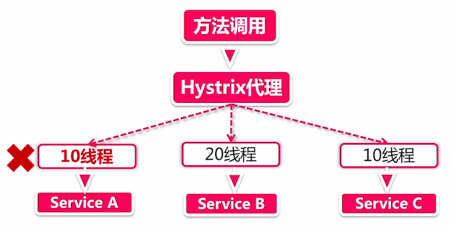

线程隔离是用来处理上面说的容器线程耗尽问题的，Hystrix可以为每个服务节点配置最大获取线程数，当服务出现问题时，会一直占用容器线程，但是如果达到了最大线程数，就无法获取线程了，所以不会影响容器其他服务节点，也就叫做线程隔离

用通俗的话来说，就是一个服务大厅，它提供美甲，美容，理发服务，如果没有线程隔离技术，如果大厅只能容纳100人，此时来了100个人，他们都要美容，但是美容花费时间很长，一个人可能需要3小时，这样99个人就在大厅等待，当有新客户想来理发，因为进不来大厅所以无法请求服务，这时就需要我们线程隔离技术

规定美容服务只能接纳20个客户，如果排队排满了，就拒绝新客户进来，这样别的进行其他服务的客户就不会被影响。

实现线程隔离也很简单，只需要在配置文件中配置即可：

```properties
# 并发执行的最大线程数，默认10
hystrix.threadpool.default.coreSize=10
# BlockingQueue的最大队列数，当设为－1，会使用SynchronousQueue，值为正时使用LinkedBlcokingQueue。该设置只会在初始化时有效，之后不能修改threadpool的queue size，除非reinitialising thread executor。默认－1。
hystrix.threadpool.default.maxQueueSize 
# 即使maxQueueSize没有达到，达到queueSizeRejectionThreshold该值后，请求也会被拒绝。因为maxQueueSize不能被动态修改，这个参数将允许我们动态设置该值。if maxQueueSize == -1，该字段将不起作用，默认为5，如果想要调大线程，需要将此配置和maxQueueSize一起
hystrix.threadpool.default.queueSizeRejectionThreshold=5
# 线程回收前的存活时间，默认2分钟，不宜过小，不然会频繁线程
hystrix.threadpool.default.keepAliveTimeMinutes=2
# 线程池统计指标的时间，默认10000
hystrix.threadpool.default.metrics.rollingStats.timeInMilliseconds=10000
# 将rolling window划分为n个buckets，默认10
hystrix.threadpool.default.metrics.rollingStats.numBuckets=10
```

## Hystrix监控

Hystrix发挥了这么大的作用，将请求进行熔断降级，那么有没有一个监控程序，来看看该服务的失败率，熔断时间或者降级率有多少呢？

SpringCloud中就有一个组件Turbine，用于聚合服务信息，他也是一个服务节点，借助Eureka的服务发现实现聚合，Turbine聚合信息时，会主动请求节点的`/actuator`接口，获取节点健康信息，

所以Turbine配合Hystrix Dashboard就可以实现了么一人性化的功能，并且对其可视化，观看起来非常简单

接下来让我们去试试Hystrix的可视化

### 实现Hystrix监控

首先我们在之前的`hystrix-consumer`上加actuator依赖以及配置

1.pom添加actuator依赖：

```xml
<dependency>
    <groupId>org.springframework.boot</groupId>
    <artifactId>spring-boot-starter-actuator</artifactId>
</dependency>
```

2.添加actuator配置

```properties
# 开启监控配置
# 关闭management的安全检查
management.security.enabled=false
# 所有的接口都暴露
management.endpoints.web.exposure.include=*
# 将所有的健康细节暴露
management.endpoint.health.show-details=always
```

然后我们就可以去看一下监控信息了：http://localhost:50000/actuator/hystrix.stream

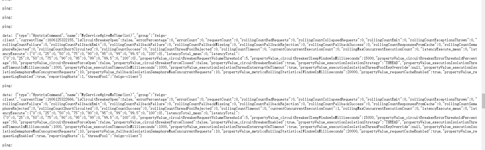

当发起一次请求后，会发现页面显示了该请求的一些信息，就是我们的监控信息

### 使用DashBoard配合Turbine实现可视化

接着我们创建一个Turbine模块，用于聚合Hystrix的信息，使其可视化更清晰

1.创建模块`hystrix-turbine`，并添加依赖

```xml
<dependencies>
    <dependency>
        <groupId>org.springframework.cloud</groupId>
        <artifactId>spring-cloud-starter-netflix-eureka-client</artifactId>
    </dependency>
    <dependency>
        <groupId>org.springframework.boot</groupId>
        <artifactId>spring-boot-starter-web</artifactId>
    </dependency>
    <dependency>
        <groupId>org.springframework.boot</groupId>
        <artifactId>spring-boot-starter-actuator</artifactId>
    </dependency>
    <dependency>
        <groupId>org.springframework.cloud</groupId>
        <artifactId>spring-cloud-starter-netflix-hystrix</artifactId>
    </dependency>
    <dependency>
        <groupId>org.springframework.cloud</groupId>
        <artifactId>spring-cloud-starter-netflix-turbine</artifactId>
    </dependency>
</dependencies>
```

2.创建启动器类

```java
@EnableDiscoveryClient
@EnableHystrix
@EnableTurbine
@EnableCircuitBreaker
@EnableAutoConfiguration
public class TurbineApplication {
    public static void main(String[] args) {
        SpringApplication.run(TurbineApplication.class,args);
    }
}
```

3.添加配置

```properties
spring.application.name=hystrix-turbine

server.port=52000
management.server.port=52001

eureka.client.serviceUrl.defaultZone=http://localhost:22222/eureka

# 需要监控的服务名
turbine.app-config=hystrix-consumer
turbine.cluster-name-expression="default"
# 通过host与port区分不同服务，默认只使用host
turbine.combine-host-port=true
# 集群配置，使用默认
turbine.aggregator.cluster-config=default
# 监控的url后缀，设置为Hystrix的后缀
turbine.instanceUrlSuffix.default=actuator/hystrix.stream
```