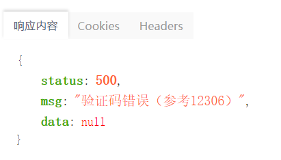

## Foodie项目集成服务容错

想要实现服务容错，其实也很简单，只需要添加一些关于Hystrix的配置即可

我们主要需要进行添加修改的有：

1. 添加turbine模块用于聚合信息
2. 添加Dashboard监控盘可视化
3. 为各个微服务添加服务容错

### 添加Turbine模块

我们需要向项目的platform目录下创建新的微服务模块：`hystrix-turbine`

1.创建Module并添加依赖

```xml
<dependencies>
    <dependency>
        <groupId>org.springframework.cloud</groupId>
        <artifactId>spring-cloud-starter-netflix-eureka-client</artifactId>
    </dependency>
    <dependency>
        <groupId>org.springframework.boot</groupId>
        <artifactId>spring-boot-starter-web</artifactId>
    </dependency>
    <dependency>
        <groupId>org.springframework.boot</groupId>
        <artifactId>spring-boot-starter-actuator</artifactId>
    </dependency>
    <dependency>
        <groupId>org.springframework.cloud</groupId>
        <artifactId>spring-cloud-starter-netflix-hystrix</artifactId>
    </dependency>
    <dependency>
        <groupId>org.springframework.cloud</groupId>
        <artifactId>spring-cloud-starter-netflix-turbine</artifactId>
    </dependency>
</dependencies>

<!-- 设置打包时主类 -->
<build>
    <plugins>
        <plugin>
            <groupId>org.springframework.boot</groupId>
            <artifactId>spring-boot-maven-plugin</artifactId>
            <configuration>
                <mainClass>com.pacee1.HystrixTurbineApplication</mainClass>
            </configuration>
            <executions>
                <execution>
                    <goals>
                        <goal>repackage</goal>
                    </goals>
                </execution>
            </executions>
        </plugin>
    </plugins>
</build>
```

2.添加启动器主类

```java
@EnableTurbine
@SpringCloudApplication
@EnableHystrix
public class HystrixTurbineApplication {
    public static void main(String[] args) {
        SpringApplication.run(HystrixTurbineApplication.class,args);
    }
}
```

3.添加配置文件

```yml
spring:
  application:
    name: hystrix-turbine
server:
  port: 20001
management:
  server:
    port: 52001
# Eureka
eureka:
  client:
    service-url:
      defaultZone: http://localhost:22222/eureka
# turbine配置
turbine:
  aggregator:
    # 集群配置，因为我们单节点所以默认default
    cluster-config: default
  # app-config: foodie-user-service,foodie-order-service,foodie-item-service
  # 先使用order
  app-config: foodie-order-service
  # 集群名称
  cluster-name-expression: "default"
  combine-host-port: true
  instanceUrlSuffix:
    default: actuator/hystrix.stream
```

这样我们的Turbine模块就创建好了

### 添加Dashboard监控盘

添加也很简单，就和之前一样，这应该是最简单的微服务组件了

1.创建`hystrix-dashboard`模块，并添加依赖

```xml
<dependencies>
    <dependency>
        <groupId>org.springframework.cloud</groupId>
        <artifactId>spring-cloud-starter-netflix-hystrix-dashboard</artifactId>
    </dependency>
    <dependency>
        <groupId>org.springframework.cloud</groupId>
        <artifactId>spring-cloud-starter-netflix-hystrix</artifactId>
    </dependency>
    <dependency>
        <groupId>org.springframework.boot</groupId>
        <artifactId>spring-boot-starter-actuator</artifactId>
    </dependency>
</dependencies>

<!-- 设置打包时主类 -->
<build>
    <plugins>
        <plugin>
            <groupId>org.springframework.boot</groupId>
            <artifactId>spring-boot-maven-plugin</artifactId>
            <configuration>
                <mainClass>com.pacee1.HystrixDashboardApplication</mainClass>
            </configuration>
            <executions>
                <execution>
                    <goals>
                        <goal>repackage</goal>
                    </goals>
                </execution>
            </executions>
        </plugin>
    </plugins>
</build>
```

2.创建主类

```java
@SpringCloudApplication
@EnableHystrixDashboard
public class HystrixDashboardApplication {
    public static void main(String[] args) {
        SpringApplication.run(HystrixDashboardApplication.class,args);
    }
}
```

3.添加配置文件

```yml
spring:
  application:
    name: hystrix-dashboard
server:
  port: 20002
```

这样就好了

### 配置各服务actuator端点

配置完两个公共模块后，我们需要为各服务的actuator开放，这样我们的大盘以及turbine才可以读取到服务信息

为每个微服务的web模块添加以下配置，这里我添加在了`application-dev.yml`中

```yml
## 开启所有actuator-endpoint
management:
  endpoint:
    health:
      show-details: always
  endpoints:
    web:
      exposure:
        include: '*'
  security:
    enabled: false
```

### 为用户服务添加容错逻辑

这里我们只针对登录进行容错逻辑的添加，为什么这样呢？因为登录没有用到服务间调用，也是可以使用服务降级的，这里我们以登录为例实现服务降级，其他的服务中的业务也是可以添加的，可以根据自己需要随意添加

我们需要做的事：

1. 在service层添加hystrix依赖
2. 为具体方法添加@HystrixCommand注解编写降级逻辑
3. 直接在配置文件中添加降级逻辑

首先就是添加依赖：

```xml
<dependency>
    <groupId>org.springframework.cloud</groupId>
    <artifactId>spring-cloud-starter-netflix-hystrix</artifactId>
</dependency>
```

然后使用@HystrixCommand注解实现方法级别降级：

```java
@PostMapping("/login")
@ApiOperation(value = "用户登录",notes = "用户登录")
@HystrixCommand(
        commandKey = "loginFail", // 全局唯一标识，默认方法名
        groupKey = "password", // 全局服务分组，仪表盘中使用，默认为类名
        fallbackMethod = "loginFail", // 降级方法名
        // 忽略的异常，不会进入降级逻辑
        ignoreExceptions = {NullPointerException.class},
        // 线程有关属性，也可以配置在配置文件
        threadPoolKey = "threadPoolA", // 线程租
        threadPoolProperties = {
                // 核心线程数
                @HystrixProperty(name = "coreSize",value = "20"),
                // size > 0 ，LinkedBlockingQueue 请求等待队列
                // size = -1,SynchronizeQueue -》 不存储元素的阻塞队列
                @HystrixProperty(name = "maxQueueSize",value = "40"),
                // maxQueueSize=-1时无效，也是设置队列大小的，两个相互作用，哪个小实验哪个
                @HystrixProperty(name = "queueSizeRejectionThreshold",value = "15"),
                // 线程统计窗口持续时间
                @HystrixProperty(name = "metrics.rollingStats.timeInMilliseconds",value = "1024"),
                // 窗口内的桶数量
                @HystrixProperty(name = "metrics.rollingStats.numBuckets",value = "18"),

        }
)
public ResponseResult login(@RequestBody UserBO userBO,
                            HttpServletRequest request,
                            HttpServletResponse response){
    String username = userBO.getUsername();
    String password = userBO.getPassword();

    // 1.校验
    if(StringUtils.isBlank(username) ||
            StringUtils.isBlank(password)){
        return ResponseResult.errorMsg("用户名或密码不能为空");
    }

    // 2.登录
    Users user = userService.queryUserForLogin(username,password);
    if(user == null){
        return  ResponseResult.errorMsg("用户名或密码错误");
    }
    // 首先清空用户敏感信息
    user = setUserNull(user);

    // 创建Token，使用UUID
    String userToken = UUID.randomUUID().toString().trim();
    redisOperator.set("redis_user_token:" + user.getId(),userToken);
    UsersVO usersVO = new UsersVO();
    BeanUtils.copyProperties(user,usersVO);
    usersVO.setUserUniqueToken(userToken);

    // 4.设置cookie
    CookieUtils.setCookie(request,response,"user",
            JsonUtils.objectToJson(usersVO),true);

    // 同步购物车数据
    SyncShopcart(user.getId(),request,response);

    return ResponseResult.ok(user);
}

private ResponseResult loginFail(@RequestBody UserBO userBO,
                                HttpServletRequest request,
                                HttpServletResponse response,
                                Throwable throwable) throws Exception{
    return ResponseResult.errorMsg("验证码错误（参考12306）");
}
```

写了一大串，其实这是针对方法进行了一系列的配置，正常来说，我们可以只写一个降级方法名`fallbackMethod`，然后其他配置直接在配置文件中全局配置

那么接下来就是在配置文件中进行全局配置：

```yml
## hystrix配置
hystrix:
  command:
    # 有的属性是默认值，写不写都行
    default:
      fallback:
        enabled: true
      circuitBreaker:
        enabled: true
        # 超过50%错误，那么开启熔断
        errorThresholdPercentage: 50
        # 5个request之后才进行统计
        requestVolumeThreshold: 5
        # 10秒之后进入半开状态
        sleepWindowInMilliseconds: 10000
        # forceClosed, forceOpen 强制关闭/开启熔断开关
      # 执行参数
      execution:
        timeout:
          enabled: true
        # 可以指定隔离方式是线程池还是信号量
        isolation:
          thread:
            interruptOnTimeout: true
            interruptOnFutureCancel: true
            timeoutInMilliseconds: 10000
      metrics:
        rollingStats:
          # 时间窗口统计
          timeInMilliseconds: 20000
          # numBuckets: 10
    #        rollingPercentile:
    #          # 时间窗口统计
    #          timeInMilliseconds: 20000
    #          # numBuckets: 10
    #          bucketSize: 300
    # 照这个方法，覆盖其他的属性
    # loginFail是在HystrixCommand中指定的ID
    loginFail:
      execution:
        isolation:
          thread:
            timeoutInMilliseconds: 3000
```

这样就全局配置了降级熔断的一些属性

然后我们就可以在login代码里随便抛出一个异常，启动注册中心以及user服务测试



正确降级

### 订单服务添加容错逻辑

因为订单服务实现了Feign服务间调用，所以这里才是真正大展拳脚的地方，要改的地方其实也挺多的

我们先总结一下要改哪些东西：

0. 因为Feign自带Hystrix，所以不需要加依赖
1. 修改配置文件，添加Hystrix的配置，并将Feign开启Hystrix
2. 因为我们需要一个编写Fallback类，所以之前通用的api接口不能使用了，需要新建一个接口
3. 编写Fallback类，这里有两种方式
   1. 直接以类的形式
   2. 以工厂的形式
4. 然后配置Fallback在@FeignClient注解上
5. 一个坑，需要修改启动器类上的Feign加载方式，由扫描包改为写具体类的形式

那么我们一步步的修改

#### 修改配置文件

```yml
### Feign 超时重试策略
feign:
  hystrix:
    enabled: true
  client:
    config:
      default:
        OkToRetryOnAllOperations: GET
        ConnectTimeout: 2000
        ReadTimeout: 5000
        MaxAutoRetries: 1
## 开启所有actuator-endpoint
management:
  endpoint:
    health:
      show-details: always
  endpoints:
    web:
      exposure:
        include: '*'
  security:
    enabled: false
## hystrix配置
hystrix:
  command:
    # 有的属性是默认值，写不写都行
    default:
      fallback:
        enabled: true
      circuitBreaker:
        enabled: true
        # 超过50%错误，那么开启熔断
        errorThresholdPercentage: 50
        # 5个request之后才进行统计
        requestVolumeThreshold: 5
        # 10秒之后进入半开状态
        sleepWindowInMilliseconds: 10000
        # forceClosed, forceOpen 强制关闭/开启熔断开关
      # 执行参数
      execution:
        timeout:
          enabled: true
        # 可以指定隔离方式是线程池还是信号量
        isolation:
          thread:
            interruptOnTimeout: true
            interruptOnFutureCancel: true
            timeoutInMilliseconds: 10000
      metrics:
        rollingStats:
          # 时间窗口统计
          timeInMilliseconds: 20000
          # numBuckets: 10
    #        rollingPercentile:
    #          # 时间窗口统计
    #          timeInMilliseconds: 20000
    #          # numBuckets: 10
    #          bucketSize: 300
```

#### 重写一个接口

```java
/**
 * 讨厌的地方来了，对于需要在调用端指定降级业务的场景来说，由于@RequestMapping和@xxxMapping注解
 * 可以从原始接口上继承，因此不能配置两个完全一样的访问路径，否则启动报错。
 *
 * 在我们的实际案例中，ItemCommentsService上面定义了RequestMapping，同时
 * ItemCommentsServiceFeign继承自ItemCommentsService，因此相当于在Spring上下文
 * 中加载了两个访问路径一样的方法，会报错"Ambiguous mapping"
 *
 * 解决问题的思路就是，避免让Spring的上下文中，同时加载两个访问路径相同的方法
 *
 * 解决方案：
 * 1）在启动类扫包的时候，不要把原始Feign接口扫描进来
 * 具体做法：可以使用EnableFeignClients注解的clients属性，只加载需要的Feign接口
 *  * 优点：服务提供者和服务调用者都不需要额外的配置
 *  * 缺点：启动的时候配置麻烦一点，要指定加载每一个用到的接口
 *
 * 2) 原始Feign接口不要定义RequestMapping注解
 * 优点：启动的时候直接扫包即可，不用指定加载接口
 * 缺点：a, 服务提供者要额外配置路径访问的注解
 *      b, 任何情况下，即使不需要在调用端定义fallback类，服务调用者都需要声明一个
 *
 * 3) 原始Feign接口不要定义@FeignClients注解，这样就不会被加载到上下文当中
 *  * 优点：启动的时候直接扫包即可，不用指定加载接口，服务提供者不用额外配置
 *  * 缺点：任何情况下，服务调用者都需要声明一个额外@FeignCliet接口
 *
 * 各有利弊，按照喜好来选就行，个人比较喜欢1），毕竟懒人
 *
 */
//@FeignClient(value = "foodie-item-service",fallback = ItemCommentsFallback.class)
@FeignClient(value = "foodie-item-service",fallbackFactory = ItemCommentsFallbackFactory.class)
public interface ItemCommentsFeignClient extends ItemCommentsService {
}
```

#### 编写Fallback类

- 类形式

```java
@Component
/**
 * 这里必须添加请求路径，不然会和之前一样的问题，请求路径重复
 * 所以我们这里随便写了一个请求路径
 * 因为这个类是降级类，不会发起远程调用，写什么都无所谓
 * 所以直接使用工厂形式最方便
 */
@RequestMapping("itemCommentsFallback")
public class ItemCommentsFallback implements ItemCommentsFeignClient {

    // 降级逻辑
    @Override
    public PagedGridResult queryMyComments(String userId, Integer page, Integer pageSize) {
        MyCommentVO commentVO = new MyCommentVO();
        commentVO.setContent("正在加载中");

        PagedGridResult result = new PagedGridResult();
        result.setRows(Lists.newArrayList(commentVO));
        result.setTotal(1);
        result.setRecords(1);
        return result;
    }

    @Override
    public void saveComments(Map<String, Object> map) {

    }
}
```

- 工厂形式

```java
@Component
public class ItemCommentsFallbackFactory implements FallbackFactory<ItemCommentsFeignClient> {
    @Override
    public ItemCommentsFeignClient create(Throwable cause) {
        return new ItemCommentsFeignClient() {
            @Override
            public PagedGridResult queryMyComments(String userId, Integer page, Integer pageSize) {
                MyCommentVO commentVO = new MyCommentVO();
                commentVO.setContent("正在加载中");

                PagedGridResult result = new PagedGridResult();
                result.setRows(Lists.newArrayList(commentVO));
                result.setTotal(1);
                result.setRecords(1);
                return result;
            }

            @Override
            public void saveComments(Map<String, Object> map) {

            }
        };
    }
}
```

#### 修改启动器加载方式 

```java
@SpringBootApplication
// tk Mybatis扫描Mapper
@MapperScan(basePackages = "com.pacee1.order.mapper")
// 扫描Component
@ComponentScan(basePackages = {"com.pacee1","org.n3r.idworker"})
@EnableDiscoveryClient
// 开启Feign，并添加需要扫描的包
@EnableFeignClients(
        clients = {
                ItemCommentsFeignClient.class,
                ItemService.class,
                UserService.class,
                AddressService.class,
                CartService.class
        }
        /*basePackages = {
        "com.pacee1.user.service",
        "com.pacee1.item.service",
        "com.pacee1.cart.service"
        }*/
)
@EnableScheduling // 需要使用定时任务
public class OrderApplication {
    public static void main(String[] args) {
        SpringApplication.run(OrderApplication.class,args);
    }
}
```

