## 配置中心的作用

配置中心？为什么要这个东西呢？我们先从现在的配置模式来看：

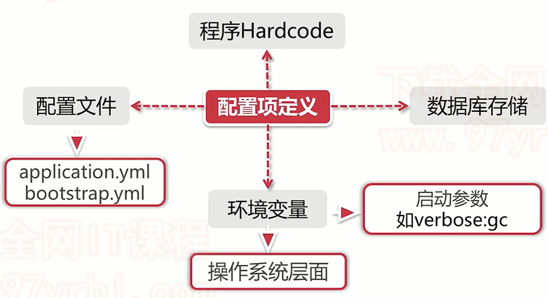

常规情况下，我们的配置都是像上面一样：

- 直接写死在代码中
- 使用配置文件存储读取
- 加载到环境变量中读取
- 通过数据库存储

那么这些配置是否有问题呢？当然：

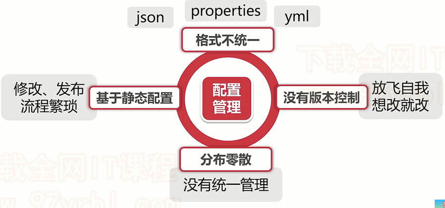

- 写死在代码中：每次修改配置都有重新部署，最差的方式！
- 使用配置文件：因为配置文件格式不同，导致不统一，可能又有properties又有yml，就很繁琐了
- 使用数据库：没有版本控制，如果我们修改错某个配置了，想要回滚很麻烦
- 环境变量：更不用说了，首先我们需要记住配置了哪些在环境变量，然后每次修改也很麻烦，没有统一的管理

通过上面这些缺点，我们配置中心的作用也显而易见了，就是将上面那些确定反转过来：

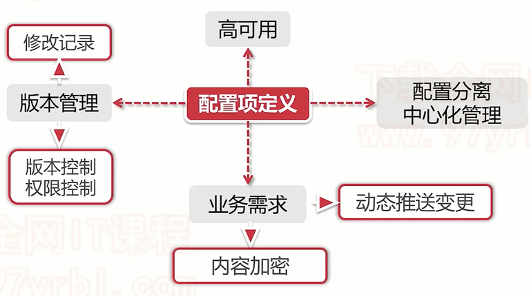

- 具有版本管理功能：可以配置权限，获取修改记录
- 高可用，可以搭建集群式的配置中心
- 可以针对需要，对一些配置进行加密
- 中心化管理，其实就是git

**其实配置中心的实现方式多种多样，对于SpringCloud Config来说，他是Spring公司开发的，一般是基于git来实现中心化管理配置**

再额外说一点，就是关于配置的，哪些配置是静态配置，不怎么修改的，哪些事动态配置，可能需要经常修改的呢？如下图：

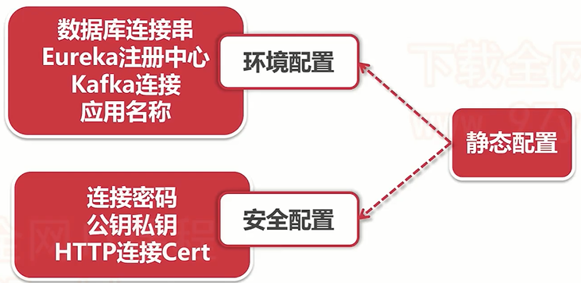

## SpringCloudConfig介绍

前面我们了解了配置中心，接下来我们了解一些SpringCloud Config这个配置中心组件

### Config Server核心功能

Config作为SpringCloud官方指定组件，提供了三个主要功能：

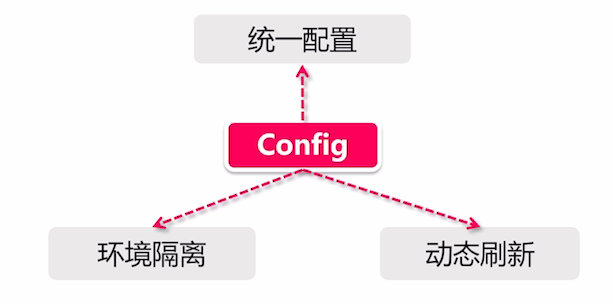

- **统一配置**：提供了中心化的配置方案，将所有的配置都集中在Config Server端
- **环境隔离**：提供多种环境隔离机制，对于Client来说，可以根据自己的需要，从Config Server拉取对应的配置
- **动态刷新**：支持运行期间进行配置的修改

除了上面这些功能，还有其他加密解密，定向推送等功能

### Config Server实现原理

我们老套路，先了解一些Config Server的原理，再对其进行demo级别的学习

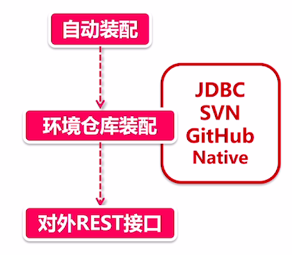

- **自动装配**：老生常谈，Config Server也是通过一个注解`@EnableConfigServer`来开启配置中心的，Config内部通过一系列的`@Import`来引入其他的配置类，完成自动装配（ConfigServerAutoConfiguration）
- **环境仓库装配**：启动自动装配后，自然要从配置的存储仓库拉取配置了，交由EnvironmentRepositoryConfiguration来实现，可以通过JDBC，SVN，Git等方式进行存储，默认情况下推荐使用Github
- **对外REST接口**：拉取完配置后，自然是要开放接口给外部，来获取配置，通过`EnvironmentController`这个类对外暴露接口，通过不同的url获取不同的配置

除此之外，ConfigServer还具备格式转换功能，比如Client需要yml形式的配置，那么如果只有properties，它会自动转换格式为yml形式进行返回

### Config Client实现原理

简单了解完Server实现原理，我们来看看Client是如果拉取配置，在何时拉取的呢？

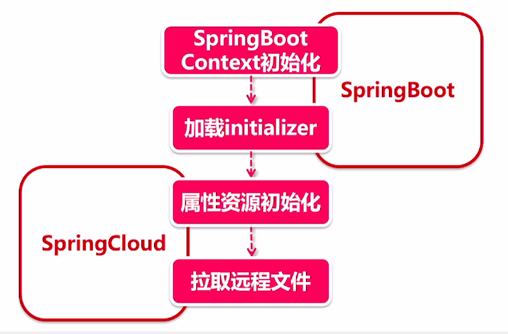

1. **SpringBoot Context初始化**：这是SpringBoot启动时必做的一件事，也就是在run时prepareContext生成上下文对象
2. **加载initializer**：加载所有的初始化器，其中PropertySourceBootstrapConfiguration作为配置文件的初始化器，来进行配置的初始化
3. **属性资源初始化**：PropertySourceBootstrapConfiguration加载时，是通过locator定位资源文件的，而当我们引入Config-client依赖后，就会启动Config的自动装配，为`ConfigServerBootstrapConfiguration`实现，这个自动装配的过程中，就会向locator列表添加一个专门获取远程文件的类-`ConfigServicePropertySourceLocator`
4. **拉取远程文件**：`ConfigServicePropertySourceLocator`定义了优先级@Order(0)即优先级最高，所以他会最先从Config Server拉取配置，进行配置绑定

通过最后一点，我们会发现一个优先级问题，这里给出一点小Tips：

- **bootstrap.yml 》 application.properties 》 application.yml**
- **所以我们可以将Config的配置放到bootstrap中优先加载**

## 单节点配置中心

在实现配置中心之前，我们还需要了解一些东西~

### 简单了解如何实现

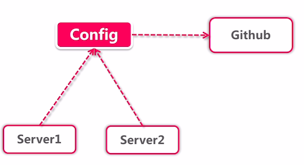

首先就是他的组织架构：由Config 组件拉取Github上保存的配置，保存一份放到本地，各个Server节点获取配置

Config Server主要有两种工作模式：

- 与仓库对接：比如Github，将配置保存到Github上，Config Server从中拉取配置信息（如果是Github的私有项目，我们需要将Github的用户名密码加密存储到配置中进行连接）

- 自立门户：不与Github合作了，直接我自己就是存储配置文件的地方，将文件保存到本地，读取文件
  - 需要开启配置：`spring.profiles.active=native`

这里我们使用最经典的第一种方式，也就是和github配合

配置起来非常简单，只需要指定github地址即可：

```properties
spring.cloud.config.server.git.url=https://github.com/xxxx/config-repo.git
# 指定目录
spring.cloud.config.server.git.search-paths={/appName}
```

**接着我们来实现一个配置中心**

### 创建Github仓库

首先我们需要创建一个Github仓库，这里我命名为`config-repo`

然后我们需要创建文件，这里文件的名字很重要，有一些潜规则：

- 一般来说，命名为`{appName}-{profile}.yml/properties`，比如`config-consumer-dev.yml`

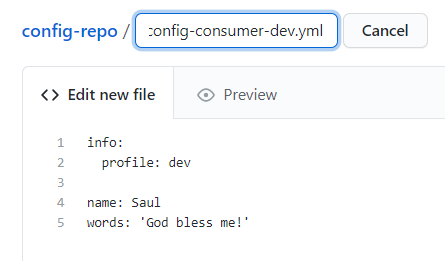

这里我们创建了一个dev环境的配置文件，然后我们再创建一个生产环境的prod配置文件：

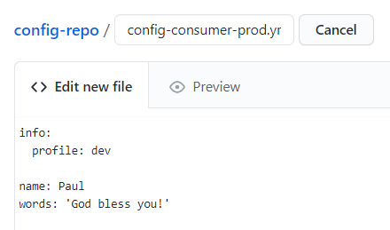

这样，我们的Git仓库环境就准备好了~

### 实现Config Server

Config Server非常简单，没有什么配置项

**1.创建`config-server`工程，并添加依赖|**

```xml
<dependencies>
    <dependency>
        <groupId>org.springframework.cloud</groupId>
        <artifactId>spring-cloud-config-server</artifactId>
    </dependency>
</dependencies>
```

**2.创建启动器类**

```java
@SpringBootApplication
@EnableConfigServer
public class ConfigServerApplication {
    public static void main(String[] args) {
        SpringApplication.run(ConfigServerApplication.class,args);
    }
}
```

**3.添加配置文件**

```yml
spring:
  application:
    name: config-server
  cloud:
    config:
      server:
        git:
          uri: https://github.com/PAcee1/config-repo.git
          # 强制拉取
          force-pull: true
#          username:
#          password:
#          search-paths: foodie,xcEdu # 配置拉取某个目录下
server:
  port: 60000
```

可以看到，非常简单就实现了配置中心

接下来我们要测试一下拉取github上的配置，这里主要有两种方式：

```
第一种，使用`/`来分割应用名称，环境，以及分支
http://localhost:60000/{application}/{profile}/{label} (label不写默认为master)
例如：http://localhost:60000/config-consumer/dev

第二种，使用`-`来连接
http://localhost:60000/{label}/{application}-{profile}.(json/yml/properties)
例如：http://localhost:60000/config-consumer-dev.yml
```

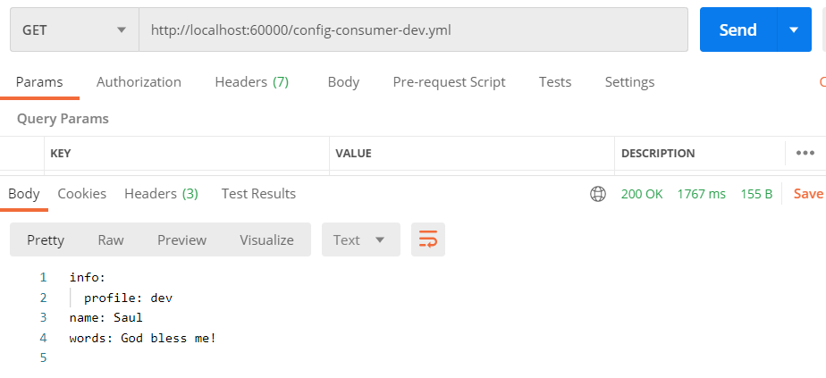

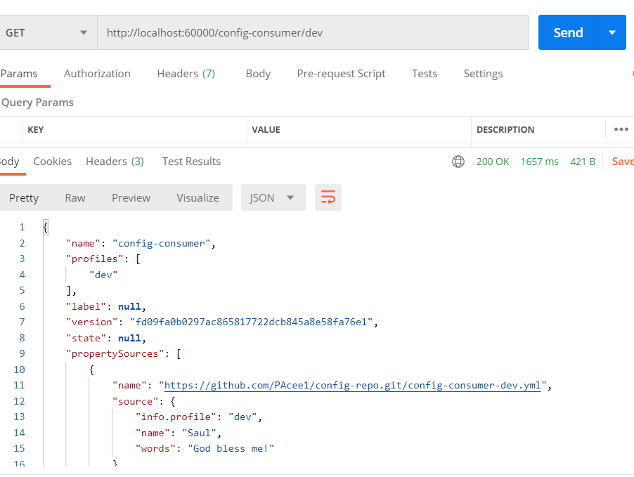

可以到，两种方式都可以，但是第二种会直接获取文件内容，而第一种会有一些其他信息

### 实现Config Client

也很简单，和ConfigServer差不多

**1.创建module，添加依赖**

```xml
<dependencies>
    <dependency>
        <groupId>org.springframework.boot</groupId>
        <artifactId>spring-boot-starter-web</artifactId>
    </dependency>
    <dependency>
        <groupId>org.springframework.cloud</groupId>
        <artifactId>spring-cloud-starter-config</artifactId>
    </dependency>
</dependencies>
```

**2.添加启动器类**

```java
@SpringBootApplication
public class ConfigClientApplication {
    public static void main(String[] args) {
        SpringApplication.run(ConfigClientApplication.class,args);
    }
}
```

这里只需要常规注解启动即可

**3.添加Controller进行测试**

```java
@RestController
public class Controller {

    @Value("${name}")
    private String name;

    @Value("${myWords}")
    private String words;

    @GetMapping("/name")
    public String getName(){
        return name;
    }

    @GetMapping("/words")
    public String getWords(){
        return words;
    }
}
```

**4.添加配置文件**

`注意！这里配置文件应该是bootstrap.yml，加载优先级高于application`

```yml
spring:
  application:
    name: config-client
  cloud:
    config:

      name: config-consumer
      uri: http://localhost:60000
      # profile 一般是由动态配置的，比如在获取当前机器的系统环境变量
      profile: prod
      label: master
server:
  port: 60001

myWords: ${words}
```

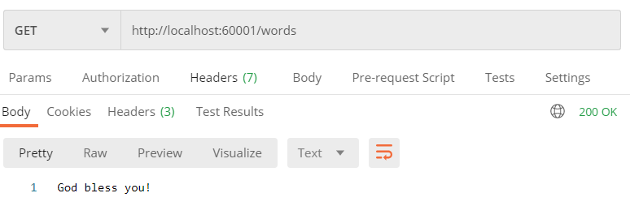

测试没问题，说明实现配置中心成功

## 动态刷新配置

当我们项目运行起来之后，会在服务启动的时候加载资源文件，那么我们如果想在服务运行期间，进行配置的修改，SpringCloudConfig支持吗？

当然，配合Actuator组件即可

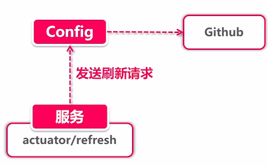

整个过程分为三步：

1. 发送指令：通过post请求config Client的`/actuator/refresh`路径，然后这个client服务节点就会会发送一个刷新配置请求给Config Server
2. ConfigServer拉取文件：拉取Github上最新的文件到本地
3. 获取变更内容：然后Client端就会从Server拿取变更内容，将变动的属性分配到每个类中

**Tips：这里有一个小前提，只有加上@RefreshScope注解的类，所包含的配置属性，才会被刷新~**

### 实现动态刷新

接着我们简单测试一下，首先我们需要进行一些改造

**1.添加actuator依赖**

```xml
<dependency>
    <groupId>org.springframework.boot</groupId>
    <artifactId>spring-boot-starter-actuator</artifactId>
</dependency>
```

**2.新建一个controller类，并添加@RefreshScope注解**

```java
@RestController
@RequestMapping("/refresh")
@RefreshScope
public class RefreshController {

    @Value("${myWords}")
    private String words;

    @GetMapping("/words")
    public String getWords(){
        return words;
    }
}
```

**3.配置文件配置actuator**

```yml
management:
  security:
    enabled: true
  endpoints:
    web:
      exposure:
        include: "*"
  endpoint:
    health:
      show-details: always
```

**4.测试**

在我们启动完Server以及Client后，去Github修改一些我们的配置文件：

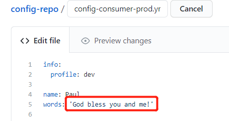

然后发送刷新指令

```
POST http://localhost:60001/actuator/refresh
```

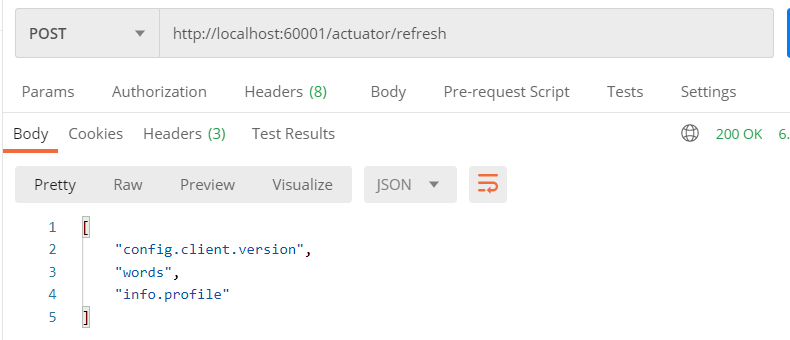

会发现我们修改了两条记录（因为我发现info.profile写错了，应该是prod，一起改了）

最后就是见证奇迹的时刻了，请求我们的新接口，看看配置是否动态刷新了


没问题

## 高可用配置中心

之前我们的配置中心，就一个节点，我们是Client直连Server拉取服务的，那么如果Server端出现宕机，就会导致服务不可用，所以我们要配置集群的形式，来实现配置中心高可用，既然我们是微服务系统。那必然会想到Eureka了~

使用Eureka配合Config实现配置中心高可用

> 当然，不使用Eureka也可以实现高可用，只需要配置多个配置中心，然后网关层进行负载均衡即可，比如使用Nginx

### 借助Eureka实现高可用

主要分为两大步：

1. 创建`config-server-eureka`工程，并添加eureka依赖，注册到注册中心
2. 修改`config-client`，也将其注册到注册中心，并修改配置中心配置

这里第一步就不放出来了，前面小节实现ConfigServer是一样的，只不过加上了Eureka依赖以及注解配置

第二步修改主页就是配置文件的修改，如下：

```yml
spring:
  application:
    name: config-client
  cloud:
    config:
      name: config-consumer
      #uri: http://localhost:60000
      discovery:
        enabled: true
        service-id: CONFIG-SERVER-EUREKA
      # profile 一般是由动态配置的，比如在获取当前机器的系统环境变量
      profile: prod
      label: master
eureka:
  client:
    service-url:
      defaultZone: http://localhost:22222/eureka
```

因为使用了注册中心，所以连接配置中心的方式**由原来的直接配置uri路径改为了使用节点名称**

## 配置中心保存私密信息

如果配置中心的配置中，夹杂了一些密码，尽管我们的仓库可以使private，但还是不好，说不定就被某个程序员生气删库跑路了，所以我们需要对这些私密的比如密码，进行加密处理。

### 数据加密

数据加密这个概念其实很简单，主要有三个对象参与：

- 数据加密端：用于数据的加密，以及对秘钥的保存，秘钥的保存非常重要
- 数据存放端：加密后的数据存放的地点，比如github
- 数据解密端：用于对加密后的数据进行解密，应该和数据加密端再一个地方

那么我们看看Config是如何实现数据加解密的

1. **数据加密**：Config中需要配置秘钥信息，这里有两种方式，对称加密和非对称加密，这个详细后面再说。主要就是经由Config对数据进行加密，然后我们将加密后的数据保存到Github上。
   - 加密可以通过POST请求`/encrypt`路径实现，在body中存放数据信息，会返回给我们加密后的数据
   - 保存到Github时，需要在数据前加上`{cipher}`标识，标识这是加密后的数据
   - 比如：`password:{cipher}6asda7aq21`
2. **服务端解密**：Config读取数据时，会对具有`{cipher}`前缀的数据进行解密，秘钥解密后再明文发送给Client端

### 对称加密和非对称加密

- **对称加密**：加密和解密数据使用的是同一个秘钥，这样的加密算法速度快效率高，但是缺点就是秘钥一定要隐秘保存，不然被谁知道了秘钥，都可以进行伪造
- **非对称加密**：需要生成一个密钥对，包括公钥和私钥，公钥用作对密码进行加密，私钥用作对密码进行解密。非对称加密算法强度高，效率比对称加密低，但是安全性更高
  - 非对称加密也要注意公钥的保存，只能分发给授信用户，不然有不法人员获取了公钥，可能会伪造一些数据来请求我们的服务
  - 比如2018年微信事件，当时腾讯报警有人非法侵入他们服务器，经查询发现，是一家公司通过反编译微信安装包，找到了公钥，所以通过这个公钥集成到了自己的app中，将自己app打造成了微信的代理，就好像是微信分身，所以公钥对授信用户分配也要注意保存

### 配置中心是加密解密

接下来我们对配置中心实现加密解密，为了方便，我们直接使用对称加密的形式实现

**1.首先我们需要到`config-server-eureka`中添加配置**

```yml
encrypt:
  key: mytreasurewaterbaby
```

注意，**这里需要配置在bootstrap.yml中**，key可以随意输入，这样我们的秘钥就配置完毕咯

**2.调用加密接口对密码进行加密**

请求路径：POST http://localhost:60002/encrypt ， 然后body中存放需要加密的数据

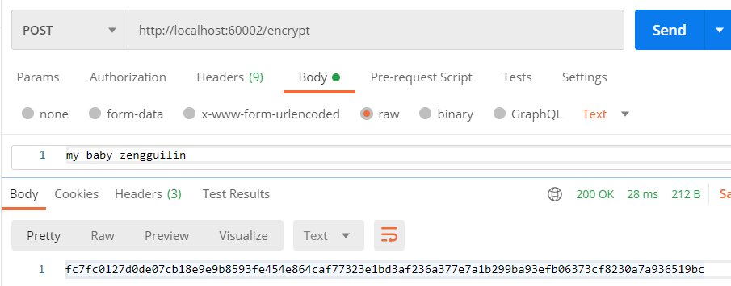

可以看到，返回了一段字符串就是加密后的数据

**3.将加密后的数据配置到Github上**

配置的时候注意！需要加上前缀：`{cipher}`标识是加密后的数据，这样Config看到才会对其解密

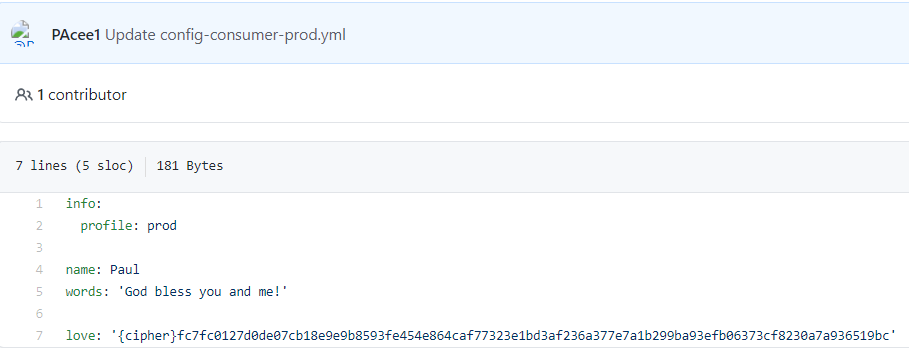

**4.修改Client测试**

然后我们将新添加的配置添加到Controller中：

```java
@Value("${love}")
private String love;

@GetMapping("/love")
public String getLove(){
    return love;
}
```

然后启动访问测试：http://localhost:60001/refresh/love

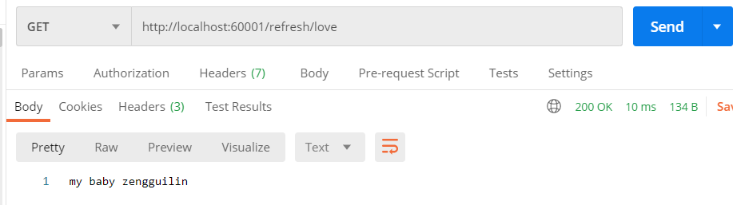

成功解密，验证成功

## 源码解读Config Server资源文件加载

因为之前了解到，Config Server为外部提供了Rest接口，主要由EnvironmentController提供，所以我们直接从这个类开始看起

```java
@RequestMapping("/{label}/{name}-{profiles}.properties")
public ResponseEntity<String> labelledProperties(@PathVariable String name,
      @PathVariable String profiles, @PathVariable String label,
      @RequestParam(defaultValue = "true") boolean resolvePlaceholders)
      throws IOException {
    // 这里主要校验profiles最后一个字母不是短横杠
   validateProfiles(profiles);
    // 这里就是实际创建环境的地点 也是资源文件加载的主要地点
   Environment environment = labelled(name, profiles, label);
   Map<String, Object> properties = convertToProperties(environment);
   String propertiesString = getPropertiesString(properties);
   if (resolvePlaceholders) {
      propertiesString = resolvePlaceholders(prepareEnvironment(environment),
            propertiesString);
   }
   return getSuccess(propertiesString);
}
```

接下来我们来看看主要方法labelled：

```java
@RequestMapping("/{name}/{profiles}/{label:.*}")
public Environment labelled(@PathVariable String name, @PathVariable String profiles,
      @PathVariable String label) {
    // 对name进行处理
   if (name != null && name.contains("(_)")) {
      // "(_)" is uncommon in a git repo name, but "/" cannot be matched
      // by Spring MVC
      name = name.replace("(_)", "/");
   }
    // 对label进行处理
   if (label != null && label.contains("(_)")) {
      // "(_)" is uncommon in a git branch name, but "/" cannot be matched
      // by Spring MVC
      label = label.replace("(_)", "/");
   }
    // 关键的来了！这里就是创建环境资源加载的地方，再次进入
   Environment environment = this.repository.findOne(name, profiles, label);
   if (!this.acceptEmpty
         && (environment == null || environment.getPropertySources().isEmpty())) {
      throw new EnvironmentNotFoundException("Profile Not found");
   }
   return environment;
}
```

进入findOne方法，是由EnvironmentRepository提供的：

```java
@Override
public Environment findOne(String application, String profile, String label) {
    // 首先创建一个环境对象，此时是空的
   Environment env = new Environment(application, new String[] { profile }, label,
         null, null);
    // 然后判断是否有多个仓库，比如git svn db，说明可以在不同的地方存放配置文件，都会被其加载
    // 因为我们只有git，所以进入
   if (this.environmentRepositories.size() == 1) {
       // 注意！这里就是获取第一个Repository，然后调用findOne开始构建环境了
      Environment envRepo = this.environmentRepositories.get(0).findOne(application,
            profile, label);
       // 获取完信息后，将其添加到环境中返回
      env.addAll(envRepo.getPropertySources());
      env.setVersion(envRepo.getVersion());
      env.setState(envRepo.getState());
   }
   else {
      for (EnvironmentRepository repo : this.environmentRepositories) {
         env.addAll(
               repo.findOne(application, profile, label).getPropertySources());
      }
   }
   return env;
}
```

进入MultipleJGitEnvironmentRepository的方法：

```java
@Override
public Environment findOne(String application, String profile, String label) {
    // 这里是判断类似缓存的，如果不是第一次请求，说明有缓存，直接取缓存中的数据
    // 因为我们是第一次请求，所以会跳过
   for (PatternMatchingJGitEnvironmentRepository repository : this.repos.values()) {
      if (repository.matches(application, profile, label)) {
         for (JGitEnvironmentRepository candidate : getRepositories(repository,
               application, profile, label)) {
            try {
               if (label == null) {
                  label = candidate.getDefaultLabel();
               }
               Environment source = candidate.findOne(application, profile,
                     label);
               if (source != null) {
                  return source;
               }
            }
            catch (Exception e) {
               if (this.logger.isDebugEnabled()) {
                  this.logger.debug(
                        "Cannot load configuration from " + candidate.getUri()
                              + ", cause: (" + e.getClass().getSimpleName()
                              + ") " + e.getMessage(),
                        e);
               }
               continue;
            }
         }
      }
   }
    // 进行一系列的路径获取替换，比如label，name，profile等
   JGitEnvironmentRepository candidate = getRepository(this, application, profile,
         label);
    // 如果label不存在，设置label为默认的master
   if (label == null) {
      label = candidate.getDefaultLabel();
   }
   if (candidate == this) {
//       进入父类的findOne方法
      return super.findOne(application, profile, label);
   }
   return candidate.findOne(application, profile, label);
}
```

父类findOne方法：

```java
@Override
public synchronized Environment findOne(String application, String profile,
      String label) {
   NativeEnvironmentRepository delegate = new NativeEnvironmentRepository(
         getEnvironment(), new NativeEnvironmentProperties());
    // 这里最重要的就是这里，获取location
   Locations locations = getLocations(application, profile, label);
   delegate.setSearchLocations(locations.getLocations());
   Environment result = delegate.findOne(application, profile, "");
   result.setVersion(locations.getVersion());
   result.setLabel(label);
   return this.cleaner.clean(result, getWorkingDirectory().toURI().toString(),
         getUri());
}

@Override
public Locations getLocations(String application, String profile, String label) {
    // 一样是判断缓存
    for (PatternMatchingJGitEnvironmentRepository repository : this.repos.values()) {
        // ···
    }
    JGitEnvironmentRepository candidate = getRepository(this, application, profile,
                                                        label);
    if (candidate == this) {
        // 一样调用父类方法
        return super.getLocations(application, profile, label);
    }
    return candidate.getLocations(application, profile, label);
}

@Override
public synchronized Locations getLocations(String application, String profile,
                                           String label) {
    if (label == null) {
        label = this.defaultLabel;
    }
    // refresh方法，终于到拨云见雾的地方了，这里就是从git拉取文件保存到本地的地方
    String version = refresh(label);
    return new Locations(application, profile, label, version,
                         getSearchLocations(getWorkingDirectory(), application, profile, label));
}
```

接着我们看看refresh方法

```java
public String refresh(String label) {
   Git git = null;
   try {
       // 获取git连接，并且在将base文件夹下所有文件删除，如果没有就创建文件夹，在我们本地会创建一个文件夹，用来临时存储git上的文件
      git = createGitClient();
       // 判断是否要重新拉取文件了
       // 因为我们前面配置了forcePull，所以一定为true，重新拉取
      if (shouldPull(git)) {
          // 这里就是三步走了：fetch checkout merge
         FetchResult fetchStatus = fetch(git, label);
         if (this.deleteUntrackedBranches && fetchStatus != null) {
            deleteUntrackedLocalBranches(fetchStatus.getTrackingRefUpdates(),
                  git);
         }
         // checkout after fetch so we can get any new branches, tags, ect.
         checkout(git, label);
         tryMerge(git, label);
      }
      else {
         // nothing to update so just checkout and merge.
         // Merge because remote branch could have been updated before
         checkout(git, label);
         tryMerge(git, label);
      }
      // always return what is currently HEAD as the version
      return git.getRepository().findRef("HEAD").getObjectId().getName();
   }
   catch (RefNotFoundException e) {
       // 异常
   }
   finally {
      try {
         if (git != null) {
            git.close();
         }
      }
      catch (Exception e) {
         this.logger.warn("Could not close git repository", e);
      }
   }
}
```

看到这我们大致就可以总结一下SpringCloud Config Server是如何加载资源文件的了

### 总结

1. 首先开放了很多Rest接口让Client请求获取配置
2. 当发送请求后，首先会根据你配置的仓库形式，循环获取配置文件，（可以有svn，git，db等等）
3. 比如我们使用的是git，然后就会**先判断集合容器是否已经存在，是一种缓存机制**
   1. 如果是第一次进入，就会跳过
   2. 第一次获取后，就会保存到那个集合容器中
4. 和git连接拉取前，**会使用一个本地默认文件夹**（通过uri路径），如果文件夹不存在，直接创建，如果文件夹存在，删除后创建，要保证为空
5. 然后会创建git，根据我们配置的git路径进行`clone`
6. 然后会判断是否需要拉取`shouldPull()`
   - 一般是通过时间判断，`refreshRate`通过这个参数配置每次刷新时间
   - 或者配置`forcePull`，每次都需要强制拉取
7. 拉取完毕后，**会将本地路径等信息保存到环境中**
8. 最后读取文件，返回给Client