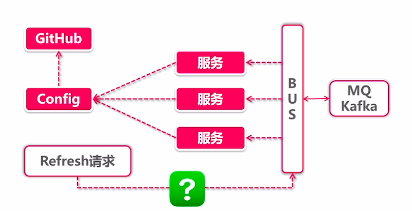
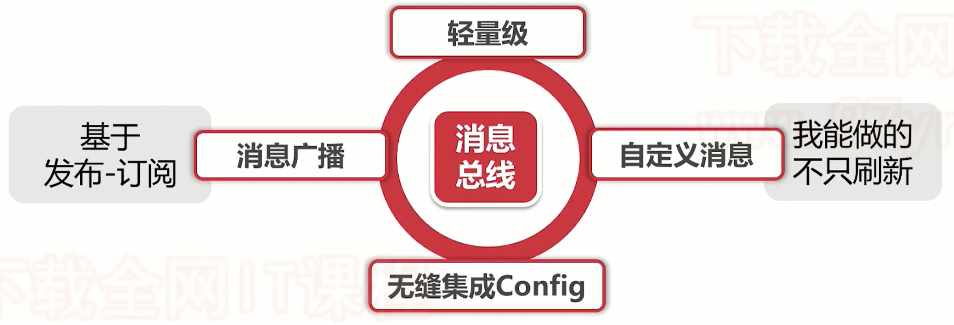
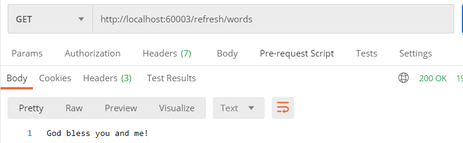
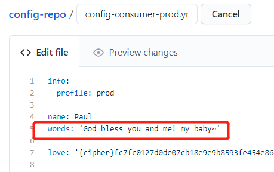
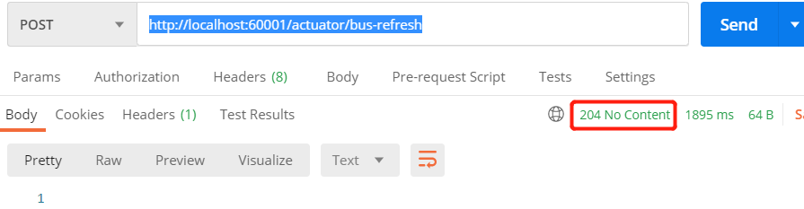
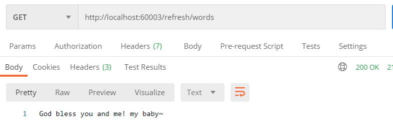
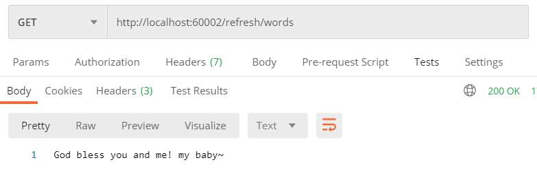
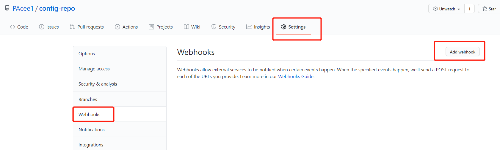
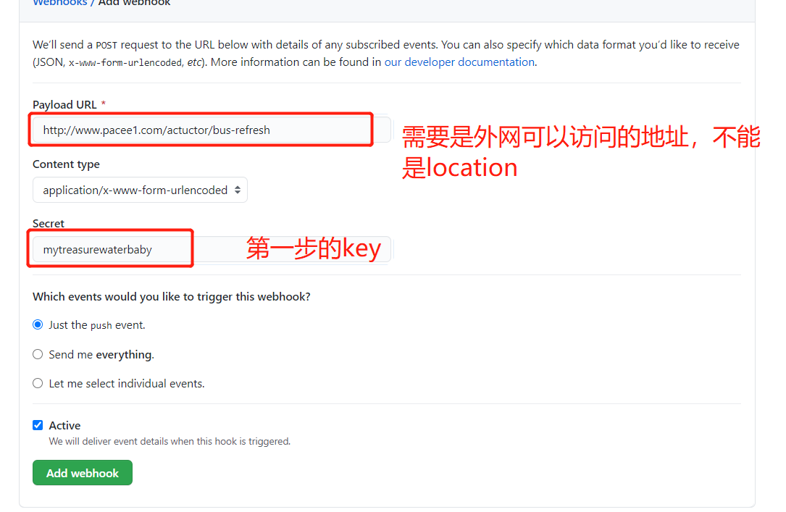
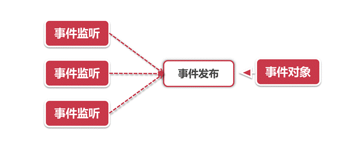

## 消息总线介绍

消息总线是什么？我们先不管，我们先看看上一节学到的Config是不是有一些问题？？

当我们需要在运行时期动态刷新配置时，需要怎么做？向Config Client发送请求，通过`/actuator/refresh`，那么如果我们有上万台节点呢？难道我们需要手工一个个发送请求，或者是通过写一个小程序循环发送请求吗？效率低且麻烦！

这种基础问题，我们能想到，SpringCloud肯定也能想到，所以消息总线出来了~

消息总线Bus，就好像一个Bus公交车，当有配置更新后，公交车就启动，把所有节点都拉上车，一并把配置给刷新了。

So，很明了了，**Bus的作用主要就是用来进行批量刷新的，主要使用了发布订阅模式，当配置修改后，会向所有服务节点发布消息，服务节点监听到后，会进行配置刷新操作**。

### Bus架构

接着我们看看Bus的架构，底层是使用什么进行发布订阅的呢？



- MQ：BUS只是一层封装，其实底层发布订阅还是使用的消息队列实现的，这里支持Kafka和RabbitMQ两种方式，实际是直接使用了Cloud封装的Stream进行的消息管理
- BUS：作为中间件，BUS主要就是接收刷新请求，然后通过MQ向所有服务节点推送消息，服务节点监听后会进行配置重新拉取刷新
- Refresh请求：通过该请求向Bus发送批量刷新请求，这里有个问题：
  - 谁来发起变更：是通过服务节点变更，还是ConfigServer发起呢（答案：都可以）
  - 何时发起变更：是通过手工发起，还是每个Github配置修改后自动发起？（答案：也都可以）
  - 这两个问题后面会有验证

### Bus场景

Bus当然不止可以实现配置刷新，看下图：



还可以实现自定义消息广播，只要是想要对所有服务节点或某些服务节点实现广播形式的消息，都可以使用bus来实现，比如：

有一些不是特别重要的服务，比如用户资料修改，查看我的会员卡等等服务，在双十一期间为了主链路性能提高，可以通过广播的形式将这些服务暂时停掉。

### Bus的EndPoint

Bus作为消息广播，通过前面架构查看，是开放了refresh端点来接收刷新请求，然后再分发消息的，那么Bus开放了哪些主要EndPoint呢？主要有两个

- `bus-env`：用于更新环境，在本地发布一个EnvironmentChangeRemoteApplicationEvent，表示远程环境改变事件，其中包含一个Map属性，监听者监听到后，会将这个Map属性添加到Spring的环境变量中
- `bus-refresh`：用于配置更新，发布RefreshRemoteApplicationEvent事件，表示远程配置刷新事件，所有监听程序会触发@RefreshScope注解标注的类，使其内部的配置属性进行刷新

### Bus的接入方式

前面我们说到，Bus底层其实就是Stream的封装，而Stream支持RabbitMQ和Kafka两种消息队列，那么要接入他们应该怎么做呢？

对于Bus来说真正做到了组件形式的简单拔插，非常简单就可以替换底层消息队列

#### RabbitMQ

添加依赖：

```xml
<dependency>
    <groupId>org.springframework.cloud</groupId>
    <artifactId>spring-cloud-starter-bus-amqp</artifactId>
</dependency>
```

添加配置：

```yml
spring:
    rabbitmq:
        host: localhost
        port: 5672
        username: guest
        password: guest
```

简单的添加依赖，以及配置就接入了RabbitMQ，是不是很方便呢

#### Kafka

对于Kafka来说，和RabbitMQ的接入方式是一模一样的

添加依赖：

```xml
<dependency>
    <groupId>org.springframework.cloud</groupId>
    <artifactId>spring-cloud-starter-bus-kafka</artifactId>
</dependency>
```

添加配置：

```yml
spring:
  cloud:
     stream:
        kafka:
          binder:
            brokers:  127.0.0.1:9092  # kafka服务地址和端口
            zk-nodes: 127.0.0.1:2181  # ZK的集群配置地址和端口
```

即可

这样我们不难发现，如果想更换底层消息队列，只需要修改依赖以及相关配置即可，对于代码层面是无感知的，非常优秀~

## 实现消息总线

Bus实现非常简单，主要分为Server与Client，其实和上一节Config差不多，只不过多了消息总线Bus的依赖

### 实现Server端

**1.创建`config-bus-server`工程并添加依赖**

```xml
<dependencies>
    <dependency>
        <groupId>org.springframework.cloud</groupId>
        <artifactId>spring-cloud-config-server</artifactId>
    </dependency>
    <dependency>
        <groupId>org.springframework.cloud</groupId>
        <artifactId>spring-cloud-starter-netflix-eureka-client</artifactId>
    </dependency>
    <!--添加以rabbitMQ为消息队列的bus依赖-->
    <dependency>
        <groupId>org.springframework.cloud</groupId>
        <artifactId>spring-cloud-starter-bus-amqp</artifactId>
    </dependency>
    <!--添加以kafka为消息队列的bus依赖-->
    <!--<dependency>
        <groupId>org.springframework.cloud</groupId>
        <artifactId>spring-cloud-starter-bus-kafka</artifactId>
    </dependency>-->
</dependencies>
```

可以看到，这里支持两种消息队列形式，RabbitMQ和Kafka

**2.创建启动类**

```java
@SpringBootApplication
@EnableConfigServer
@EnableDiscoveryClient
public class ConfigServerApplication {
    public static void main(String[] args) {
        SpringApplication.run(ConfigServerApplication.class,args);
    }
}
```

这里和之前一样没有变化

**3.添加配置**

`bootstrap.yml`：

```yml
encrypt:
  key: mytreasurewaterbaby
```

`application.yml`：

```yml
spring:
  application:
    name: config-bus-server
  rabbitmq:
    host: localhost
    port: 5672
    username: guest
    password: guest
  cloud:
    config:
      server:
        git:
          uri: https://github.com/PAcee1/config-repo.git
          # 强制拉取
          force-pull: true
#          username:
#          password:
#          search-paths: foodie,xcEdu # 配置拉取某个目录下
server:
  port: 60001

eureka:
  client:
    service-url:
      defaultZone: http://localhost:22222/eureka
management:
  security:
    enabled: true
  endpoints:
    web:
      exposure:
        include: "*"
  endpoint:
    health:
      show-details: always
```

这里主要修改这些：

- 修改应用名称
- 添加RabbitMQ配置
- 添加actuator端点开放

这样，我们的Server端就配置完毕了

### 实现Client端

Client端的实现也非常简单

**1.创建`config-bus-client`工程并添加依赖**

```xml
<dependencies>
    <dependency>
        <groupId>org.springframework.boot</groupId>
        <artifactId>spring-boot-starter-web</artifactId>
    </dependency>
    <dependency>
        <groupId>org.springframework.boot</groupId>
        <artifactId>spring-boot-starter-actuator</artifactId>
    </dependency>
    <dependency>
        <groupId>org.springframework.cloud</groupId>
        <artifactId>spring-cloud-starter-config</artifactId>
    </dependency>
    <dependency>
        <groupId>org.springframework.cloud</groupId>
        <artifactId>spring-cloud-starter-netflix-eureka-client</artifactId>
    </dependency>
    <dependency>
        <groupId>org.springframework.cloud</groupId>
        <artifactId>spring-cloud-starter-bus-amqp</artifactId>
    </dependency>
</dependencies>
```

Client端也需要添加bus依赖

**2.创建启动类和Controller**

```java
@SpringBootApplication
@EnableDiscoveryClient
public class ConfigClientApplication {
    public static void main(String[] args) {
        SpringApplication.run(ConfigClientApplication.class,args);
    }
}
```

```java
@RestController
@RequestMapping("/refresh")
@RefreshScope
public class RefreshController {

    @Value("${love}")
    private String love;

    @Value("${myWords}")
    private String words;

    @GetMapping("/love")
    public String getLove(){
        return love;
    }

    @GetMapping("/words")
    public String getWords(){
        return words;
    }
}
```

这里和之前一样没有变化

**3.添加配置**

`bootstrap.yml`：

```yml
spring:
  application:
    name: config-bus-client
  rabbitmq:
    host: localhost
    port: 5672
    username: guest
    password: guest
  cloud:
  	# 需要指定使用rabbitMQ还是kafka
    stream:
      default-binder: rabbit
    config:
      name: config-consumer
      #uri: http://localhost:60000
      discovery:
        enabled: true
        service-id: CONFIG-BUS-SERVER
      # profile 一般是由动态配置的，比如在获取当前机器的系统环境变量
      profile: prod
      label: master
server:
  port: 60002
eureka:
  client:
    service-url:
      defaultZone: http://localhost:22222/eureka
myWords: ${words}
management:
  security:
    enabled: true
  endpoints:
    web:
      exposure:
        include: "*"
  endpoint:
    health:
      show-details: always

```

`这里主要有这些不同：

- 修改应用名称
- Server的服务名称修改
- 添加RabbitMQ配置
- 指定RabbitMQ为默认消息队列

这样，我们的Client端就配置完毕了

### 测试

首先我们需要提前启动好RabbitMQ

这里我们依次启动Eureka Server，Config Bus Server，以及两个Config Bus Client节点，这里我使用60002和60003端口。

启动完毕后，首先测试是否可用



经测试，没有问题，接着我们去github上修改配置



然后我们发起刷新指令：

```
POST httphttp://localhost:60001/actuator/bus-refresh
```



204说明刷新成功，接着我们访问两个节点





都修改完毕，说明Bus总线配置成功，全部刷新

**小Tips~这里我们针对Client节点使用Post请求访问`/actuator/bus-refresh`进行刷新也是可以实现刷新的**，所以Bus在哪里都可以进行调用刷新

## 实现自动推送

通过上节Demo，我们会发现推送是我们手工进行的，那么在Bus架构那一节说到的自动推送配置更新，是如何实现呢？

那么就是Github的Webhook~

Webhook是啥？这里我们简单介绍一下

```
Webhook是一种钩子机制，其实就是callback机制，比如当代码更新后提交到Github上，就会调用Webhook触发一段预先定义好的操作，比如通知持续集成部署Jenkins进行构建，当然也可以是调用我们的/actuator/bus-refresh接口进行配置更新
```

所以实现自动推送，必然离不开Webhook了

Webhook三步走~：

1. 设置encrypt.key
2. 将key添加到Github仓库
3. 配置Webhook url

首先第一步，就和之前加密一样，在application.yml添加一个encrypt.key即可

```yml
encrypt:
  key: mytreasurewaterbaby
```

然后第二部加到Github仓库

我们需要打开Github，存放配置文件的Repository



点击Settings，Webhooks，Add webhook



添加完毕就ok了，这样就实现了自动推送

## Bus如何助攻其他业务场景

前面我们学习了Bus的主要应用场景-推送配置变更，这难道是Bus的全部本领吗？就这点本事还能进Spring Cloud？

我们知道Spring Cloud的组件个个身怀十八般武艺，每个组件都有几样拿手的功能，可谓是一专多长。再看Bus，好像似乎除了推送变更啥也不会。大家有所不知，Bus是Spring Cloud的特长生，这“推送”就是它的特长。就像健美操特长都能进清华一样，Bus就靠着这一手排山倒海的推送特长，进了Spring Cloud，专门处理各种广播消息推送，不只局限在配置变更推送。

我们接下来就看看，Bus如何通过自定义事件，实现消息广播。

### 发布-订阅模型



Bus的事件推送由三个角色构成：

- **事件对象**：Bus中定义的一个事件类，通常是一个Pojo对象，包含了消费者需要的信息
- **事件发布**：Bus作为生产者，将事件对象通过广播的形式发布出去
- **事件监听**：由消费者主动监听Bus的事件发布动作，当获取到事件对象后会调用处理方法进行消费

### 自定义事件

#### 自定义事件对象

Bus的所有事件对象都继承自ApplicationEvent或者RemoteApplicationEvent，我们可以仿照bus-refresh功能定义的事件类RefreshRemoteApplicationEvent中的写法，定义一个MyEvent类

```java
public class MyEvent extends RemoteApplicationEvent {

    public MyEvent() {
    }

    public MyEvent(Object body, String originService, String destinationService) {
        super(body, originService, destinationService);
    }
}
```

其中第一个参数可以自定义一个POJO类，大家可以根据自己的需求随意添加属性，但是要保证这个类实现了序列化/反序列化接口（implements Serializable）。

#### 配置自定义对象

在创建了MyEvent之后，我们需要将它加载到Bus的上下文中，这里可以通过@Configuration和@RemoteApplicationEventScan注解将MyEvent加载进来

```java
@Configuration
@RemoteApplicationEventScan(basePackageClasses = MyEvent.class)
public class BusExtConfiguration {
}
```

#### 监听事件

我们要在服务节点添加事件监听器，用来监听服务发布动作，这一步可以通过@EventListener方法级别的注解来实现（可以参考RefreshEventListener类），接收的参数就是第一步中创建的EventBody，Bus会帮我们将消息反序列化为Java类。也可以通过继承ApplicationListener接口来实现，示例如下：

```java
@Component
public class MyEventListener implements ApplicationListener<MyEvent> {
    
    @Override
    public void onApplicationEvent(MyEvent event) {
        logger.info("Received MyCustomRemoteEvent - message: ");
    }
}
```

#### 发布事件

 

万事俱备之后，我们只需要一个发布事件的地方了（在消息生产者处实现），我们可以创建一个简单的Controller，然后对外提供一个POST方法，比如：

```java
@PostMapping("/bus/publish/myevent")
public boolean publishMyEvent(@RequestBody EventBody body) {
    MyEvent event = new MyEvent(body, applicationContext.getId(), "");
    try {
        // 可以注入ApplicationEventPublisher来发送event
        eventPublisher.publishEvent(event);
        // 也可以直接使用
        // applicationContext.publishEvent(event)
        return true;
    } catch (Exception e) {
        log.error("failed in publishing event", e);
    }

    return false;
}
```

我们有两种方式发送event，一种是通过依赖注入ApplicationEventPublisher的实例来发送，现有的bus-refresh功能也是使用这种方式。另一种是直接通过ApplicationContext来发送，由于前面我们通过@RemoteApplicationEventScan注解已经将MyEvent注册为Bus的一个事件，这样ApplicationContext会把MyEvent当做一个Bus总线事件，而不是在Context范围内发布一个Regular Event。

### 应用场景

通过上面的方式我们可以将自定义事件广播到所有监听该事件的节点，让所有消费者触发事件响应。消息广播的使用场景非常多，我们随便举两个实际应用中的例子：

- **清空缓存**：通知所有服务监听者清空某项业务的本地缓存信息，我们也可以在自定义的消息体中加业务属性，事件监听逻辑可以根据这些属性来定点清除某个特定业务对象的缓存

- **数据同步**：子系统依赖实时的数据库记录变动触发相应的业务逻辑，我们这里就可以将数据库的binlog抓取出来，通过广播功能同步到所有监听器，起到数据同步的作用