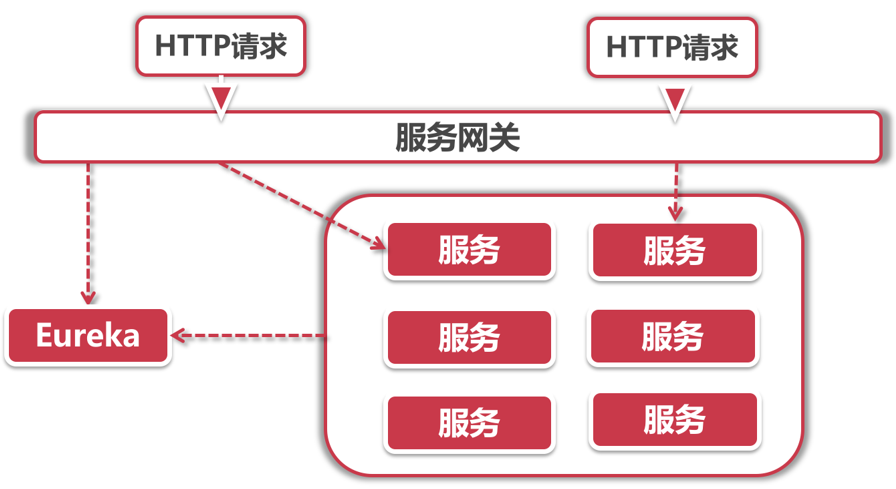
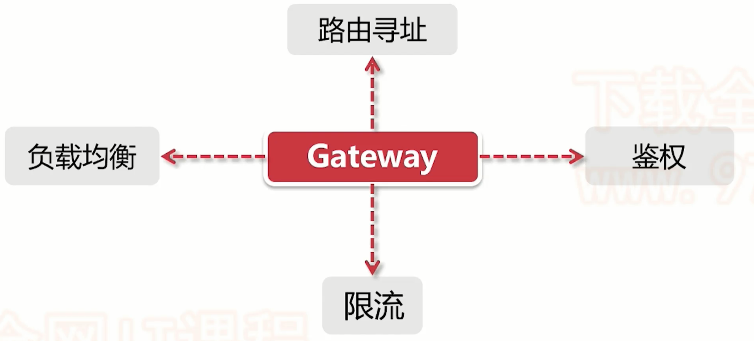
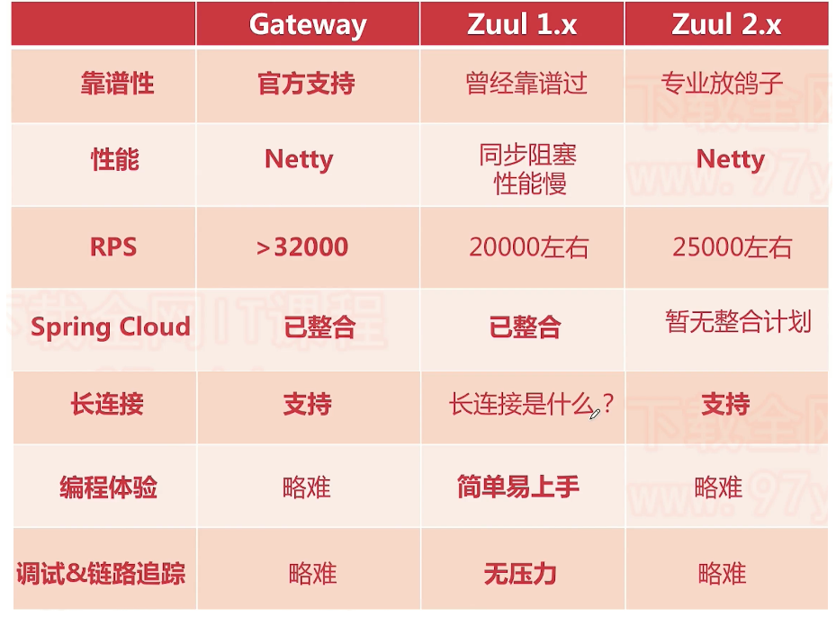
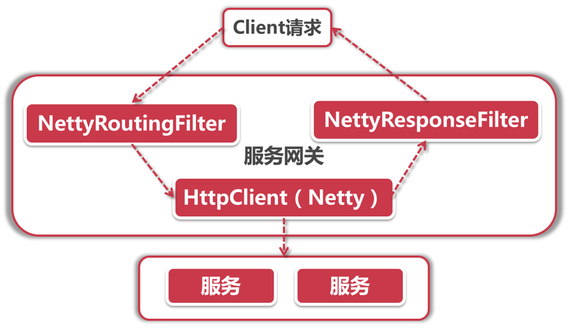
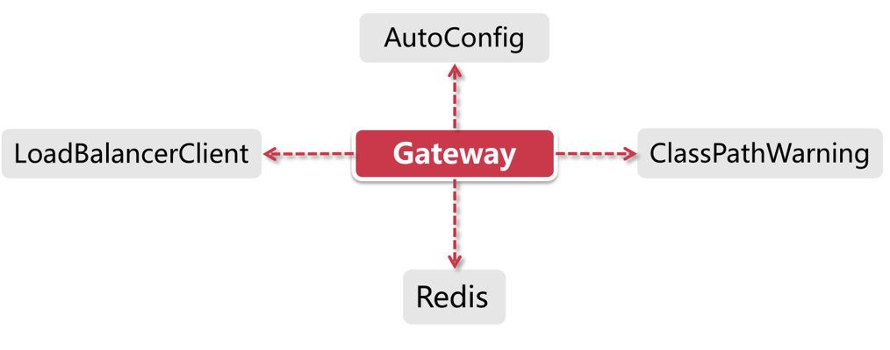

## 服务网关介绍

什么是服务网关？我们先看看下面这个问题

### 对外服务的难题

微服务架构体系很庞大，大量服务节点，配置中心，服务总线，Turbine监控，链路追踪，Stream消息队列中间件，一个系统可能弄出十几二十几个包。

那么就会有一个问题，我们之前都是使用localhost+端口的形式访问，那么**提供给外部调用应该怎么办**呢？产品经理发话了，让我们的前端同学辛苦一下，加班加点的为各个页面配置不同的请求URL和端口，这确实可以，但是用户访问的时候，看那URL换来换去的，还以为是钓鱼网站呢，所以这肯定是不靠谱的；那还有一种方法，使用Nginx进行代理，这确实可以，但又没有想过运维人员的维护问题，你更换节点或者删减节点，都需要运维人员手工维护，很麻烦，所以需要一套机制专门处理这种问题。

还有一个问题就是**安全问题**，我们在提供外部服务的时候往往会加入一些访问控制，比如说下单接口不允许未登录用户的访问，有的服务还会通过一些JWT签名等防止客户端篡改数据。如果让每个服务提供者都实现同样的访问验证逻辑未免有些太繁琐，这样纯属是增加研发人员的怒气值，况且如果有一天我们需要更换权限认证方案，比如更换为OAuth2.0，难不成还要每个服务提供者都做变更？

还是那句话，你能想到的问题，SpringCloud想不到吗？当然可以，服务网关就是SpringCloud提出的解决方案，他就像是**传达室**的角色，先对你身份进行校验，然后再告诉你要走去哪个楼

### 传达室

任何问题，SpringCloud都可以添加一个中间件来解决问题，那么我们就来看看服务网关中间件-传达室~

我们去某个公司找人办事，或者去小区找人，都要通过传达室这一关，主要做了两件事：

- **访问控制**：先查明你的身份，是否有权访问
- **引导指路**：告诉你如何找到你要找的人，走哪条路

引入网关层后，架构就成了这个样子

网关层作为唯一对外的服务，外部只能调用到网关层，然后再由网关层进行鉴权以及请求转发

### 访问控制

访问控制主要包含两个方面：

- **拦截请求**：有的接口需要登录才能访问，对于这样的请求，网关层会看看你请求Header中是否包含了`Authorization`或者`Token`，如果没有，说明你没有登录，直接返回403错误
- **鉴权**：你确实登录了，然后再来到下一环节，你是不是有权限去这个地方呢？需要判断令牌的真假以及令牌的权限

### 路由规则

路由规则也包含两个方面：

- **URL映射**：用户请求的URL不一定是真实的服务URL，这里可以在网关层进行配置，那么网关层获取到用户请求的URL后，比如`/login`请求，但是用户服务实际请求路径为`/user/login`，那么网关层就需要进行一层映射
- **服务寻址**：我们获取到实际URL要进行转发时，又有一个问题了，因为是微服务集群形式，转发到哪一台用户服务节点是一个问题，这里就需要获取服务列表进行负载均衡~（Gateway使用Eureka获取服务列表，并使用Ribbon进行负载均衡）

服务网关介绍的差不多了，接着我们去看看实际的SpringCloud中间件Gateway

## Gateway介绍

Gateway是SpringCloud第二代服务网关组件，为啥说是第二代呢？因为第一代是Zuul，由Netflex公司推出的，那么为啥不再使用Zuul，而是SpringCloud自己整了个Gateway呢？后面再说~

### Gateway前世今生

看了上面一段话，我们可以发现Gateway是**Spring公司出品**的网二代，可谓是根正苗红，底层由**Netty实现**，可谓是快字当头，又有**大批社区维护**的程序员，可谓是风头正盛，我们也毫无理由的直接使用Gateway作为我们服务网关。

那么我们看看Gateway都做了什么呢？

上面说过的服务网关功能都可以实现，并且还可以进行限流。

简单了解Gateway后，我们看看Zuul和Gateway到底有何差异，两者谁才是王者

通过对比图我们不难发现Spring推出Gateway的原因了

- Zuul 1.x效率低，问题较多
- Netflix说好的Zuul 2.x一直放鸽子

这两点导致Spring受不了了，我不能让我的用户一直用着烂烂的Zuul1.x吧，不行我得自己研究一套，所以就有了Gateway

### Gateway体系架构

看完了Gateway的介绍，我们指定使用它来做我们的服务网关组件了，那么我们去看看Gateway的体系架构，看看这个网二代的家底

#### Gateway的家底

Gateway作为网二代，家底肯定厚实了，让我们来拨开Gateway的自动装配工厂`GatewayAutoConfiguration`看看，映入眼帘的就是由黄金铸造的五个大字`Netty`。

Netty是啥？那可是网络通信业的王牌，非阻塞，高性能，高可靠的异步输入输出，造就了它的地位，速度王！可以说Gateway的快速都是依赖Netty，来看看Netty为Gateway提供了哪些应用：

- 发起服务调用：通过`NettyRoutingFilter`过滤器实现，底层采用Netty的`HttpClient`发起服务调用
- Response传输：通过`NettyResponseFilter`过滤器实现，用于服务调用完毕后的响应数据，返回给调用者
- Socket连接：通过`ReactorNettyWebSocketClient`类承接

所以，Gateway与Netty可以说是息息相关，这些服务调用响应都是由Netty实现的，而且！都是通过**过滤器实现**的，有关Gateway底层过滤器我们再源码解析进行了解

一张图概括：

Client发起请求后，由NettyRoutingFilter拦截，使用HTTPClient调用外部服务，服务响应后的数据Response再由NettyResponseFilter拦截传回给客户端。Netty可以说是Gateway高效的原因

#### Gateway自动装配

接着让我们看看Gateway再启动时的自动装配，加载了什么资源

- **AutoConfig**：核心装配类，`GatewayAutoConfiguration`负责所有Route路由，Predicate断言工厂和Filter的装配，这可是Gateway的重中之重，用于完成路由功能，并且会装配Netty
- **LoadBalancerClient**：也就是加载Ribbon的配置，对Ribbon进行装配，由`GatewayLoadBalancerClientAutoConfiguration`实现
- ClassPathWarning：同样也是在AutoConfig完成之后触发（具体加载类为`GatewayClassPathWarningAutoConfiguration`），由于Gateway底层依赖Spring WebFlux的实现，所以它会检查项目是否加载了正确配置
- Redis：在Gateway中Redis主要负责限流的功能
- 路人甲：`GatewayMetricsAutoConfiguration`负责做一些统计工作，比如对所谓的“short task”运行时长和调用次数做统计
- 路人乙：`GatewayDiscoveryClientAutoConfiguration`服务发现客户端自动装配类

#### Gateway的坑

有时Gateway会启动出错，查来查去也没有配置出错，这时可以看一下是否引入了错误的依赖，因为Gateway由WebFlux实现，所以需要引入`spring-boot-starter-webflux`，假如引入了`spring-boot-starter-web`，那么就会出现启动错误的问题，需要在Gateway依赖中将web依赖剔除