## 服务网关介绍

什么是服务网关？我们先看看下面这个问题

### 对外服务的难题

微服务架构体系很庞大，大量服务节点，配置中心，服务总线，Turbine监控，链路追踪，Stream消息队列中间件，一个系统可能弄出十几二十几个包。

那么就会有一个问题，我们之前都是使用localhost+端口的形式访问，那么**提供给外部调用应该怎么办**呢？产品经理发话了，让我们的前端同学辛苦一下，加班加点的为各个页面配置不同的请求URL和端口，这确实可以，但是用户访问的时候，看那URL换来换去的，还以为是钓鱼网站呢，所以这肯定是不靠谱的；那还有一种方法，使用Nginx进行代理，这确实可以，但又没有想过运维人员的维护问题，你更换节点或者删减节点，都需要运维人员手工维护，很麻烦，所以需要一套机制专门处理这种问题。

还有一个问题就是**安全问题**，我们在提供外部服务的时候往往会加入一些访问控制，比如说下单接口不允许未登录用户的访问，有的服务还会通过一些JWT签名等防止客户端篡改数据。如果让每个服务提供者都实现同样的访问验证逻辑未免有些太繁琐，这样纯属是增加研发人员的怒气值，况且如果有一天我们需要更换权限认证方案，比如更换为OAuth2.0，难不成还要每个服务提供者都做变更？

还是那句话，你能想到的问题，SpringCloud想不到吗？当然可以，服务网关就是SpringCloud提出的解决方案，他就像是**传达室**的角色，先对你身份进行校验，然后再告诉你要走去哪个楼

### 传达室

任何问题，SpringCloud都可以添加一个中间件来解决问题，那么我们就来看看服务网关中间件-传达室~

我们去某个公司找人办事，或者去小区找人，都要通过传达室这一关，主要做了两件事：

- **访问控制**：先查明你的身份，是否有权访问
- **引导指路**：告诉你如何找到你要找的人，走哪条路

引入网关层后，架构就成了这个样子


网关层作为唯一对外的服务，外部只能调用到网关层，然后再由网关层进行鉴权以及请求转发

### 访问控制

访问控制主要包含两个方面：

- **拦截请求**：有的接口需要登录才能访问，对于这样的请求，网关层会看看你请求Header中是否包含了`Authorization`或者`Token`，如果没有，说明你没有登录，直接返回403错误
- **鉴权**：你确实登录了，然后再来到下一环节，你是不是有权限去这个地方呢？需要判断令牌的真假以及令牌的权限

### 路由规则

路由规则也包含两个方面：

- **URL映射**：用户请求的URL不一定是真实的服务URL，这里可以在网关层进行配置，那么网关层获取到用户请求的URL后，比如`/login`请求，但是用户服务实际请求路径为`/user/login`，那么网关层就需要进行一层映射
- **服务寻址**：我们获取到实际URL要进行转发时，又有一个问题了，因为是微服务集群形式，转发到哪一台用户服务节点是一个问题，这里就需要获取服务列表进行负载均衡~（Gateway使用Eureka获取服务列表，并使用Ribbon进行负载均衡）

服务网关介绍的差不多了，接着我们去看看实际的SpringCloud中间件Gateway

## Gateway介绍

Gateway是SpringCloud第二代服务网关组件，为啥说是第二代呢？因为第一代是Zuul，由Netflex公司推出的，那么为啥不再使用Zuul，而是SpringCloud自己整了个Gateway呢？后面再说~

### Gateway前世今生

看了上面一段话，我们可以发现Gateway是**Spring公司出品**的网二代，可谓是根正苗红，底层由**Netty实现**，可谓是快字当头，又有**大批社区维护**的程序员，可谓是风头正盛，我们也毫无理由的直接使用Gateway作为我们服务网关。

那么我们看看Gateway都做了什么呢？


上面说过的服务网关功能都可以实现，并且还可以进行限流。

简单了解Gateway后，我们看看Zuul和Gateway到底有何差异，两者谁才是王者


通过对比图我们不难发现Spring推出Gateway的原因了

- Zuul 1.x效率低，问题较多
- Netflix说好的Zuul 2.x一直放鸽子

这两点导致Spring受不了了，我不能让我的用户一直用着烂烂的Zuul1.x吧，不行我得自己研究一套，所以就有了Gateway

### Gateway体系架构

看完了Gateway的介绍，我们指定使用它来做我们的服务网关组件了，那么我们去看看Gateway的体系架构，看看这个网二代的家底

#### Gateway的家底

Gateway作为网二代，家底肯定厚实了，让我们来拨开Gateway的自动装配工厂`GatewayAutoConfiguration`看看，映入眼帘的就是由黄金铸造的五个大字`Netty`。

Netty是啥？那可是网络通信业的王牌，非阻塞，高性能，高可靠的异步输入输出，造就了它的地位，速度王！可以说Gateway的快速都是依赖Netty，来看看Netty为Gateway提供了哪些应用：

- 发起服务调用：通过`NettyRoutingFilter`过滤器实现，底层采用Netty的`HttpClient`发起服务调用
- Response传输：通过`NettyResponseFilter`过滤器实现，用于服务调用完毕后的响应数据，返回给调用者
- Socket连接：通过`ReactorNettyWebSocketClient`类承接

所以，Gateway与Netty可以说是息息相关，这些服务调用响应都是由Netty实现的，而且！都是通过**过滤器实现**的，有关Gateway底层过滤器我们再源码解析进行了解

一张图概括：


Client发起请求后，由NettyRoutingFilter拦截，使用HTTPClient调用外部服务，服务响应后的数据Response再由NettyResponseFilter拦截传回给客户端。Netty可以说是Gateway高效的原因

#### Gateway自动装配

接着让我们看看Gateway再启动时的自动装配，加载了什么资源


- **AutoConfig**：核心装配类，`GatewayAutoConfiguration`负责所有Route路由，Predicate断言工厂和Filter的装配，这可是Gateway的重中之重，用于完成路由功能，并且会装配Netty
- **LoadBalancerClient**：也就是加载Ribbon的配置，对Ribbon进行装配，由`GatewayLoadBalancerClientAutoConfiguration`实现
- ClassPathWarning：同样也是在AutoConfig完成之后触发（具体加载类为`GatewayClassPathWarningAutoConfiguration`），由于Gateway底层依赖Spring WebFlux的实现，所以它会检查项目是否加载了正确配置
- Redis：在Gateway中Redis主要负责限流的功能
- 路人甲：`GatewayMetricsAutoConfiguration`负责做一些统计工作，比如对所谓的“short task”运行时长和调用次数做统计
- 路人乙：`GatewayDiscoveryClientAutoConfiguration`服务发现客户端自动装配类

#### Gateway的坑

有时Gateway会启动出错，查来查去也没有配置出错，这时可以看一下是否引入了错误的依赖，因为Gateway由WebFlux实现，所以需要引入`spring-boot-starter-webflux`，假如引入了`spring-boot-starter-web`，那么就会出现启动错误的问题，需要在Gateway依赖中将web依赖剔除

## 急速落地Gateway

接着我们非常迅速的实现一个Gateway，简单了解一下Gateway的配置实现方式

### 实现Gateway

1.**创建`gateway-sample`模块，并添加依赖**

```xml
<dependencies>
    <dependency>
        <groupId>org.springframework.cloud</groupId>
        <artifactId>spring-cloud-starter-netflix-eureka-client</artifactId>
    </dependency>
    <dependency>
        <groupId>org.springframework.cloud</groupId>
        <artifactId>spring-cloud-starter-gateway</artifactId>
    </dependency>
    <dependency>
        <groupId>org.springframework.boot</groupId>
        <artifactId>spring-boot-starter-actuator</artifactId>
    </dependency>
    <dependency>
        <groupId>org.springframework.boot</groupId>
        <artifactId>spring-boot-starter-data-redis-reactive</artifactId>
    </dependency>
</dependencies>
```

这里没有添加web依赖，因为gateway比较特殊，底层使用的是webflux实现的，与web冲突，所以不要添加

2.**创建启动器**

```java
@SpringBootApplication
@EnableDiscoveryClient
public class GatewayApplication {
    public static void main(String[] args) {
        SpringApplication.run(GatewayApplication.class,args);
    }
}
```

非常简单，只添加了最基本的springboot以及服务注册的注解

3.**添加配置**

```yml
spring:
  application:
    name: gateway-service
  cloud:
    gateway:
      discovery:
        locator:
          # 使用注册中心服务发现自动创建路由
          enabled: true
          # 自动创建的路由使用小写
          # 因为服务注册到注册中心，id默认大写，所以如果想要使用小写路由就开启
          lower-case-service-id: true
server:
  port: 65000

eureka:
  client:
    service-url:
      defaultZone: http://localhost:22222/eureka

management:
  security:
    enabled: true
  endpoints:
    web:
      exposure:
        include: "*"
  endpoint:
    health:
      show-details: always
```

这样，我们的Gateway就创建好了

### 测试Gateway

测试Gateway之前，我们需要开启注册中心，并开启两个之前创建的Feign-client节点，用于服务调用，开启两个是为了测试Gateway的负载均衡，最后开启Gateway

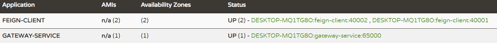

然后如何测试呢？

在刚刚的配置中我们不难想到，Gateway会拉取注册中心注册的所有节点，然后自动为其配置默认的路由规则，那么到哪看他默认配置的路由规则呢？

这里直接说答案：http://localhost:65000/actuator/gateway/routes

```json
[
    {
        "route_id": "CompositeDiscoveryClient_FEIGN-CLIENT",
        // 路由规则
        "route_definition": {
            // 路由id
            "id": "CompositeDiscoveryClient_FEIGN-CLIENT",
            // 断言，用于匹配访问路径
            "predicates": [
                {
                    "name": "Path",
                    // 路径规则为以FEIGN-CLIENT路径下的所有路径
                    "args": {
                        // 注意，这里是因为我们之前配置了小写，所以才是小写，不然默认大写
                        "pattern": "/feign-client/**"
                    }
                }
            ],
            // 对访问路径或参数进行过滤或处理
            "filters": [
                {
                    "name": "RewritePath",
                    "args": {
                        "regexp": "/feign-client/(?<remaining>.*)",
                        "replacement": "/${remaining}"
                    }
                }
            ],
            // 实际访问的路径，lb说明使用了负载均衡，而后面的serviceId就是注册中心的id
            "uri": "lb://FEIGN-CLIENT",
            "order": 0
        },
        "order": 0
    },
    {
        "route_id": "CompositeDiscoveryClient_GATEWAY-SERVICE",
        "route_definition": {
            "id": "CompositeDiscoveryClient_GATEWAY-SERVICE",
            "predicates": [
                {
                    "name": "Path",
                    "args": {
                        "pattern": "/gateway-service/**"
                    }
                }
            ],
            "filters": [
                {
                    "name": "RewritePath",
                    "args": {
                        "regexp": "/gateway-service/(?<remaining>.*)",
                        "replacement": "/${remaining}"
                    }
                }
            ],
            "uri": "lb://GATEWAY-SERVICE",
            "order": 0
        },
        "order": 0
    }
]
```

通过这个路由规则，虽然不明白全部意思，但基本还是能看出来，就是对于每个服务，都注册了以服务名称为路由的规则

这里主要看`route_definition`里的配置，主要由四部分组成

- `predicates`：断言，用于配置匹配路径
- `filters`：过滤器，用于对路径或参数进行过滤或处理
- `uri`：就是实际的访问节点，并且可以添加 lb 负载均衡
- `order`：排序

简单了解了一下routes，我们可以进行测试了

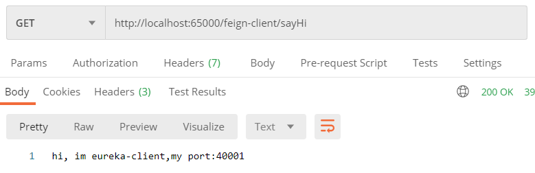

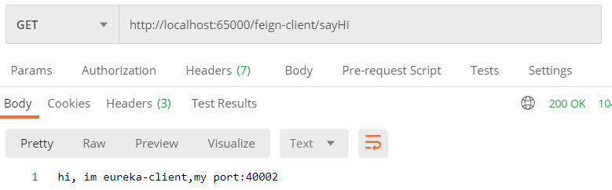

我们连续向网关发送两个请求，会发现均匀的分布在了两个FeignClient节点，说明**路由成功并且负载均衡成功**

### 路由配置

可以看到上面我的路由都是自己生成的，那么，能不能我们自己增删改一些路由呢？当然是可以的

**增加路由**

只需通过POST请求，请求路由的地址后面添加路由ID，然后再body中以json形式添加四大部分即可

```
POST http://localhost:65000/actuator/gateway/routes/dynamic
```

```json
{
    "predicates": [
        {
            "name": "Path",
            "args": {
                "pattern": "/dynamic/**"
            }
        }
    ],
    "filters": [
        {
            "name": "StripPrefix",
            "args": {
                "_genkey_0": "1"
            }
        }
    ],
    "uri": "lb://FEIGN-CLIENT",
    "order": 0
}
```

**修改路由**

也是同样的路径，只需要在body里的json修改即可

**删除路由**

同样的路径，body为空，且通过DELETE请求即可

```
DELETE http://localhost:65000/actuator/gateway/routes/dynamic
```

## Gateway路由

Gateway的路由有很大的门道，不止是简简单单的请求转发那么简单，在请求到网关层时，会有很多事发生，不光可以拒绝请求，还可以篡改请求参数等等，接下来就看看路由里的门道

### 路由三叉戟

首先看看路由三叉戟，其实前面我们有介绍过，如下图：

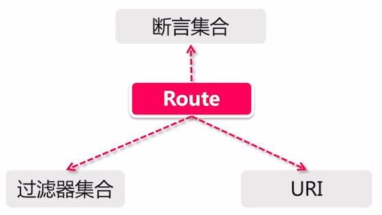

- **断言集合**：断言是请求进入的第一扇大门，用来匹配路由规则，当请求进来后，会根据断言集合来匹配是否与某个路由吻合，只有全部吻合，才会选择这个路由来处理该请求。为什么是集合形式呢？因为一个路由可以添加多个断言，当每个断言都匹配成功了，才可以说明该请求是属于这个路由规则的。后面会详细介绍断言
- **过滤器集合**：请求经过第一扇大门后就表示被当前路由正式接手了，接着就由过滤器集合来处理了，过滤器集合比较八仙过海各显神通，都是由用户自定义的，比如可以对请求进行鉴权校验，或者其他逻辑处理。过滤器这一层可以修改Response的状态码，来达到中断的效果，比如修改状态码为403，表示鉴权不通过
- **URI**：如果全部通过，就来到第三扇大门，但这里就不会拦你了，而是宝藏存放处，会由Gateway进行请求转发，URI可以配置具体的地址，也可以通过服务注册的形式配置具体服务节点，如果是服务节点形式，默认使用的是Eureka，并配合Ribbon实现负载均衡

### 路由工作流程

我们从一个请求入手，简单看一下在Gateway中的流转，经过了哪些具体过程

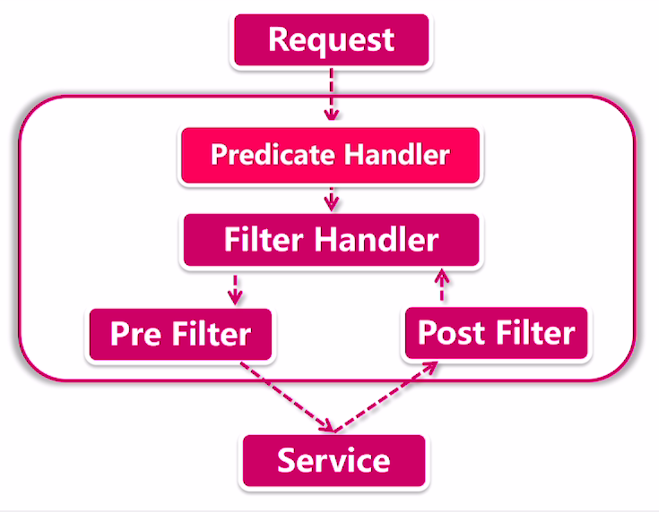

- **Predicate Handler**：首先承接的类就是RoutePredicateHandlerMapping类，这个类通过我们前面说的三扇门，也可以知道是干嘛的，就是获取所有路由，然后循环路由，判断该请求是否能后某个路由的断言全部匹配上，如果全部验证正确，说明该请求应为此路由处理，交由下一阶段
- **Filter Handler**：这一步就是第二扇大门了，选中路由后，交由过滤器进行处理，可以发现，这是一种责任链的形式，在处理过程中，不仅该路由的过滤器生效，全局配置的Global过滤器也会一并参与
- **寻址**：这一阶段就是请求转发到URI地址了，发送请求前，所有Pre类型的过滤器会执行，请求响应后Post类型过滤器执行

## Gateway断言

接着我们来了解Gateway路由第一大核心-断言

### Predicate机制

这个机制其实就和ifelse判断差不多，是Java8新引入的功能，接收一个判断条件，然后返回true or false，当然也可以使用and，or，negative三个操作符，将多个Predicate串联起来。

前面说到Gateway是传达室大爷，那么这个Predicate机制就是暗号，你和大爷对了暗号才能放你进去，就比如大爷要求你的请求方式为Get，又或者你的请求参数必须带name，且值为马冬梅，你要是没有带name这个参数，或者名字叫马小梅，都是不行的，会被大爷打回原形

**说白了，Predicate就是一种路由的匹配规则，就像if一样，全部匹配正确，才说明你属于这个路由，让你放行**

### 常用断言

断言的种类很丰富，Gateway就提供了十多种断言，我们来看看常用的断言

- **路径匹配**：Path的断言非常简单，就是一段url匹配，当实际路径与其匹配时，就会转发到下面的uri中，这个uri地址可以是一个实际的地址，也可以是Eureka某个服务节点。比如我们请求路径为/gateway/test，就会匹配第一个路由

  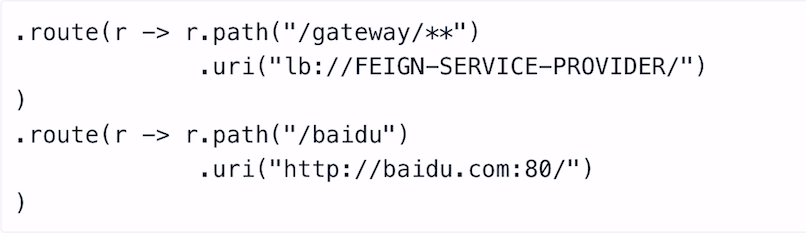

- **Method断言**：专业验证HTTP Method的断言，下面的例子里，我们将路径与Method通过and连接起来，共同作用

  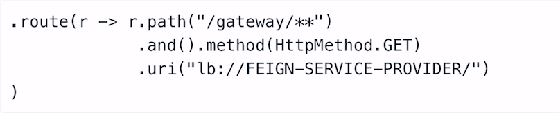

- **RequestParam匹配**：这就是我们前面说的大爷例子里的了，请求参数匹配，从请求列表查询属性，他有两种校验方式：

  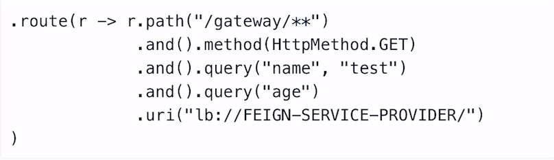

  - **属性名校验**：只有单个请求参数，比如`query("age")`，就只对属性名进行校验，只要有这个属性即可
  - **属性值校验**：当有两个请求参数，如`query("name","test")`不仅对属性名校验，还需要值必须相同才可以

- **Header断言**：对Header进行校验，可以验证是否携带令牌等等

  

- **Cookie断言**：校验cookie中保存的信息的断言，也是由key value形式存储的，但是它必须有两个参数才可以，而不是像RequestParam可以有一个

  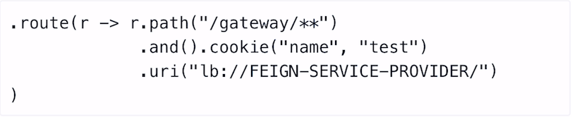

- **时间片匹配**：有三种方式Before，After，Between，指定了在什么时间范围内路由才会生效

  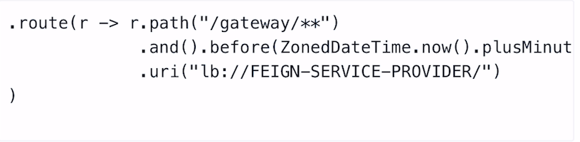

  以Before为例，接收ZonedDateTime是用于表示生效时间，这里设置一分钟，因为断言是在项目启动时加载的，所以这里的意思就是，在项目启动的1分钟内，该断言生效，一分钟以后就不生效了

- **自定义断言**：断言也是可以自定义的，这里我们等了解使用完断言后，再实现

### 实现断言

接着我们在java中通过创建路由的方式，来看看实际断言如何配置

配置断言有两种方式，一种是在配置文件中配置，一种是在java代码中配置，如下：

yml方式：

```yml
spring:
  cloud:
    gateway:
      routes:
      - id: ymlRoute
        uri: lb://FEIGN-CLIENT
        predicates:
          - Path=/yml/**
        # 这个的意思是，将第一个路径去除，比如/yml/sayHi，去除后实际请求到服务的路径为/sayHi
        filters:
          - StripPrefix=1
```

这里对于filter的配置，后面会详细介绍

java方式：

```java
@Configuration
public class GatewayConfiguration {

    @Bean
    public RouteLocator customRoutes(RouteLocatorBuilder builder){
        return builder.routes().
                route(r -> r.path("/java/**")
                .and().method(HttpMethod.GET)
                .and().header("name")
                .filters(f -> f.stripPrefix(1)
                // 在响应头上添加信息
                .addResponseHeader("java-add","pacee1"))
                .uri("lb://FEIGN-CLIENT"))
                .build();
    }
}
```

使用调用链的形式进行的配置，并且java写法我们没有添加id，这样的话Gateway会自动为我们创建一个id

### 自定义断言

我们可以根据源码，比如QueryRoutePredicateFactory这个官方断言来实现我们的自定义断言，会发现有两点

- 首先需要继承AbstractRoutePredicateFactory这个断言抽象工厂
- 需要在类中实现一个Config内部类‘
- 然后需要实现该工厂的apply抽象方法

所以我们的自定义断言就是这个样子了

```java
public class ReqParamNumPredicateFactory extends AbstractRoutePredicateFactory<ReqParamNumPredicateFactory.Config> {

    public ReqParamNumPredicateFactory(){
        super(Config.class);
    }

    @Override
    public Predicate<ServerWebExchange> apply(Config config) {
        return exchange -> {
            int size = exchange.getRequest().getQueryParams().size();
            if(size > config.getNum()){
                return false;
            }else {
                return true;
            }
        };
    }

    @Validated
    public static class Config {

        private Integer num;

        public Integer getNum() {
            return num;
        }

        public void setNum(Integer num) {
            this.num = num;
        }
    }
}
```

实现完毕后，我们就需要配置这个断言了，也有两点

- 将自定义断言工厂注入Spring
- 使用predicate或者asyncPredicate进行配置

```java
@Configuration
public class GatewayConfiguration {

    @Bean
    public RouteLocator customRoutes(RouteLocatorBuilder builder){
        return builder.routes().
                route(r -> r.path("/java/**")
                .and().method(HttpMethod.GET)
                .and().header("name")
                .filters(f -> f.stripPrefix(1)
                .addResponseHeader("java-add","pacee1"))
                .uri("lb://FEIGN-CLIENT"))
                .route(r -> r.path("/myPredicate/**")
                // 设置自定义断言，超过3个请求参数时返回false
                .and().predicate(reqParamNumPredicateFactory().apply(config -> config.setNum(3)))
                .filters(f -> f.stripPrefix(1))
                .uri("lb://FEIGN-CLIENT"))
                .build();
    }

    @Bean
    public ReqParamNumPredicateFactory reqParamNumPredicateFactory(){
        return new ReqParamNumPredicateFactory();
    }
}
```

这样我们就设置了一个，当请求参数超过3个就拒绝的断言

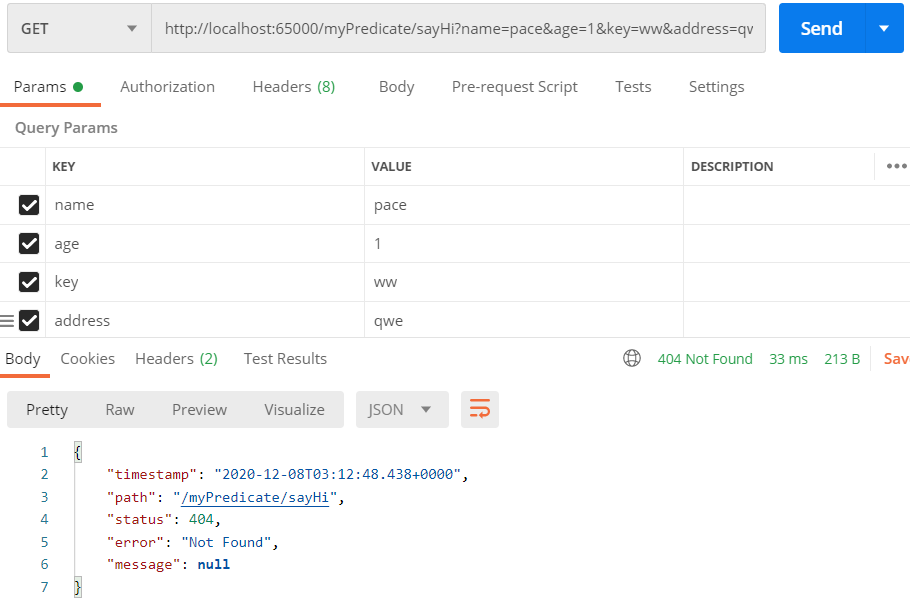

## Gateway过滤器

### 常用过滤器

- **Header过滤器**：这个Header系列有很多过滤器，AddRequestHeader，AddResponseHeader，分别向Request和Response中添加Header。相应的也有RemoveRequestHeader，RemoveResponseHeader，移除Header操作。

  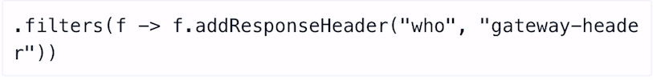

- **StripPrefix过滤器**：它的作用是去除部分URL路径，如下图，去除第一个路径，就比如你的路径为`http://localhost:65000/java/sayHi`，那么第一个路径就是`/java`这个路径就会被去除，这样请求到指定服务时的url就是`/sayHi`，才能与Controller配置的mapping对应上

  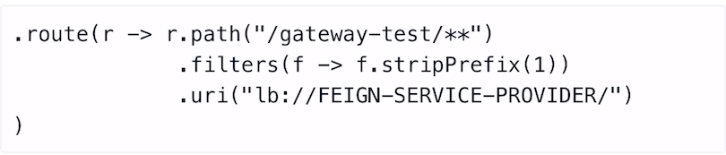

- **PrefixPath过滤器**：这个过滤器和StripPrefix完全相反，是在Url路径前加上一些前缀，比如下面这个`/go`，就会变成`/go/java/sayHi`

  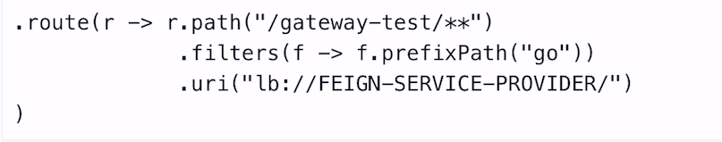

- **RedirectTo过滤器**：看名字也知道，这是一个请求重定向的过滤器，根据响应状态码，重定向到一个指定网址上

  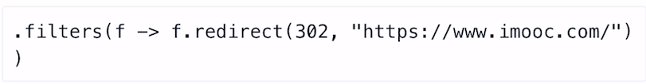

- **SaveSession过滤器**：微服务一般都是无状态的，也不依赖Session，但是如果有分布式session需求，或者使用到了`spring-session`或`spring-sercurity`那么这个过滤器就会有用，用作强制保存Session，在每次服务调用前

  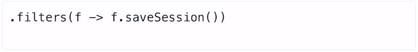

### 过滤器详解

**过滤器的工作模式**

过滤器的会像足球比赛开场一样，每个队员要和所有敌方队员握手，过滤器就是这样，每个请求需要**按照顺序**的被每个过滤器处理

**过滤器的实现方式**

过滤器实现起来非常简单，在Gateway中，我们只需要实现Gateway接口的默认方法filter即可

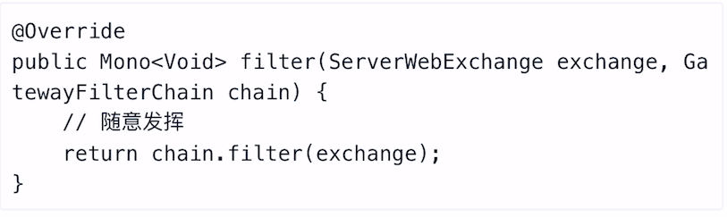

这里有两个关键对象：

- `ServerWebExchange`：Spring封装的针对Http请求的request和response交互协议，也就是说，你可以通过该对象，获取到request或response，并对其进行修改
- `GatewayFilterChain`：这是Gateway过滤器调用链，当我们这个过滤器处理完毕后，需要交给下一个链上的过滤器进行处理

**过滤器的执行阶段**

前面我们介绍Gateway体系框架的时候，会发现在过滤器这个阶段，具有Pre和Post两个阶段，这里的前和后是针对当前的过滤器的，也就是下一个过滤器执行前以及过滤器执行后

我们举例来说：

- Pre类型 - AddResponseHeaderGatewayFilterFactory

这个过滤器我们前面介绍过，就是用来向响应头添加信息的

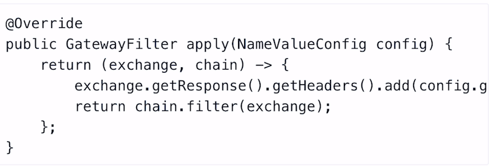

通过源码我们可以看出来，该逻辑是在`chain.filter(exchange)`之前执行的，说明此过滤器属于Pre类型的过滤器

- Post类型 - SetStatusGatewayFilterFactory

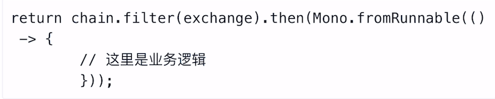

这个过滤器是在过滤器执行完毕后，将指定的HttpStatus返回给调用方，通过`then()`可以得知，该方法是在所有过滤器链调用完毕后，才执行的，说明该方法为Post类型的过滤器

**过滤器的排序**

通过前面的了解学习，我们会发现过滤器是有顺序的，主要依靠`org.springframework.core.Ordered`接口来给指定过滤器指定顺序

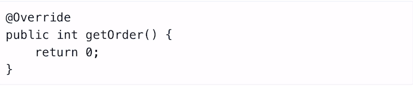

数字越小，优先级越高，但这是针对Pre类型的过滤器而言，对于Post类型的过滤器，数字越大，优先级越高

### 自定义过滤器

我们自己创建一个过滤器，并为其添加到Route路由上，我们简单的实现一个打印log的过滤器

创建过滤器需要两个关键点：

- 实现过滤器接口：这里有两种
  - GatewayFilter，普通的过滤器类型
  - GlobalFilter，全局过滤器类型
- 实现Ordered接口，用于对过滤器排序

```java
@Slf4j
@Component
// 如果实现GlobalFilter，就是全局路由
public class MyFilter implements GatewayFilter, Ordered {

    @Override
    public Mono<Void> filter(ServerWebExchange exchange, GatewayFilterChain chain) {
        // 只需要打印一行日志，我们将其作为Post类型的过滤器
        String path = exchange.getRequest().getURI().getPath();
        return chain.filter(exchange).then(
                Mono.fromRunnable(() -> {
                    log.info("My Filter run and path:" + path);
                })
        );
    }

    @Override
    // 用于对Filter排序，先后执行
    public int getOrder() {
        return 0;
    }
}
```

然后我们进行配置

```java
@Autowired
private MyFilter myFilter;

@Bean
public RouteLocator customRoutes(RouteLocatorBuilder builder){
    return builder.routes().
            route(r -> r.path("/java/**")
            .and().method(HttpMethod.GET)
            .and().header("name")
            .filters(f -> f.stripPrefix(1)
            .addResponseHeader("java-add","pacee1")
            // 添加自定义过滤器
            .filter(myFilter))
            .uri("lb://FEIGN-CLIENT"))
            .route(r -> r.path("/myPredicate/**")
            // 设置自定义断言，超过3个请求参数时返回false
            .and().predicate(reqParamNumPredicateFactory().apply(config -> config.setNum(3)))
            .filters(f -> f.stripPrefix(1))
            .uri("lb://FEIGN-CLIENT"))
            .build();
}
```

这样就可以实现自定义过滤器了

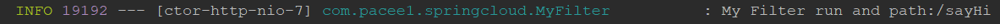

通过调用，成功打印日志

## Gateway限流

Gateway也有限流组件的功能，一般使用令牌桶的方式，配置起来也非常简单，令牌桶的知识，可以参考前面分布式限流

**引入Redis**

想要使用Gateway限流，Redis肯定少不了，所以我们需要先向项目中加入Redis依赖，并添加配置

```xml
<dependency>
    <groupId>org.springframework.boot</groupId>
    <artifactId>spring-boot-starter-data-redis</artifactId>
</dependency>
```

```yml
spring:
	redis:
		host: 127.0.0.1
		port: 6379
```

**Key Resolver**

Gateway限流组件要求定义一个Key Resolver，用来对每次路由请求生成key，这个key就是限流分组的标识，每个key相当于一个令牌桶。

假如我们设置一个服务每秒只能被调用3次，那么这个限制就会对不同的key进行计数，哪个key超过了，就不能再被调用了

创建Key Resolver很简单：

```java
@Bean
public KeyResolver myKeyResolver(){
    return exchange -> Mono.just(
    exchange.getRequest().getRemoteAddress().getHostName());
}
```

这里我们key的规则是，使用hostname作为key的区分

**配置过滤器**

```yml
spring:
  cloud:
    gateway:
      routes:
      - id: ymlRoute
        uri: lb://FEIGN-CLIENT
        predicates:
          - Path=/yml/**
        # 这个的意思是，将第一个路径去除，比如/yml/sayHi，去除后实际请求到服务的路径为/sayHi
        filters:
          - StripPrefix=1
          - name: RequestRateLimiter
          	args:
          		key-resolver: '#{@myKeyResolver}'
          		redis-rate-limiter.replenishRate: 10
          		redis-rate-limiter.burstCapacity: 20
```

主要是最后5行的配置，首先添加了一个Gateway限流组件Filter，RequestRateLimiter，然后配置它的参数，分别是KeySolver在Spring中的名称，令牌桶每秒填充速度，令牌桶总量

这样，我们就把限流配置好了