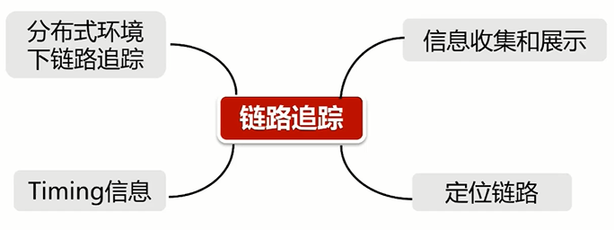
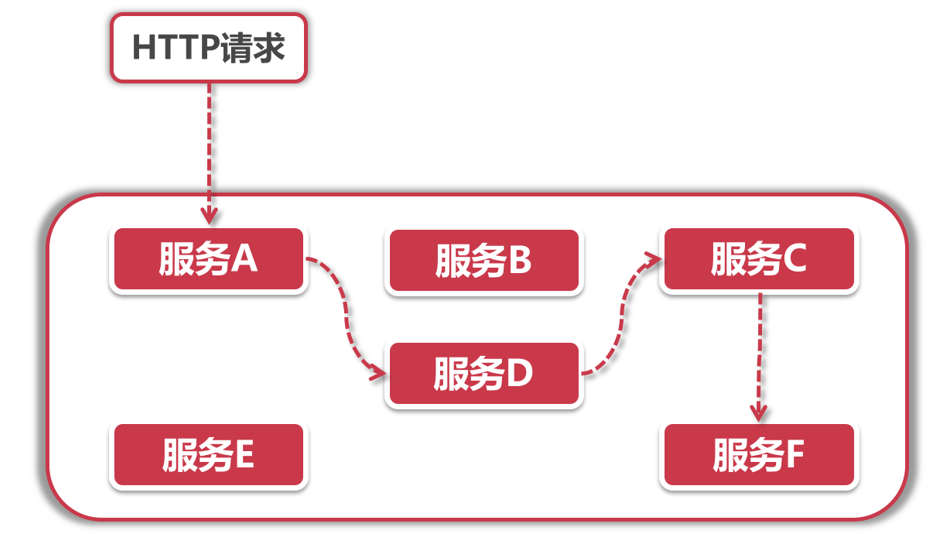
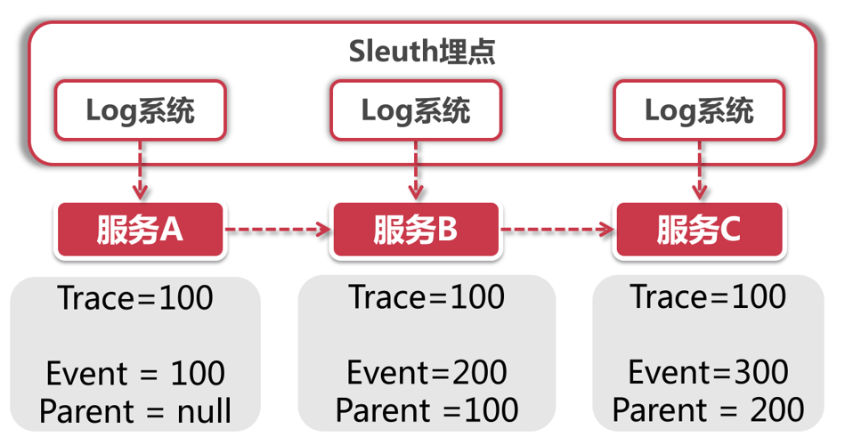
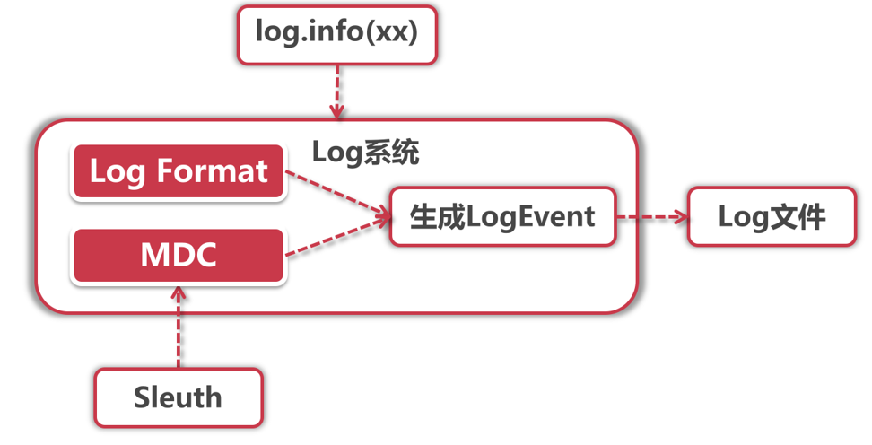
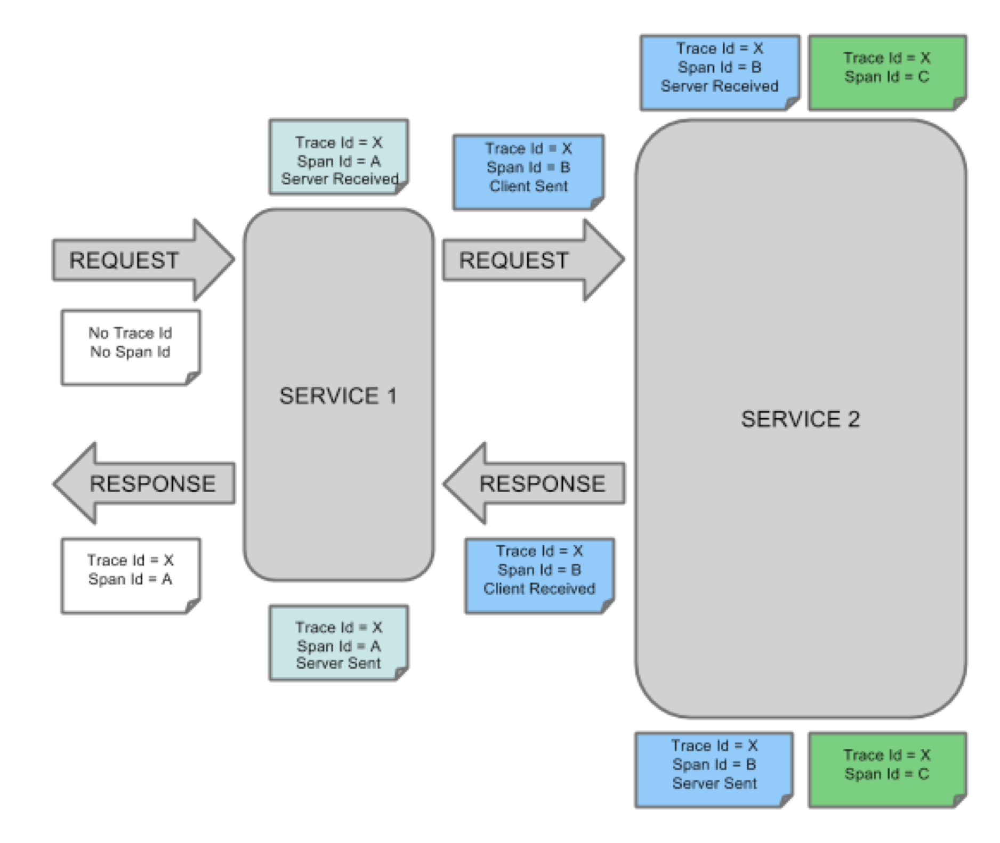
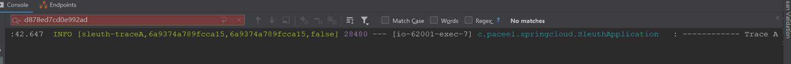
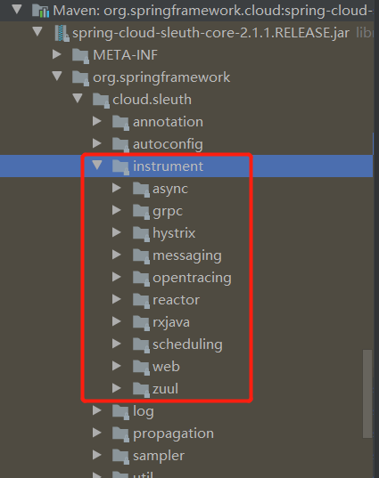
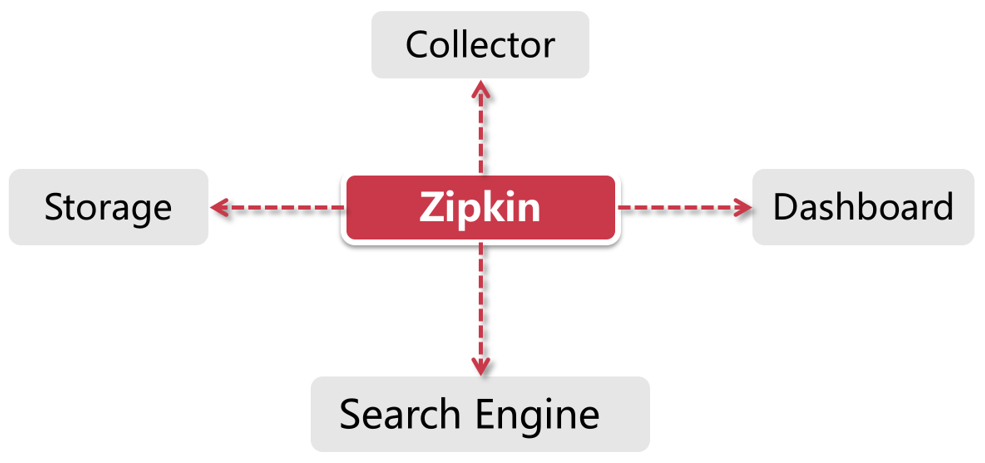

## 链路追踪技术

对于没有接触过这个词的同学可能很蒙蔽，什么是链路追踪技术？干吗用呢？

其实链路追踪技术理解起来非常简单，我们看一下这张图


看了这张图是不是头皮发麻呢？这就是企业中微服务间的调用关系，看到这张图应该就知道了，我们需要一种技术来管理它，人工管理调用关系是不可能的，就算你想要人工管理，那么比如你负责的服务是购物车服务，你知道有用户服务调用了你，但是对于用户服务于其他服务的调用关系你不会特别清楚的，所以这种间接调用关系非常难梳理。

这时就需要我们的链路追踪技术了，来管理各微服务间的调用关系。

链路追踪技术也不仅仅只有这一种作用，还有一些好用的功能



- `分布式`：链路追踪可以从分布式环境中获取所有节点的信息进行管理
- `Timing信息`：就是整个调用链路每个微服务模块所耗费的时间，比如用户从点击下单到下单成功，购物车，订单，用户微服务各个的耗费时间以及总时长等
- `定位链路`：每条链路都有自己的ID，管理人员只需要通过查询这个ID就可以获取某条链路的所有调用情况，可以非常方便的查询问题
- `信息收集展示`：信息收集完后，还需要可视化的展示出来，更好查看

可以看到，链路追踪技术所提供的功能点很多，说明它需要提供的也这么多，那么它就不是一种技术直接实现的，而是多种中间件配合实现

## Sleuth介绍

Sleuth意思为大侦探，顾名思义，Sleuth就是沿着从上游到下游的请求，找到所有关联关系，也就是我们的链路追踪技术。

### Sleuth的功能

最核心就是链路追踪技术，在用户请求发起后，所经过的所有服务都会被Sleuth梳理出来



比如：服务A调用服务D，服务D又调用服务C，C又调用了F，那么Sleuth就会通过一种打标记的机制，对所有这次请求访问的服务打上标记，我们只需要拿到这个标记，就可追踪到这次请求所有服务调用。

Sleuth还可以完成一些其他的功能：

- **线上故障排查**：之前我们说过，通过Tracking ID就可以获取某条请求链路的所有服务信息，那么我们就可以看到出错异常是在哪个服务生成的，就很方便进行故障排查
- **性能分析**：对于每天链路的每个服务请求，都会保存它的响应时间等信息，通过响应时间就可以推断哪个服务调用时间过长，就可以进行优化
- **依赖梳理**：当服务节点过多，服务与服务间的依赖调用错综复杂，就可以依靠Sleuth来梳理依赖关系
- **链路优化**：比如我们有很多推荐算法，哪种推荐算法会让用户的下单率高，就可以通过Sleuth来观察，找到转化率最高的为以后产品设计打下基础

### Sleuth的优势

链路追踪技术肯定不少，Sleuth又有什么优点呢？主要是他的两大设计原则

- **无业务侵入**：Sleuth不需要你在业务代码中进行任何改动，就可以静默接入链路追踪技术，这个可以说是非常棒的开源组件的设计理念了
- **高性能**：其实，对于日志来说，一般来说在业务代码中加入完整的log（10行代码里有2行log），会影响5%左右的接口性能，因此，Sleuth也是基于对Log埋点实现追踪，也多多少少会影响一些性能，但是对Sleuth来说，力求对性能影响最小，同时还提供了“采样率配置”降低开销（比如开发人员可以设置只对20%请求进行采样）

### Sleuth的体系架构

Sleuth底层是依靠Log系统实现业务埋点的：



每个服务都有Log组件，Sleuth集成之后，会将链路信息传递给Log组件，在每行日志前打印这些信息，主要会记录几个关键信息：

- 链路ID：当前请求整条链路的ID，如上图，在ABC服务流转间，它的Tracking ID是不变的，这就是链路ID
- 单元ID：因为一次链路请求会访问不同的服务节点，所以每个服务节点有自己的单元ID来区分不同服务，并且会记录请求来自哪里，也就是上游服务，可以通过图中的Parent看到

通过我们的介绍，可以看出Sleuth主要依靠在Log埋点，实现对链路的记录，并且埋点具有特殊的一些信息需要打印，那么就引入一个问题，Sleuth如何进行数据埋点呢？

- Log系统集成：如何让埋点信息加入到业务Log中？
- 埋点信息传递：服务调用间，如何把链路ID等信息传递到下游？

我们针对这两个问题，来展开了解

### Log系统集成

Sleuth既然要切入Log打印信息，我们就先了解一些Log组件时如何打印信息的



这里主要有两个重要组件，LogFormat和MDC，当我们使用"[log.info](http://log.info/)"打印日志的时候，Log组件会将“写入”动作封装成一个LogEvent事件，而这个事件的具体表现形式由Log Format和MDC共同控制，Format决定了Log的输出格式，而MDC决定了输出什么内容。

**Log Format Pattern**

Log组件定义了日志输出格式，这和我们平时使用“String.format”的方式差不多，集成了Sleuth后的Log输出格式是下面这个样子：

```
"%5p [sleuth-traceA,%X{X-B3-TraceId:-},%X{X-B3-SpanId:-},%X{X-Span-Export:-}]"
```

上面有几个X开头的占位符，这就是我们需要写入Log的链路追踪信息了。至于这几个符号分别对应链路信息的哪部分，在之后介绍

**MDC**

MDC是通过`InheritableThreadLocal`来实现的，它可以携带当前线程的上下文信息。它的底层是一个Map结构，存储了一系列Key-Value的值。Sleuth就是借助Spring的AOP机制，在方法调用的时候配置了切面，将链路追踪数据加入到了MDC中，这样在打印Log的时候，就能从MDC中获取这些值，填入到Log Format中的占位符里

由于MDC基于InheritableThreadLocal而不是ThreadLocal实现，因此假如在当前线程中又开启了新的子线程，那么子线程依然会保留父线程的上下文信息

### Sleuth数据结构

咦？我们不应该看第二个问题埋点信息传递吗？怎么跳到数据结构了？

因为埋点信息传递前必须先了解数据结构，之前我们一直说Sleuth会生成一些信息，在埋点的时候，我们知道的有Tracking ID，那么具体有什么信息呢？主要有两大长老：

- **Trace**：从头到尾贯穿链路的ID，Trace ID
- **Span**：标识一个基本的工作单元，每个单元都有独一无二的ID，就比如服务A调用服务B，这就是一个事件，就需要一个工作单元SPAN来记录。Span不单单只是一个ID，它还包含一些其他信息，比如时间戳，它标识了一个事件从开始到结束经过的时间，我们可以用这个信息来统计接口的执行时间。每个Span还有一系列特殊的“标记”，也就是接下来要介绍的`Annotation`，它标识了这个Span在执行过程中发起的一些特殊事件。

**Annotation**

一个Span会包含多个Annotation，每个Annotation表示一个特殊的事件：

- CS（Client Sent）：客户端发送一个调用请求
- SR（Server Received）：服务端接收请求进行处理
- SS（Server Sent）：服务端处理完毕，发送Response给客户端
- CR（Client Received）：客户端接收到Response

每个Annotation同样有一个时间戳字段，这样我们就能分析一个Span内部每个事件的起始和结束时间

是不是很清晰呢？如果还觉得不清晰，我们看看下面这张官方图：



我们一点点来看：

1. 首先，图中有两个Service，代表两个服务节点
2. 除了一开始http的请求外，每个Span都具有相同的Trace ID=X，说明为一个整的调用链路
3. 浅蓝色的Span对应http请求与Service1的调用事件，所以有相同的Span ID，事件为SR和SS，服务端接收HTTP请求以及最后的Response响应
4. 蓝色Span对应Service1对Service2的请求，具有4个Annotation事件，并且为一个Span ID，说明是一个整的Span，包含了CS，SR，SS，CR
5. 绿色的Span是Service2内部业务处理，所以又是一个Span，因为是Service2内部方法执行，所以该Span会打印在Service2的日志中

看完这个，是不是很清晰了呢？Trace ID会伴随整个Http请求，而Span对应一次服务调用，不同服务间调用请求具有不同的Span

### 埋点信息传递

我们知道了Trace ID和Span ID，眼下的问题就是如何在不同服务节点之间传递这些ID。我想这一步大家很容易猜到是怎么做的，因为在Eureka的服务治理下所有调用请求都是基于HTTP的，那我们的链路追踪ID也一定是HTTP请求中的一部分。可是把ID加在HTTP哪里好呢？Body里可以吗？NoNoNo，一来GET请求压根就没有Body，二来加入Body还有可能影响后台服务的反序列化。那加在URL后面呢？似乎也不妥，因为某些服务组件对URL的长度可能做了限制（比如Nginx可以设置最大URL长度）。

那剩下的只有Header了！**Sleuth正是通过Filter向Header中添加追踪信息**，我们来看下面表格中Header Name和Trace Data的对应关系：

| Header Name       | Trace Data                          | 含义           |
| ----------------- | ----------------------------------- | -------------- |
| X-B3-TraceId      | Trace ID                            | 整个链路的ID   |
| X-B3-SpanId       | Span ID                             | 当前Span的ID   |
| X-B3-ParentSpanId | Parent Span ID                      | 前一个Span的ID |
| X-Span-Export     | Can be exported for sampling or not | 是否可以被采样 |

在调用下一个服务的时候，Sleuth会在当前的Request Header中写入上面的信息，这样下游系统就很容易识别出当前Trace ID以及它的前置Span ID是什么

接着，我们通过demo，更直观的利用代码了解Sleuth

## Sleuth Demo

接着就是我们的Demo实现环节了，对于Sleuth的实现真得非常非常简单，我们需要创建两个module，`sleuth-traceA`和`sleuth-traceB`，然后A调用B才看看日志中的链路情况

首先我们创建traceA

**1.创建module添加依赖**

```xml
<dependencies>
    <dependency>
        <groupId>org.springframework.cloud</groupId>
        <artifactId>spring-cloud-starter-netflix-eureka-client</artifactId>
    </dependency>
    <dependency>
        <groupId>org.springframework.boot</groupId>
        <artifactId>spring-boot-starter-web</artifactId>
    </dependency>
    <dependency>
        <groupId>org.springframework.boot</groupId>
        <artifactId>spring-boot-starter-actuator</artifactId>
    </dependency>
    <!--Sleuth-->
    <dependency>
        <groupId>org.springframework.cloud</groupId>
        <artifactId>spring-cloud-starter-sleuth</artifactId>
    </dependency>
</dependencies>
```

**2.创建主程序类并直接添加controller方法**

```java
@SpringBootApplication
@RestController
@Slf4j
public class SleuthApplication {

    @LoadBalanced
    @Bean
    public RestTemplate restTemplate(){
        return new RestTemplate();
    }

    @Autowired
    private RestTemplate restTemplate;

    @GetMapping("/traceA")
    public String traceA(){
        log.info("------------ Trace A --------------");
        return restTemplate.getForObject("http://SLEUTH-TRACEB/traceB",String.class);
    }

    public static void main(String[] args) {
        SpringApplication.run(SleuthApplication.class,args);
    }
}
```

**3.创建配置文件并配置**

```yml
server:
  port: 62001
spring:
  application:
    name: sleuth-traceA
eureka:
  client:
    service-url:
      defaultZone: http://localhost:22222/eureka
management:
  security:
    enabled: true
  endpoints:
    web:
      exposure:
        include: "*"
  endpoint:
    health:
      show-details: always
```


创建完TraceA后，TraceB的创建过程是一模一样的，只不过controller需要修改一下

```java
@GetMapping("/traceB")
public String traceB(){
    log.info("------------ Trace B --------------");
    return "traceB";
}
```

直接return就好了

然后就可以测试了，请求http://localhost:62001/traceA，查看日志




我们主要看错误等级后的中括号里的几个数据，分为：

- 服务名称
- Trace ID：TraceA和TraceB的Trace ID是相同的
- Span ID：TraceA和TraceB的Span ID是不同的
- 是否采集：这个采集是后面说到的，用来对日志进行收集配合其他中间件，将其可视化出来

这里我们说到了采集，那么后面就看一下Sleuth日志信息采集是怎么回事

## Sleuth原理分析

### Sleuth自启动

通过前面的学习，我们可以发现Sleuth几乎是Spring Cloud中最干净的组件了，为什么说是干净呢？因为它不需要任何配置就可以使用，不需要加注解，不需要添加配置文件，只需要将依赖引入即可。那么问题来了，我们应该从哪里顺藤摸瓜的学习呢？

经过我们SpringBoot，SpringCloud了解，针对这种情况，肯定是去找他们的AutoConfiguration自动配置类了，所以，入手Sleuth我们也是一样，这不，一下就找到了`TraceAutoConfiguration`自动配置类，Sleuth的静默启动就是靠着这个类的一行配置：

```java
@Configuration
@ConditionalOnProperty(value = "spring.sleuth.enabled", matchIfMissing = true)
@EnableConfigurationProperties(SleuthProperties.class)
public class TraceAutoConfiguration {
```

就是通过第二行的配置，意思是，只要`spring.sleuth.enabled`这个配置没有，就默认为true，而它为true的话，就默认开启此自动配置类，因为我们在配置文件没有加任何关于Sleuth的配置，所以会自动配置

### 链路追踪适配方案

在SpringCloud中有很多组件，他底层使用的技术都是不一样的，比如Hystrix底层的RxJava，Gateway里的WebFlux，已经我们最基础的Http，每种协议/调用方式的不同，它的传递信息的姿势也都不同，那么Sleuth应该如何进行链路信息传递呢？

Sleuth使用了最简单的方法，定义了一系列五花八门的适配方案，如下图：



主要存放在Sleuth的instrument包下，比如专门为Hystrix准备的是配置，放在Hystrix下面，messaging专门为消息队列准备的。

Sleuth对接了各种各样的适配组件，为的就是捕捉链路中各种调用。比如我们通过WebFlux调用服务A，服务A又调用了消息组件，这样Sleuth因为有适配器webflux以及messaging，所以这些操作都会被它记录下来，**创建Span并记录链路数据**，如果某个环节没有相应的适配器，就无法生成一个Span，也无法加入到调用链路中。

Sleuth中的适配方案都大相径庭，**共同目的就是为这些操作创建Span来加入到调用链路中**，他们的主逻辑主要有三点：

1. **AutoConfiguration**：每个适配方案都有自动装配类来加载特有的配置项或核心方法类，比如Rxjava就是RxjavaAutoConfiguration
2. **Span管理**：创建新的Span，与上游Span做关联，将链路信息加入到当前Span中
3. **链路信息传递**：比如Http的传递方案为Http Header中添加链路信息，消息组件时再Message Header中添加，对于其他不同的适配方案也有不同的传递方式。

## Sleuth集成Zipkin

### Zipkin介绍

Zipkin又是什么？我们通过前面Sleuth的了解，会发现它的缺点，只做了日志埋点，而什么信息汇聚啊，分析调用链路啊都是没有的，所以Sleuth就像Hystrix一样，需要一个组件来进行聚合展示，以此情形下，Zipkin就诞生了，配合Sleuth，可以实现对埋点信息的聚合展示。

Zipkin主要作用是收集Timing维度的数据，可以用作调用延迟等问题排查。Timing维度就是开始时间+结束时间的标记，有个这两个信息，就可以计算每一步调用耗时。Zipkin的核心功能主要有两个：

1. **数据聚合**：聚合客户端的链路信息数据
2. **数据查找**：可以通过Trace ID 或服务名来查找整条链路

Zipkin分为服务端和客户端，客户端用来收集各个服务的链路信息数据发送给服务端，服务端用来整合数据，存储数据等，Zipkin提供了多种维度查找链路的功能，比如Trace ID，服务名。



我们来看看Zipkin中的组件：

- `Collector`：这是一个服务端组件，很多人会认为是客户端组件，因为他是用来收集数据的，其实它是一个守护进程，用来验证接收客户端发来的链路信息，是后台执行线程
- `Storage`：存储链路信息的组件，支持ElasticSearch以及Mysql等存储介质进行存储，默认情况下使用Cassandra存储
- `Search Engine`：搜索引擎，是一些JSON API接口，用于查找数据
- `Dashboard`：监控大盘，后台调用Search Engine来获取展示信息

