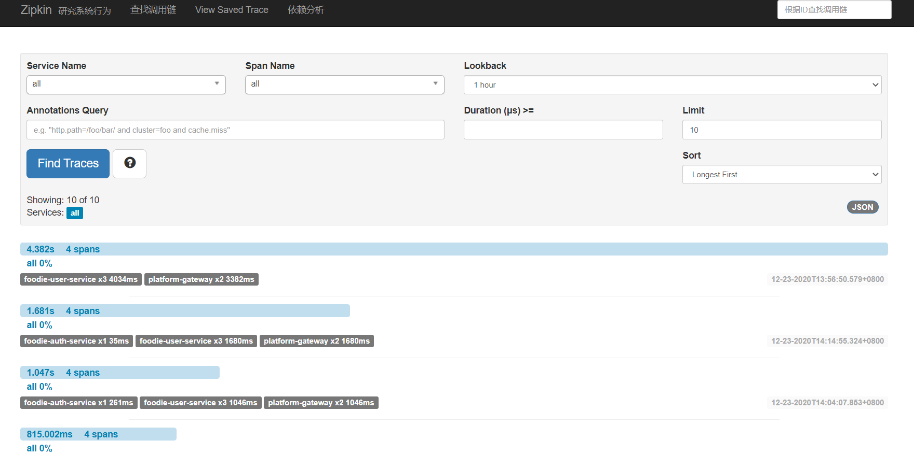

## Foodie集成链路追踪

我们之前学习的时候，会发现链路追踪非常好植入，所以配置起来其实非常简单

### 创建Zipkin服务端

这里和上一节教程中的几乎一模一样

这里在platform下创建zipkin-server的module，并添加依赖，这里还需要添加eureka的依赖，使其高可用

```xml
<dependencies>
    <dependency>
        <groupId>io.zipkin.java</groupId>
        <artifactId>zipkin-server</artifactId>
        <version>2.8.4</version>
    </dependency>
    <dependency>
        <groupId>io.zipkin.java</groupId>
        <artifactId>zipkin-autoconfigure-ui</artifactId>
        <version>2.8.4</version>
    </dependency>
    <dependency>
        <groupId>org.springframework.cloud</groupId>
        <artifactId>spring-cloud-starter-netflix-eureka-client</artifactId>
    </dependency>
</dependencies>

<build>
    <plugins>
        <plugin>
            <groupId>org.springframework.boot</groupId>
            <artifactId>spring-boot-maven-plugin</artifactId>
            <configuration>
                <mainClass>com.pacee1.ZipkinApplication</mainClass>
            </configuration>
            <executions>
                <execution>
                    <goals>
                        <goal>repackage</goal>
                    </goals>
                </execution>
            </executions>
        </plugin>
    </plugins>
</build>
```

然后创建主程序类，只需要添加`@EnableZipkinServer`

```java
@SpringBootApplication
@EnableZipkinServer
@EnableDiscoveryClient
public class ZipkinApplication {
    public static void main(String[] args) {
        SpringApplication.run(ZipkinApplication.class,args);
    }
}
```

然后添加配置

```properties
spring:
  main:
    allow-bean-definition-overriding: true
  application:
    name: zipkin-server

server:
  port: 20005

eureka:
  client:
    service-url:
      defaultZone: http://localhost:22222/eureka
management:
  metrics:
    web:
      server:
        auto-time-requests: false
```

这样我们的服务端就创建好了

### 改造各个服务

这里除了domain里的各个服务外，还需要改造网关服务，改造方式也很简单，分为三步

1. 添加依赖
2. 修改配置
3. 添加日志配置

首先添加依赖

```xml
<!--Sleuth-->
<dependency>
    <groupId>org.springframework.cloud</groupId>
    <artifactId>spring-cloud-starter-sleuth</artifactId>
</dependency>
<!--Zipkin-->
<dependency>
    <groupId>org.springframework.cloud</groupId>
    <artifactId>spring-cloud-starter-zipkin</artifactId>
</dependency>
<!--需要log组件-->
<dependency>
    <groupId>org.springframework.boot</groupId>
    <artifactId>spring-boot-starter-logging</artifactId>
</dependency>
```

除了Sleuth和Zipkin，我们还需要添加log，因为在我们common中将其剔除了，之前都是使用的log4j，这里我们需要使用到logback了

然后添加配置

```yml
spring:
  zipkin:
    base-url: http://ZIPKIN-SERVER/
    discovery-client-enabled: true
    locator:
      discovery:
        enabled: true
    sender:
      type: web
  sleuth:
    sampler:
      probability: 1
```

最后添加配置文件

```xml
<?xml version="1.0" encoding="UTF-8" ?>
<configuration>
    <include resource="org/springframework/boot/logging/logback/defaults.xml" />

    <springProperty scope="context" name="springAppName"
                    source="spring.application.name" />

    <!-- 日志在工程中的输出位置 -->
    <property name="LOG_FILE" value="${BUILD_FOLDER:-build}/${springAppName}" />

    <!-- 控制台的日志输出样式 -->
    <property name="CONSOLE_LOG_PATTERN"
              value="%clr(%d{yyyy-MM-dd HH:mm:ss.SSS}){faint} %clr(${LOG_LEVEL_PATTERN:-%5p}) %clr(${PID:- }){magenta} %clr(---){faint} %clr([%15.15t]){faint} %m%n${LOG_EXCEPTION_CONVERSION_WORD:-%wEx}}" />

    <!-- 控制台输出 -->
    <appender name="console" class="ch.qos.logback.core.ConsoleAppender">
        <filter class="ch.qos.logback.classic.filter.ThresholdFilter">
            <level>INFO</level>
        </filter>
        <!-- 日志输出编码 -->
        <encoder>
            <pattern>${CONSOLE_LOG_PATTERN}</pattern>
            <charset>utf8</charset>
        </encoder>
    </appender>

    <!-- Logstash -->
    <!-- 为logstash输出的JSON格式的Appender -->
    <!--<appender name="logstash"
              class="net.logstash.logback.appender.LogstashTcpSocketAppender">
        <destination>127.0.0.1:5044</destination>
        &lt;!&ndash; 日志输出编码 &ndash;&gt;
        <encoder
                class="net.logstash.logback.encoder.LoggingEventCompositeJsonEncoder">
            <providers>
                <timestamp>
                    <timeZone>UTC</timeZone>
                </timestamp>
                <pattern>
                    <pattern>
                        {
                        "severity": "%level",
                        "service": "${springAppName:-}",
                        "trace": "%X{X-B3-TraceId:-}",
                        "span": "%X{X-B3-SpanId:-}",
                        "exportable": "%X{X-Span-Export:-}",
                        "pid": "${PID:-}",
                        "thread": "%thread",
                        "class": "%logger{40}",
                        "rest": "%message"
                        }
                    </pattern>
                </pattern>
            </providers>
        </encoder>
    </appender>-->

    <root level="INFO">
        <appender-ref ref = "console"/>
        <!--        <appender-ref ref = "logstash"/>-->
    </root>
</configuration>
```

可以看到，这里我们将elk的配置去掉了，因为我没有使用，当然将elk集成进来也相当简单，依赖中添加Logstash依赖，然后将日志配置放开即可


这样我们的服务就完成了链路追踪，可以启动后看一下：



确实是从网关请求user，user请求auth的三个服务相互调用