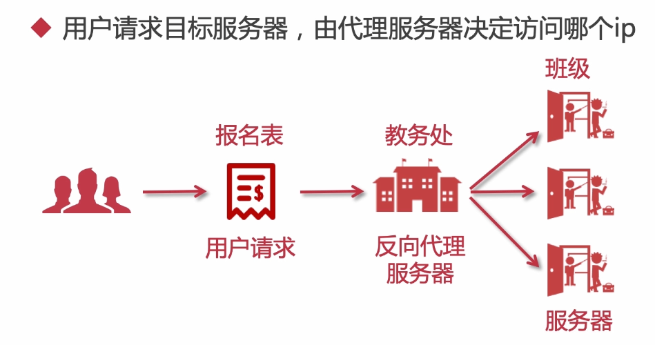

## Nginx简单介绍

>  Nginx是我们从单点项目到集群必不可少的一个环节，一个组件，为什么这么说呢？
>
> 因为集群就说明有多个节点，那么当用户请求时，应该如何将域名与多个节点绑定，又应该访问哪个节点都是问题，使用Nginx就可以很好的解决此问题，其轻量高性能的实现反向代理负载均衡

Nginx到现在2020年，使用率是越来越高了，绝大部分公司都会使用它，来当做负载均衡，反向代理的web服务器。而他也就是一个高性能的http和反向代理的web服务器。

主要功能就是反向代理，负载均衡，以及对静态资源进行虚拟化

### 简单介绍反向代理

反向代理服务器，其实就是当用户访问目标网站时，该网站是集群模式的，就会有多个节点，比如223,224,225，3台服务器节点，反向代理就会根据一定的规则将这个用户分配给某个服务器进行访问，如下图：



反向代理还有一个重要功能就是路由，nginx可以根据请求域名的不同，根据配置文件，请求应有的应用服务器


简单了解完Nginx作用后，就可以开始学习使用玩他了

## Nginx安装

首先准备nginx安装包，这里我在虚拟机上玩耍，版本1.16.1

1.安装依赖环境

```
yum install -y gcc-c++
yum install -y pcre pcre-devel
yum install -y zlib zlib-devel
yum install -y openssl openssl-devel
```

2.解压nginx

```
tar -zxvf nginx-1.16.1.tar.gz
```

3.创建nginx存放目录文件夹

```
mkdir /var/temp/nginx -p
```

4.在nginx目录下，配置nginx创建makefile文件

```
./configure \
--prefix=/usr/local/nginx \
--pid-path=/var/run/nginx/nginx.pid \
--lock-path=/var/lock/nginx.lock \
--error-log-path=/var/log/nginx/error.log \
--http-log-path=/var/log/nginx/access.log \
--with-http_gzip_static_module \
--http-client-body-temp-path=/var/temp/nginx/client \
--http-proxy-temp-path=/var/temp/nginx/proxy \
--http-fastcgi-temp-path=/var/temp/nginx/fastcgi \
--http-uwsgi-temp-path=/var/temp/nginx/uwsgi \
--http-scgi-temp-path=/var/temp/nginx/scgi
```

5.make编译安装

```
make
make install
```

6.进入sbin启动

```
cd /usr/local/nginx/sbin/

./nginx 启动
./nginx -s stop 停止
./nginx -s reload 重启
```


注意：关闭防火墙或开启端口

```
systemctl stop firewalld.service
systemctl disable firewalld.service 
```

