## 一、视图组件

### 1.view

所有组件都有公有属性如：id，name，class，data等等，不同的组件还具有特有的一些属性。

- `hover-class`：手指点击更改class样式，松开回到原先样式
- `hover-start-time`：按住多少毫秒后改变样式，如1000，即按住1秒后才改变样式
- `hover-stay-time`：手指松开后多少毫秒回到原来的样式
- `hover-stop-propagation`：阻止冒泡事件，即本节点点击后，父节点也跟着改变了点击样式

```html
<view class="a" hover-class="b" hover-start-time="1000"
  hover-stay-time="1000">
hover
</view>
```

### 2.scroll-view

可滚动视图组件，分为横向与纵向

#### 纵向

- `scroll-y`：true即允许纵向滚动
- `scroll-top`：设置滚动条初始位置高度
- `scroll-into-view`：使用id为参数，设置滚动条初始位置的子元素id，**文档说优先级大于`scroll-top`，实际测试小于**
- `enable-back-to-top`：ios点击顶部状态栏，滚动条回到顶部，默认false
- `scroll-with-animation`：开启过场动画
- `upper-threshold`：距离顶部多少距离时，触发事件，触顶事件
- `lower-threshold`：距离底部多少距离时，触发事件，触底事件
- `bindscroll`：滚动事件

```html
<scroll-view style="height:300rpx" scroll-y="true"
bindscrolltoupper="scrolltoupper" bindscrolltolower="scrolltolower"
upper-threshold="1" lower-threshold="1"
bindscroll="scroll" scroll-with-animation="true"
scroll-into-view="b" scroll-top="150rpx">
  <view id="a" class="a size">a</view>
  <view id="b" class="b size">b</view>
  <view class="c size">c</view>
  <view class="d size">d</view>
  <view class="e size">e</view>
</scroll-view>
```

```js
Page({
  scrolltoupper:function(){
    console.log("触顶事件")
  },

  scrolltolower:function(){
    console.log("触底事件");
  },

  scroll:function(){
    console.log("滚。。。");
  }
})
```

界面：

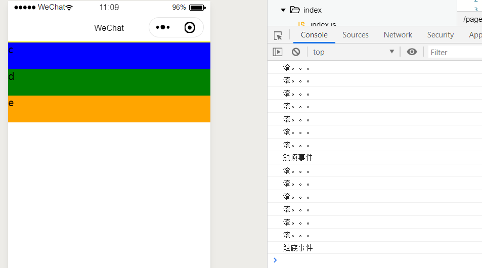

#### 横向

在官方文档中，横向滚动只需设置`scroll-x`为true即可，其实还需要设置其他的

1. 设置父元素

```scss
.container {
  display: flex;
  white-space: nowrap;
} 
```

2. 设置子元素

```scss
.xsize {
  width: 300rpx;
  height: 100rpx;
  display: inline-block;
}
```

设置完毕就可以测试了：

- `scroll-x`：使元素可以横向滚动，应用场景：顶部分类，可以滑动查看
- `scroll-left`：初始位置设置

wxml：

```html
<scroll-view class="container" style="margin-top:100rpx" scroll-x="true"
scroll-left="150">
  <view id="a" class="a xsize">a</view>
  <view id="b" class="b xsize">b</view>
  <view class="c xsize">c</view>
  <view class="d xsize">d</view>
  <view class="e xsize">e</view>
</scroll-view>
```

效果：

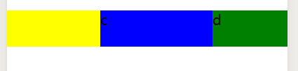

### 3.swiper轮播图

主要使用<swiper>配合<swiper-item>来使用，属性有：

- `indicator-dots`：是否显示面板知识点，默认false
- `indicator-color`：指示点颜色
- `indicator-active-color`：选中的指示点颜色
- `autoplay`：是否自动播放，默认false
- `interval`：自动切换时间间隔
- `duration`：滑动动画时长

wxml：

```html
<swiper indicator-dots="{{indicatorDots}}"
  autoplay="{{autoplay}}" interval="{{interval}}" duration="{{duration}}">
  <block wx:for="{{background}}" wx:key="*this">
    <swiper-item>
      <image src="{{item}}"></image>
    </swiper-item>
  </block>
</swiper>
```

js：

```js
Page({
  data: {
    background: ['../img/lunbo1.jpg', '../img/lunbo2.jpg', '../img/lunbo3.jpg'],
    indicatorDots: true,
    vertical: false,
    autoplay: true,
    interval: 2000,
    duration: 500
  }
})
```

效果：

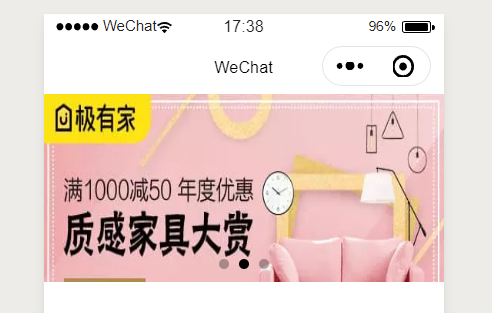

### 4.movable

<movable-area>配合<movable-view>可以实现元素的拖拽。

实际应用场景：比如视频播放平台，上面是视频，下面是评论，如果用户往下滑到评论区，那么视频会小窗口播放在一旁，并可以拖动，如：


<movable-view>的属性：

- `direction`：可拖拽方向，默认为none不可拖拽，all所有方向，vertical纵向，horizontal横向
- `inertia`：是否带有惯性，默认false，如果为true，根据拖拽速度会进行方向上的飘移，即惯性
- `out-of-bounds`：超出area范围后，是否还可以拖拽，这里如果为true也不是说能拽出去，而且只能再往外伸展一点
- `x，y`：定义元素在area中的初始位置
- ` disabled `：是否禁用
- ` bindchange `：拖动过程中触发的事件

```html
<movable-area class="area">
  <movable-view class="view" direction="all" x="50" y="50"
  out-of-bounds="true" bindchange="onChange">
  </movable-view>
</movable-area>
```

```js
Page({
  onChange: function(){
    console.log("正在拖动");
  }
})
```

```scss
.area{
  width: 100%;
  height: 500rpx;
  background: gray
}

.view{
  width: 100rpx;
  height: 100rpx;
  background: red;
}
```

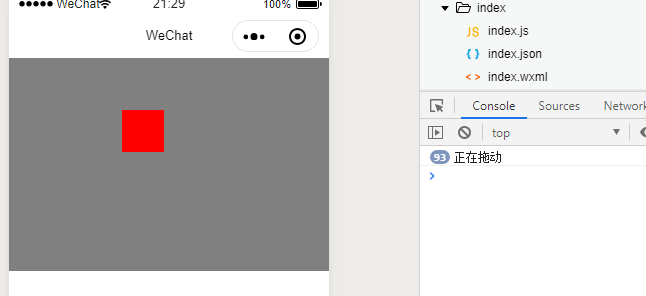

## 二、基础组件

### 1.icon

常用的一些图标

```html
<icon type="success" size="50" color="red"></icon>
<icon type="success_no_circle" size="50"></icon>
<icon type="info" size="50"></icon>
<icon type="warn" size="50"></icon>
<icon type="waiting" size="50"></icon>
<icon type="cancel" size="50"></icon>
<icon type="download" size="50"></icon>
<icon type="search" size="50"></icon>
<icon type="clear" size="50"></icon>
```

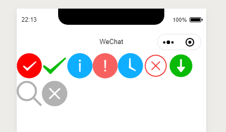

### 2.text

text指文本组件，所有组件只有text可以长按选中，并且text内部只支持text嵌套

属性：

- `selectable`：是否可以被选中
- `space`：显示连续的空格
  - `ensp`：中文字符空格一半大小
  - `emsp`：中文字符空格大小
  - `nbsp`：根据字体设置的空格大小
- `decode`：可以转义特殊字符

```html
<view><text selectable="true">this is text</text></view>
<view><text space="ensp">this             is text</text></view>
<view><text decode="true">&nbsp; &lt; &gt; &amp; &apos; &ensp; &emsp;</text></view>
```

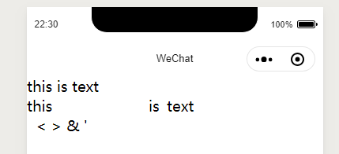

### 3.rich-text

富文本框，里面可以写一些html的内容进行展示

<rich-text>中属性主要为nodes，nodes可以直接使用字符串，或集合的形式进行添加富文本：

- 字符串：''
- 集合形式
  - name：标签名
  - attrs：标签中的属性
  - children：子节点，结构和nodes一致

```html
<rich-text nodes="{{nodes}}"></rich-text>
<rich-text nodes="{{nodes2}}"></rich-text>
```

```js
Page({
  data:{
    nodes:'',
    nodes2 : [{
      name :"img",
      attrs:{
        height: "150rpx",
        witdth: "150rpx",
        src:"http://image.enbuys.com/241997c4-9e62-4824-b7f0-7425c3c28917.jpeg"
      }
    }]
  }
})
```

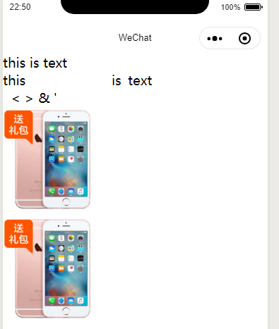

### 4.process

进度条，也是比较简单的，默认长度单位为px，属性：

- `percent `：百分比，0-100
- `show-info` ：在进度条右侧显示百分比，默认false即不显示
-  `border-radius` ：进度条圆角大小
- ` font-size `：进度条右侧百分比文字大小，默认10
- ` stroke-width `：进度条宽度，默认6
- ` activeColor `：已选择进度条颜色
- ` backgroundColor `：未选择进度条颜色
- ` active `：进度条从左往右动画效果
- ` active-mode `：进度条动画效果
  - ` backwards `：从头播放
  - `forwards`：从上次结束点播放
- ` bindactiveend `：进度完成事件

```html
<progress percent="{{per}}" stroke-width="10"
show-info="true" activeColor="red" backgroundColor="blue"
active="true" active-mode="forwards">
</progress>
<view bindtap="addPer">add per</view>
```

```js
Page({
  data:{
    per:10
  },
  addPer : function(){
    var newPer = this.data.per + 10;
    this.setData({
      per : newPer
    })
  }
})
```

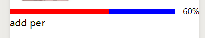

## 三、表单组件

### 1.button

用于表单提交submit或表单重置reset，常用属性有：

- `size`：default默认大小，填充满一行，mini小型图标
- `type`：default默认灰色，primary绿色，warn红色
- `disable`：默认false可以点击，true不能点击
- `plain`：背景镂空
- `loading`：带旋转图标
- `form-type`：表单提交或重置设置，submit or reset

```html
<button type="default">点击</button>
<button type="primary" size="mini" >点击</button>
<button type="warn" size="mini" plain="true">点击</button>
<button type="default" size="mini" disabled="true" loading="true" >点击</button>
```

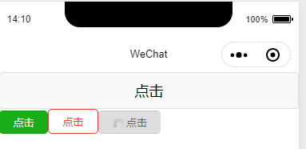

### 2.checkbox

多选框在小程序里需要配合checkbox-group使用，即<checkbox-group>包裹多个<checkbox>

`<checkbox-group>`属性：

- `bindchange`：选择框改变事件

`<checkbox>`属性：

- `value `：标识，当触发bindchange事件时，会携带value标识                                                                                                                                                                                                                                                                                                                                                                                                                                                                                                                                                                                                                                                                                                                                                          
- `color`：选中时√的颜色
- ` disabled `：是否禁用
- ` checked `：当前是否选中

注意，checkbox可以配合label更改选中状态，for中填入checkbox的id

```html
<checkbox-group>
<checkbox checked="true" value="iphone" id="iphone">iphone</checkbox>
<checkbox disabled="true">huawei</checkbox>
<checkbox checked="true" color="red">mi</checkbox>
</checkbox-group>
<label for="iphone">更改点击状态</label>
```

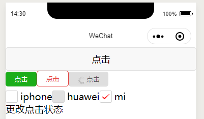

### 3.form

form都很熟悉了，一个表单，具体用法和html一样，可以绑定submit或reset事件，通过button提交或重置

- `bindsubmit `：提交事件
-  `bindreset `：重置事件

### 4.input

小程序的输入框，具体属性可以参考[官方文档]( https://developers.weixin.qq.com/miniprogram/dev/component/input.html )，常用属性有：

-  `value `：输入框初始内容
-  `type `：输入的键盘类型
  - `text`：文本键盘
  - `number`：数字键盘
  - `idcard`：身份证键盘，即数字键盘加X
  - `digit`：带小数的键盘
-  `password `：是否为密码
-  `placeholder `：输入框为空时的提示
- ` maxlength `：最大输入长度
-  `focus `：焦点

### 5.picker

picker就类似select选择器，与其不同的是，通过设置mode属性，可以设置为不同类型的选择框

#### 普通选择器

`mode = selector`

- range：数组或对象，即需要循环选择的数据
- range-key：当range为对象时使用，使用对象哪个属性来当做显示数据
- value：表示range中的下标，第几个被选中
- bindchange：value改变时触发

```html
<view>普通选择器</view>
<picker model="selector" range="{{obj}}" range-key="name" bindchange="selectorChange">
<view>{{show}}</view>
</picker>
```

```js
// pages/form/form.js
Page({
  data:{
    show: '选择一个人',
    obj:[
      {id:1001,name:'lili'},
      { id: 1002, name: 'mike' },
      { id: 1003, name: 'col' },
      { id: 1004, name: 'shy' },
    ]
  },
  selectorChange: function(e){
    console.log(e);
    var index = e.detail.value;
    var newShow = this.data.obj[index].name;
    this.setData({
      show : newShow
    })
  }
})
```

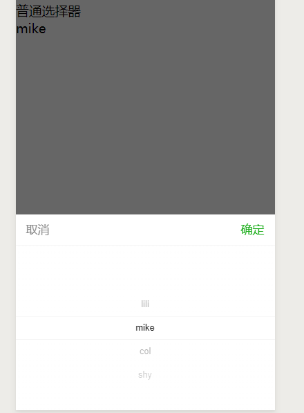

#### 多列选择器

`mode = multiSelector`，其属性和普通选择器大相径庭，多了一个` bindcolumnchange `，因为是多列，所以这个是列改变时触发事件，需要注意数组或对象需要多个才能显示出来

```html
<view>多列选择器</view>
<picker mode="multiSelector" range="{{obj2}}" range-key="name"  bindchange="multiChange">
<view>{{showMulti}}</view>
</picker>
```

```js
Page({
  data:{
    showMulti: '选择两个人',
    obj2:[
      [
        { id: 1001, name: 'lili' },
        { id: 1002, name: 'mike' },
        { id: 1003, name: 'col' },
        { id: 1004, name: 'shy' },
      ],
      [
        { id: 1001, name: 'lili' },
        { id: 1002, name: 'mike' },
        { id: 1003, name: 'col' },
        { id: 1004, name: 'shy' },
      ]
    ]
  },
  multiChange:function(e){
    console.log(e);
    var index = e.detail.value;
    var obj2 = this.data.obj2;
    console.log(obj2);
    for (var i = 0; i < index.length; i++) {
      var id = obj2[i][index[i]].id;
      var name = obj2[i][index[i]].name;
      console.log(id + " " + name);
    }
  
  }
})
```

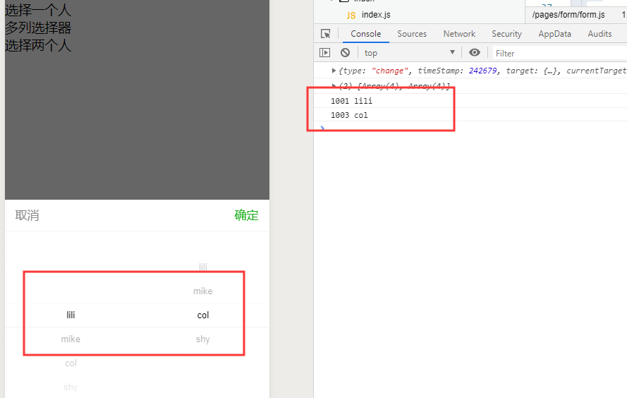

#### picker-view

也类似于多列选择器，配合<picker-view-column>使用，有几个column，就有几列

```html
<picker-view style="width:100%;height:200px" bindchange="pickerChange">
<picker-view-column>
<view wx:for="{{year}}">{{item}}</view>
</picker-view-column>
<picker-view-column>
<view wx:for="{{month}}">{{item}}</view>
</picker-view-column>
<picker-view-column>
<view wx:for="{{day}}">{{item}}</view>
</picker-view-column>
</picker-view>
<view>{{picker}}</view>
```

```js
// pages/form/form.js
Page({
  data:{
    year:[2000,2001,2002,2003,2005],
    month:[1,2,3,4,5],
    day:[1,4,7,15,30],
    picker:'选择日期'
  },

  pickerChange:function(e){
    console.log(e);
    var index = e.detail.value;
    var year = this.data.year[index[0]];
    var month = this.data.month[index[1]];
    var day = this.data.day[index[2]];
    this.setData({
      picker: year+'年'+month+'月'+day+'日'
    })
  }
})
```

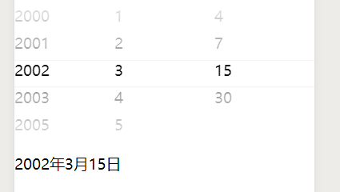

### 6.radio

单选框radio需要配合<radio-group>使用，在group上绑定bindchange事件，其属性有：

- value：表单提交时带入的值或change事件发生时带入的值
- checked：是否被选中
- disabled：是否禁用
- color：颜色

```html
<radio-group bindchange="radioChange">
<radio value="hhkb" disabled="true">hhkb</radio>
<radio value="filco" color="red">filco</radio>
<radio value="leopold" checked="true">leopold</radio>
</radio-group>
<view>{{radio}}</view>
```

```js
// pages/form/form.js
Page({
  data:{
    radio:'单选键盘'
  },

  radioChange:function(e){
    var value = e.detail.value;
    this.setData({
      radio : value
    })
  }
})
```

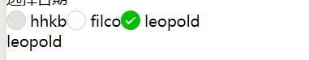

### 7.slider

滑动条，可以配合增减音量或一些大小，常用属性有：

- `min`：最小值
- `max`：最大值
- `value`：当前取值
- `activeColor`：已选择颜色
- `backgroundColor`：未选择颜色
- `block-color`：滑块颜色
- `show-value`：显示当前value
- `bindchange `：滑动后触发事件
- `bindchanging `：滑动过程中一直触发事件

```html
<slider value="10" min="0" max="100" show-value="true"
  backgroundColor="blue" activeColor="red" block-color="green"
  bindchange="sliderChange" bindchanging="sliderChanging"></slider>
<view>{{sliderValue}}</view>
```

```js
Page({
  data:{
    sliderValue:10
  },
  sliderChange: function (e) {
    var value = e.detail.value;
    this.setData({
      sliderValue: value
    })
  },
  sliderChanging: function (e) {
    var value = e.detail.value;
    this.setData({
      sliderValue: value
    })
  },
})
```

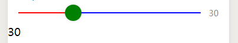

### 8.switch

开关，比较简单，主要属性有：

- `checked`：开或关
- `disabled`
- `type`：样式，switch or checkbox
- `color`
- `bindchange`

```html
<view>type = checkbox</view>
<switch checked="true" type="checkbox">开关</switch>
<view>type = switch</view>
<switch checked="true" type="switch">开关</switch>
```

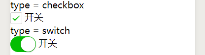

## 四、导航组件

### navigator

即页面间的跳转，主要属性有：

- `url`：跳转链接
- `open-type`：跳转方式
- `delta`：回退的层数，比如页面1跳页面2，页面2跳页面3，如果delta设置为2，页面3可以直接跳回页面1

`open-type`：跳转的方式有多种，常见的有：

-  `navigate `：直接跳转到某个页面
-  `redirect `：重定向到某个页面，**重定向不会添加层数**
-  `navigateBack `：回退到某个页面

## 五、媒体组件

### 1.image

图片标签，主要属性有：

- `src`：图片路径
- `mode`：图片的裁剪、缩放模式，微信提供了13种缩放模式，具体可以看[文档]( https://developers.weixin.qq.com/miniprogram/dev/component/image.html )
- `lazy-load`：开启懒加载模式
-  `bindload `：当图片加载完后触发
- `binderror`：当图片加载失败后触发