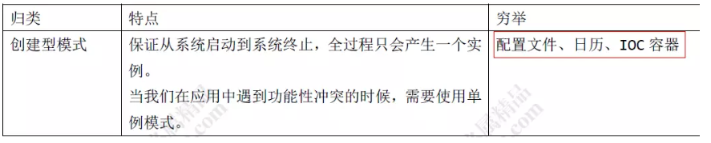
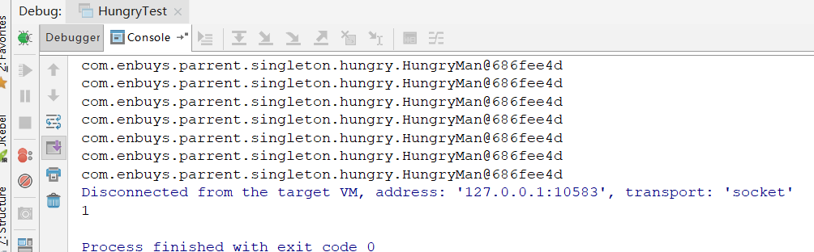
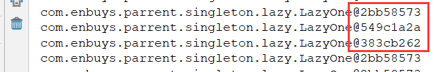
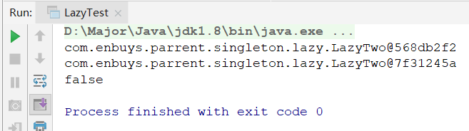
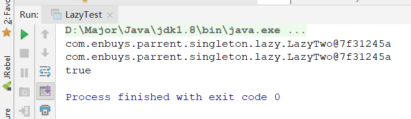

# 单例模式

## 单例模式介绍

单例模式，就是**在程序运行过程中，有且只有一个实例产生，并对外提供访问的全局访问点**。

不管是否并发，还是说多线程使用，都是用的一个实例，避免线程安全问题与序列化反序列化问题。

比如Spring，Spring控制的Bean全部是单例的，并提供全局访问点BeanFactory。



实现单例模式有几个关键点：

- **构造方法私有**，这样外部才不会轻易的创建新对象，而是使用内部提供的
- **有一个提供给外部的方法，返回唯一实例**

单例模式有几种常见形式：

- 饿汉式
- 懒汉式
- 注册式

我们依次介绍

## 饿汉式

饿汉式的意思就是，实例在使用前就被创建出来了，并且是单例的。即类加载时就创建好了

- 优点：
  - **绝对线程安全**，因为线程还没出现就实例化好了，不可能出现安全问题
  - 没有任何的锁机制，效率高
- 缺点：类加载时创建，就是说不管有没有人去使用实例，都**会消耗资源**（占着茅坑不拉屎）

### 代码实现

饿汉式实例：

```java
public class HungryMan {

    // 将构造方法私有
    private HungryMan(){}

    // 创建静态单例对象
    private static final HungryMan hungryMan = new HungryMan();

    // 全局访问点
    public static HungryMan getInstance(){
        System.out.println(hungryMan);
        return hungryMan;
    }
}
```

测试类：

```java
public class HungryTest {

    public static void main(String[] args) {
        // 创建100个并发线程
        int count = 100;
        // 使用计数器，这里设置100,当计数器为0时，才会放行使多线程并发执行
        CountDownLatch latch = new CountDownLatch(count);

        // 使用Set保存实例，重复实例就会被清除
        final Set<HungryMan> hungryManSet = new HashSet();

        // 并发执行，模拟多线程
        for (int i = 0; i < count; i++) {
            new Thread(){
                @Override
                public void run() {
                    System.out.println("等待");
                    try {
                        // 所有子线程等待，当计数器为0时，共同放行
                        latch.await();
                        hungryManSet.add(HungryMan.getInstance());
                    } catch (InterruptedException e) {
                        e.printStackTrace();
                    }
                }
            }.start();
            // 每次countDown，都会使计数器中的数减一
            latch.countDown();
        }

        try {
            Thread.sleep(1000);
            System.out.println(hungryManSet.size());
        } catch (InterruptedException e) {
            e.printStackTrace();
        }
    }
}
```

这里测试类的意思是，使用`CountDownLatch`模仿多线程并发

1. 初始计数器设置为100
2. 每次线程循环时，调用`countDown()`方法，使计数器减一，并且线程被`CountDownLatch.await()`方法阻塞，不让走
3. 循环结束后，计数器为0，同时并发放行所有被阻塞的线程，达到多线程并发的效果
4. 使用Set保存每个实例，这样最后统计set中保存的实例数，就可知整个过程中是否只有一个实例了

测试结果：



证明多线程绝对安全，整个应用执行过程期间，只有一个实例


## 懒汉式

懒汉式，**当实例实际需要使用时，才会进行实例化**，就和前端的懒加载差不多

优点：

- 不会出现资源浪费的情况

缺点：

- 处理不当会出现线程安全问题
- 加synchronized锁解决线程安全问题时，不可避免的会出现性能问题
- 可以使用私有内部类，解决线程安全和加锁性能的问题

### 实现方式一-简单实现

```java
public class LazyOne {

    private static LazyOne lazy = null;

    private LazyOne(){}

    public static LazyOne getInstance(){
        if(lazy == null){
            lazy = new LazyOne();
        }
        return lazy;
    }
}
```

这种方式**会出现线程安全问题**，因为多个线程同时访问时，第一个还没new出现，其他的就可能进入方法也开始执行new实例了。



### 实现方式二-方法加锁

在方法上添加synchronized同步锁

```java
public class LazyTwo {

    private static LazyTwo lazy = null;

    private LazyTwo(){}

    public static synchronized LazyTwo getInstance(){
        if(lazy == null){
            lazy = new LazyTwo();
        }
        return lazy;
    }
}
```

这样可以**完美解决线程安全**，但是**性能消耗会增加**

### 实现方法三-双重校验锁

使用双重校验锁，是在方法二上的改进，不在方法上加锁了，而是在创建时加锁，如下代码：

```java
public class LazyThree {
    private static LazyThree lazy = null;

    private LazyThree(){}

    public static  LazyThree getInstance(){
        if(lazy == null){
            // 双重校验锁
            synchronized(LazyThree.class){
                if(lazy == null){
                    lazy = new LazyThree();
                }
            }
        }
        return lazy;
    }
}
```

这样同时线程进入if后，会被同步锁锁住，就不会出现线程安全问题了

但是同步锁的存在，**或多或少会比不加锁的性能消耗多**

### 实现方法四-私有内部类

在类内部使用私有内部类来创建实例，当外部调用获取实例方法时，才会加载内部类进行实例创建，并且**不会出现线程安全问题，性能也和简单实现的一样高效**。

```java
public class LazyFour {

    private LazyFour(){}

    public static LazyFour getInstance(){
        // 被调用前，首先会去加载内部类，就实例化了单例对象
        return LazyHolder.lazyFour;
    }

    /**
     * 没有绑定关系，而且只有被调用到时才会装载，从而实现了延迟加载。
     */
    private static class LazyHolder{
        //静态初始化器，由JVM来保证线程安全
        private static LazyFour lazyFour = new LazyFour();
    }
}
```


## 注册式

注册式对比懒汉饿汉式，更加实用

每次获取实例时，都往一个固定的容器中注册，并将使用过的实例进行缓存，这样下一次请求时，一定是上次缓存的对象，就保证了单例，所以他也叫注册登记式。

注册式应用广泛，比如**Spring的IOC单例模式，就使用的注册式模式**，所以很重要需要掌握。

注册式有两种实现方式

- 容器缓存
- 枚举登记

### 枚举登记

枚举实现单例非常简单，因为它本身就是单例的

```java
public enum  EnumRegister {

    INSTANCE;

    public static EnumRegister getInstance(){
        return INSTANCE;
    }
}
```

其实枚举登记底层也是和容器登记差不多

### 容器缓存

传入一个类名称，如果不存在注册到容器中返回，如果存在，直接从容器中拿去返回。

线程安全问题可以使用`concurrent`容器

```java
public class MapRegister {

    // 创建容器，使用concurrent保证线程安全
    private static Map<String,Object> ioc = new ConcurrentHashMap<>();

    private MapRegister(){}

    public static Object getInstance(String className){
        // 判断className是否为空，为空注册自身
        if(className == null){
            className = MapRegister.class.getName();
        }

        // 判断容器中是否存在，不存在注册，存在直接返回
        if (ioc.containsKey(className)){
            Object obj = null;
            try {
                obj = Class.forName(className);
                ioc.put(className,obj);
            } catch (ClassNotFoundException e) {
                e.printStackTrace();
            }
            return obj;
        }else {
            return ioc.get(className);
        }
    }

}
```


## 序列化问题

当单例模式的对象使用序列化反序列化时，会打破单例模式，即反序列化时会创建新的对象出来。

如下：

```java
public static void main(String[] args) throws IOException, ClassNotFoundException {
    LazyTwo lazyTwo = null;
    LazyTwo lazyTwo1 = LazyTwo.getInstance();
    FileOutputStream fos = new FileOutputStream("LazyTwo.obj");
    ObjectOutputStream oos = new ObjectOutputStream(fos);
    oos.writeObject(lazyTwo1);
    oos.flush();
    oos.close();
    FileInputStream fis = new FileInputStream("LazyTwo.obj");
    ObjectInputStream ois = new ObjectInputStream(fis);
    lazyTwo = (LazyTwo) ois.readObject();
    ois.close();
    System.out.println(lazyTwo);
    System.out.println(lazyTwo1);
    System.out.println(lazyTwo == lazyTwo1);

}
```



如何解决这个问题呢？在对象中重写`readResolve()`方法

```java
public class LazyTwo implements Serializable {

    private static LazyTwo lazy = null;

    private LazyTwo(){}

    public static synchronized LazyTwo getInstance(){
        if(lazy == null){
            lazy = new LazyTwo();
        }
        return lazy;
    }

    private Object readResolve(){
        return lazy;
    }

}
```



当JVM从内存中反序列化地"组装"一个新对象时,就会自动调用这个 `readResolve`方法来返回我们指定好的对象了, 单例规则也就得到了保证。


## 总结

- 单例模式就是在整个应用运行过程中，对于一个类来说只有一个实例被创建并使用，并且此类有一个全局公共访问接口
- 饿汉式：实例在类加载时就创建好，会造成性能浪费
- 懒汉式：实例在实际使用是才创建，需要考虑性能问题，线程安全问题
- 注册式：当请求进来后，先从容器查看，如果不存在创建实例并缓存到容器中，下次进来直接从容器中取缓存的实例，实现单例模式
- 序列化问题：需使重写`readResolve`方法解决问题
- **Spring的IOC单例模式使用注册式方法实现**，所以我们的重点应放在注册式