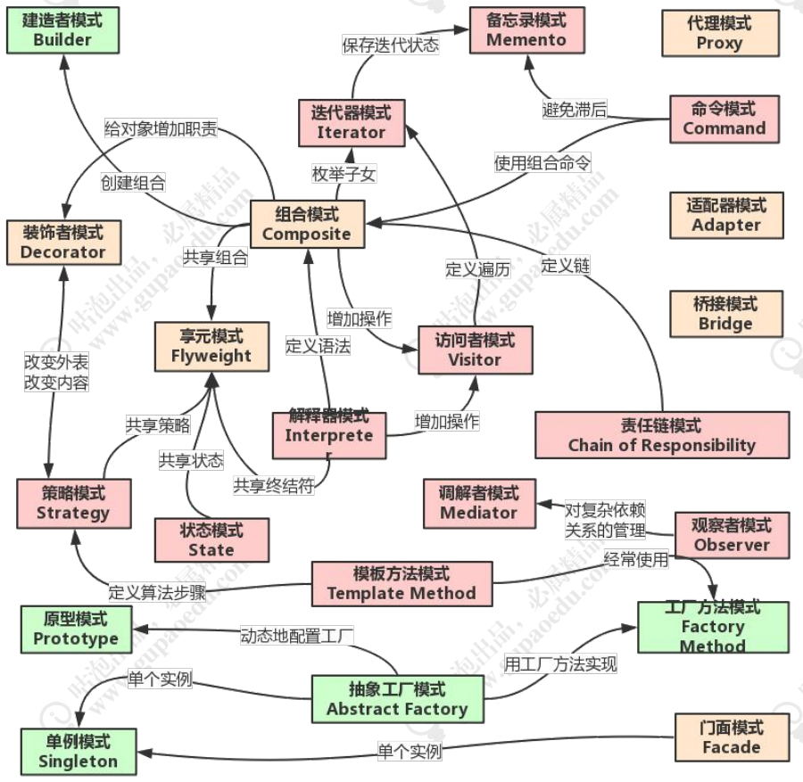

# 常用的设计模式

首先，我们要明确一个目标，为什么我们要学习设计模式？

1. 设计模式就像地基，有了好的地基，基础，才能盖出更高的楼
2. 我们之后要学习Spring源码，Spring中使用了大量设计模式，学好了设计模式，可以更通透的进行源码阅读理解。

## 经典设计模式

经典的设计模式有23种，如下表：

| 分类   | 设计模式                                                     |
| ------ | ------------------------------------------------------------ |
| 创建型 | 工厂方法模式（Factory Method）、抽象工厂模式（Abstract Factory）、建造者模式（Builder）、原型模式（Prototype）、单例模式(Singleton) |
| 结构型 | 适配器模式(Adapter)、桥接模式（Bridge）、组合模式（Composite）、装饰器模式（Decorator）、门面模式（Facade）、享元模式（Flyweight）、代理模式（Proxy） |
| 行为型 | 解释器模式（Interpreter）、模板方法模式（Template Method）、责任链模式（Chain of Responsibility）、命令模式（Command）、迭代器模式（Iterator）、调解者模式（Mediator）、备忘录模式（Memento）、观察者模式（Observer）、状态模式（State）、策略模式（Strategy）、访问者模式（Visitor） |

设计模式很多，这里我们也不需要全部理解透彻，对于重点的就行理解，并知道如何使用就可以。

对于设计模式来说，并不是一个个独立使用的，而是一些设计模式，**根据需求，组合使用**

## 六大原则

设计模式在使用中，具有六大原则

### 开闭原则

- 对扩展开放，对修改关闭
- 在程序需要拓展时，不去修改源码，而是使用实现继承等方式扩展，实现热拔插
- 目的：就是为了程序更好地扩展，易于维护升级
- 实现方式就是接口和抽象类

### 里氏代替原则LSP

- 任何父类出现的地方，子类都可以进行替换
- LSP是复用继承的基石，只有当子类可以无差错替换父类时，才能证明基类真正可被复用
- 里氏替换原则是开闭原则的补充，因为实现开闭原则的关键就是抽象化，而LSP的父类子类继承就是抽象化的具体实现，所以是开闭原则的补充。

### 依赖倒转原则

- 之前依赖具体对象，倒转后就是依赖抽象出的接口
- 就好比集合，我们是使用`List list = new ArrayList()`，而不是`ArrayList list = new Arraylist()`
- 这是开闭原则的基础，针对接口编程

### 接口隔离原则

- 使用多个相互独立的接口胜于使用一个接口
- 意思就是降低依赖，降低耦合
- 比如一个接口里有课程增删改，课程分类增删改，这里就可以把课程分类隔离出来，降低耦合

### 迪米特法则

- 也叫最少知道原则
- 一个实体应尽量少的和其他实体相互发生作用，即各系统模块相互独立

### 合成复用原则

- 尽量使用合成聚合的方式，而不是继承

## 设计模式之间关系图

这张图我们可以简单了解一下，等后面了解完一些重要设计模式后，再回来理解

## 总结设计模式

- 设计模式不是单一使用的，根据需求应组合使用
- 设计模式的出现是为了解决一些代表性的问题
- 设计模式来源于生活，并反而帮助我们更好的生活（生活=代码）
- 设计模式帮助我们的代码实现可扩展性，可用性，可读性，可维护性。
- 对于复杂的业务需求，可以更简单透彻的进行解决，而不是绕来绕去