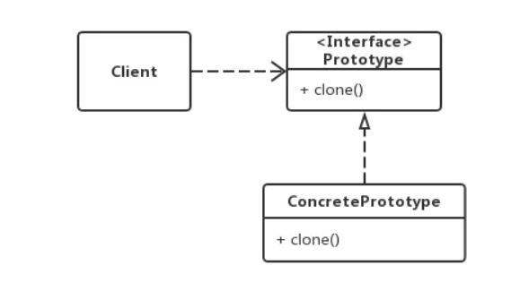
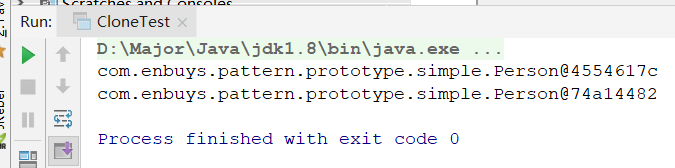
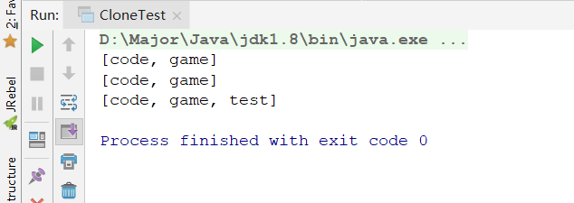
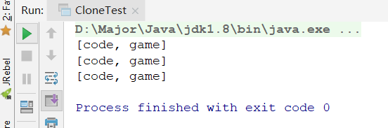
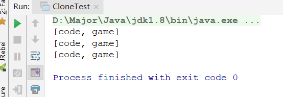

# 原型模式

## 原型模式介绍

原先模式就是，使用原型实例指定创建对象的种类，并使用拷贝的方式创建对象。

通俗来说，就是**对一个实例进行克隆**，克隆出多个相似但不同的对象，被克隆的对象就是原型对象，这种模式就是原型模式。

就比如Apache中的工具类BeanUtils，有一个方法`copyProperties()`就是复制对象，将一个对象中的值复制到另一个相同类型的对象中，使用的就是原型模式，底层是使用反射实现的。

### 原型模式使用场景

- 对象创建过程相当复杂，比如需要很多初始化参数等等，适用原型模式
- 对象创建过程中，有大量的公共数据，只有少量变量需要修改，适用原型模式

**注意！如果对象创建相对简单，不推荐使用原型模式**，因为克隆的成本比直接new要大很多，即性能差异。只有当对象需要初始化很多变量，创建复杂时，克隆的性能才会更好。

### UML图



- `Client`：使用者
- `Prototype`：接口，抽象原型，具有clone功能，但是没有具体实现，比如`Cloneable`接口
- `ConcretePrototype`：具体原型，抽象原型的具体实现类，根据自身需求重写`clone`方法


## 原型模式实现

这里我们使用Prototype接口为Java提供的`Cloneable`接口

创建一个类，实现`Cloneable`接口，并重写`clone()`方法

```java
public class Person implements Cloneable {

    private String name;
    private List likes;


    public String getName() {
        return name;
    }

    public void setName(String name) {
        this.name = name;
    }

    public List getLikes() {
        return likes;
    }

    public void setLikes(List likes) {
        this.likes = likes;
    }

    @Override
    protected Object clone() throws CloneNotSupportedException {
        return super.clone();
    }
}
```

测试：

```java
public class CloneTest {
    public static void main(String[] args) throws CloneNotSupportedException {
        String name = "aP";
        List likes = new ArrayList();
        likes.add("code");
        likes.add("game");
        Person person = new Person();
        person.setName(name);
        person.setLikes(likes);

        System.out.println(person);

        Person cloneP = (Person) person.clone();
        System.out.println(cloneP);
    }
}
```



成功实现原型模式，并且地址不同


## 深浅拷贝问题

有过一定经验的人，都知道拷贝有一个深浅问题

- 浅拷贝：只能真正拷贝八大数据类型，对于实例内部List，Map等对象只是将地址指向了被拷贝对象上，即如果原List修改了，新实例中的List也会改变
- 深拷贝：除了八大数据类型， 其他对象会在堆中创建新的地址，而不是修改地址指向，即原对象修改，不影响新实例中的对象

### 浅拷贝

刚刚的例子就是浅拷贝：

```java
public class CloneTest {
    public static void main(String[] args) throws CloneNotSupportedException {
        String name = "aP";
        List likes = new ArrayList();
        likes.add("code");
        likes.add("game");
        Person person = new Person();
        person.setName(name);
        person.setLikes(likes);

        System.out.println(person.getLikes());

        Person cloneP = (Person) person.clone();
        System.out.println(cloneP.getLikes());

        // 修改likes，看看是否是浅拷贝
        likes.add("test");
        System.out.println(cloneP.getLikes());
    }
}
```



可以看到，修改`person`的List，拷贝出来的`cloneP`的List也同样修改了，说明这只是地址引用，并没有开辟新的地址。

### 深拷贝

有多种方法实现，这里展示两种

- 一种是重写clone方法时，进行修改，对于不属于八大类型的，进行new创建
  - 手动赋值，效率高，但代码过于啰嗦
- 序列化反序列化实现，即二进制流实现
  - 有约束，实例必须实现序列化接口
- 反射实现
  - 麻烦

#### 重写Clone

```java
public class Person implements Cloneable {

    private String name;
    private List likes;


    public String getName() {
        return name;
    }

    public void setName(String name) {
        this.name = name;
    }

    public List getLikes() {
        return likes;
    }

    public void setLikes(List likes) {
        this.likes = likes;
    }

    @Override
    protected Object clone() throws CloneNotSupportedException {
        Person p = new Person();
        p.name = name;
        
        // 创建新的List
        List like = new ArrayList();
        like.addAll(likes);
        p.setLikes(like);
        return p;
    }
}
```



成功实现深拷贝，虽然手动赋值，效率高，但代码过于啰嗦

#### 序列化反序列化实现

注意类上需要添加`Serializable`接口

```java
/**
     * 序列化实现深度克隆
     * @return
     */
public Object deepClone() throws IOException, ClassNotFoundException {
    // 序列化
    ByteArrayOutputStream bos = new ByteArrayOutputStream();
    ObjectOutputStream oos = new ObjectOutputStream(bos);
    oos.writeObject(this);

    //反序列化
    ByteArrayInputStream bis = new ByteArrayInputStream(bos.toByteArray());
    ObjectInputStream ois = new ObjectInputStream(bis);
    Person p = (Person) ois.readObject();

    bos.close();
    oos.close();
    bis.close();
    ois.close();
    return p;
}
```



也实现类深拷贝

