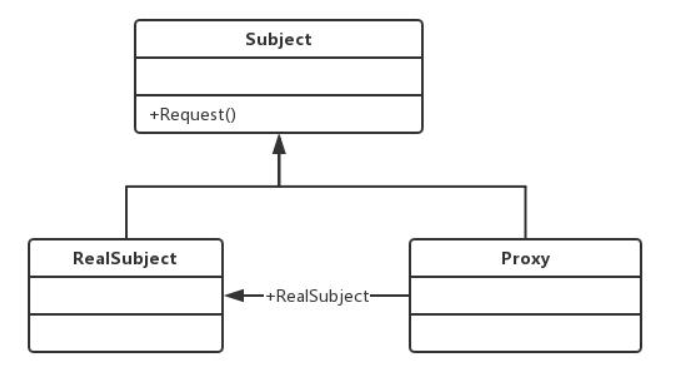
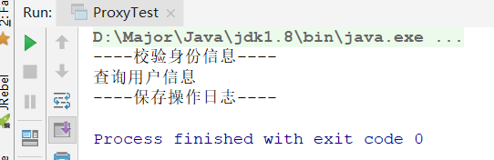

# 代理模式

## 代理模式介绍

官方定义：**代理模式就是为其他对象提供一种代理，以控制对这个对象的访问**。

简单来说，就是客户端不直接访问对象，而是访问这个对象的代理对象，那么为什么不直接访问对象呢？

- **代理对象对方法增强**，比如方法真正执行前判断用户是否登录，执行后保存操作日志
- **客户端没有能力，没有权限直接访问对象**

举例来说：

你陷入财务纠纷，需要打官司，但是你又没学过法律也不知道怎么打，就需要去律师招待所找个律师帮你打，打官司过程中，律师辩论，偶尔才需要你说几句话。

- 律师：代理
- 你：被代理对象
- 整个事件：代理模式

通过这个例子，我们引出代理模式的UML：



三个角色

- Subject：抽象主题角色，普通的业务类型定义，比如上述例子中，打官司就可以被抽象成Subject接口
- RealSubject：具体角色，也就是被代理对象，上述例子中，你需要打官司，所以你就是RealSubject
- Proxy：代理对象

## 代理模式实现

代理模式的实现大方面来说，分为两种

- 静态代理
- 动态代理

这里我们以http请求的拦截做例子并用代码实现

### 静态代理

静态代理，代理类一直被程序所知，即在**程序运行前就编译完成**，代理之前就确定被代理类，或被代理类的接口。

问题：

- 只能代理某一个接口或父类的实现类，具有局限性
- 违反开闭原则，一旦接口或父类修改，代理与被代理类都需要修改

实现方式：

- 创建一个接口，以供代理与被代理类实现（也可以不创建，这样的话代理类直接继承被代理类）
- 被代理类，实现接口，并重写目标方法
- 代理类，实现接口，并重写目标方法，并在被代理类基础上对方法增强

#### 代码实现

Http接口：

```java
public interface IHttpInvoke {
    void search();
}
```

Server，被代理类

```java
public class Server implements IHttpInvoke {

    @Override
    public void search() {
        System.out.println("查询用户信息");
    }

}
```

Proxy，代理类

```java
public class Proxy implements IHttpInvoke {

    private IHttpInvoke httpInvoke;

    public Proxy(IHttpInvoke httpInvoke){
        this.httpInvoke = httpInvoke;
    }

    @Override
    public void search() {
        // 执行前校验身份信息
        System.out.println("----校验身份信息----");
        // 执行目标方法
        httpInvoke.search();
        // 执行后保存日志
        System.out.println("----保存操作日志----");
    }

}
```

Test，测试

```java
public class ProxyTest {
    public static void main(String[] args) {
        IHttpInvoke httpInvoke = new Proxy(new Server());
        httpInvoke.search();
    }
}
```



这里会发现有几个问题

- Proxy代理类只能处理他实现的`IHttpInvoke`这个接口下的被代理类，**局限性**
- 如果`IHttpInvoke`增加方法，其实现类全部都要修改代码，**违反开闭原则**

所以，静态代理最大问题就是局限性和违反开闭原则

### 动态代理

动态代理就是动态的加载代理类，在程序运行前并不知道它代理的哪一个具体的对象，只有运行起来之后，才会进行动态的构建。

动态代理有两种实现方式：

- JDK动态代理：使用JDK的API，代理类**需要实现固定的接口**并且**目标类也必须有接口实现**，在程序执行过程中，使用**反射**构建对象并执行代理方法
- Cglib动态代理：使用cglib框架，不需要实现任何接口，其原理是使用**字节码技术**，运行期间对被代理对象**生成子类**，并在子类中覆盖方法进行增强，因为采用继承，所以**无法处理final修饰的类**。

#### JDK动态代理

其中Http接口和Server目标类是一样没有变的

```java
public interface IHttpInvoke {
    void search();
}
public class Server implements IHttpInvoke {
    @Override
    public void search() {
        System.out.println("查询用户信息");
    }
}
```

代理类：

```java
public class MyProxy implements InvocationHandler {

    private Object obj;

    public MyProxy(Object obj){
        this.obj = obj;
    }

    @Override
    public Object invoke(Object proxy, Method method, Object[] args) throws Throwable {
        // 执行前校验身份信息
        System.out.println("----校验身份信息----");
        // 执行目标方法
        Object invoke = method.invoke(obj, args);
        // 执行后保存日志
        System.out.println("----保存操作日志----");

        return invoke;
    }
}
```

实现了InvocationHandler接口，JDK提供的实现动态代理的接口，需要重写invoke方法，从这个方法的参数也可以看出，其实就是反射中的invoke方法

测试类：

```java
public class ProxyTest {
    public static void main(String[] args) {
        /*IHttpInvoke httpInvoke = new MyProxy(new Server());*/
        Server server = new Server();
        MyProxy myProxy = new MyProxy(server);
        // 使用JDK，反射生成一个代理类，并用目标类接口接收
        IHttpInvoke httpInvoke = (IHttpInvoke) Proxy.newProxyInstance(server.getClass().getClassLoader(),
                server.getClass().getInterfaces(),
                myProxy);
        // 执行代理后的方法
        httpInvoke.search();
    }
}
```


为什么说目标类必须实现接口呢？

- 类:java.lang.reflect.Proxy(通过该类动态生成代理类)
- 代理类实现接口:InvocationHandler

因为JDK生成代理对象的过程中，**其代理对象已经继承了Proxy，所以无法再继承其他类，如果想要实现对目标类的代理，就只能使用接口实现的方式，来绑定需要代理的目标类**

#### Cglib动态代理

首先需要引入cglib的jar包，这里我使用的maven

```xml
<dependency>
    <groupId>cglib</groupId>
    <artifactId>cglib</artifactId>
    <version>2.2.2</version>
</dependency>
<dependency>
    <groupId>asm</groupId>
    <artifactId>asm-all</artifactId>
    <version>3.3</version>
</dependency>
```


Cglib不需要实现接口，所以我们之前使用IHttpInvoke就去掉了，Server目标类，还是和之前一样

```java
public class Server{

    public void search() {
        System.out.println("查询用户信息");
    }

}
```

Proxy代理类

```java
public class MyProxy implements MethodInterceptor {

    private Object obj;

    public MyProxy(Object obj){
        this.obj = obj;
    }


    //获取Proxy，生成的代理类
    public Object getProxy(){
        // 使用工具类
        Enhancer enhancer = new Enhancer();

        // 设置父类
        enhancer.setSuperclass(Server.class);
        // 设置回调函数
        enhancer.setCallback(this);

        // 创建子类
        Object o = enhancer.create();
        return o;
    }

    @Override
    public Object intercept(Object o, Method method, Object[] objects, MethodProxy methodProxy) throws Throwable {
        //方法增强
        // 执行前校验身份信息
        System.out.println("----校验身份信息----");
        // 执行目标方法
        Object invoke = methodProxy.invokeSuper(o, objects);
        // 执行后保存日志
        System.out.println("----保存操作日志----");

        return invoke;
    }
}
```

主要有两个

- 实现MethodInterceptor接口，重新intercept方法，用作对目标类方法增强
- 获取生成代理类的方法，这里可以发现需要设置父类，说明代理类其实是目标类的子类（当然，这里生产代理类的代码也可以写在测试类中）

测试代码：

```java
public class ProxyTest {
    public static void main(String[] args) {
        // 生成目标类的代理类
        MyProxy myProxy = new MyProxy(new Server());
        Server server = (Server) myProxy.getProxy();
        // 执行增强方法
        server.search();
    }
}
```

## 总结

代理模式就是为目标类提供一种代理，用来控制目标类，增强方法等

代理分为静态代理和动态代理

- 静态代理：代理类在应用执行前就固定好，代理哪些目标类
  - 实现方式：目标类，代理类实现相同接口
  - 问题：不满足开闭原则，具有局限性，如果有多个不同目标类需要代理，需要写大量代码
- 动态代理：代理类在执行过程中才会被动态创建，在执行前并不知道代理的目标类是谁，分为JDK实现和Cglib实现
  - JDK：JDK自带API
    - 代码实现：`Proxy`与`HandlerInvoke`，Proxy用于动态创建代理类，`HandlerInvoke`用于在原有功能基础上进行增强，**底层使用反射创建代理类，并将类编译class获取字节码，然后加载到内存中**
    - 问题：**目标类必须实现接口**，因为代理类反射创建时必须继承Proxy，必须使用接口形式与目标类绑定
  - Cglib：外部的包，需要导入
    - 代码实现：创建目标类，并创建一个类实现`MethodInterceptor`接口，使用`Ehancer`工具类创建代理类，`Ehancer`需要设置父类，所以Cglib底层是**使用继承的方式生成的代理类**，并通过`MethodInterceptor`接口中的`intercept`方法覆盖原方法，实现方法的增强。
    - 问题：因为使用继承，所以**对于final修饰的类无法实现代理**